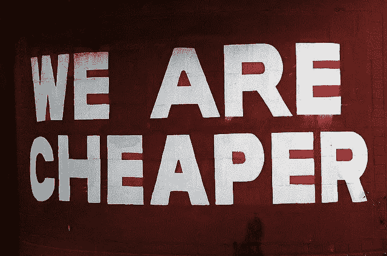
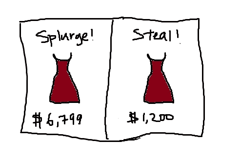

# 为什么创业公司定价过低

> 原文：<https://medium.datadriveninvestor.com/why-startups-underprice-work-55128b12b3ac?source=collection_archive---------7----------------------->

我们生活在一个真正的、疯狂的、深刻的创业时代。不可否认，创业泡沫确实存在，而且这个泡沫不会很快破裂。印度是世界上最年轻的创业国家。72%的创业公司创始人不到 35 岁。令人惊讶不是吗？

此外，美国的创业公司数量位居第三；4200–4400，是一个近似值。当创业公司出现时，数字变得更加重要。这一切都始于项目定价？

 [## 金融科技初创公司正在扰乱世界各地的银行业-数据驱动的投资者

### 传统的实体银行从未真正从金融危机后遭受的重大挫折中恢复过来…

www.datadriveninvestor.com](https://www.datadriveninvestor.com/2018/10/20/fintech-startups-are-disrupting-the-banking-industry-around-the-world/) 

项目定价是一块永远不会停止浮出水面的巨石。由于每个客户都是完全不同的样本，所以在决定总体数量时很难有信心。因此，大多数高级经理和金融专家建议你首先定义自己的价值，你工作的价值，然后相应地为每个人制定一个一致的价格图表。

**陷入客户螺旋**

然而，这里并不全是黑与白。有一个巨大的灰色区域，它占用了大量的时间、精力和精力。这些客户没有很多背景信息。他们的领域有多赚钱？他们的月利润必须是多少？这家公司到底有多老了？他们是挥霍者还是廉价者？他们的技术知识商数怎么样？他们对市场研究得太透彻了吗？他们有多绝望，忘记了这项工作已经开始。他们过去的经历如何？这样的问题不胜枚举。我们试图涵盖在特定项目的定价需要申报时要考虑的大部分参数。

这通常是一个棘手的阶段，如果你定价过低，你可能会失去很多价值，如果你定价过高，你可能会失去客户。

经常可以看到，初创公司会毫不犹豫地对他们的工作、产品或服务定价过低。无论是在竞争中崛起，还是让自己脱颖而出；归根结底，数字不会说谎。为什么这已经成为一个普遍的共识呢？让我们找出答案。

1.他们不知道任何更好的

这是不言自明的，不是吗？这是因为大多数创业公司已经在现实世界中呆得够久了。他们不知道比一次又一次地压低自己的价格更好的方法，只是因为这样做有效。哦，我们一定会破解它，因为它第一次对我们也有效。

即使成功率很高，最终结果又如何呢？你是愿意有 10 个客户每个月付给你 5000 英镑，还是 3 个客户每个月付给你 17000 英镑？这不仅仅是数学问题。想象一下，要满足 10 个不同的想法，而不是在另一个场景中只满足 3 个，需要付出的努力、精力和精神空间。现在我们并不是说有那么多客户有如此雄厚的财力；但是，不试试就不知道了吧？

2.意识不到自己的价值

尽管看起来不像，但这是创业公司定价过低的最常见原因。他们不知道他们的工时有多宝贵。什么是工时？一个工时基本上是你的员工为一个特定项目工作一小时的价格。所以，如果你的 3 个员工每周工作 2 小时；这意味着它总共花费了你 6 个工时。明白吗？

因此，如果你准确地知道这个数字，一切都变得简单了。然而，工时并不仅仅由工作质量来定义；它由每月员工工资、所用资源的租金、电力、安全等来定义。没有足够多的勤奋的公司清楚地知道一个工时应该花费多少。在这种情况下，很容易定价过低。总是更安全的选择！

3.市场调查不够

如果你没有在市场上做足够的研究，你怎么知道什么是有效的，什么是无效的？这是一个了解不够的经典案例。我见过聪明的销售人员向不同规模的公司发出需求和商业建议，这样他们就可以得到他们的投资组合和价格图表，并把它们作为参考。同意，这个过程需要时间，但你应该从某个地方开始。这显然是缺乏经验的表现。坚持你认为正确的东西需要很大的信念；然而，没有多少创业公司的创始人是同一类人。

4.空口袋

这是一件很容易的事。创业公司低估了工作的价值，因为他们没有那么多钱。因为每一分钱都很重要，中型或大型企业就不是这样。这是从人群中脱颖而出的一种方式，通过给出令人难以置信的高质量服务的数字。然而，数量重于质量并不总是有效的。初创公司没有意识到的是游戏的结局，那就是他们不想在未来几十年被称为“初创公司”。

5.建立投资组合

定价过低会怎样——项目突然变得听起来很有吸引力。接下来会发生什么？“是”的可能性大大增加。因此，初创公司定价过低，只是为了让他们不必听到可怕的“不”。通过这种方式，投资组合变得更强大，然后可以将这项工作推销给同一领域的其他客户，让球在他们的球场上。几乎所有的初创公司都是如此，尤其是在最开始的阶段。在你接待的最初几次客户会议中，你不能透露几乎没有 2-3 个人给你发工资。给人的印象不太好，是吧？

**定价过低与定价过高**

我个人总是选择后者，因为它散发着信念、信心和一切积极的东西。当然你会抓到更少的苍蝇，但是你抓到的苍蝇会比衰竭的苍蝇产更多的蜂蜜。基础数学到最后！