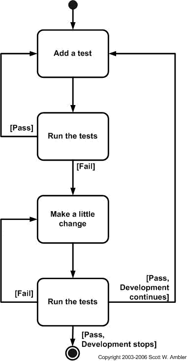

# TDD 值得吗？

> 原文：<https://medium.datadriveninvestor.com/why-tdd-may-sink-your-software-startup-18e42c16f8e1?source=collection_archive---------1----------------------->

Photo by [Deanna Ritchie](https://unsplash.com/@deannaritchie?utm_source=medium&utm_medium=referral) on [Unsplash](https://unsplash.com?utm_source=medium&utm_medium=referral)

上周六，我不得不参加一个社交活动。我到会场有点早。舞台正在被装饰。电工正在安装串联灯。他们想包围整个舞台表面，并忙于连接电缆。

我出于好奇问道:“你为什么不在进行下一步之前测试墙上的一根电缆？”

首席电工沾沾自喜地笑了，“过早测试没意思。即使只有一个灯泡坏了，它还是坏了。我们要么 100%成功，要么根本不成功。这就是我们的客户留住我们的原因。”

这听起来既自大又愚蠢。

“但是如果你不分段测试的话，你将会花费大量的时间来找出它失败的地方，”我争辩道。

 [## 数据科学和软件工程哪个更有前途？数据驱动的投资者

### 大约一个月前，当我坐在咖啡馆里为一个客户开发网站时，我发现了这个女人…

www.datadriveninvestor.com](https://www.datadriveninvestor.com/2019/01/23/which-is-more-promising-data-science-or-software-engineering/) 

“只要看看没有点亮的灯泡，我们就总能知道故障出在哪里。就是这么安排的。这纯粹是浪费时间，除非中间需要换电工。”

“但是如果他们都没有点亮呢？”我傻乎乎地问。

“你的插座明显有问题。我不知道测试我的电缆会如何使检测更好。”

我在想我周五的最后一次代码提交。我的代码在调试器中工作，但是我匆忙更新的测试失败了。它堵塞了 CI。那次提交毁了我整个周末，我不得不花半个星期一来修复那些失败的测试。

这种与电工的互动真的让我开始思考 TDD 对于每一种软件项目的可行性。所以在这里，我借此机会深入探讨 TDD 什么时候适合软件公司的产品生命周期，什么时候不适合。

# TDD(测试驱动开发)到底是什么？

在我们讨论 TDD 的优点和缺点之前，让我们先给出定义，以免混淆。

Agiledata.org[有非常深入的信息](http://agiledata.org/essays/tdd.html)关于为什么 TDD 首先被发明和采用。引用这段话:

> TDD 完全改变了传统的开发方式。不是先写功能代码，然后再写测试代码(如果你写的话)，而是**在功能代码**之前写测试代码。此外，您可以通过非常小的步骤来实现——一次一个测试和一小部分相应的功能代码。采用 TDD 方法的程序员拒绝编写新的函数，直到第一次测试失败，因为该函数不存在。事实上，他们拒绝添加哪怕一行代码，直到测试存在。

简而言之，TDD 实施并假设:

*   每个功能代码在存在之前都必须有一个测试
*   每一个新的特性/缺陷修复都经过了彻底的单元测试和验收测试
*   每个开发人员都知道如何编写单元测试
*   每个开发团队都采用某种测试框架

为了使事情简单化，我在这里粘贴来自 agiledata.org 的 TDD 流程图:

Source: [AgileData](http://agiledata.org/essays/tdd.html)

# 为什么您应该关注测试驱动开发(TDD)？

TDD 被誉为质量保证的圣杯。笔试通常被认为是面试候选人的先决条件。

我最近参加了一个十亿美元游戏公司的高级开发者技术面试。面试官问我，我更喜欢如何开始编写一个特性。

我认真地回答他:“我在纸上/白板上设计，写功能，重构，测试。”

“你如何测试它们？”他问。

“我不是已经提过了吗？”

"所以你*不会*从编写测试开始."他傻笑着说。

闪电击中了我，但没有返回的点。此外，我讨厌仅仅因为这个职位太有利可图而不能忽视就同意别人的意见。我选择了诚实。“我明白你的意思，但是不，我并不热衷于 TDD。至少在我参与的项目中没有。”

不出所料，他礼貌地护送我出去，我在我们互动的 2 小时内收到了拒绝邮件。

对 TDD 说一句礼貌的*不*就到此为止。

TDD 在整个软件行业的重要性一直困扰着我。我谷歌了一些关于 TDD 的观点，我得到了一些有趣的发现[在这里](https://blog.reactiveconf.com/tdd-waste-of-time-7bf5a84ce9b6)和[在这里](https://www.phpclasses.org/blog/post/237-7-Reasons-Why-TDD-Failed-to-become-Mainstream.html)。

早在 TDD 诞生之前就有编写复杂软件嗜好的资深开发人员对 TDD 持怀疑态度。Chris Fox 称 [TDD 为软件开发的根本错误实践](https://hackernoon.com/test-driven-development-is-fundamentally-wrong-hor3z4d)。

Ruby On Rails 框架的创建者 David Heinemeier Hansson 有一句著名的话[承认了他为什么不使用 TDD](https://dhh.dk/2014/tdd-is-dead-long-live-testing.html) 。

读完之后，我想到了一些 TDD 可能对您的 SDLC 产生负面影响的情况。

# **#1 —当有能力的开发人员在开发肉时，TDD 是一个负担:**

每个软件项目都经历不同的阶段。进展很少是线性的。高效的编码人员首先验证想法，然后开发具体内容。

那是什么肉？

肉是代码中解决核心客户问题的部分。

你正在开发一个更好的文件压缩软件吗？那么拉链功能就是你的肉了。

如果你正在开发一个健身应用程序，那么你从跟踪器中收集样本的部分将形成肉。

如果您的软件是分布式的，那么 Meat 还包含一些非常重要的组件。这些由网络和序列化模块、模型之间的链接、UI 以及它们之间的一切组成。

不用说，这是你进行大量重构的阶段。你*在这里得到*你的可重用函数。

如果你试图定义测试那些函数的每一次迭代的测试桩(甚至在编写那些函数之前，按照 TDD 的要求，[，你将最终编写那些测试桩一百万次。](https://en.wikipedia.org/wiki/Test-driven_development)

想象一下，基于现有的 API 编写一个定制的 UI 组件。它需要 40 个属性来装饰它。这是业内还没有人开发的东西，你也不确定这个新颖的想法能走多远。

你会先写测试来确保每个属性都工作吗？或者你会花时间发明创新的方法来制作更棒的 UI 吗？

TDD 的定义造成了测试用例阻碍开发的情况。

正是 TDD 的这种约束，使得即使是高级开发人员也要编写大量的测试。**荒谬的测试。**初级开发人员跟随他们的脚步，用更多无用的测试来混淆回购，只是为了遵循 TDD。

> 你的测试测试正确的东西吗？

一个真正有效的对细节有敏锐眼光的程序员不会编写验证无意义的东西的测试。

*   他宁愿调试每一条程序语句，以确保得到正确的值。
*   他将进行审查和同行审查，以确保他检查的是正确的界限。
*   他会反复设计和讨论。
*   他会记录每一个设计决策，以便在项目开发的每一点捕捉团队的愿景。

# # 2——但是如果你没有足够的财力雇佣所有高效的程序员呢？

在整个软件行业中，没有人有这种奢侈。包括 FAAMG 在内的顶级公司也不行。

有效的程序员是后天培养的，而不是天生的。由于大量的进度失误、易变的需求、不成熟的设计决策和杂乱无章的代码，它们变得很有效。

像其他行业一样，即使在软件行业，失败也是最好的老师。

初级开发人员在编写功能之前开始编写测试是有意义的，这样可以确保质量。

只有在他们参加课程以获得软件学位的时候。这不是讽刺。

> 有些人甚至想在特性开发之前就编写测试，这是本末倒置。

因为有人想甚至在特性开发之前就编写测试，这是本末倒置。对于那些希望将手推车视为乘客旅程的真正象征的人来说，它可能看起来很美。他们可以继续从前面跟随他们的目标乘客，很高兴马车在前进，马正在让它发生。

以蜗牛的速度。

空测试、重构测试、删除测试、修改测试和表面测试是这个迭代过程中最大的障碍。

大多数开发人员加入软件行业是因为他们喜欢以计算机的速度做事。您拥有由超高速硬件组成的终极设置，再加上配备插件的超现代调试器。你的桌面上有 15 个可视化工具。

但是，不是粗制滥造出下一个最好的想法，所有消耗每个开发人员一天 50%时间的都是无聊的测试用例，无用的测试用例，以及更多的测试用例。

# TDD 可能让初级开发人员失败的地方:

> 公司文化很少倾向于在单元测试开发上投入更多的时间，更不用说奖励 TDD 最佳实践了。

您非常渴望推出新的功能，并且您背负着一个过时的测试用例。现在你正在修改它，希望这一个将是最后一个，直到有人决定为来自一个特殊深度链接的客户绕过甚至是令牌检查。

> 高级开发人员经常分配不完整的任务，这迫使初级开发人员进行大量的测试重写，而没有 TDD 是可以避免的。

高级开发人员将需求分块分配给初级开发人员。他们将一个故事分解成几个小任务，以帮助低年级学生将问题的模块化形象化。TDD 将所有接口固定下来。开发人员可以灵活地更改函数签名，但是当测试也要做同样的事情时，对于初级开发人员来说，这使得开发变得很乏味。

在你的噩梦中，你无意中听到你的经理在会议室墙壁上聊天。他们计划在未来 3 个月推出一个经过修订的 API 来消除现有的流量。

提前很好地了解这一点，您仍然要努力为这个不合适的 API 编写测试。

一家初创公司不能为其旗舰开发者浪费这样的时间和动力。

# #3 —琐碎的测试案例=书面记录

我见过初级程序员为登录网页编写测试，检查 6 个测试用例以通过 CI。如果将来公司决定允许更长的密码长度，该怎么办？

较小规模的高数量测试没有帮助。因为没有人愿意仅仅为了考试而降低自己的冲刺速度。伪装 TDD 来更快地传递价值，是主要成功软件公司遵循的方式。

公司文化很少倾向于在单元测试开发上投入更多的时间，更不用说奖励 TDD 最佳实践了。

当你拥有一个初级开发团队时，你就面临着教育他们优化产品设计的挑战。相反，你最终解决了他们的无聊。

初级编码人员只有在学习模式下遵循 TDD 才有意义，迭代具有易变需求和粗制滥造工作流的函数签名对他们来说不是问题。

有了 TDD，他们可能最终会写出愚蠢的测试用例，或者更糟，更愚蠢的代码来提前回家。真正有创造力/生产力的人甚至可能会逃离公司。

事先编写测试用例的负担会减少他们对 API 的实验。他们将错过在引擎盖下调试和探索平台/框架必须提供的可能性。在我看来，这是任何软件公司最大的损失。

# TDD 的一些优点:

TDD 肯定有一个它的支持者想要利用的优势:管理者喜欢统计数据；这是他们工作的成果。随着冲刺的进行，他们会很高兴看到 CI 渠道中 100%的红色变成 100%的绿色。

谁关心交付给最终用户的价值？

对于那些将单元测试开发外包给更大的软件产品组织的机构来说，TDD 也是一个巨大的资金来源。这样，产品开发人员可以免于修改测试，因为代理测试人员做脏活累活。

当开发人员与编写测试脱钩时，它就不是 TDD 了。

# 结论:

*   测试是为了确保最终产品的质量，而不是开发的间歇阶段的质量。
*   测试是为了让未来的维护者比现在的维护者生活得更轻松。
*   测试比测试用例更重要。你可以通过编写不测试真实内容的测试来逃脱。
*   编写更好的代码是一个更健康的选择，而不是编写大量的测试来显示 TDD 遵从性。
*   因为它要求在开发之前进行*测试，所以许多团队做了错误的 TDD 或者正确的 TDD 却没有回报。这必须改变。*

TDD 在业界有一席之地。瀑布也有。没有一个会完全过时。

TDD 肯定对代码质量有巨大的价值，但是经常以牺牲开发人员的热情和生产力为代价。如果它想超越大口袋组织，它还有很多需要改进的地方。

没有将他们从 TDD 的当前状态中解放出来，没有软件团队能够实现这一点。