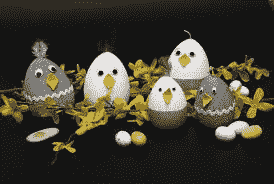

# 为什么团队工作有效。

> 原文：<https://medium.datadriveninvestor.com/why-team-work-works-b341695494c4?source=collection_archive---------32----------------------->

We win as a Team!

自从进化发生很久以来，单细胞生物存活下来并进化成多细胞生物。每一个细胞之间的协调努力使得恐龙有可能存活并变成化石，狗有可能成为毛茸茸的伙伴，当然人类也有可能生存并享受地球。一个简单的依赖创造了一个多种需求和手段共存的复杂结构。这适用于每一个生物体及其维持生命的活动。

事实上，我们是高度进化的物种，创造了一个美丽的社会和国家隔离系统。文明人要求的工作、职业和专业都需要团队的努力。从拥有一个不起眼的农场到一个千亿美元的公司，每个人造的实体都需要他人的帮助来维持和成功。

Flickr

> 除了在阿诺德·施瓦辛格的经典电影中看到的，我们还能举出成功的单兵作战的例子吗？经营一个企业需要一个团队甚至更多！

有了这些，员工对自己作为团队一员的认可度有多高？如果让我分享我的个人经历，我会毫不掩饰地说**“人各有志！”**事实上，我们必须保持警惕，保护我们的发展。忽略了一个同样重要的事实——如果我们作为一个单独的实体对整个团队来说仍然是一个隐士，我们就会辜负组织，最终辜负我们自己；这的确是一场自作自受的灾难。如果你觉得自己是个自作聪明的人，可以在公司陷入困境时退出，那就再想想吧。只有傻瓜才会有这种态度，认为只有他一个人完成了一次成功的冒险。构思可以是一个单独的行动，但决不能付诸实施。如果你把你的工作场所放在一个黑暗的池塘里，不要期望得到干净的水作为你的居住地。 ***一个阵亡的士兵比一个潜逃的罪犯更有价值。如果你真的想放弃，确保你是一名士兵而不是罪犯，更好的是成为一名士兵而不是罪犯。***

# 还记得安然吗，纳斯达克的掌上明珠。一群自私的高层管理人员为他们的个人成长展示了腐败的聪明，他们对胜利离开的错误理解被击倒在地，他们被关进监狱。

团队工作不仅仅是自命不凡的拍拍肩膀和丰盛的美食午餐或全付费的现场旅行。以下是你可以思考并积极灌输的四件事:

1.  **分担任务:**额外的工作不一定总是为了奖励或认可。如果你发现你的队友被一项你可以帮忙的任务困住了，那就去分担这项任务，即使那位队友不是你的朋友，甚至你对他/她有些冷漠。这将是建立强大职业纽带的好方法。

**2。保持透明:**你是老板的亲信，知道内幕消息。欢迎你独自品味内部消息。任何对团队有益的非机密项目相关信息都需要与整个团队共享。不要只是把信息带在身边，试着成为团队中的大力士。这说明你的团队精神有多弱。透明度带来信任和长期利益。

Creative Teamwork | by Aalto Creative Sustainability |

**3。避免玩责备游戏:**错误是自然发生的。今天，你可能是团队中的完美主义者。如果你后来犯了一个严重的错误，你的脖子处于危险之中，如果你一直是一个刺头，挑犯错误的成员，你的团队没有人会站在你一边。耐心地教导，并尝试与团队成员讲道理，解释他或她为什么反复犯那个特定的错误。伸出你的援助之手，鼓励他们有效应对。这不仅能提高你的领导技能，还能通过提高个人效用来帮助你提高产出。

pxhere

**4。物以类聚，人以群分:**这是不良企业文化滋生的习惯之一。我们很容易与说我们语言的人或来自同一个家乡、有相似兴趣或属于相似社区的人结伙。当我们在同类身上找到力量时，我们一次又一次地被诱惑去排斥弱者。这是一种不健康的做法，会挫伤被排除在外的队友的士气。尽可能地停止这种卑鄙的习俗，并灌输积极的人际关系的信念。

> **无论是高层、中层还是低层，如果你是一名团队成员，你将会吸收公司的核心价值观，并尊重积极团队合作的需要。理解“团结则存，分裂则亡”的基本原则。**

让团队成长，看到自己也跟着成长。即使你的技能高于现在的公司，像骑士一样体面地离开它，它会像一颗闪亮的宝石一样在你的简历上反映出你以前的公司和你一样成功。

