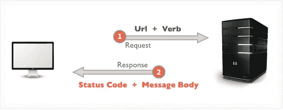
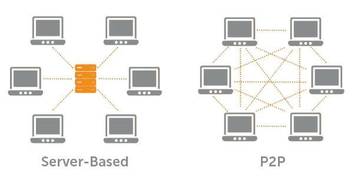

# 为什么科技仍然可以创造一个光明的未来，正如我向持怀疑态度的父亲解释的那样。

> 原文：<https://medium.datadriveninvestor.com/why-tech-can-still-create-a-bright-future-as-explained-to-my-skeptical-father-f3a6e6dc960?source=collection_archive---------3----------------------->

我最近收到父亲的一封电子邮件，内容是关于谷歌最近在量子计算方面的突破。

> “然而，另一项技术肯定会产生负面影响，并会破产或不受监管。请原谅我的冷嘲热讽。你怎么看待这种普遍的发展？”

我完全明白他为什么会有这种感觉，他可能是完全正确的。

然而，作为一名技术专家，面对亚马逊+ NSA 在地狱、大数据和其他一切事物中建立的伙伴关系，我仍然保持乐观，我想知道我是否无法解释为什么我可以乐观，因为很明显，这个世界的扎克伯格将把我们都变成某种肥胖、过时、几乎认不出是人的斑点。

我从事软件工作，最近一直专注于区块链空间和其他去中心化技术。这是希望所在。因为一个去中心化的世界首先没有中央权威来操纵和控制我们。但是有很多东西需要理解，才能想象这意味着什么。我花了很多年。我试图在给父亲的电子邮件回复中提炼出这一点:

# 亲爱的爸爸:

据我所知，我们距离量子计算的实际应用还有很长一段时间。真实、实用的量子计算的潜在负面和正面是难以想象的。

他们可以提供很多帮助的一件事是进行大规模模拟，试图了解做不同事情对环境的影响。这也可能是一条通往人工智能的道路，这当然可能是人类有史以来最好或最糟糕的事情。

我明白，但我不建议玩世不恭，部分原因是它不会减缓任何事情，还因为它就像对微积分的发明持玩世不恭的态度。没有人知道它会把我们带到哪里，我们只知道它会把我们带到一个不同的地方。

## IPFS

然而，我一直在了解一种令人兴奋的新技术，它可以立即投入实际使用，被称为星际文件系统，它有望以完全分散的方式取代现有的互联网基础设施。不需要数据中心。“为什么谷歌会允许这种事情发生”的问题可以用这样一个事实来回答，即这种基础设施的效率要高得多。

这么想吧。假设你有一份文件想给我。我们在危地马拉乡下的同一个小屋里。在当前的网络架构下，你的手机需要把这个信息发送到几百到几千英里外的服务器上，然后再返回给我，即使我就在你身边。如果那台服务器坏了，你、我和数百万其他人就倒霉了

IPFS 会让你直接寄给我的。不仅如此，如果危地马拉与互联网的连接被切断，危地马拉的每个人仍然可以相互交流。

越来越好了。(这有点技术性，但我相信你能理解。随便问我你喜欢的任何问题)

**地址基于数据，而非第三方域名注册机构**

您可以使用数据本身的指纹，而不是使用网址来指向数据所在的位置。没有人必须拥有域名，也没有人可以删除数据，所以你去的地址和数据不见了。数据的指纹指向数据本身，不管它在哪里！

它存在于任何想存储它的人的个人电脑或硬盘上。当你需要文件、视频、网站、图像或其他任何东西时，该协议会找到离你最近的一台或多台计算机进行下载。

**情况继续好转。**

现在在互联网上，如果你出版一本书，然后推出一个新版本，比如说，1000 页中只有 15 页被编辑，我们需要复制整本书。另一方面，IPFS 使用包括我在内的程序员使用的高效“版本控制”软件 Git。因此，新版本不是复制 985 页的全新副本，而是简单地创建 15 个新页面，软件会自动获取原始的 985 页。如果你想要新的版本，它将结合这些。如果你想要旧版本，它会简单地提供原始的 1000 页。

由于地址只是数据本身的指纹，所以你只需要知道指纹，不管是原始的还是新版本的，你的计算机就会从附近的计算机收集所需的数据。

**比这更节省空间！**

数据被分解成小的、易于传输的数据包。这是 HTTP、torrents 和几乎所有互联网协议的常见做法。然而，在 IPFS 上，你不仅可以避免从一个文件的一个版本到另一个版本复制数据，而且可以在不同的文件之间复制数据。整个系统是一个永远不需要复制的包的大系统。

在这个场景中，你在科罗拉多州，我在危地马拉。

假设你制作了一部电影，你想把它放到 IPFS 网站上。你不需要把它“上传”到任何地方，因为那里没有服务器。你只需把它放在你的电脑上，然后部署到 IPFS 网站上。通过这样做，软件会把你的电影分解成大概几十或几百个成千上万的包。也许更多。

现在想象几个这样的包代表一个没有声音的黑屏。在电影的开始和结尾有几秒钟，中间可能有几秒钟或几分之一秒。这些数据包与地球上任何其他视频文件中代表黑屏的数据包完全相同。

Using the web we currently have, this black background is stored on a specific server. No matter where you are in the world, you have to get it from this one place. If it goes down, we are out of luck. What sense does that make?

现在说我想看你的电影。我是第一个这样做的人，所以现在这部电影只在你的电脑上。我可以把影片的地址(影片中数据的指纹)输入我的电脑。它会开始从你的电脑上下载电影，甚至可以一包一包地直接传到我的电脑上。这些数据包中的每一个都有自己的指纹/地址，用于在离我最近的计算机上查找数据。

因此，对于每个数据包，它会寻找离我最近的计算机来获取数据。对于大多数包，他们将是这部电影的独特之处，所以他们必须从 CO 到 Guat。但对于许多人来说，就像黑屏数据包一样，可能会有一台离我更近的计算机在处理“黑屏”数据包。所以它不会去你的电脑前找那些东西。

随着这个系统的发展，越来越多的数据包将在不同的文件之间共享。

这产生了两个非常惊人的结果。

**1。**
随着你的电影被观看的次数越来越多，IPFS 网络中会有更多的用户想要下载这部电影，它会在系统中传播开来。越多的人想储存，甚至只是流，你的电影，越快**为其他人观看它！**

出于这个原因，大公司将别无选择，只能拥抱这项技术。他们可以通过这种方式，使用我们的硬件进行直播，节省数十亿美元，而不是花费大量的金钱在一个可以处理数千万台计算机的中央服务器上，这些计算机同时从同一台服务器上请求相同的数据。现在他们不得不猜测有多少人会观看，并为超过这个数字支付高价。如果太多人收听，他们就有带宽问题。如果收看的人太少，他们就要为那些没有被使用的服务器支付所有的钱。

所以这项新技术对每个人都有好处。

**2。**
理论上，最终系统可以变得如此数据丰富，以至于我可以创建和添加一些*新的*、独特的文件；一些简单的东西，比如一张图片或者一个 PDF，系统实际上已经有了在系统中构建最终产品所需的每个包。我真正要添加的是一个新的数字签名，它代表了所有的数据如何被拼接在一起，以创建最终的项目。

换句话说，我可以上传一个 PDF 文件，并分享指纹，世界各地的其他人可以开始使用该指纹下载 PDF 文件，但所有的数据包都是从离他们比我自己更近的计算机上加载的。他们可能不需要从我的电脑上下载一个数据包就能拥有这个文件。只需下载小块数据的副本，这些副本一起形成一个相同的文档。

由于寻址是通过实际数据的指纹来实现的，因此您可以完全确定您收到的是您所要求的确切数据。不多不少。

**无处窥探来自**

现在，有了这样一个建立起来的网络，T4 就没有国家安全局和亚马逊或任何人可以利用和吸取所有数据的中央管道。如果谷歌*真的想在自己的大型服务器上存储大量数据，他们可以继续下去。他们所做的只是通过为文件提供另一个存放的地方来为其他人加快网络速度。但是他们的服务器对网络来说并不比我的笔记本电脑更重要，除了他们可以保存更多的数据。*

如果你需要数据安全，它可以被加密并同样有效。

当你考虑到数据本身也可以是软件这一事实时，其含义变得令人震惊。

## 区块链

所有这些都不同于区块链技术。区块链技术有些类似，因为它涉及计算机之间的直接对话。但是区块链的效率比 T8 低得多，而 T10 比 T11 安全得多。有了区块链，不是在网络上共享数据，**每条**数据都必须存在于**网络中的每个**节点上。你可能听说过这个想法。有了比特币，每个比特币矿工都下载了整个链条的全部交易历史。随着每一笔新交易的增加，所有的矿工都相互核对，并达成共识，即新的交易是合法的，没有人破坏过系统。

借助世界第二大区块链和加密货币以太坊，您可以做的不仅仅是处理交易。你也可以运行代码，称为智能合同，这是我一直在学习设计和构建的。智能合同必须在每台以太坊矿工的计算机上执行，这样才能对代码的结果达成共识。

显然，让数千台计算机都运行相同的代码或处理相同的事务是非常低效的。然而，这正是它如此安全的原因。不需要中央权威，相反，你可以从数学上保证你寄给我的钱实际上首先是属于你的。或者我支付了 200 美元的电费，我收到了 150 美元，因此在我再次被收费之前，我应该再收到价值 50 美元的电费。

效率是一个问题，但是许多世界上最好的工程师正在研究如何保持同样的数学确定性，同时减少所需的数据量和处理能力。比如有一个很热的新东西叫做零知识证明，这是一种加密算法，可以肯定地验证我给你汇了 99 美元，不知道我是谁，你是谁，也不知道汇了多少。它可以验证“无论是谁发送的，都将正确的金额发送给了应该收到它的人。”

有了这样的创新，“所有交易”的规模变得越来越小，占用的计算能力也越来越少。

## Web 3.0

现在**结合**所有这些技术，你就有了网络在 2025 年的样子。所有不需要如此高的安全性和准确性的东西都生活在 IPFS 上。T4 需要的一切都在区块链。大公司可以创建他们自己的私人区块链，或者尽力让他们的旧系统保持活力。但是*新*的东西将主要建立在这些新系统上。

**这基本上可以做到的是从商业中消除最昂贵和最具控制力的看门人和中间商。对于终端用户来说，剩下的是一台效率更高、运转更好的机器:内容、知识、服务等的生产者和消费者。**

这是世界前所未有的向权力下放的巨大转变，并将改变关于权力和经济以及世界运作方式的一切。

我们所谈论的本质上是运行在全球超级计算机上的世界，每个人都有平等的访问权。

## 最后

如果谷歌能够设法用他们的量子计算机做一些有用的事情，他们就有机会保持相关性。权力的推拉继续。但是如果某个组织将其量子计算机连接到网络上。现在我们都有一台量子计算机作为网络的一部分。如果其他公司效仿，谷歌有一个并不意味着什么，因为我们都有一大群这样的公司。

再加上人工智能，天知道。我们可以很容易地拥有一个流畅而高效的系统，这是我们今天无法想象的。

也就是说，我认为，虽然玩世不恭是对当今许多问题的恰当态度，但技术不在其中。为什么？随着网络和系统变得越来越复杂，如果你想要效率，你必须牺牲控制。虽然我确信新的科技精英们确实享受他们的控制，但他们并不是通过寻求控制而达到目的的。他们通过建立更高效的系统实现了这一目标。在科技世界呆了 6 年后，我确信大多数科技精英对效率的热情超过了他们对成为寡头的热情。即使他们不是，目前估计有 1820 万软件开发人员不是精英，但仍然可以构建这些新系统。

我个人并不崇拜效率之神。然而，消除摩擦可以创造一种新的经济，在这种经济中，真正让我们有价值的贡献为我们创造了比以往更多的价值。换句话说，更多的自由，更多的时间，我们自己的人性可以产生更大的影响，我们为此获得更多的价值回报。

这是一个值得为之奋斗的未来，而且我们可以实现。

爱你，

亚历克斯

如果你有任何问题，我很想听听。

如果你是一个技术专家，而我在这里有任何错误，请让我知道！

如果你喜欢这篇文章，请跟我来，如果你想请我喝杯咖啡，你可以发邮件到这里:【paypal.me/alexwhite5d

 [## 金融科技档案|数据驱动的投资者

### 金融科技

档案|数据驱动的投资者 Fintechwww.datadriveninvestor.com](https://www.datadriveninvestor.com/category/technology/fintech/)