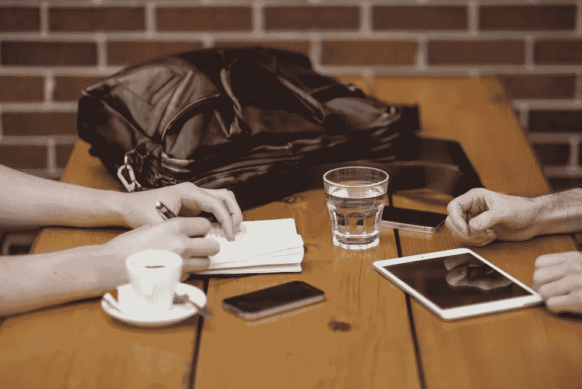
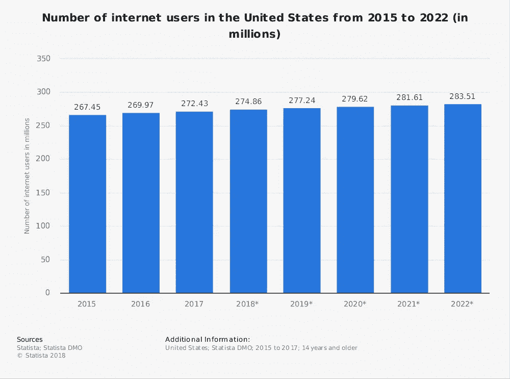
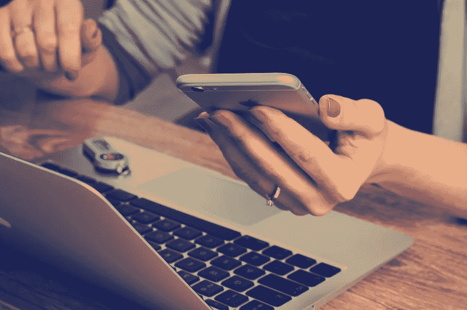
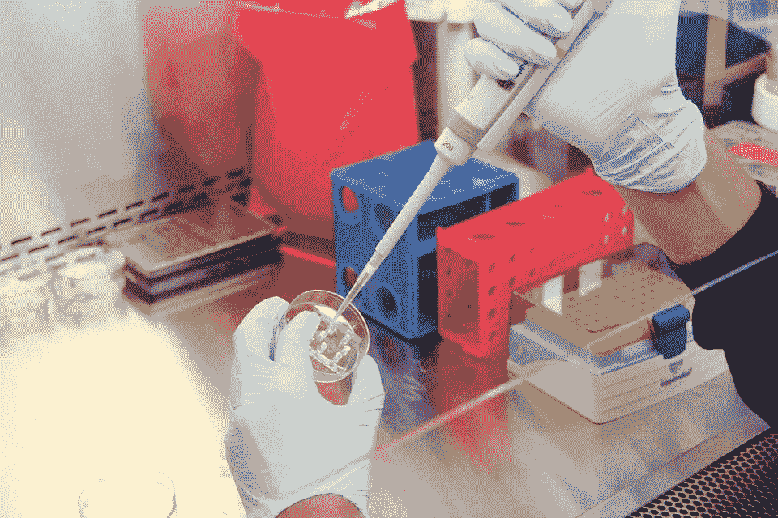

# 为什么“技术是邪恶的”这个答案太简单了

> 原文：<https://medium.datadriveninvestor.com/why-technology-is-evil-is-too-easy-of-an-answer-d5966b13d887?source=collection_archive---------4----------------------->

每一天，现代社会都变得更先进、更发达、联系更紧密。随着每一项重大技术创新的诞生，我们的世界面临着前所未有的风险。避开互联网和人工智能是很容易的，因为它们既可怕又危险——但你应该这样做吗？

简单的答案是肯定的。

毕竟，多年来，科幻小说和反乌托邦电影已经警告我们，科技可以为许多邪恶所用。最近，未来派的网飞热门影片*【黑镜】*以其令人痛心的信息吸引了数百万观众:小心创新。

无论我们是否被[我们军队在武器上的发展](https://www.businessinsider.com/american-battlefield-weapons-2011-4#the-taser-shockwave-4)所震惊，是否担心[我们自己的数据被泄露](https://www.bbc.com/news/technology-43649018)或者其他，几乎每个使用过技术的人都经历过与技术元素相关的不安感。

Via statista.com

然而，我们还在继续使用它。过度使用它。[2017 年，仅美国就有接近 2.72 亿互联网用户](https://www.statista.com/statistics/325645/usa-number-of-internet-users/)。我们的生活变得越来越以技术的使用为中心，也许这一事实只是让人害怕。在世界各地，人们都沉迷于技术带来的一切，有些人限制他们的屏幕时间，有些人则完全远离它。

作为课程项目的一部分，我休了六个小时的科技假。我关掉手机、笔记本电脑和电视，去攀岩了三个小时，然后在剩下的时间里和朋友一起去玩。这项任务的具体要求是，我们要避免一切“互联网连接技术”，比如“电话、电视、电脑或 iWatch”。

虽然我成功地避免了个人直接使用互联网技术，但我没有(我相信也不可能)离开任何技术。当我从使用自己的互联网连接技术中解放出来时，我反思了作为现代社会的一员并希望避免所有类型的技术是多么徒劳。

我开去健身房的车是数百年科技创新的成果。我在一个利用电子设备的红灯前停了下来。我走进健身房时，健身房的监控摄像头拍下了我的照片。我会员卡的扫描仪是电子的，可以上网。甚至浴室里的干手器也是令人惊讶的高科技。

在一个如此难以置信地依赖技术的社会中，我们不可能完全独立于技术本身。我们可以自主，因为我们可以选择不亲自使用或直接使用技术，但我们永远无法逃避他人对技术的使用，我们无法摆脱技术为我们的社会提供的固有商品。在某些情况下，技术不再被视为商品，而是必需品。

当然，技术绝对可以成为我们社会中许多独特问题的负担、威胁和催化剂。社交媒体可以用来描绘理想化生活方式的不切实际的画像，人们可能会变得过于舒适，只在屏幕上互动。

技术使他人失去人性，并影响了我们与周围人互动的方式，这种观点完全合理。意识到这种风险是关键；一旦一个人意识到这种危险，通过限制屏幕时间和重视面对面的互动，就很容易战胜它。然而，虽然宁愿不使用技术可能是一种个人选择，但将所有技术都贴上可怕和邪恶的标签最终是破坏性的和误导性的。

许多人害怕的同一项技术已经改善甚至拯救了许多人的生命。医学创新彻底改变了医疗保健，改变了全球医学。疫苗、假肢、外科技术、程序和研究给全世界数百万人带来了希望和答案。

此外，技术带来了国家和文化之间的交流，打开了文明对话的大门。技术已经以惊人的方式帮助我们的社会进步，并且随着我们的科学和研究知识的提高，它将继续这样做。

虽然有无数种方法可以利用技术为非作歹，但人工智能和技术创新还可以以更多方式造福于所有人。

如果我们能够学会负责任地、合乎道德地使用技术，我们不仅可以改善我们的日常生活，还可以改善其他人的福祉，甚至是我们所知的这个世界。