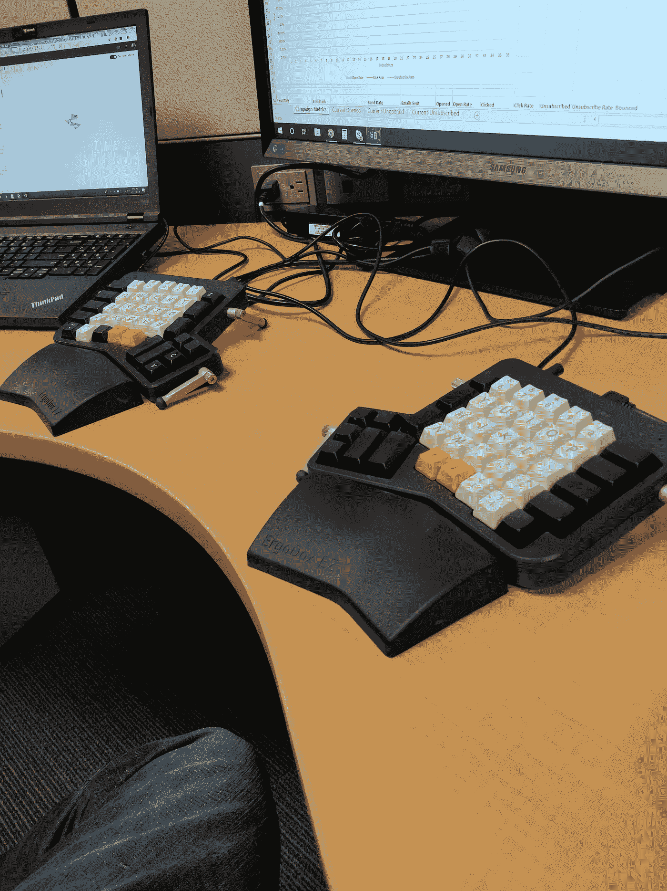
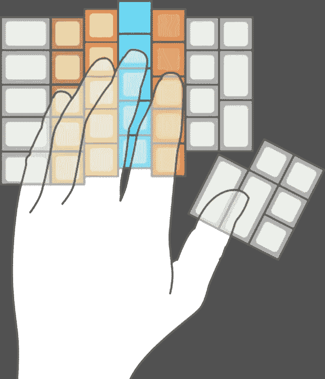

# 为什么 ErgoDox 可能是你的完美键盘。

> 原文：<https://medium.datadriveninvestor.com/why-the-ergodox-might-be-the-perfect-keyboard-for-you-d223fc40977e?source=collection_archive---------3----------------------->

## 释放直线键盘的魔力。

My ErgoDox Configuration

自 2017 年 12 月以来，我一直在一台配有 Cherry MX 白色开关的 ErgoDox EZ Shine 上打字，我不想回到任何其他键盘，即使多年来使用标准键盘在我需要借用别人的机器时仍然有用。甚至现在，我正在我的 ErgoDox EZ 上输入这篇文章，按照我内心的愿望进行配置。

*首先，我与 ErgoDox 没有任何关联，我没有从 ErgoDox 的销售中获得任何佣金，即使你在读完我的文章后想去买一个。*

## 什么是麦角新碱？

ErgoDox 最初是通过成功的 IndieGoGo 活动众筹的，是一种机械键盘，旨在提供舒适性和功能灵活性。它有很多很酷的功能，比如完全可重新编程，并且运行在开源代码上。你甚至可以建造你自己的。

设计它的前提很简单:标准键盘已经过时了，它可以更舒适。当你可以将键盘的设计和两半分开，并以更放松的姿势与肩同宽时，为什么要弯腰驼背地打字呢？让我们更进一步。当你的手指只能垂直移动时，为什么要斜着移动来打字呢？

这是 ErgoDox 做得非常好的两件事，如果你经常使用键盘和打字，你可能会考虑做出改变——如果你愿意花时间的话。

## 是给谁的？

ErgoDox 面向大量打字的专业人士。无论你是软件开发人员、游戏玩家、作家，还是想要一个超棒键盘的人，ErgoDox 都可能适合你。

## ErgoDox 的特点是什么？

ErgoDox(如果您选择购买预建配置的话)具有广泛的酷功能。

*   使用易于使用的图形配置器完全可重新编程，以改变您的键盘布局和功能。用特殊和组合键功能编程多达 32 个不同的层。
*   酷炫的 LED 灯让您更擅长游戏和书写。(不尽然，但它们看起来很漂亮，也是可编程的。)
*   从各种机械按键开关中进行选择，无需焊接即可随时更换。
*   舒适的打字:伙计，如果你要打字很长时间，这东西是很舒服的。手不会疲劳，打字时姿势更加放松、开放。

Vertical keys mean no diagonal finger motion, all but eliminating fatigue. (Image Credit: ErgoDox)

## 将(钥匙)转换到 ErgoDox 的挑战

除了双关语，转换到 ErgoDox 不会没有挑战，但我发现一旦我克服了它们，回报是值得的。以下是我在学习这款键盘时面临的挑战:

*   **成本本身:**:270 美元的基本款，没有你需要的花哨东西，如背光按键、舒适的腕托和金属帐篷，以支撑你的键盘半部到一个好的角度。如果你想要拥有所有酷功能的全套装备，你会看到 354 美元。
*   **切换:**切换到 ErgoDox，我的打字速度从每分钟 90 个字降到了 25 个字。当你转换时，许多你可能有的但不知道的坏习惯开始显现出来，天哪，它们真丑。我花了几个星期来提高，甚至九个月来，我仍然只有大约 80 WPMon 的 ErgoDox，即使这 80 在长时间内比我从标准键盘得到的要舒服得多。
*   **布局:**这款键盘最强大的地方在于你可以自定义自己的布局。作为一名作者，我花了十次不同的迭代才找到最适合我的方法，将我最常用的复合命令绑定到一个键上以方便使用。预计将不得不摆弄你的布局，并通过重新学习某些键来增加学习曲线。
*   **来回移动有些麻烦:**每次我现在都不情愿地使用标准键盘，这很好，但我下次使用 ErgoDox 的前五分钟左右就有麻烦了。我现在尽量避免使用普通键盘，以至于我刚刚又买了一个 ErgoDox，这就引出了我的下一个观点。
*   你会想要另一个 ErgoDox: 我最后又买了一个 ErgoDox(价格是 354 美元的两倍)，这样我就不用定期带着键盘上下班了。如果你在家工作或者不经常在家使用电脑，这没什么大不了的。如果没有，你可能会计划服用另一种麦角新碱来提高你的生活质量。

# 判决

现在我已经用了将近一年了，我无法想象自己会使用其他键盘。ErgoDox 在我需要它的每一个方面都表现出色，在工作中，当我写书时，当我玩游戏时，它都非常棒。如果你能克服这一系列的挑战，做出改变，我想你会发现这个键盘是一个梦想。