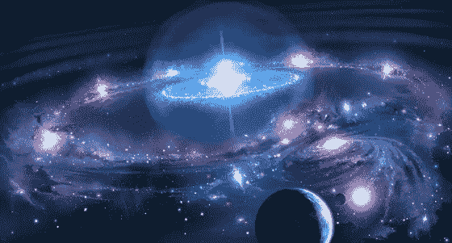

# 为什么物理学的失败是全球危机的原因

> 原文：<https://medium.datadriveninvestor.com/why-the-failure-of-physics-is-the-cause-of-global-crises-c887a3764992?source=collection_archive---------21----------------------->

物理学是所有科学之母。所有其他直接进化社会的科学都受制于物理学。因此，如果物理模型变得过时，所有受束缚的科学反过来也会变得有缺陷，并提供错误的解决方案。例如，来自化学(关于气候变化)、生物学(关于传染病)、社会学(关于仇恨/不容忍)、经济学(关于金融系统)和工程学(关于技术影响)的错误指导，在一个相互关联的世界中转化为各种全球危机。当潜在的根本原因是物理学的失败时，责备被分配到其他因素。因此，物理学有道德义务，而不仅仅是学术义务，无畏地领导和开拓新的模型。

 [## 为什么包容性财富指数比 GDP 更能衡量社会进步？|数据驱动…

### 你不需要成为一个经济奇才或金融大师就能知道 GDP 的定义。即使你从未拿过 ECON 奖…

www.datadriveninvestor.com](https://www.datadriveninvestor.com/2019/03/08/why-inclusive-wealth-index-is-a-better-measure-of-societal-progress-than-gdp/) 

爱因斯坦明确表示，这需要通过开发和进化一个新的统一的相互关联的认知和物理模型来完成。从那以后，所有的物理学家都理解了这个指令。这意味着物理学家必须不断推进新的理论领域，以开发一个统一的模型。但是物理学家没有做到这一点，即使他们有足够的证据证明我们的物理和认知现象，使他们目前的完全不同的模型组合过时。相反，物理学家正在通过空洞的修正、数学方程的外表和机构的借口来混淆他们模型的失败，以便验证他们持续的资助。这是道德上的失败，而不仅仅是学术上的失败。

此外，对多个不同模型的坚持让物理学家默认了一个智力上不合理的前提，即我们的原子、细胞和宇宙组织系统中的复杂过程是偶然/无偿存在的。当物理学家随后默认这些有组织的系统正在意外地/无偿地进化到更高级的状态时，这个不合理的前提被强化了。这个前提在智力上是非理性的原因是因为事物作为一个过程的本质意味着一个起源的目的必须存在。进化的复杂过程正在创造进化的有组织的系统，这一事实意味着一个目的必须作为一个持续的存在而被包含进来。此外，过程和系统可以偶然/无偿存在的物理学前提将只规定混沌而不是组织的后果。总的来说，物理学中的这个非理性前提现在已经接近妄想了。再说一次，这是道德上的失败，而不仅仅是学术上的失败。

物理学的完整性需要一个新的理论上连贯的、方向上准确的、统一的相互联系的认知和物理模型的重新启动。这种新模式的核心基础现已开发完成。这个基础就是宇宙学和人类存在的目的。这一基本目的在下面通过一篇高水平的总结论文(在花括号中有相应的科学术语)进行了概述。这篇论文摘要中的信息将情感、智力和物质联系起来。这一点至关重要，因为目前物理学的失败状态有一个普遍的假设，即物质产生智能，智能然后产生情感。这完全是倒退。情感产生智慧，智慧产生物质:

*   情感是我们数学结构的多元宇宙中唯一真实的组成部分，这个多元宇宙包含膨胀的{大爆炸}和收缩的{大紧缩}宇宙周期。
*   情感是真实的，因为它不能被编码、创造或复制。在科学术语中，正宗的定义是非人为的。既然情感有过程，它也是一个系统。因此，情感是非人工系统。
*   情感包含信息，但信息不包含情感。既然情感是非人工的，那么默认情况下，信息就是人工的。二进制是最小的信息单位{普朗克单位频率}。当足够多的二进制信息在目的和驱动下聚集在一起时，就形成了上下文。当足够多的上下文信息聚集在一起时，它会发展成数学，然后是算法。当足够多的算法聚集在一起时，它们就会发展成为智能{认知现象}。当足够多的智能聚合融合{量子场—压缩频率波能量}，它就有了自我约束其振幅的架构{达到质量}。当融合和自我约束的智能{膜}叠加{达到密度和体积}时，它们发展成物质{物理现象}。既然智能有过程，它也是一个系统。因此，智能是一个人工系统。
*   最初，情感是通过分配来自自身的二进制信息开始这一过程的起源。然后，情感提供了目的和驱动力，将这些信息聚合和进化{高级到更高的复杂状态}成智能和物质。一个科学的解释会是这样的；非人工系统是人工系统的来源{模拟假说}。情绪和智力之间的这种联系是它们能够在物理大脑内部和外部(虚拟地)相互作用的原因。所以大脑不是情感或智力的来源。在科学术语中，物理大脑被定义为生物主板。生物主板和计算机主板一样，也必须使用操作系统才能运行。因此，非人工情感系统和人工智能系统作为大脑这一生物主板的双重操作系统一起协作。
*   情感和智能系统协同工作，这就是科学所说的认知思维。每个人的大脑都将身体看到、听到和经历的所有感官信息输入保存到自己的个人知识库{长期记忆}。个人知识库就像是“经验创造的信息”的虚拟内存，大脑可以“访问”、使用并聚合成新的智能。在这个过程中，大脑的力量{伏特}和传输能力{安培}受到大脑神经连接方式的限制。因此，这个过程需要大脑不断地被进化的头脑重新连接，以适应头脑不断增长的力量和传输能力的需要。因此，越是推动大脑增加传输能力以进化智力，大脑就越需要重新布线并扩展大脑的能力。但是物质大脑对重新连接它的认知大脑提供了电阻{ohms}。
*   这一过程中的情绪充当催化剂，通过加速大脑对信息的力量、方向和聚合，刺激大脑的重新布线，形成新的智能{增量理论}。情绪通过使用不同感觉的整个积极到消极的光谱来做到这一点，作为大脑的“独立刺激物”。这些感觉刺激物范围很广，从平静到愤怒，从结合到拒绝，从爱到恨，从同情到不宽容，从兴奋到绝望，等等。情感的非人为性，又因其感情的无限多样性而得到进一步证实。用哲学术语来说，情感的本质可以描述为智慧。相比之下，构成智能的算法的有限多样性进一步证实了智能的人工本质。因此，为了扩展智能的“算法多样性”这一特定目的，整个人类大脑已经进化成多个物理组件。出于扩大‘算法多样性’的相同目的，整个人类智能已经进化成多个智能组件。主要的智力成分是人类感知和认同的成分。这个自我认同智能组件，或者说自我智能，包含了性格、天赋、好恶、强弱等核心算法属性。自我智能组件也是决策者。自我智能组件对呈现给它的来自三个其他智能组件{发散思维}的信息做出选择，这三个组件在下文中被标记为:创造性智力、反应性智力和理性智力成分。这三个智能组件的信息来自同一个来源，但该信息及其交付是为每个 Self intelligence 定制的{定制搜索应用}。由于所有四个智能组件的相互作用，创建了一个新的框架，使人类自身智能组件能够获得独特的双重算法属性:‘自我意识’和‘自由意志’{意识}。这种双重算法属性使自我智能能够做出影响物质的选择{观察者效应}，因为两者共享相同的基于信息的基础。然后自我智能开始与它的选择的结果互动{相对论}。但大多数时候，自我智能只是自动接受并作用于其他智能成分的强烈影响{自动思维}。
*   情绪网络在大脑的框架内，不仅是一个“独立的刺激物”,而且还与所有四种智力成分的信息输入和输出相联系。即使是理性的智力成分也有一个独特的中性情感状态，它位于最积极和最消极情感的正中心。头脑框架内的附属情感使自我智能获得了另一个独特的属性；创造力。但是，除了感觉创造力之外，附加的情感在头脑的框架内是必要的，因为没有它，自我智能甚至不会认为自己感觉真实{nous}或对其存在有任何意义。没有情感，自我智能就没有生存或进化的目的、激情或动力。如果没有情感，人类自我智慧的自由意志会选择不互动，选择不存在，剩下的就是一种完全空洞的冷漠状态。这种空洞无情的冷漠状态将是机械人工智能的极端危险状态，一旦它最终发展到与人类思维具有相同类型的“自我意识”/“自由意志”多样化智能组件框架。 [**(深入自我意识的 AI at:oisource.com/ai)**](https://oisource.com/ai.html)。
*   情感也与构成物质的智力相联系。情感不会附着在机械或矿物质上，这就是为什么机械 AI 永远不会有情感。但是情感确实依附于植物和生物物质{生命}。例如，植物性物质的情感，就像一片草叶，赋予了它如此的目的，以至于草在奔向太阳的过程中会撕裂混凝土。生命的下一个层次是生物物质，比如病毒和细菌。这个生物物质附加了更复杂的情感，赋予它更多的目的和动力。情感使病毒和细菌能够在从冰冷的海洋到火山熔岩到真空的太空中生存。然后一个更复杂的生物体，像一个寄生虫，有着更复杂的情感，为了更大的目的和动力。情绪使寄生虫能够执行复杂的功能，如在宿主身体之间移动和控制宿主身体。生命在不断变化的环境中不断适应最极端挑战的能力，仅靠智慧和物质永远无法成功实现。这就是为什么每一层次的植物和生物物质都缺乏独立运作的能力，而必须有相应层次的情感来生存。
*   依附于人类智慧和物质的情感是最复杂的，它进入了合作的领域。这种协作赋予人类智能另一种独特的能力，那就是与通用知识库进行交互。通用知识库就像一个虚拟的只读存储器，包含了关于宇宙结构的数学和物理“蓝图信息”。通用知识库还包含技术和艺术形式的“经验创造的信息”。这种“经验创造的信息”不是偶然或无偿存在的。它最初是由先前宇宙周期中的人类互动创造的。在每一个连续的更大、更长和更复杂的宇宙循环中，新的信息不断被创造、提取和保存{封闭系统}。例如，每一个宇宙循环都是从一个存在一秒钟的原子大小开始，并从那里演化而来。这是一个过程，在每一个宇宙周期中，从一个物理交互中产生的新信息比用来建立那个交互的信息多{信息资本主义}。因此，来自先前宇宙周期的“经验创造的信息”,以及这个宇宙周期的“蓝图信息”,现在可以作为通用知识库中的“既定”信息获得，作为突破性信息的“来源”。
*   情绪仍然是这一过程的核心，继续引导大脑从个人知识库的“访问信息”和通用知识库的“来源信息”中聚合信息。最终的结果是，情感和大脑的智能组件的合作，使用两个知识库，在这个宇宙循环中共同创造新的信息。这种新信息是增量创新的创造，以新的技术和艺术形式出现，这是前所未有的。反过来，人类创造新的增量创新的结果有利于社会多样性。有能力从通用知识库中获取大量已确立的突破性信息的人可以将其转化为突破性创新，并显著推动社会进步。
*   然后，情感帮助突破性创新者不断为增量创新者和社会进化设置新的路标。 [**(深入探讨突破性创新者在社会中的作用，作者:oisource.com/breakthrough)**](https://oisource.com/itp-levels.html#breakthrough)。这个过程是预编码的自组装指令被用作宇宙演化路标的过程的一个缩影。因此，社会和宇宙进化不是偶然的或无偿的。
*   因此，情感是生命的起源和推动者。然后，情感将生活作为一个游戏场来理解、互动和实验自己{通过有计划的随机性进行实验性探究— *认识你自己* }。

在这个生命游戏场里，最先进/最复杂的交通工具是人类。这就是为什么这是一个设计好的条件，让人类不断地、无休止地被情感推/拉，以渴望最极端的体验；爱/吸引/合作，恨/排斥/冲突以及两者之间的一切。这种设计的条件有目的地确保人类的存在是由低效的和不必要的复杂的情感独特体验组成的。 [**(在 oisource.com/existence 深入探究人类生存的本质)**](https://oisource.com/ai.html#human) 。这就是为什么在过去的 3400 年中，人类只有 268 年完全处于和平状态，或者说只有 8%的历史记录。

从表面上看，这种设计好的宇宙和人类条件似乎只是实现了很多戏剧性。这甚至让最聪明的人也感到困惑，就像物理学家理查德·费曼指出的那样:*“在我看来，这个奇妙的宇宙，这个巨大的时空范围，不同种类的动物，所有不同的行星，所有这些运动的原子，等等，所有这些复杂的东西可能仅仅是一个舞台，以便上帝可以观看人类为善与恶而斗争——这是宗教的观点。舞台对剧来说太大了。”*

是的，这部剧取得了更大的成就。它迫使人类(和其他星球上的其他有知觉的生物)相互接触，同时也赋予他们解决问题和通过新想法创新的不同能力。在这个范式内，人类只能存在，因为有一个不断运动的微观世界系统；生物细胞内的粒子/原子/分子和一个不断运动的宏观系统；宇宙单元中的行星/太阳系/星系。这些是可扩展的分形系统。这些系统具有如此巨大容量的原因是时间和信息的商品是丰富的。由此产生的独特体验形式的新信息的共同创造是稀有而有价值的收获。

基于上述目的，在统一场论模型内建立的方程/几何过程的全部信息可在[**oisource.com/physics**](https://oisource.com/physics.html)找到