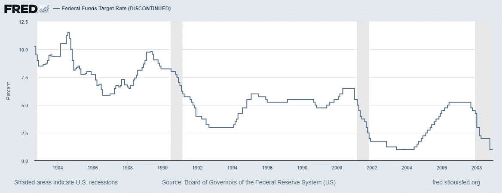
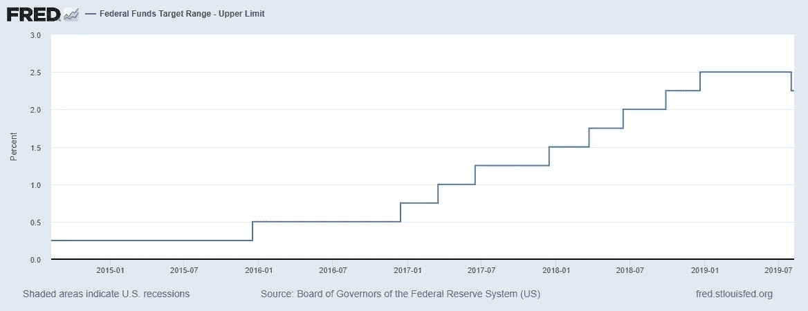

# 为什么美联储不应该降低利率

> 原文：<https://medium.datadriveninvestor.com/why-the-fed-should-not-have-lowered-interest-rates-903f0b727acd?source=collection_archive---------6----------------------->

如果现在维持降息政策，下次衰退可能就要用负利率了。

Photo by [Artem Beliaikin](https://unsplash.com/@belart84?utm_source=medium&utm_medium=referral) on [Unsplash](https://unsplash.com?utm_source=medium&utm_medium=referral)

7 月 31 日，美联储将利率从 2.25%下调至 2.00%。降息是个糟糕的主意。随着美国从大衰退中复苏，利率已经保持低水平好几年了。这是必要的，但此时降息不仅没有必要，而且非常危险。

# 通过在经济表现良好时降息，我们正在失去一个通常在经济放缓时使用的工具

过去，只要经济开始放缓，美联储就会降低利率。这些较低的利率起到了刺激经济的作用。每当经济过热、担心过度通胀时，美联储就会采取加息政策。

 [## 为什么包容性财富指数比 GDP 更能衡量社会进步？|数据驱动…

### 你不需要成为一个经济奇才或金融大师就能知道 GDP 的定义。即使你从未拿过 ECON 奖…

www.datadriveninvestor.com](https://www.datadriveninvestor.com/2019/03/08/why-inclusive-wealth-index-is-a-better-measure-of-societal-progress-than-gdp/) 

下图显示，当经济陷入衰退时，足以刺激经济的降息幅度约为 5-6%。目前，在最近的降息后，我们的利率只有 2.25%。那么，如果我们进入新一轮衰退，我们如何实现所需的 5-6%的削减呢？下面两张图表显示，在未来的衰退中，我们没有足够的空间以正利率刺激经济。

An interactive version of this graph can be found on the Federal Reserve Economic Database (FRED) at [this link](https://fred.stlouisfed.org/series/DFEDTAR).

An interactive version of this graph can be found on FRED at [this link](https://fred.stlouisfed.org/series/DFEDTARU).

如果我们把利率降到零，但这不足以刺激经济，我们该怎么办？答案是，我们必须走向负利率。负利率是一件可怕的事情。参见*巴伦的*中关于欧洲负利率问题的讨论[负利率已经上瘾](https://www.barrons.com/articles/negative-interest-rates-europe-51558452806)。负利率是一个“焦油婴儿”

有人可能会说，负利率是不必要的，因为经济真正需要的是计划周密的财政政策，把钱交到中产阶级手中。然而，真的有人期待国会能很快通过任何法案吗？

# 美联储降息只是为了支持特朗普的贸易战

美联储主席杰罗姆·鲍威尔(Jerome Powell)说，降息是应对经济潜在减速的保险政策，包括贸易紧张局势加剧和全球增长放缓。参见[美联储自 2008 年以来首次降息](https://www.npr.org/2019/07/31/734060292/fed-cuts-interest-rates-for-1st-time-since-2008)来自 *NPR* 关于此次降息的更多信息。

美联储需要保持独立性，不要成为一场考虑不周的贸易战的同谋。如果美联储没有降息，它将对特朗普政府施加更大压力，迫使其放弃破坏性的关税。

一位总统怎么会认为同时用保护主义贸易壁垒来攻击整个世界、盟友和不那么友好的国家是个好主意？美联储只是确保了这一疯狂政策的延续。这项贸易政策得不偿失。无论输赢，总统都会宣布胜利，他的支持者也会同意他的观点。与此同时，我们通常会出口的农作物正在田里腐烂。这一政策持续的时间越长，进入新一轮衰退的可能性就越大。由于导致大衰退的许多系统性问题尚未得到解决，下一次衰退可能被称为“大衰退”。

# 负利率的问题

通常，当一个人在银行存款时，他或她实际上是在向银行贷款。该银行将这些存款资金的价值计入其部分准备金，然后根据存款金额的乘数发放贷款。银行向存款人支付利息，并从借款人那里收取利息。这是世界应该运行的方式。

当一个国家的利率为负时，货币以颠倒的方式流动。为了把钱存在银行，银行向存款人收取利息，为了借入资金，银行向借款人支付利息。这很疯狂，但这些负利率是当今许多欧洲国家的现实。

对许多银行储户来说，负利率的改变并不重要。令人难以置信的是，许多储户仍然在收取月费且不支付存款利息的机构办理银行业务。然而，对于很大一部分美国人来说，这些负利率很重要。

## 为了避免亏损，你要么是借款人，要么是现金持有者

在这个颠倒的负利率世界里，为了不让自己的银行账户因负利率而缩水，你需要要么成为借款人并因此获得利息，要么从银行取出资金并携带现金。

在经济衰退时，许多携带大量现金的人会成为犯罪的目标。这些犯罪目标中的许多都在更贫困的地区，因为生活在这些地区的人的信用评分普遍较低。这些人将无法借款，因此无法获得利息，而是必须向银行支付利息或携带现金。政府将如何应对这种犯罪浪潮？

## 负利率将增加对无现金经济的需求

负利率带来的这些问题的解决方案是转向无现金经济。从表面上看，无现金和/或加密货币经济可能有许多优势。在很大程度上，我们中的许多人已经通过使用借记卡和信用卡生活在无现金经济中。无现金到这种程度就好了。然而，一个完全无现金的经济是一个可怕的想法。

当一个人手中可以持有实际的实物货币时，就有了一种在无现金经济中永远不会存在的自由度。例如，如果你与债权人发生分歧，而他们在你不知情的情况下做出了不利于你的判决，该怎么办？债权人可能会拿走你一些“无现金”的钱。另一方面，同一个债权人不能从你的口袋里拿走现金——至少在你不知道的情况下。不能携带现金将导致滥用个人的正当程序权利。

# 结论

有没有人愿意生活在一个为了不让银行账户缩水而不得不借钱的世界里？我们必须避免使用负利率。如果我们生活在一个代表一个人信用评分的三位数代码是你的银行账户是因负利率而缩水还是增长的决定因素的世界，收入和财富不平等只会越来越严重。

由于无力偿还债务，经济能力较低的人通常信用评分较低。因此，负利率的颠倒世界将使这些人的账户萎缩，导致更加绝望的局面。债务在某种程度上是一种个人奴役。

我一生中的大部分时间都在努力减轻人们的债务。我担心，一个负利率和无现金社会的世界将导致一个反乌托邦的现实，我们将只能根据自己三位数的信用评分进行买卖。目前，在我们的经济中，如果我们不想成为债务人，我们可以拒绝成为债务人。无现金/负利率经济将使“选择”成为非债务人变得更加困难。

一个真正的经济必须基于“价值交换价值”的概念，而不是“价值减少的债务”现在是美联储站出来维护其独立性的时候了。通过这样做，美联储将迫使美国选民选出负责任的领导人。任何负责任的领导人都会意识到，美国必须停止仅仅依赖货币政策。任何负责任的领导人和政党都会推行提升中产阶级的财政政策，而不是导致大量财富从中产阶级转移到最富裕的美国人手中的财政政策，例如为富人减税。