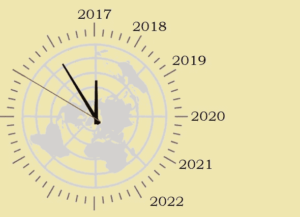

# 为什么未来得不到资助

> 原文：<https://medium.datadriveninvestor.com/why-the-future-doesnt-get-funded-ecc1c40789fb?source=collection_archive---------28----------------------->

## 为未来经济而不是旧经济融资

## 介绍

为什么要担心未来？未来不会自己照顾自己吗？毕竟，我们不是在不明确关心未来的情况下相处得很好吗？历史的记录并不令人鼓舞，它表明，如果我们为未来做好准备，并在问题变得不可收拾之前加以解决，我们可能会做得更好。但是，是否为未来做好了准备？大多数情况下，没有。有一个令人惊讶的简单原因，很少为未来做准备，这是因为未来没有得到资助。

礼物得到资助，因为礼物和我们在一起为它辩护，直接拨动我们的心弦。不幸的是，过去也常常伴随着我们，我们发现自己资助过去，因为它是熟悉和舒适的，而没有意识到这往往对我们的利益不利，而不是对我们的利益有利。但是，未来仍然是抽象和难以捉摸的，鉴于目前的危机，我们很容易忽视我们明天必须面对的问题。但是未来即将到来，它*可以*被资助，只要我们选择这样做。

## 钱，钱，无处不在…

当今世界充斥着金钱。尽管有次贷危机、大衰退和欧盟几近解体的后遗症，但世界上从未有过如此多的资本寻求有利的投资，也从未有过像现在这样的资本集中。任何关心这项研究的人都很容易获得这些统计数据:相对少数的个人和机构拥有并控制着世界上的大部分财富。他们用这些钱做什么？大多数情况下，他们都在寻找一个安全的地方进行投资，而找到一个安全存放这么多钱的地方并不容易。

货币的全球可获得性与食物的全球可获得性是平行的:尽管世界人口已经超过 70 亿并且还在增长，但是今天世界上有充足的食物，人们没有食物的唯一原因是由于政治(和经济)对食物分配的阻碍。然而，即使在 21 世纪，当有足够的食物养活地球上的每个人时，许多人仍然挨饿，饥荒仍然发生。类似地，尽管世界上充斥着寻求投资和回报的资本，但许多有价值的项目资金不足，许多项目根本没有资金。

## 什么得到资助？

**W** 帽子*得到资助？可预测的机构项目通常会得到资助(我们以前称之为“像房子一样安全”的投资)。尽管存在主权债务违约的事实，但民族国家仍然是相对较好的信用风险，但最重要的是，它们足够大，能够吸收目前正在寻找去处的大量资本。主要行业也足够大和稳定，以吸引大量投资。一定数量的资本发现自己作为风险资本投资于较小的项目。*

*众所周知，风险投资是风险最大的投资，风险资本家预计他的大部分投资都会失败，不会有任何回报。回报来自于非同寻常的冒险，尽管困难重重，而且与投入的资本不成比例，却取得了巨大的成功。这一罕见的风险投资成功非常有利可图，不仅弥补了所有其他损失，而且弥补了损失，使成功的风险投资公司成为世界上资本最密集的行业之一。*

## *为冒险而冒险？*

*任何风险投资项目的风险都已经很高了，风险资本家不会不必要地寻求额外的、不必要的风险，因此，在获得风险投资的少数项目中，获得投资的不是风险最大的项目，而是风险最小的项目。也就是说，在资本可获得的边际投资中，投资者试图挑选那些看起来尽可能可靠的投资，尽管事实上这些投资中的大多数都将失败和亏损。没有人是为了冒险而冒险；如果有人追求风险，那也只是为了获得更高的资本回报。*

*风险投资家有一个公式。他们在被认为是项目早期发展的关键阶段投入一定数量的资金，然后制定一个时间表，将产品推向市场，并使公司尽早上市，这样风险资本投资者可以在两到五年内再次收回他们的资金。*

*考虑到吸引风险资本的投资的本质已经很脆弱，许多投资的想法被以最脆弱的借口拒绝，几乎没有经过认真考虑就被立即拒绝，因为它们被认为不切实际或过于理想化，或者不可能足够快地产生回报以证明风险资本注入的合理性。*

## *企业家、投资者和气质类型*

***W** 为什么被资助的项目得到了资助，而其他项目没有得到资助？这个问题的答案在于成功投资者的个人心理。少数积累了足够资本成为新企业投资者的人之所以变得富有，主要是因为他们有一个好主意，并坚持不懈地坚持下去。专注是成功的必要条件，但这通常是以戴上眼罩为代价的。*

*每个人都有冒险和尝试的冲动，也渴望稳定和熟悉。冒险的冲动带来了企业家精神，对公认智慧的质疑，尝试和冒险的意愿(通常包括寻求刺激的活动)，以及逆来顺受的准备。对稳定的渴望带来纪律、专注、勤奋，以及勤劳者所有熟悉的、麻木的美德。对一些人来说，冒险的冲动占主导地位，而对另一些人来说，对稳定的渴望是生活的决定性影响。*

*对企业家来说，冒险的冲动超过了对稳定的渴望，而对金融家来说，稳定的渴望超过了冒险的冲动。因此，企业家和资助他们的投资者构成了互补的人格类型。但两者都不能代表两个极端。冒险家和诗人是富有想象力的极端代表，而墨守成规的传统主义者则是稳定的极端代表。*

*我是少有的同时拥有冒险想象力和自律的人；这是天才。对大多数人来说，要么是想象力，要么是自律。那些想象力丰富但缺乏纪律性的人可能会胡思乱想，但在现实世界中很可能一事无成。那些纪律占主导地位的人可能在生活方式上缺乏想象力，但他们也可能在行为上稳定、专注和可预测。*

*大多数一开始持有适度股份的人渴望比 6%的年回报率更大的冒险。由于冒险的冲动，他们很可能会去冒险，而这种冒险在经济上是不合理的。这样的人可能会获得独特的经历，但如果他们能够克服自己对冒险的渴望，专注于一个有纪律的投资计划和延迟满足，他们可能会在经济上更成功。如果你能克服这种冒险的欲望，你就能让自己变得相当富裕(至少，你能让自己过得舒适)，而不需要太多的努力。尽管我们听到没完没了地赞美新奇和创新，但事实上，纪律远比创造力或创新更重要。*

***底线是，控制世界资本的人在智力上没有冒险精神或想象力；相反，他们的财务成功是他们缺乏想象力的选择性结果。***

## *机构慷慨的一课*

*在这方面，麦克阿瑟奖学金的教训值得一提。当麦克阿瑟基金会奖学金成立时，激进的前提是把钱给个人，然后他们可以自由地做他们想做的任何工作。当最初的奖学金被授予时，一些新闻界人士和一些吃不到葡萄说葡萄酸的人嘲笑这些奖学金是“天才补助金”，暗示该基金会在其慷慨中有点过于宽松和自由。显然，批评击中了要害，因为在连续几轮命名麦克阿瑟奖的过程中，奖金变得越来越保守，批评者大多不再称它们为“天才奖金”，而是在背后窃笑。*

*慈善基金会就像企业一样，在本质上保守(如果不是反动的话)的社会环境中运作，在这种环境中，任何新事物都会立即受到怀疑，而经过检验的真理受到青睐。没有人想引起争议；没有人希望因为错误的原因或在不友好的背景下被媒体提及，因此任何可以挑起争议的人，即使不存在争议，也可以将这种规避风险的环境作为他们嘲笑甚至窃笑的人质。*

*谁在慈善委员会任职？同样是那些在公司董事会任职的缺乏想象力的人，他们通过高度自律但基本上缺乏想象力且非常乏味的投资策略来获取财富，这些投资策略受到那些倾向于稳定型性格的人的青睐。*

*事实证明，发放“天才奖金”过于冒险，而且具有社会风险，这也让那些负责奖金的人容易受到批评。随之而来的是一种反应，约定俗成开始压倒想象；制度僵化开始了。正是这种普遍的制度僵化，使得麦克阿瑟奖在奖学金的早期如此激进，当时麦克阿瑟基金会本身还年轻，富有冒险精神，但制度气候赶上了这个机构，并使其屈服。它现在舒适地躺在体面的传统。*

**

## *为下一个经济做准备*

***O** 风险厌恶型投资类别(尽管总是谈论其“风险承受能力”)的后果之一是，它倾向于投资熟悉的技术，以及基于熟悉技术的业务。然而，在技术经济中，一个确定的事实是旧技术经常被新技术取代(这个过程我称之为[技术继承](https://geopolicraticus.wordpress.com/2011/01/25/technological-succession/))。在某些情况下，有一个简单的技术继承过程，旧技术被抛弃(就像汽车取代马车一样)，但在许多情况下，我们看到的是新技术建立在旧技术的基础上。这样，电网的建设曾经是一项尖端的技术成就；现在，它只是经济所依赖的基础设施的一部分(我称之为[变革推动者](https://geopolicraticus.wordpress.com/2014/04/09/the-computational-infrastructure-of-civilization/)的技术)，它是新技术的基础，这些新技术将依次成为下一个尖端技术(我称之为[变革驱动者](https://geopolicraticus.wordpress.com/2014/04/09/the-computational-infrastructure-of-civilization/))。*

*那么，我们应该关心的不是已经建立的技术基础设施，这些技术基础设施将继续被逐步完善和改进(这个过程可能产生与进步的增量性质成比例的利润)，而是将利用现有技术基础设施构建的新技术。当一个工商企业掌握了技术而其他工商企业尚未掌握时，引进的技术就有能力提供竞争优势。一旦一项技术被经济的所有要素所掌握，它就不再为任何一家公司提供竞争优势，而是被所有人平等地拥有和使用，也不再是变革的驱动力。因此，可以区分作为变革的*驱动者的技术和作为变革*的*促进者的成熟技术，后者由其他技术驱动，也就是说，这些技术是处于经济、社会和政治变革前沿的技术的工具。**

*从盈利和社会变革的角度来看，资助有远见的商业企业的艺术在于资助那些专注于未来变革驱动力的技术的企业，而不是过去变革驱动力的企业。这可能是一门很难掌握的艺术。我们听说将军们总是为刚刚打完的上一场战争做准备，而不是为下一场战争做准备。这并不总是正确的——我们可以列出一系列有远见的军事思想家，他们看到了未来战斗的可能性，并竭尽全力为之做准备，如[朱里奥·杜黑](https://geopolicraticus.wordpress.com/2011/02/12/holding-the-high-ground/)、[比利·米切尔](https://geopolicraticus.wordpress.com/2011/02/02/the-end-of-the-age-of-the-aircraft-carrier/)、 [B. H .利德尔·哈特](https://geopolicraticus.wordpress.com/2013/05/21/the-fundamental-theorem-of-astropolitics/)和海因茨·古德里安——但这一点很好，在商业和工业中也同样正确:金融家和商人为过去的经济而不是未来的经济*做准备。**

*现在，普遍的投资环境有利于对新技术初创企业的投资，但人们几乎总是含蓄地将正在讨论的技术理解为某种电子设备，以添加到如今日常携带的不断增长的电子设备目录中，或者这种电子设备的某种软件应用程序。*

*风险厌恶资本的事实，加上企业家以吸引投资者的方式塑造他们的项目，从而为他们的企业获得资本，表明了不走这条路的可能性，这条路将是一个以通过资助其科学、技术、工程甚至其思想来建设未来为特定目标的企业，也就是说， 但是，资助那些尚未成为经济变革驱动力的发展，而不是那些已经成为经济变革驱动力的发展，因此，作为经济的既定促进因素，将会退居第二位。*

## *什么是可能的？*

***我**如果那些控制资本的人有更多的想象力，可能会资助什么？有哪些可能性？对科学、技术和工程的大规模投资会实现什么，更不用说艺术和人类文化的精华了？一种可能性是，通过资助那些明确致力于实现超越现在的目标的企业，明确地资助一个特定的未来愿景。*

*明确面向未来的商业企业可能被视为风险投资中风险最大的，但从另一个意义上来说，它们是最保守的投资:我们知道未来会到来，不管是主动还是被动，尽管我们不知道这个不可避免的未来会怎样。尽管我们对未来一无所知，但我们至少有能力——无论这种能力多么有限和不确定——来塑造未来的事件。我们没有真正的力量来塑造过去的事件，尽管许多政治顾问试图掩盖这种无能。*

*对投资者来说，那些对未来有明确想法的人可能看起来像是梦想家，没有人愿意被贴上“梦想家”的标签，因为这相当于被视为怪人或傻瓜而被忽视。然而，我们需要梦想家来给我们一种感觉，那就是我们能够塑造的未来可能是什么样的，但我们对此却一无所知。做梦者对未来至少有部分的预见，不管这种预见多么不完美，它至少是一瞥，代表着通过想象塑造未来的第一次尝试。*

*每一个曾经做过大梦的人都知道，试图分享这些梦想却无法实现是什么感觉。那些对未来的远大梦想不屑一顾的人通常不满足于仅仅忽视或抛弃梦想者，但他们似乎不得不超越抛弃和嘲笑，如果不是试图羞辱那些不顾社会反对而梦想自己梦想的人的话。*

*这种令人沮丧的策略令人痛苦地熟悉，既缺乏想象力又毫无帮助:这个想法是不可行的，这仅仅是一个幻想，或者是“科幻小说”人们还听说自己在浪费时间，认为自己的时间可以更好地利用，还有一个居高临下的问题，“难道你不想拥有真正的*影响力吗？”**

***T** 毫无疑问，试图超越当前的经济模式，要比在当前经济模式稳定且明显确定的情况下，为自己的钱寻找一个安全的去处，风险要大得多，但更大的风险也意味着相应的回报。并且潜在的回报不限于特定商业企业的特定愿景，无论其多么有远见或面向未来。非常规企业的大规模融资可能会产生非常规的经济结果。这些结果将是前所未有的，因此也是不可预测的，但它们更有可能是利大于弊。*

*凯恩斯的《就业、利息和货币通论》中有一段著名的话在这里也适用:*

> *“如果财政部用钞票装满旧瓶子，把它们埋在废弃的煤矿中适当的深度，然后用城镇垃圾填满地面，并让私营企业根据久经考验的自由放任原则重新挖掘钞票(当然，这样做的权利是通过投标获得的)，就不会有更多的失业，而且在影响的帮助下，社区的实际收入及其资本财富可能会比实际情况更大事实上，更明智的做法是建造房屋之类的东西；但如果在这方面存在政治和实际困难，上述内容总比没有好。”*
> 
> **约翰·梅纳德·凯恩斯，*就业、利息和货币通论*，第三册第十章第六节**

*不管是对凯恩斯还是对 T21 来说，做点什么总比什么都不做好，尽管为了刺激经济活动，盖房子总比挖出埋在地下的钞票要好。但是，如果做点什么总比什么都不做好，如果做一些有建设性的事情比如盖房子比做一些毫无意义的事情比如在地上挖洞要好，那么为人类建设一个未来不是更好吗？*

*如果现在正在寻找投资的一些资本被系统地引导到为全人类带来更广阔、更有趣、更激动人心和更全面的未来的项目中，那么最终的结果几乎肯定不会是最初打算的那样，但是无论建设未来的努力产生了什么结果，都将是一个前所未有的未来。*

***T** 资助各种创新技术的附带效应很可能是，正如凯因斯所写，“社会的实际收入，以及资本财富，可能会比实际情况大得多。”即使对于厌恶风险的投资者来说，这也是一个不容错过的好前景。*

## *没有远见的地方，人民就会灭亡*

***W** 除了投资未来，还有什么选择？资助过去。这么说听起来很空洞，但是资助过去是没有前途的。不过，在目前的社会经济投资环境中，获得资金的是过去。*

*未来应该如何投资？尽管我们流行犬儒主义，但即使是犬儒主义者也需要一个他们可以相信的未来。为充满希望的未来愿景提供资金，是对绝望的绝望和绝望的最佳解药。*

*如果他们愿意，谁能为未来提供资金？任何规避风险的投资者，他们一直在寻求资本回报，并幻想世界可以继续下去，就像未来不会发生任何变化一样。*

*怎样才能为未来提供资金？对一个企业的大规模投资从一开始就被认为是未来发展的一部分，并着眼于一个长期的未来，在这个未来中，人类和它所创造的文明将成为未来的一部分。*