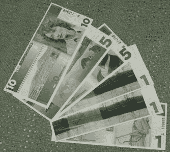

# 本地货币、加密货币和富豪统治的终结

> 原文：<https://medium.datadriveninvestor.com/why-the-future-of-capitalism-is-local-currencies-956598104449?source=collection_archive---------1----------------------->

[BerkShares](http://www.berkshares.org/), arguably America’s most popular local currency.

我在加州卡尔斯巴德的本地时间银行——如果你感兴趣的话，它的名字是[小时卡尔斯巴德](http://www.hourworld.org/bank/?hw=1152)——是一个悲伤的、很少有人光顾的尝试。南加州郊区千篇一律的生活方式和严厉的消费主义并不完全是替代经济安排的最佳地理位置。由于在没有长期牛市的情况下，对替代货币的参与往往会增加，无论如何，这些都不是理想的条件。

看看这些帖子——最后一次发布是在去年的某个时候——很难相信这种做法有一天会成为解决一系列当代问题的关键，包括经济不平等、生活水平停滞不前和气候变化，等等。

我们生活在一个国家和国际货币作为所有经济活动的基本媒介存在的时代。与这些资本形式相关的流动性和流动自由被认为是现代工业世界的基础。在一定时期内，这种信用是合理的。

然而，现在有证据表明，国家货币的唯一游戏地位导致了我们的财阀统治和环境不负责任的最严重的过度行为。批评者开始指出，复兴本币实践将是遏制这些富豪过度行为的必要因素，也是实现区块链、众包和数字平台等诸多前沿技术趋势去中心化潜力的必要因素。

# **当地货币的黄金时代**

T4 我第一次也是唯一一次去欧洲是几年前在德国参加一个学术会议。我还记得在华丽的大教堂里漫步时，我突然想到，无论是谁建造了这座教堂，他都非常认真地对待他们的宗教。考虑到当时这些中世纪城镇的人口数量，通常最多只有几百人参加仪式。更奇怪的是，大教堂通常是由市民建造的，而不是富有的贵族赞助者。

那种宗教狂热让琼斯镇相形见绌。这种虔诚的确令人印象深刻，但似乎有些过头了。

事实证明，这种想法也出现在其他人身上，甚至产生了一些有趣的学术成果。[学者](https://www.amazon.com/Europe-High-Middle-Penguin-History/dp/0140166645) [已经](https://global.oup.com/ushe/product/the-central-middle-ages-9780199253128?cc=us&lang=en&)开始考虑 1040 年至 1290 年之间的时期，也就是所谓的[高潮，或者中央、中世纪](https://en.wikipedia.org/wiki/High_Middle_Ages)，是前现代西方世界的一种黄金时代。对于大多数普通人来说，这是一个繁荣和悠闲的时代。整个欧洲大陆的社区生活和公共工程都在急剧扩张。许多最著名的大教堂也是在这个时代建造的。事实证明，它们是中世纪的路边旅游景点，吸引了那个时代的许多宗教朝圣者——以及他们的旅行资金。

学者们认为，推动普通民众大量进行公共投资的原因是，本币在这个时代的经济体系中发挥了远为突出的作用。大多数经济活动发生在当地，这使社区成员对当地公共投资的价值有了更好的认识。

学者们特别强调了“[滞期费](https://en.wikipedia.org/wiki/Demurrage)”的做法，这是一种负利率计划，鼓励那些持有当地货币的人尽快花掉它们。因为与当前时代不同，货币在被储蓄时不被理解为财富或价值的储存手段，所以社区成员寻求其他更基于社区的方式来投资他们的剩余货币，例如投资于惠及所有人的公共工程。

# **国家货币时代**

在十四世纪和十五世纪，君主政体和国家政府越来越多地寻求巩固对其领土的权力，其中一个关键策略就是强制采用国家货币。人们普遍认为，这导致了未来几年一系列灾难性的货币政策，导致了中世纪晚期真正的“黑暗时代”。[【1】](#_ftn1)这应该不奇怪。前现代时代的经济安排在很大程度上局限于本地活动。当地货币能够更好地反映当地经济的实际经济增长和通货膨胀影响。

但是，尽管总的来说，在前现代时代，国家货币可能拖累了经济表现，但在现代工业化时代，它们证明是非常有效的。这是因为现代的许多技术进步有助于远距离经济活动。工业时代允许大规模生产、大规模运输和全国性的经济组织。

事实上，二十世纪见证了革命性技术的爆发，当这些技术结合在一起时，必将深刻地改变人类的状况。这些包括电网、灯泡、室内管道、内燃机、电话、空调、各种重大医学进步、州际高速公路系统和商业航空运输、工业农业和合成肥料——事实上，这个清单可以长达数页。

在这一时期，工人生产率飙升，经济扩张和收入中位数也是如此，而生活水平、自我报告的生活满意度和预期寿命都在逐步上升。在这一时期，国家货币，尤其是现代资本主义国家使用的国家货币，起到了几个有益的作用。它们允许在全国甚至全球范围内进行经济交流，从而为这些强大的技术提供了充分开发其经济潜力的机会。与此同时，国家货币及其庞大的银行系统所提供的高水平流动性使资本主义国家能够在相对较短的时间内充分利用这些技术的潜力。

# **二十世纪中期繁荣之后**

不幸的是，这段技术发展和经济扩张的非凡时期相对短暂——大概持续了 50 年左右，从 1920 年到 1970 年。从那时起，发达资本主义经济体的表现明显喜忧参半——如果从生态角度考虑，甚至可以说是糟糕透顶。国家货币不仅加剧了这些问题。他们可以说是一个基本的驱动力。

自 70 年代初以来，对于绝大多数家庭和工人来说，生活水平和家庭收入中位数一直停滞不前，而 T4 的财富和收入不平等却急剧上升。[【4】](#_ftn4)美国实际人均 GDP 从 1981 年的 28，500 美元左右增长到 2011 年的 51，000 美元。然而，绝大多数家庭却没有得到多少新创造的财富。1949 年至 1973 年间，以实际美元计算的家庭收入中值翻了一番，从 25，000 美元增长到 50，000 美元，但此后仅增长到 61，000 美元，这在很大程度上是女性在劳动力中所占比例较大的结果。[【6】](#_ftn6)

但是，当中产阶级和工人阶级受到停滞不前的工资和医疗保健、退休、儿童保育、住房和大学费用上涨的挤压时，富人和中上层阶级却参与了前所未有的消费活动。如上所述，尽管美国的实际人均 GDP 在过去 35 年中几乎翻了一番，但美国 GDP 中用于消费品的比例却从 60%上升到了 69%。由于中产阶级和工人阶级的工资停滞不前，并受到生活成本的挤压，这意味着消费增长的大部分来自上层阶级。

消费的大规模增长给环境带来了巨大的代价。许多人希望随着现代经济变得更加高效，经济增长和资源消耗最终会“脱钩”。然而，经济学家蒂姆·杰克逊(Tim Jackson)指出，截至 2015 年，根本没有证据表明这种情况正在发生，因为大部分支持脱钩的证据并没有考虑到发展中国家，而当前的经济生产大部分是在这些国家进行的。[【8】](#_ftn8)

结果是全球变暖似乎正以越来越快的速度发生。我们已经开始面临科学家预测的饥荒、干旱、海平面上升和极端天气事件。如果气候最终达到 2 摄氏度的危险区域，许多人认为政治混乱和数百万穷人的死亡将随之而来。

前海军准将、美国安全项目首席执行官斯蒂芬·切尼写道:“气候变化是我们军方所说的‘威胁倍增器’。”它与冲突的联系不是线性的。相反，它加剧和复杂化了现有的安全风险，增加了未来任务的频率、规模和复杂性。在已经动荡的局势中,[它的]影响尤其不稳定，加剧治理不力、经济不平等和社会紧张等挑战——并产生真正有害的冲突。”[【10】](#_ftn10)

# **为什么要责怪国家货币？**

我们真的能把这一切归咎于像货币体系这样平庸的东西吗？首先，考虑一下让各国货币如此受益的环境。革命性技术，如戈登在二十世纪早期至中期强调的那些技术，往往会造成巨大的社会破坏，极大地影响社会等级和财富分配。

尤其是在那个前所未有的技术发展和应用时代，无数新的工作、职业、技能以及创业和社会流动的机会出现了。这个时代创造的财富分布广泛，教师、制造厂工头和熟练技术人员等普通职业的收入处于中上阶层水平。[【11】](#_ftn11)

在这种情况下，像美元这样的国家货币的流动性和全国范围的可兑换性使得这种社会混乱和财富的有机再分配得以发生，甚至可能助长和加剧这种情况。但是自从 1970 年以来，随着技术变革的步伐放缓，我们已经看到了人类历史常态的回归，因为最富有的 20%的人已经获得了自那以来几乎所有的财富。[【13】](#_ftn13)

这在很大程度上是通过各种各样的“T0”寻租活动实现的，也就是说，这些经济活动不是生产性的——它们对经济增长没有贡献——而是旨在获取越来越大的经济份额。这些措施包括利用股票期权；高层管理人员有效设定自己(巨额)薪酬的能力；利用负外部性；破坏工会；影响税收、监管、工人保护和最低工资的设计；在通货膨胀持续、工作时间增加、福利减少的情况下压低工资；收取不必要的高利率；征收交易费；和许多其他没有积极经济目的的活动。[【14】](#_ftn14)

当然，各种各样的[改革](https://www.amazon.com/Price-Inequality-Divided-Society-Endangers-ebook/dp/B007MKCQ30)已经被提出来解决这些滥用经济权力的问题。它们肯定值得一试。尽管如此，有充分的理由怀疑这些改革最终是否有效。皮凯蒂或许比任何人都更好地证明了 20 世纪的经济生活是多么不正常，此外，人类历史表明，财富的不平等倾向于加剧和扩大，因为财富的拥有者不断寻求利用他们的资产来控制他们社会的政治和经济生活。[【15】](#_ftn15)

事实上，历史上没有再分配政策成为创造广泛经济平等的驱动力的真实例子。尽管 20 世纪的进步政策长期以来一直是人们的榜样，但戈登很可能让这个例子站不住脚，因为他证明是革命性技术创新的爆发推动了 20 世纪的经济平等，而不是进步政策。

想一想现代金融部门在定位于获取而非创造财富方面变得多么有效。它使用复杂的技术和高水平的专业知识来购买未来投资的股票，这是大多数普通人永远不会意识到的。它利用其庞大的资源基础收买政客，间接控制公共政策和立法，并影响公众舆论。最后，大银行，而不是美联储，负责绝大部分的货币创造，因为它们只能将一小部分存款作为准备金。因此，毫不奇怪，迈克尔·哈德森不得不认为我们当前的经济根本不是资本主义经济，而是简单地认为[中央](https://michael-hudson.com/2012/01/banking-wasnt-meant-to-be-like-this/) [银行家](https://michael-hudson.com/2012/09/financial-conquest-or-clean-state/)[策划](https://www.nakedcapitalism.com/2011/06/michael-hudson-the-financial-road-to-serfdom-%E2%80%93-how-bankers-are-using-the-debt-crisis-to-roll-back-the-progressive-era.html)。

这对日常社区有多大影响？想想著名的“[沃尔玛效应](https://www.jstor.org/stable/4166248?seq=1#page_scan_tab_contents)”许多小社区欢迎大型商店，认为这将创造就业机会，刺激当地投资。然而恰恰相反的事情发生了。几项研究表明，本地企业在本地经济中的支出高达其收入的 54%(在商品、专业服务、工资、福利等方面)。)，而大卖场的支出约为 14%，几乎全部花在了(相对较低的)工资上。[【16】](#_ftn16)

值得考虑的是，更具创造性和实验性的方法是否能更有效地遏制金融部门在过去几十年中获得的巨大权力。因为国家货币实际上是唯一的游戏，大银行和跨国公司总是处于控制资本流动和流动性的地位，因此也就控制了国家经济的未来。

# 当地货币是一个现实的选择吗？

你可能会说，这很有趣，但这种转向本币的想法现实吗？

显然，我无法明确回答这个问题。在这里，我并不完全支持本地货币，但我认为有一个很好的理由来证明它们值得探索和试验。然而，让我提出几个我认为应该认真对待它们的合理性的理由。

首先，至少从长期历史角度来看，各国货币的表现被大大高估了。如果你剔除它们在 20 世纪最后 60 年的表现，各国货币的记录充其量是好坏参半。直到大萧条时期，他们常常是经济管理不善的根源(T2)。

你可能会以过去几十年为例，但我认为，他们加剧的经济不平等，以及他们对政治和社会生活和[环境](https://www.amazon.com/dp/B00JHIDON6/ref=dp-kindle-redirect?_encoding=UTF8&btkr=1)的[毒害影响，实际上抹去了他们对经济发展的积极影响——这些影响主要浪费在](https://www.amazon.com/Price-Inequality-Divided-Society-Endangers-ebook/dp/B007MKCQ30/ref=sr_1_2?s=digital-text&ie=UTF8&qid=1538684989&sr=1-2&keywords=stiglitz+joseph)[过度消费主义和过度消费上](https://www.amazon.com/Affluenza-All-Consuming-Epidemic-Thomas-Naylor-ebook/dp/B00YD6XYH8/ref=sr_1_2?s=digital-text&ie=UTF8&qid=1538684942&sr=1-2&keywords=affluenza+book)。

第二个原因是，国民经济体系的使用往往严重依赖不可持续的资源消耗水平——尤其是碳氢化合物燃料。值得思考的是，在全球经济的结构中，是否存在某种根本上不可持续的东西。是的，我们可能不得不在不可持续的经济结构中进行绿色革命，但我怀疑这能否及时完成，以拯救地球气候免于灾难。

最后，当地货币更符合当前技术走向更大程度的去中心化和非物质化的趋势。如果你想一想戈登指出的革命性技术(汽车、电灯、工业农业等)。)，这些技术本质上需要在国家甚至全球范围内进行投资，特别是在现有生产模式下。在那种技术背景下，采用那些大规模生产模式，国家货币在经济上很有意义。

然而，许多新兴技术正引导我们走向更加分散的生产和交换模式。当然，许多行业(生物技术、运输、公用事业等。)仍然需要那种只能通过大规模银行和联邦政府支出才能实现的大规模投资支出，这就是为什么我们不想完全消除国家货币。尽管如此，智能手机小型机、互联网、平台技术、众包和区块链只是导致经济活动更加分散化的几个趋势。

这些只是面向组织的技术。Juliet Schor 、 [Andrew McAfee](https://www.amazon.com/dp/B00D97HPQI/ref=dp-kindle-redirect?_encoding=UTF8&btkr=1) 和 [Erik Brynjolfsson](https://www.amazon.com/Machine-Platform-Crowd-Harnessing-Digital-dp-0393254291/dp/0393254291/ref=mt_hardcover?_encoding=UTF8&me=&qid=) 最近都认为，众多趋势和技术模式正在导致更大的分散化本地生产模式。这些技术包括高级分析、机器人、无人机技术、人工智能、3D 打印机、食品计算机和垂直农业。这是走向非物质化消费的大趋势之首(例如，电子邮件代替普通邮件，iTunes 代替 CD，等等)。)，这就需要规模较小的经济组织。

尤其是区块链技术在提高当地货币的可行性和实用性方面有着巨大的潜力。国家货币比当地货币更受青睐，因为人们认为国家货币更稳定、更可靠，而且在储蓄时最有可能保值。同时，它们提供了更大的经济灵活性，允许持有者在几乎任何地方使用它们的价值。加密货币由于其客观、分散和透明的架构，在许多方面解决了本地货币的信任问题。

我们已经开始看到这种潜力的实现。2018 年夏天，当地加密货币计划大幅增加。加州柏克莱市宣布将开始试验基于区块链技术的市政债券。在其他地方，以色列的加密货币网络 [Colu](https://www.colu.com/) [在伦敦、利物浦、特拉维夫和海法建立了他们的第一个本地加密货币网络](https://medium.com/colu/the-first-community-currencies-are-live-41e605e7cb9c)。最后， [Bancor](https://about.bancor.network/) [宣布](https://bitcoinmagazine.com/articles/blockchain-based-community-currencies-be-launched-kenya/)它将与非营利组织[草根经济学](https://www.grassrootseconomics.org/)合作，在肯尼亚建立一个本地加密货币网络。

这些货币都以互补货币模式运作，也就是说，它们旨在允许当地行为者在国家货币稀缺时进行交易和经济合作，从而帮助刺激可持续经济发展。

# **重视当地货币的潜力**

许多人，甚至一些学者都在努力思考本地货币在未来时代的可能性，尤其是在加密货币革命之后。本地货币和加密货币的支持者可能都需要接受的一个事实是，不管他们的分散化理想如何，政治和经济可能永远不会脱钩。

当本币得到政府实体的支持和鼓励时，它们总是最成功的。如前所述，当国家经济陷入困境时，当地货币往往主要作为一种替代经济体系发挥作用。但这在很大程度上是因为各国政府传统上对本币非常敌视。

另一方面，当州和地方政府给予支持和鼓励时，当地货币往往会繁荣，为社区参与和当地经济增长开辟新的途径。近几十年来，日本在全国范围内进行了一项实验，涉及数百种不同的举措，涉及多种多样的本币活动。[【17】](#_ftn17)这次实验的规模是州和地方官员支持和鼓励的直接结果。

与此同时，与传统上激进的自由意志主义倾向的区块链狂热分子相比，将区块链应用于本币可能是一个更合适的范式。可以说，导致诸如基于以太坊的 DOA 在[的失败和](https://en.wikipedia.org/wiki/The_DAO_(organization))[中国几乎接管比特币](https://qz.com/1072907/why-china-is-so-hot-on-bitcoin/)等惨败的致命缺陷是其本质上的无政府主义方法。

自由主义者认为经济生活仅仅是孤立的个人寻求效用最大化的事情。但经济生活的现实是，它发生在具体的社区中，其目标和议程超越了个人私利。现代政治经济趋势越来越试图孤立个人，这只会让他们容易受到有组织的阴谋的伤害，如强大的金融行为者的寻租或利用专制政权的资源。

在经济生活中，激进的权力下放当然仍有一席之地，但至少在地方一级，它可能永远无法摆脱参与政治的需要。毕竟，地方社区有各种激励和鼓励更多参与当地货币的选择，比如负利率、税收激励和分区政策。

无论好坏，在可预见的未来，国家货币都可能在现代经济学中发挥作用。在相对较短的一段时间里，他们在建立现代世界中发挥了重要作用。然而，它们不再像过去那样有用了。也许是时候考虑是否有更好的选择了。

[【1】](#_ftnref1)斯蒂芬·贝尔金&伯纳德·利塔尔*新世界的新货币*【电子版】(博尔德公司:奇特拉出版社，2011 年)，ch。6、《回到未来》。

[【2】](#_ftnref2)罗伯特·j·戈登(Robert J. Gordon)，*美国增长的兴衰:内战以来的美国生活水平*，(普林斯顿:普林斯顿大学出版社，2016)。

[【3】](#_ftnref3)同上，2ff。

[【4】](#_ftnref4)马丁·福特，*机器人的崛起:技术和失业未来的威胁*，(纽约:基础图书，2015)，35；泰勒·考恩(Tyler Cowen)，*《大停滞》(The Great Stagnation):**美国是如何吃掉现代历史上所有唾手可得的果实、生病，并将(最终)感觉好些的*，(纽约:企鹅出版社，2010 年)，15 页。关于不平等的信息，参见托马斯·皮凯蒂著《21 世纪的资本》(T21)。)，(剑桥，马:哈佛大学出版社，2014)；Matthew O'Brien，“经济增长(和 1%)如何将中产阶级甩在后面”， *The Atlantic* ，2012 年 5 月 10 日(2018 年 10 月 5 日访问):[https://www . thealantic . com/business/archive/2012/05/How-Economic-Growth-and-The-1-Left-The-Middle-Class-Behind/256998/](https://www.theatlantic.com/business/archive/2012/05/how-economic-growth-and-the-1-left-the-middle-class-behind/256998/)

圣路易斯美联储银行。资料来源:美国经济分析局。(访问时间:2016 年 7 月 15 日):[https://fred.stlouisfed.org/graph/?g=hh3.](https://fred.stlouisfed.org/graph/?g=hh3.)

[【6】](#_ftnref6)福特(2015)，35；考恩(2011)，15。

[【7】](#_ftnref7)圣路易斯美联储银行。资料来源:美国经济分析局。(访问时间:2016 年 7 月 15 日):[https://fred.stlouisfed.org/graph/?g=hh3.](https://fred.stlouisfed.org/graph/?g=hh3.)

[【8】](#_ftnref8)蒂姆·杰克逊，*没有增长的繁荣:有限星球的经济学*【电子版】(纽约:Earthscan，2011)，ch。5、“脱钩的神话。”

[【9】](#_ftnref9)*纳奥米·克莱恩，《这改变了一切:资本主义与气候*》(纽约:西蒙&舒斯特出版社，2014)。

[【10】](#_ftnref10)斯蒂芬·切尼，“特朗普对气候变化的选择”，*项目辛迪加*，2016 年 12 月 12 日(访问时间:2017 年 1 月 16 日):[https://www . Project-Syndicate . org/commentary/Trump-Climate-Change-security-risk-by-Stephen-Cheney-2016-12](https://www.project-syndicate.org/commentary/trump-climate-change-security-risk-by-stephen-cheney-2016-12)

[【11】](#_ftnref11)皮凯蒂(2014)，276–279 页。

[【12】](#_ftnref12)参见戈登(2016)和考恩(2010)。

[【13】](#_ftnref13)约瑟夫·斯蒂格利茨，*不平等的代价:当今分裂的社会如何危及我们的未来*【电子版】(纽约:W. W .诺顿&公司，2013)，ch。1，“美国 1%的问题。”另见 Piketty (2015)。

[【14】](#_ftnref14)施蒂格利茨(2013)，ch。2，“寻租和不平等社会的形成”

[【15】](#_ftnref15)皮凯蒂(2014)。

[【16】](#_ftnref16)贝尔金&列塔尔(2011)，ch。13、“可持续发展”

[【17】](#_ftnref17)贝尔金&列塔尔(2011)，ch。15，“社会用途货币。”