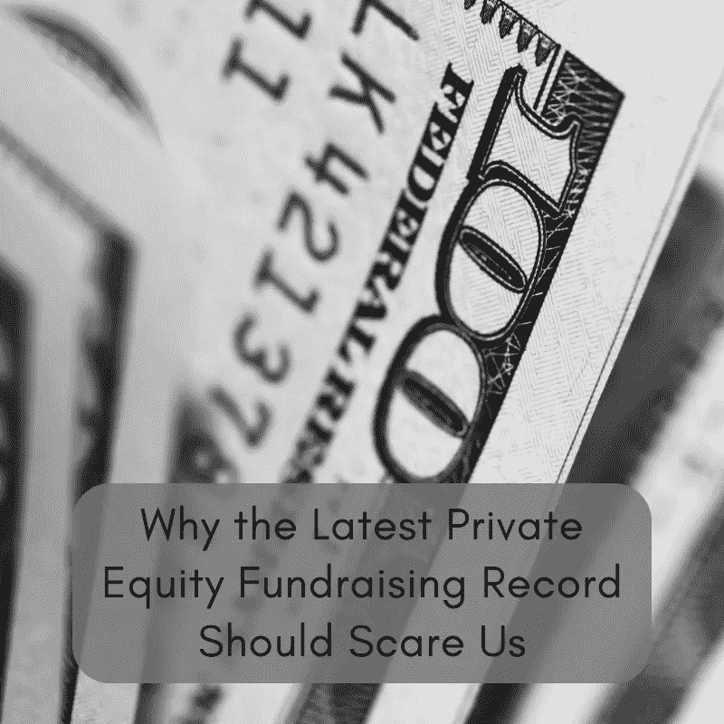

# 为什么最新的私人股本融资记录会让我们感到恐慌

> 原文：<https://medium.datadriveninvestor.com/why-the-latest-private-equity-fundraising-record-should-scare-us-2f29571a5fe7?source=collection_archive---------8----------------------->

# 黑石集团创造了新的筹资记录

世界上最大的私募股权公司黑石，将很快拥有世界上最大的基金。其最新的旗舰基金已经超过 220 亿美元，这使其有望超过阿波罗基金创下的 247 亿美元的纪录。软银证明了投资者有足够强大的风险资本胃口来建立 9 位数的愿景基金。像这样的超大型基金，价值超过 50 亿美元，现在占私人资本筹集的 15%以上。显然，私人股本公司可以瞄准的投资者资本并不短缺，这将很快创造又一个筹资纪录。也就是说，资本可以配置的目标并不多。结果如何？投资者回报减少，裁员，无价值债务增加。

# 交易竞争越来越激烈

被拍卖的公司数量有限，但私人股本资本的数量似乎是无限的。这种动态正在推高公司价格。这是一个卖方市场，这使得买家更难获得投资者所要求的丰厚回报。利润更难从昂贵的资产中挤出来，所以保荐人压榨得越来越狠。为了控制开支，大批顾问正涌向私人股本投资公司。内部咨询团队过去常常将最好的私人股本公司与其竞争对手区分开来。如今，它们成了赌桌赌注。当一家私人股本公司以高价收购一项瘦资产时，会发生什么？它们最终会切入骨头。

 [## 风险投资家在给创业公司播种时会考虑什么标准？数据驱动的投资者

### 2017 年，风险投资资金攀升至十年来的最高水平。你的创业公司目前吸引风险投资的机会是…

www.datadriveninvestor.com](https://www.datadriveninvestor.com/2018/04/20/what-criteria-do-venture-capitalists-consider-when-seeding-a-startup/) 

# 裁员被伪装成经营上的改善

对许多私募股权公司来说，投资组合公司的员工是负债。它们只是资产负债表上的数字，仅此而已。运营商表示，减少这些数字会让公司更有效率。然而，效率是以每个被解雇的员工为代价的。这些生计在经营者的财务计算中被忽视。当然，我们可以称之为资本主义。然而，真正的资本家会意识到短视决策的长期后果。离开劳动力市场的工人不再是有用的经济行为者。私人股本对企业的参与加重了整个经济体系的负担。此外，私人股本公司只关心其投资组合公司的生存能力，直到它们退出这些公司。他们对公司的长期成功不感兴趣，这意味着未来会有更多的人失业。

# 低利率，低收益，更多债务

杠杆收购是私人股本公司的主要业务。为了实现回报最大化，私人股本公司利用低质量债务为其收购融资。他们与投资银行合作，将债务辛迪加给渴望收益的投资者。在我们所处的这种低利率环境下，投资者正在排队购买这种高收益债券。投资者如此渴望收益，以至于他们放弃了标准的保护，或契约，以获得定期支付利息的特权。如果市场崩盘，借款人无法偿还债务，这些“低调”交易可能会让投资者暴露在风险之下。为了让这更真实，想象一下玩具反斗城由于不可持续的债务水平而破产。但是，除了负面新闻，KKR 没有遭受任何损失，它的投资者损失了钱。

# 笑到最后

随着每一项融资记录的出现，私人股本公司笑得越来越厉害。他们的商业模式是建立在使用别人的钱的基础上的(OPM)，所以他们不像他们的投资者那样暴露在糟糕的投资中。从私募股权公司的角度来看，激烈的交易竞争并不理想。然而，他们找到了增加利润的方法。“运营改进”的标准做法使得大规模裁员变得可以接受。就市场状况而言，利率仍然很低，这使得低质量、高收益的债务很容易被辛迪加。

私募股权公司即使在投资变得糟糕时也能赚钱，因为投资者仍然要支付管理费、前期费用和运费。不幸的是，他们的投资者被甩在了后面。这都是什么意思？私募股权公司将继续创造筹资纪录，直到它们的投资者停止投入资本。如果我是这样一个系统的受益者，我也会笑的。

最初发布于[https://bunkerbasics.com/private-equity-fundraising-record/](https://bunkerbasics.com/private-equity-fundraising-record/)