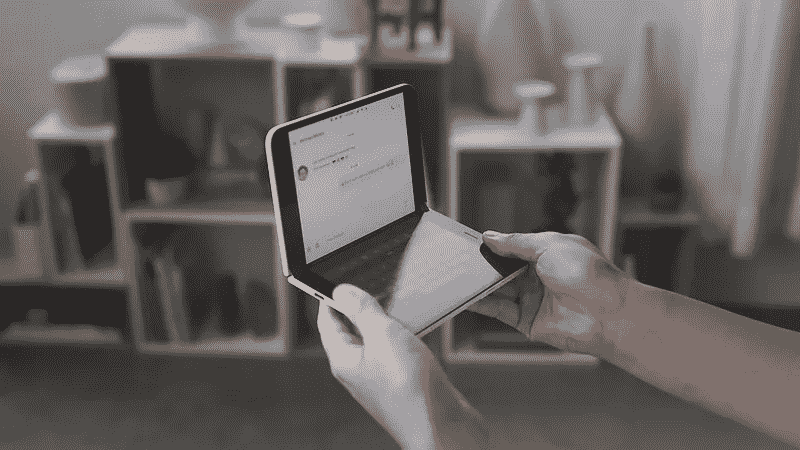

# 为什么微软 Surface Duo 如此重要

> 原文：<https://medium.datadriveninvestor.com/why-the-microsoft-surface-duo-is-a-big-deal-2d4167983c10?source=collection_archive---------4----------------------->

2019 年 10 月初，微软从苹果的 keynote playbook 中借鉴了一页，给了我们一个没人预料到的“另一件事”:双屏 Android 智能手机。微软宣布凭借 Surface Duo 重返智能手机市场(尽管他们官方表示“这不是智能手机，这是 Surface”)。

鉴于这是软件巨头有史以来生产的第一款 Android 设备，这一发现令人惊讶。它预计要到 2020 年底才会上市销售，但展示的几分钟录像对微软来说意义重大。原因如下。

*A user receiving a phone call on the Surface Duo*

凭借二人组，微软正在放弃手机 Windows，但这实际上是一件好事。由于应用市场的激烈竞争和缺乏第三个竞争者的空间，Windows Phone 失败了。用户证明了应用程序可以成就或摧毁一个操作系统，以及与之相伴的手机制造商。通过采用 Android，这个问题就消失了，微软可以专注于发布一款具有独特用户体验的设备，并预装 Office、Outlook、Skype、Bing 和其他第三方服务。

 [## 2019 年移动应用开发之路|数据驱动的投资者

### 任何在移动应用程序开发行业工作的人，无论他们是专注于在伦敦开发 iOS 应用程序还是…

www.datadriveninvestor.com](https://www.datadriveninvestor.com/2019/01/15/the-path-of-mobile-app-development-in-2019/) 

Surface Duo 运行的看起来像是 Android 的修改版，提供了新的令人兴奋的用例。它的便携式设计展开后可以发现两个屏幕可以合二为一，这使得使用小设备感觉更像平板电脑。

*A user typing on the Surface Duo*

科技公司正在争先恐后地推出可折叠设备，三星的 Galaxy Fold 事故表明，这将是一条崎岖不平的道路。玻璃不会弯曲，柔性塑料的强度不足以保护电容屏。科技行业将如何解决这个可折叠的困境？微软展示了一个解决方案，实际上可能比迄今为止被证明的任何其他可折叠设备都更加可靠和可用。当然，一个大的可折叠屏幕意味着比两个通过薄铰链连接的独立屏幕更大的空间，但除了看电影或玩游戏，还有什么使用案例表明双屏选项明显更差吗？

直到可折叠屏幕足够坚固，可以在不需要多重安全注意事项的情况下进行操作，Surface Duo 这样的设备可以弥合这一差距，并提供类似的客户价值，而没有大多数缺点。事实上，我对宣布的时间感到惊讶；其他竞争对手会在接下来的一年里确保 Surface Duo 的诞生吗？苹果或谷歌会在公众接触到这两者之前发布任何一种可折叠或双屏设备吗？这么快就展示设备是一个冒险的举动，我只能假设微软正试图从开发者和批评者那里获得早期反馈，以确保他们将 Windows Phone 再次惨败的风险降至最低。

在正式发布前一整年发布这一声明也意味着微软有时间改进这两个产品。从演示视频来看，单手场景和快速浏览信息是需要更多可用性改进的地方。假设你没有戴智能手表(大多数人都没有)，你有多少次只是为了查看你的通知而没有完全解锁手机？你有多少次只用一只手接电话？由于缺少外部屏幕，Surface Duo 无法执行任何快速操作；相反，客户需要用双手展开或打开设备才能看到任何通知。希望微软能从自己的测试人员那里收到这样的反馈，并在二人组发布之前有足够的时间解决可用性问题。

尽管如此，这对微软来说是一个关键的考验，因为这是一个展示制造商结合 Android 和硬件可以做什么的机会。在折叠屏幕变得可以安全使用之前，这是一个很好的权宜之计，不用担心灰尘或碎片会损坏一台 2000 美元的设备。更重要的是，这是对谷歌主导的软件建立更好的用户体验的一次测试。两人的操作系统将与谷歌 Play 商店兼容，这意味着可以访问谷歌 Pixel 4 拥有的相同应用程序。公告中看到的微软 launcher 会来到其他单屏安卓设备上吗？看到微软将如何与非 Windows 操作系统一起工作将是令人兴奋的…我几乎不敢相信我写了这些话！

如果 Surface Duo 失败了，微软可以继续忽视智能手机，但我相信这款设备实际上将启动一个新的双屏设备细分市场，这将在几年内变得普遍。对于微软来说，Surface Duo 可能相当于 Surface RT，一款最终被遗忘的设备，同时为这个雷德蒙德巨头创造了下一个 10 亿美元的业务。

你喜欢这篇文章吗？ [**订阅**](https://geekonrecord.com/subscribe/) **通过邮件获取新帖。**

*原载于 2019 年 11 月 3 日*[*geekonrecord.com*](https://geekonrecord.com/2019/11/03/why-the-microsoft-surface-duo-is-a-big-deal/)*。*