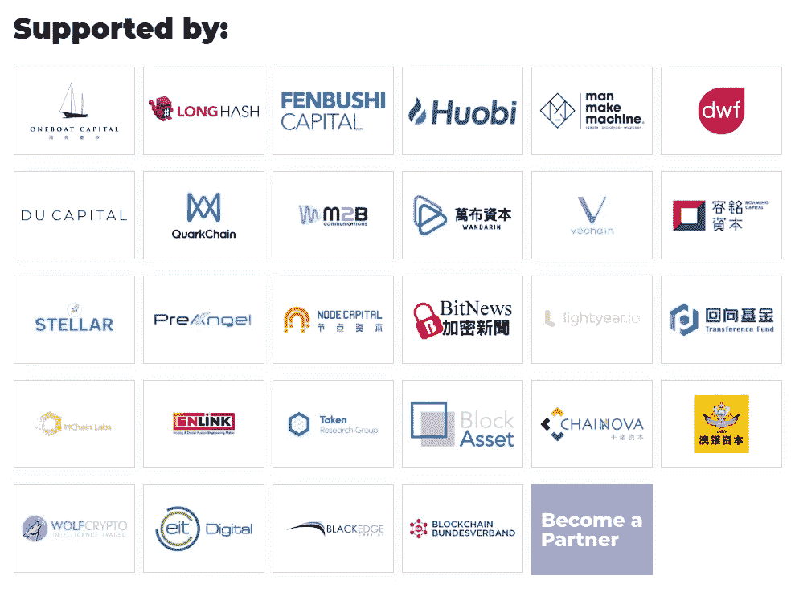
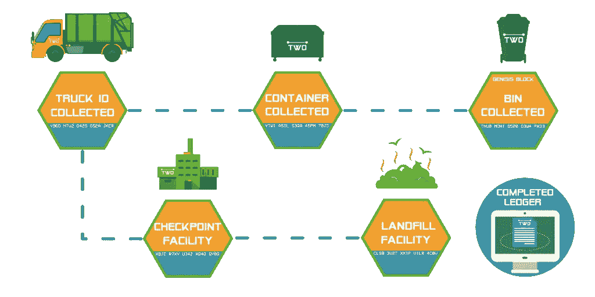

# 为什么 MXC 基金会是物联网数据收集服务的未来

> 原文：<https://medium.datadriveninvestor.com/why-the-mxc-foundation-is-the-future-of-iot-data-collection-services-98c5c1ddeba?source=collection_archive---------18----------------------->

MXC by [MXC.org](https://www.mxc.org/ico)

世界为更美好的明天而奋斗。改进现有的各种技术和创新新技术是确保光明未来的最重要因素。效率和效果是不断创新的主题。世界希望以尽可能少的投入获得更多的产出。这导致了有助于使各种过程更有效的变化，特别是当缺点涉及人的局限性时。

最新的创新之一是**物联网(IoT)** ，它可以广义地定义为任何可以收集数据并向网络提交数据的设备。 [**MXC**](https://mxc.news/2yL2n11) 研究了处理分散全球数据的预期需求，并开发了一个平台，旨在尽可能高效、简单地处理这些数据。

可以被视为物联网一部分的设备列表正在呈指数级增长-电视、冰箱、扬声器，几乎任何可以收集数据并将其上传到网络的设备都可以被指定为物联网。

设备的✳️This 增长也是更多行业适应使用这种设备带来的便利的结果。例如，供应链系统——特别是在仓库部门——极大地受益于物联网设备为其提供的分类和排序。此外，人工智能技术在各种经济领域的使用增加了对更多数据收集设备的需求，这些设备几乎都是物联网设备。数据收集先于数据处理，数据处理先于基于所提供数据的适当响应。

4G/5G 和 Wi-Fi 等当前的连接基础设施将无法应对未来的需求。然而，仍然有时间实现创新，以应对物联网技术的预期未来使用和所需的数据集成程序的增长。作为一个平台，MXC 将在这个领域蓬勃发展。

# 有意义的伙伴关系

不同的公司生产物联网设备。合作伙伴关系是不可避免的，因为数据集成将涉及所有这些公司，包括其他服务提供商，如 LPWAN 公司，它们提供集成预计未来将产生的海量数据所需的基础架构。

[**MXC**](https://mxc.news/2yL2n11) 的运营基于区块链技术，这是为了更好的明天而创新的又一项革命性技术。因此，其合作伙伴名单还包括区块链领域的知名人士。

Partnerships by [MXC.org](https://www.mxc.org/)

✳️Blockchain 是 MXC 的重要组成部分，因为它是分散化领域的领先技术，是确保安全、高效和准确数据集成的重要组成部分。

合作伙伴中的✳️Some 包括全球领先的数字资产交易所之一[火币](https://www.huobi.com/)；他们可能会支持 MXC 在其交易所托管他们的数字资产。最近，MXC 被 Huobi 社区成员投票选为下一个免费在交易所上市的项目。其他合作伙伴包括[分不实](http://fenbushi.vc/index_en.html)资本、Token research group 和 Block Asset。

# LPWAN —首选技术

Wi-Fi、4G/5G 和蓝牙是常见的数据传输技术，已成为 21 世纪后半叶移动和互联网通信的支柱。然而，随着数据传输需求的不断增长，它们的局限性越来越明显。物联网需要强大的网络，随时准备以尽可能少的限制传输数据。考虑到物联网设备的数量持续增长，需要覆盖范围更广、速度可接受的网络。Wi-Fi 受到其覆盖范围的限制，4G 网络也是如此。

✳️MXC 提议使用 LPWAN(低功耗广域网)技术，该技术可容纳预计数量的物联网设备，同时仍能提供能够维持数据上传、集成和处理的高效速度。 [**机器交换协议(MX 协议)**](https://mxc.news/2yL2n11) 是将支撑整个 MXC 网络的中枢。

# 为共享经济而生

[**MXC**](https://mxc.news/2yL2n11) 的创建是为了增强社区的经济实力。通过将他们的各种设备连接到 MXC 网络，社区和个人有机会从他们的数据中获利。

✳️The MXC 网络的构建方式是通过使用 MXC 网络中的本地令牌系统来交换数据。MXC 代币是 MXC 网络中的首选货币。通过它，以太坊等渴求数据的组织可以访问任意多的数据。MXC 尊重隐私。因此，只有用户允许共享的数据才会提供给相关方。

✳️Nearly 所有的前沿创新都将依赖于从物联网设备和其他数据收集设备获得的数据——例如，任何行业的人工智能技术。它有可能彻底改变所有许多领域——从机器人等复杂系统到简单的日常方面，如在最新的 iOS 更新中看到的测量日常物体的尺寸。这需要不同程度的数据，从简单到高度复杂的数据，取决于预期的结果。

The Sharing Economy by [Paybase](https://www.google.co.uk/url?sa=i&source=images&cd=&cad=rja&uact=8&ved=2ahUKEwiVtIPxw5reAhVLLMAKHaUwB2MQjxx6BAgBEAI&url=https%3A%2F%2Fpaybase.io%2Fblog%2Fthe-sharing-economy-when-will-payments-catch-up&psig=AOvVaw3qYxmPYadJvKxlSHTDrQeG&ust=1540314246251773)

各种复杂的数据属于数据分析的范畴，它吸引了大量的资金，通常在数十亿美元左右。随着对各种形式数据需求的预期增加，预计这一数字还会上升。

使用 MXC，重点放在机器生成的数据上，因为机器可以可靠地提供连续的数据流。人类生成的数据是必不可少的，也可以用来支持机器生成的信息。

✳️ninety-nine %的人口拥有智能手机，可以用来连接到 MXC 网络并提供支持数据。数据共享仍然是首要目标。货币优势与 MXC 平台将通过联网物联网设备和来自用户的支持性数据提供的数据的质量和数量挂钩。更多关于需求和需要的数据可以通过[这里的](https://www.thoughtspot.com/thoughtspot-blog/embedded-analytics-%E2%80%9Cdata-hungry%E2%80%9D-world)阅读。

# 适合未来城市

✳️Climate 的变化、废物管理和交通堵塞是几乎总是出现在发达国家和发展中国家城市发展议程上的关键问题。除了统一的解决方案之外，这些主题的共同点是它们都需要持续一致的准确数据流。有创新的应用程序和软件可以用来管理所有这些问题；然而，他们需要正确的数据来推断解决这些问题的适当方法。

物联网可以使这种数据流通过 MXC 成为可能，尤其是在大约 20 公里的半径范围内。根据城市的大小，可以在城市中放置多个数据中继中心，并根据人工智能和机器学习软件的请求或要求提供适当的数据。

➡️Traffic 的拥堵问题很容易解决，因为有关汽车进出城市的数据由各种物联网硬件(如战略性地放置在这些城市中的传感器)传递。除了缓解交通流量之外，还有可能在短时间内为紧急服务车辆或贵宾开辟优先车道。由于绝大多数汽车都嵌入了技术，连接到 [MXC 网络](https://mxc.news/2yL2n11)的用户可以接收到进站紧急服务车辆的更新，这样司机就可以适当地意识到，并可以为这些紧急车辆创造一条轻松通行的车道。

这些城市中不同位置周围的➡️Emission 密度也是通过放置合适的传感器来计算的。然后可以根据人工智能或运行这些城市排放程序的软件的建议进行必要的调整。这可以通过减少城市温室气体的排放来帮助避免或减少气候变化的进一步影响。

➡️Waste 管理也可以通过硬件和软件进行革命，这些硬件和软件可以帮助人们通过通知个人这些废物产品的有用参数来分类他们处理的废物。使用物联网设备还可以提高垃圾收集的效率。他们可以给出下一次有效收集时间的实时反馈，从而在这个过程中节省一些资源。

IoT Waste Management by [Jumpadevice](https://www.google.co.uk/url?sa=i&source=images&cd=&cad=rja&uact=8&ved=2ahUKEwi51LeRxJreAhXFbMAKHXQcDbUQjxx6BAgBEAI&url=https%3A%2F%2Fjumpadevice.com%2F2018%2F07%2F18%2Ftwo-iot-wants-more-waste-management-system%2F&psig=AOvVaw3QSkSnNAvL9yXOdjd2D8GY&ust=1540314319328256)

由于使用了区块链技术，数据使用的安全性和透明性得到了保证。因此，城市甚至可以有分散的应用程序，将城市居民连接到 MXC 网络，在那里他们可以提供实时数据并获得有关城镇周围各种事件的实时信息。更令人兴奋的是，随着数据共享的发生，货币在经济中流动，从而使 MXC 成为潜在的经济驱动力。

✳️[mxc 网络](https://mxc.news/2yL2n11)不限于这些用途；随着区块链、LPWAN、研究人员和公众对其他相关技术的更好理解，一些应用将会出现。

# 信息优先级

如果这项技术被全球接受，通过这个网络共享的数据将会是巨大的。这意味着各种方式和形式的数据将在网络中流动。MXC 采用了某些因素来建立某种秩序，并赋予某些数据包以高于其他数据包的优先权。这些包括货币化因素，以鼓励更多的人上传他们的数据，因为这是一种激励。该网络还设计为某些形式的重要数据比其他数据具有更高的上传优先级，例如，在紧急情况下，来自特定区域的数据比来自其他区域的数据具有更高的优先级，这有助于最大限度地减少人员伤亡或损失。

✳️[mxc](https://mxc.news/2yL2n11)网络有改变世界的潜力。物联网可能是革命性的，但正是 MXC 网络为这些设备记录和上传的数据提供了意义。

✳️Through 使用 MXC 令牌/硬币，数据可以在平台内货币化，以及其他形式的创收活动，这将受到用户的欢迎。区块链技术的目的是帮助提供一个安全和透明的平台，使 MXC 网络能够抓住每一个可能的机会蓬勃发展并真正影响全球社会。

为了参与这个伟大的项目并开始拥抱未来接受的趋势，[请点击此处](https://mxc.news/2yL2n11)或点击下面的链接。

## 官方链接

[**网站**](https://mxc.news/2yL2n11) **|** [**电报**](https://mxc.news/2PCtF0J) **|** [**推特**](https://twitter.com/MXCfoundation)

## ➕ ➕ ➕ ➕ ➕ ➕ ➕ ➕ ➕ ➕ ➕ ➕ ➕ ➕ ➕ ➕ ➕

**如果你喜欢看我的文章，请一定要鼓掌，关注我的** [**中**](https://medium.com/@moarman) **！**