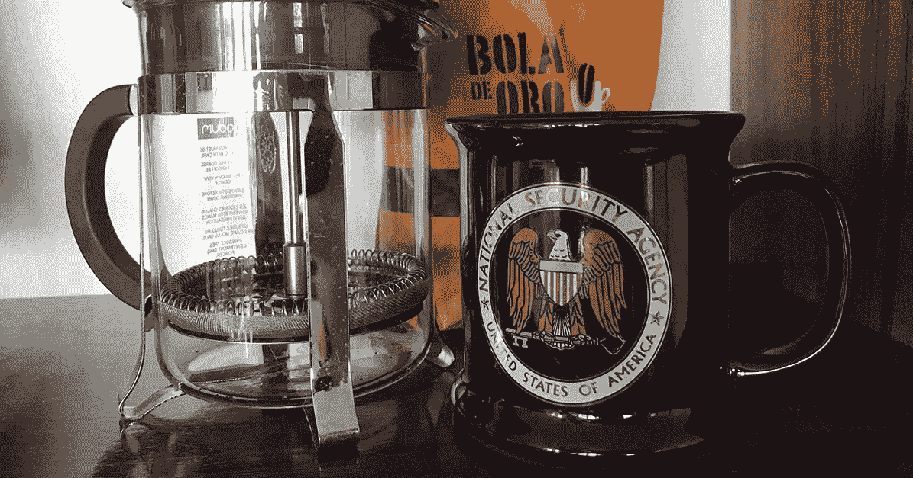
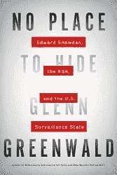

# 为什么国安局在午夜后打电话给我要我的源代码

> 原文：<https://medium.datadriveninvestor.com/why-the-nsa-called-me-after-midnight-and-requested-my-source-code-f7076c59ab3d?source=collection_archive---------0----------------------->

## 我的绝密咖啡杯背后的故事

请仔细听，不要挂断。当我哥哥把电话递给我的时候，这个陌生的男性来电者对我说的第一句话就是这些。

那是 2000 年 7 月 4 日的周末，前后相差一天，X 先生知道先说这句话，因为他在午夜后在康涅狄格州我哥哥的家里给我打电话。这不仅仅是令人毛骨悚然，因为我住在加利福尼亚，除了我的直系亲属，没有人知道我在康涅狄格州，他们都和我在房子里。我是前一天才到的，就像大多数年一样，大约在这个时候来参加我们一年一度的家庭野餐。

这家伙为什么打电话给我？

> 这是国家安全问题。

打电话的人为吵醒我们道歉，并说他的名字叫戴夫。他让我去拿纸笔，因为他要给我一些重要的指示，让我确认他的身份。然后他扔下炸弹，说“事关国家安全。”

现在，房子里的其他一些人已经开始聚集在我站在厨房壁挂式电话旁边的地方。到底发生了什么事？我示意我的兄弟给我拿支笔来——马上。

我仍在试图处理正在发生的事情，奇怪的是，我甚至没有心情去问戴夫他是如何得到这个号码的。他听起来很严肃，说话带着权威的口气；我想我已经确信他是诚实的。

好了，我准备好写了。

戴夫告诉我他在贝塞斯达的国家安全局工作——国家安全局。在我给他回电话之前，他什么也不能说。这就是为什么我需要这支笔。他正要给我一系列步骤，让我按照这些步骤给他回电话，以证明他的身份，并巩固情况的严重性。

## 给我回电话

戴夫指示我挂断电话，拨打 411(信息)并向接线员询问马里兰州贝塞斯达海军基地的主要号码。我要拨打该号码，然后通过一系列其他基地接线员，依次要求每个人将我连接到链条中的下一个。他给了我在每一跳要说的确切的话，因为我会要求被带到一个安全的地方。

> 肾上腺素起作用了，我完全清醒了。

为了让我放心，他说如果没有我的消息，他会在十分钟内回电话——以防我搞砸了。但我没有搞砸。

几分钟后，我又和戴夫通了电话。喔——国家安全局。这是真的。肾上腺素起作用了，我完全清醒了。

## 我们需要你的帮助

戴夫接着告诉我，他们有一台笔记本电脑，里面的文件已经用我的安全屋隐私软件加密了。他们面临国家安全形势，需要立即查阅这些文件，他们需要我的帮助；或者更具体地说，让我帮助他们获得可能比他们自己更快的访问权限。时间是最重要的；因此，午夜电话。

> 如果国家安全局不能得到那些文件，坏事就要发生了。

SafeHouse 过去是(现在仍然是)我开发的一个流行的 Windows 实用程序，用于加密作为互联网共享软件分发的私有文件。免费共享软件版本特意采用了弱加密，以符合美国国务院对军火的出口控制，并鼓励需要严格隐私的用户升级到更强的付费版本。我的客户从家庭用户到大型华尔街机构都有。

如果国家安全局不能得到那些文件，坏事就要发生了。也许有人会死，或者至少当戴夫礼貌地问我是否愿意把我的源代码给他时，他给了我这种印象；一直以来，我都在为没能告诉我更多关于这种情况的事情而道歉。

我提到戴夫很有礼貌地询问我的代码，因为这件事很突出，让我觉得非常奇怪——他实在是太好了。他似乎预先安排或准备让我说不。如果在其他任何时候是其他任何人，他可能是对的，但我可以告诉一些大事情正在发生，根本没有时间来讨论把我的源代码交给国家安全局的好处。

当然，戴夫马上问是否有可能存在加密的后门，因为这将节省很多时间。但不是。安全屋是按照最高标准和最佳实践设计的，使用强大的 256 位行业标准密码。

我给你消息来源。绝对的。你需要什么都行。没问题。但是实际上有一个小问题——我没带在身上。我在度假。所以我打电话叫醒了在波特兰的罗恩。那时西海岸大约是凌晨 1 点。Ron 是我团队中的一名程序员，我知道他家里有一份源代码的副本。

拉上拉链。发邮件了。完成了。

我试着探测——那么，你们真的能破解 256 位加密吗？戴夫是妈妈。加密业内人士对此一直有所猜测；我觉得值得一试。我真的没指望他会回答。

这个笔记本电脑家伙什么时候买的安全屋？他有什么版本？我知道的越多，就越能给你们指出正确的方向。

这时候，戴夫让笔记本电脑上的家伙有共享软件版本。什么——真的吗？这改变了一切。共享软件版本只支持廉价的 40 位加密——大多数坚定的黑客在几天内就可以完全破解；很可能，我认为，在相当短的时间内，在国安局内部没有窗户的房间里工作的秘密密码破译员。

我再次探测，这次是关于它们 40 位的能力；也许降低的级别并不是什么国家机密。但是，戴夫还是妈妈。

## 愚蠢的罪犯

但说真的，这个笔记本电脑白痴正计划炸毁一栋大楼，或同样糟糕的东西，但不够聪明或足够富裕，以至于不能支付 39.99 美元来升级到最大强度加密？

这一次戴夫回答道——“令人惊讶的是，这种事经常发生。他们称之为愚蠢的罪犯是有原因的。难以置信，但却是真的。”

接下来的一天左右，我继续与戴夫和他的团队一起工作。我回答了他们所有的问题，他们自然没有回答我的任何问题。但在这些单方面的谈话中，他们总是彬彬有礼，这激起了我疯狂的好奇心，我知道这种好奇心永远不会得到满足。

## 礼物

几天后，我回到加州的家中，一个没有标记的盒子出现在我的办公室，收件人是我。包在白色薄纸里的是一个蓝色的 NSA 咖啡杯，上面有一张手写的普通白色复印纸，上面简单地写着“谢谢。戴夫。”

那天晚些时候，我接到戴夫的电话。他仍然不能给我任何细节，因为这都是最高机密，但他告诉我，一切都“解决了”，他们很感激我的帮助。

我又一次试图探查，问“解决”是否意味着他们破解了密码；当然，他也不会说。总是那么沉默。他在聚会上一定很有趣。戴夫是他的真名吗？

当我感谢他的礼物时，我忍不住对他藏在盒子里的秘密纸条大发雷霆。他只是笑着说“那是我国家安全局的正式信笺。”

我已经拥有那个绝密咖啡杯 18 年了。这和本文顶部的图片是一样的。我每天早上都需要喝咖啡，但是我从来没有用过这个杯子。太特别了。如果我开始经常使用它，我担心我会把它弄坏，所以它一直和我其他珍贵的纪念品一起挂在我客厅的架子上。

> 据我所知，他们在礼品店卖那些杯子。

我从没去过国家安全局，据我所知，他们在礼品店卖那些杯子。但对我来说这无关紧要。这个杯子让我想起了从未发生过的坏事，而我在其中扮演了一个小角色。

但是这么多年过去了，还有一件事一直困扰着我——在康涅狄格州布里斯托尔那个炎热的夏夜，戴夫究竟是怎么在午夜后找到离家 3000 英里外的我的？

## 感谢阅读。如果你喜欢这篇文章，请随意点击那个按钮👏帮助其他人找到它。

# **DDI 推荐阅读:**

*   [*无处可藏:爱德华·斯诺登、美国国家安全局和美国监控国家*](http://go.datadriveninvestor.com/nsab/mb/mp000002/t) 格伦·格林沃尔德著

