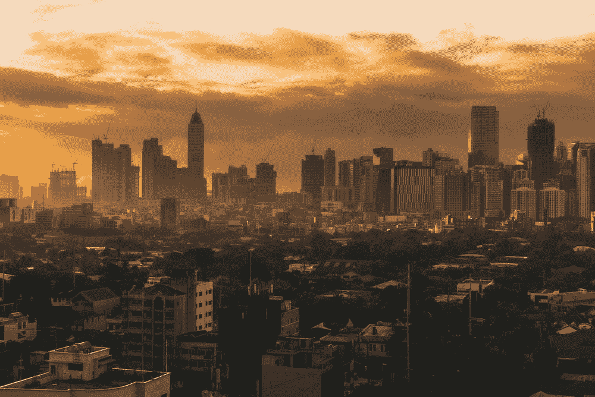

# 为什么菲律宾很穷

> 原文：<https://medium.datadriveninvestor.com/why-the-philippines-is-poor-28cce8e2e311?source=collection_archive---------2----------------------->

Source: [https://images.unsplash.com/photo-1526731955462-f6085f39e742?ixlib=rb-1.2.1&ixid=eyJhcHBfaWQiOjEyMDd9&auto=format&fit=crop&w=749&q=80](https://images.unsplash.com/photo-1526731955462-f6085f39e742?ixlib=rb-1.2.1&ixid=eyJhcHBfaWQiOjEyMDd9&auto=format&fit=crop&w=749&q=80)

我注意到菲律宾人真的想要一条摆脱贫困的道路。谁没有呢，对吧？但问题是，当现在采取正确的步骤时，菲律宾人会撤销它，并决心回到他们最擅长的事情上，懈怠并抱怨他们有多穷，他们如何需要政府的帮助，听起来好像这是解决他们糟糕的财务状况的关键。

在这篇文章中，我想指出菲律宾人贫穷的原因。我不是要打击菲律宾人，而是要让人们了解菲律宾人民的处境，以及每个菲律宾人应该如何重新思考如何摆脱贫困。

 [## 经济就是包容人|数据驱动的投资者

### 建模，数据，最重要的是，人 Tayo Oyedeji 博士在他的食谱中混合了所有这些成分，为一个…

www.datadriveninvestor.com](https://www.datadriveninvestor.com/2019/03/06/economy-is-all-about-including-people/) 

# 计划生育不力

在菲律宾，菲律宾人的计划生育意识很差。他们很自私。他们只是想到现在什么是有趣的，但没有想到他们正在做的事情的后果，或者他们是否能够承担他们正在做的事情的责任。这就是为什么在菲律宾，贫穷的菲律宾人有很多孩子，他们无法在经济上支持他们过上好的生活和教育。在这种文化下，穷人不断增加。

一个国家的民族，是每个家庭的顶点。作为菲律宾人，我们需要关注如何计划建立家庭。对于我们的行动可能带来的结果，我们需要更加无私和面向未来。如果我们要抚养一个孩子，父母必须有经济能力在经济上支持这个孩子。

# 菲律宾人有一种“无论发生什么”的态度

菲律宾人无法规划自己的生活。他们大多用他加禄语说*【无论如何】*或*【巴哈拉纳】*。这是一种糟糕的思维方式。他们不喜欢提前计划，因为这种心态从未被引入菲律宾文化。

# 菲律宾人把一切都归咎于政府

菲律宾人将他们的贫困归咎于政府，然而他们并没有做任何事情来改善他们的处境。他们不用他们的头脑、眼睛、手和脚去工作。他们只是坐在那里充满自豪地抱怨，当他们抱怨时，他们认为他们更知道如何更好地管理菲律宾人民。

# 缺乏爱国主义

菲律宾人对菲律宾人提供的产品和服务缺乏爱国心。因为菲律宾这里的许多服务不提供高质量的工艺，这就是为什么我们菲律宾人形成了一种刻板印象，认为菲律宾的服务或产品等于骗局和质量不是很好。

# 缺乏教育和意识

可悲但真实的是，腐败的官员坐在政府里，因为没有受过教育的人有投票权，腐败的政客可以很容易地通过握手或招待他们来贿赂他们的选票，或者只是因为他们有名或英俊。

在菲律宾，缺乏教育的现象非常普遍。说到底，他们想知道为什么菲律宾很穷。

# 自私、贪婪和容易受骗

菲律宾人自私、贪婪、好斗。看看菲律宾人是怎么开车的就知道了。他们认为几乎每一个机会都是理所当然的，只是为了到达他们的目的地，而没有真正考虑其他人或乘客的安全。

自从菲律宾成为一个文明国家以来，菲律宾人就一直自私和贪婪。菲律宾第一任总统艾米利奥·阿奎纳多因听到博尼法西奥可能正在策划反对阿吉纳尔多的政变的阴谋，在阿姆斯安德列斯·波尼法秀处决了他的兄弟。出于对权力的贪婪，阿吉纳尔多谋杀了博尼法西奥。尽管没有确凿的证据证明阿吉纳尔多有罪，但如果你深入了解这个故事，你也会得出同样的结论。安东尼奥·卢纳将军也是如此。虽然没有确凿的证据证明阿吉纳尔多谋杀了他们两人，但如果你看看博尼法西奥和卢娜以及他们是如何被陷害的，你也会意识到阿吉纳尔多是唯一有能力完成这件事的人。如今，如果你看看老师和教授是如何教授菲律宾历史的，他们让我们的祖先看起来像是英雄，但实际上不是。

马科斯总统，尽管在这届政府中，菲律宾的经济增长非常突出。但是作为菲律宾人，我们不应该视而不见，当他担任菲律宾共和国总统时，他偷了数十亿比索，至今下落不明。仅仅因为没有人能证明他们从菲律宾人民那里偷了数十亿美元，并不意味着这是真的。

当马科斯总统被弹劾时，菲律宾官员所做的是宣布家庭主妇科里·阿基诺为菲律宾共和国总统。我重复一遍家庭主妇。我不反对家庭主妇，原谅我。但你我都需要明白，菲律宾的命运取决于谁掌权。我们应该寻找的领导人是，他们应该在身体上有能力，在精神上了解如何管理菲律宾的经济状况。再次，原谅我问，但是一个简单的家庭主妇能做那吗？然而菲律宾人让她负责。

现在，让我们看看现在。前总统格洛丽亚·马卡帕加尔·阿罗约贪恋权力，她利用自己的腐败关系保住了自己在马拉坎南宫的王位，因此在 2004 年大选中引发了争议的“你好，加西亚”丑闻。但是看看现在的阿罗约，她还在从政。我们如何让这样的人仍然能够成为政府的一部分？然而菲律宾人对此并不介意。*(如果你想了解更多关于你好加西亚丑闻的信息，请查看维基链接:*[*【https://en.wikipedia.org/wiki/Hello_Garci_scandal】*](https://en.wikipedia.org/wiki/Hello_Garci_scandal)*)*

贪钱的珍妮特·纳波莱斯领导了 2013 年的猪肉桶骗局，从菲律宾人民那里窃取了数十亿比索。菲律宾人民努力争取的数十亿比索。*(如果你想了解更多关于猪肉桶骗局，或也被称为 PDAF 骗局的信息，请查看此维基链接:*[*https://en . Wikipedia . org/Wiki/Priority _ Development _ Assistance _ Fund _ Scam*](https://en.wikipedia.org/wiki/Priority_Development_Assistance_Fund_scam)*)*

另一个，邦·瑞维拉。他是一名演员。他没有足够的知识和勇气在政府中任职，但他是一名参议员。一个非常腐败的参议员。他参与了猪肉桶骗局，但在 2019 年的参议院选举中，菲律宾人仍然投票给他。

有了这些真实的例子，我们就能明白为什么菲律宾这个国家贫穷了。

# 菲律宾人还有希望吗？

是的，希望总是有的。但是我们现在做什么？这是我们菲律宾人的责任。我今天没有答案，甚至可能在未来几天或几年都没有。但是，我确信我们应该从菲律宾文化开始。加强菲律宾文化，以获得知识的力量，遵守法律，害怕任何针对彼此的不法行为，最重要的是，表现出对彼此的爱和同情，这是给这个国家带来变化的根源。