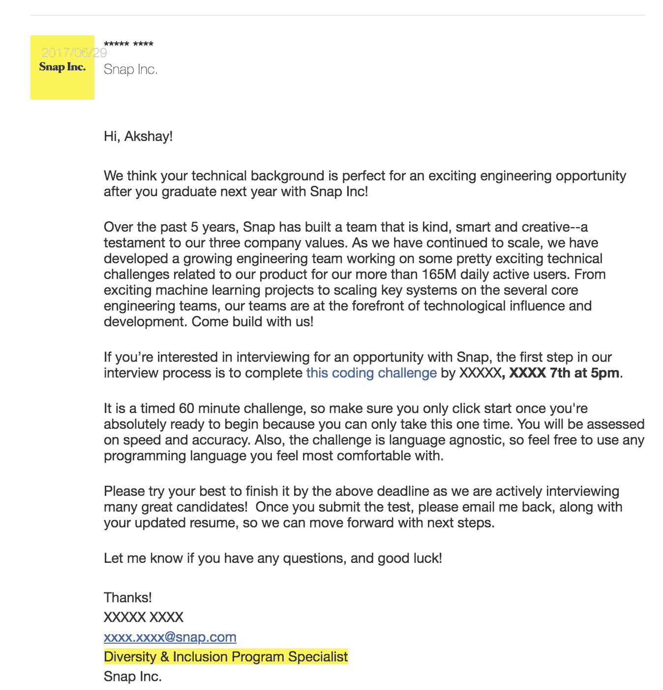
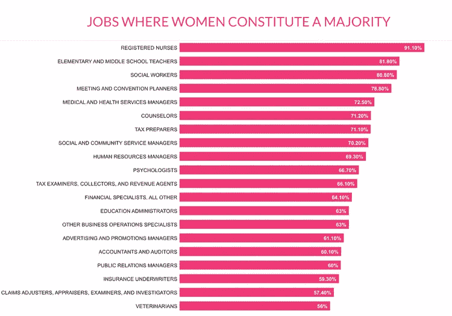

# STEM 流行病——对妇女和少数民族的压力

> 原文：<https://medium.datadriveninvestor.com/why-the-pressure-to-pursue-stem-for-women-and-minorities-499fc3a75c08?source=collection_archive---------4----------------------->

## 为什么只关注 *STEM？*

“electronic circuit boards near tester” by [Nicolas Thomas](https://unsplash.com/@nicolasthomas?utm_source=medium&utm_medium=referral) on [Unsplash](https://unsplash.com?utm_source=medium&utm_medium=referral)

如果你是一个女人(或男人)，一个同性恋者、双性恋者、跨性别者或来自少数民族的人，我真的为我们充满政治色彩的*新社会在我们已经经历的基础上给你施加的压力感到抱歉。有时被简化成一个统计数字，而不是作为一个个体被整体评估，这真的令人沮丧。*

**在我继续写下去之前，我想让你知道这一点:**
无论你是男性、女性、非二元、顺式、反式、白人、特权阶层、贫困阶层还是少数民族——接受你自己，做对你个人有用的事情，做你喜欢并引以为豪的事情。如果你想做一个呆在家里的爸爸(或妈妈)，并从中找到乐趣，那就去做吧。如果你喜欢烘焙，那就去做吧！如果你想成为一名律师、医生或工程师，不要让刻板印象阻碍你，或缺乏刻板印象，把你推向那个方向。不要对社会施加给你的追求 STEM 的压力做出反应，尤其是如果你并不那么感兴趣的话。因为，*—*赶时髦可能真的会压垮你的灵魂，几乎屈服于少数人的奴役，这些人的观点往往被接受为规范。

## **可信度**

我讨厌我不得不通过我的资历和在这个领域的工作来证明我的可信度——任何上过本科哲学 101 的人都会很快指出这个谬误，但这就是我们今天的处境。争论已经不重要了。如果你是直男、白人、男性(或者某些圈子里的女性)——多数；并且没有大学学位，你的意见实际上是无效的。正是因为这个原因，我很高兴我不是大多数，并持有多张“卡”。(检查)。除此之外，我之前还参与了 STEAM (STEM + Arts)研究，并在一位女性专家教授的指导下，与来自德国锡根大学的客座研究员合作。我们去了费城地区的当地社区学校进行实地调查，用 Arduinos 教授 12-14 岁的女孩编程和机器人技术；以便鼓励他们在高中和大学期间参与科学、技术、工程和数学。我们的研究发表在日本大阪举行的 Ubicomp 2015 会议上，我参与的演示论文和工作获得了“最佳论文奖”。我还担任过德雷克塞尔大学数学计算机科学(MCS)协会的主席，这是一个学生组织，由行业专家和技术雇主组织启发智力的技术讲座，拥有大量的大学生追随者。我的第一位计算机科学老师是一位女性——她教我如何编码。事实上，我高中所有的计算机科学老师都是杰出的女性。只是在大学里，计算机系的教师是一个倾斜的(男性占多数)混合体。我发表的涉及 [*元数据技术*](http://metadatace.cci.drexel.edu) *的研究是在一位女性行业专家 Park Jung-ran 博士的指导下完成的。这是我的成就，为了便于讨论。*

## 多样性和“排斥”

不久前，我收到了以下来自 **Snap Inc.** 的电子邮件

***Details Partially Masked.*** An email sent by a Snap Inc. recruiter from their *Diversity & Inclusion Program*

***哎哟！签名中的那一行……***

起初，收到 Snap 这样的领先科技公司发来的电子邮件让受宠若惊——我知道他们的初衷是好的。但是……就看我从小的成就吧；创新、网络项目、专利申请、发表的研究、独立研究、获得基于成绩的奖学金、开源贡献和专业工作经验——所有这些都归结为我个人的身体特征。也许我想得太多了，这可能是一个纯粹基于才能的选择，但这感觉像是侮辱。

我礼貌地感谢招聘人员把我记在心里，但没有费事去追求这个机会。

在我与我的一些女性工程师朋友(当时是同事)的非正式讨论中，她们的感觉是相似的——“雇用我是因为我的才能，而不仅仅是……因为女性证或我的肤色或完成配额。但是如果你做了，我会向你证明我的价值！

然而，另一方面，站着我的一个匿名朋友——姑且称她为*提什。她是一名保守的基督徒，对女权主义和我们都追随的“女性主义”潮流有所保留。*提什*喜欢烘焙。她做得很棒——我尝过她自制的饼干。她想开一家面包店，但几乎不好意思在她的女性同龄人中展示这一才华，其中一些人是 STEM 专业的，因为她的“家庭主妇”生活方式而看不起她。*

**这不是女权主义**。作为一名人权支持者，我个人不同意对大多数妇女和少数民族施加不适当的压力来追求 STEM！毕竟，我的母亲以前是一个家庭主妇…现在她是一个商人。后者是否让她成为一个更有价值的人？我有一个姐姐以最优异的成绩获得了理科学士学位，但她的内心一直想追求艺术和时尚，而不是科学。你猜怎么着？她最终回到了纽约的一所顶级时装学校，这样就不会再次摧毁她的灵魂。这并不是因为她不擅长 STEM，而是因为她可能并没有那么投入。

我想我们都会同意，如果女权主义的信条教会了我们什么的话——那就是让女性获得自由；成为他们想成为的人，这意味着，如果一个年轻的女人(或男人)对技术或烘焙有热情——没有人应该告诉他们不要追求它，但同时，把他们推向一个或另一个方向是荒谬的。**非 STEM 专业人士不够优秀吗？**

就好像，打破陈规的压力；超越和打破男性主导的玻璃天花板已经超越了我们忠于自我和追求让我们快乐的东西的逻辑能力——因为我们不想成为刻板印象。如果你真的对科技感兴趣，并觉得它令人着迷，我指的不是你，但仅仅因为“它很酷”或因为金钱利益而追求 STEM，就是另一回事了。相信我，你会像我在德雷克塞尔的许多同事一样沮丧地离开——无论男女，他们都曾追求计算机科学/工程，尽管并没有完全投入其中，但最终在第二年转专业到非技术或半技术的东西，如*管理信息系统*。性别歧视与此几乎没有关系——至少在一个包容和多元化的费城，以及一所拥有左倾、自由、欢迎的信仰……*和唯一信仰*的大学。一些追求工程作为“实验”的男孩和女孩，实际上从来没有任何真诚的兴趣，只是不能做到这一点。

不幸的是，这种情况发生在每个人身上——不仅仅是女性。我刚刚听说了一个男人的故事，他放弃了信贷员的日常工作，转而从事编码工作——哎呀，你怎么花了这么长时间？我认为金钱或职业机会是显而易见的动力。我的另一位在市场营销部门工作的前男性同事也有类似的经历。

很抱歉这里有偏见，但是我*偏向*天生的程序员和技术专家，他们从小就对 it 充满热情，而不是那些主要出于次要原因想进入 it 行业的人——把它视为一份“替代工作”。

是的，对于*在这个残酷的世界里生存*，这是一个极好的策略。你可以学习这门手艺，在朝九晚六的工作中过上好日子。但是，如果你想成为任何领域的专家、创新者、发明家，就必须有与生俱来的兴趣，还要有学习新技能的能力和获取资源的途径。几乎是先天+后天。

**现在，关于我参与的 STE(A)M 研究…** 我们从一组大约 10 名或更多的中学女生开始，她们报名参加了我们的夏季编码营。他们会在课后留在学校，和《美国周刊》一起学习 Arduino 编程和机器人技术。他们的父母似乎很欣赏我们所做的工作——我为自己在社区中做出的贡献感到自豪。我们的研究人员是一个多元化的群体，年轻女孩们也来自非常多元化的背景——社会经济、种族和宗教；毕竟这里是费城。当然，他们的出勤率有波动——没有多少孩子想在放学后留在学校。临近季度末，10 个女孩中只有 2 个坚持下来了。他们真的很聪明——天生擅长编程，我不得不说，他们可能比同龄的男孩更优秀。他们优雅地完成了他们的最终项目:将可编程的 Arduino 供电的 LED 排列缝制到可穿戴设备中，如派对礼服或背包。对于他们的年纪来说，我很惊讶他们得到的最终结果是一个实际工作的，漂亮的成品，由他们在最少的成人帮助下编码和缝制。老实说，尽管我有多年的编程经验，但即使在今天，我也无法完美地执行这个项目。

但是，不幸的是，残酷的现实让我们不那么激动:**尽管我们不断努力营造一个友好的环境，并为她们提供一些小奖励——只是一些小零食，我们试图将艺术和毛绒玩具融入编码中，但大多数女孩还是辍学了**；让参加我们的夏令营更愉快。根据我作为该小组人种学研究员的个人观察，我在仔细观察学生学习行为的同时做了详细的实地记录，一些女孩似乎对编码不感兴趣。现在，请注意，社会科学(特别是人类学和人种学)可能非常主观——很多都基于解释、调查和观察，这也是我在这个领域的问题。另一名研究人员可能会将这解释为不聪明、对女孩认知不足、学生忙于家庭问题的迹象，甚至会将此视为我们未能吸引老师的迹象！客观地说，这些观察都不一定是真的或假的——这是解释。

在我的现场笔记中(我现在还有复印件)，在老师和学生之间看似随意的谈话过程中，我们有策略地插入了一些问题——闲聊会慢慢引出一个问题，如“那么，你认为你在学校受到的待遇与男生不同吗？”女孩回答道:“不，我认为我们都受到了平等的对待。”听到这真令人欣慰。话说回来，这是一个多元化的费城。

现在，我们不知道年轻男孩的成功率会有多高。坦白地说，**我们从未真正向他们敞开大门**——遗憾的是如此。我希望如果有一件事我们可以做得不同，那就是向年轻的男孩和女孩推广技术俱乐部，并使它成为每个人的培养环境。有可能到最后，我们的男孩数量会变少或变多；但至少这是一个公平的比较，有助于我们理解教学方法的差异。

在努力实现包容的过程中，我们很可能最终排除了一些人——那些甚至可能不完全理解歧视、*-主义*和政治的年轻男孩。在努力实现多元化的同时，我们也在某种程度上反对多元化。

这里我不得不引用亚马逊首席执行官[杰夫·贝索斯](https://www.businessinsider.com/bezos-explains-his-dreaded-one-character-emails-2018-4)先生的话:

> *“我注意到的事情是，当* ***奇闻*** *和* ***数据*** *不一致时，* ***奇闻通常是对的。你测量的方式有问题。”***

大量的学术研究论文和遍布互联网的数据会告诉你一组事实(数据)和主观研究，它们显然已经过完美的研究、同行评议并被博士们反复确认为确凿的证据，但通常你的个人观察(“轶事”)并不总是与之一一对应。
而且，你要么会被你的情绪所愚弄，要么可能会被学术界的*所胁迫*而相信，也许是你的*内在偏见*导致了这些想法或条件反射——我不是想在这里验证我们的内在偏见，但是真的……**这到底是怎么回事？我们尽了最大努力让年轻女孩参与 STEM，但结果并不令人满意。我们搞砸了吗？**

也许，我们应该问一个更重要的问题，而不是“为什么 STEM 中女性这么少？”也许是，“*为什么 STEM 中有很多女性(或<插入集团名称>)如此重要？”* **或**
*我们为什么要给乡亲们加压，无形中* ***大家都*** *，变成* ***干*** *？”*

在任何领域都有促进多样性的正当理由——我不需要列举它们；互联网和媒体上充斥着太多这样的问题，但是把它变成一种被接受的最高实践，国家的法律，并宣称它是解决一个问题的*终极* *解决方案*，而这个问题可能并不存在于我们的头脑之外**和**在此基础上把人们推向一个方向，这简直是荒谬的。

当谈到其他男性主导的工作时，没有多少人会问这个问题，我不仅仅是指: ***为什么没有足够多的女性…***

*   ***建筑工人***
*   ***煤矿工人***
*   ***发货人***
*   ***水管工***
*   ***电缆技师***
*   ***电工***
*   ***环卫工人***
*   ***执法人员……***
*   *[*消耗性*](https://en.wikipedia.org/wiki/Male_expendability) *其他高风险工作——一个由* [***沃伦·法雷尔博士***](https://en.wikipedia.org/wiki/Warren_Farrell)**一位女权主义者和一位研究* [*男孩&父性&的概念*](https://www.amazon.com/Boy-Crisis-Boys-Struggling-About/dp/1948836130/ref=tmm_pap_swatch_0?_encoding=UTF8&qid=&sr=)**

**…但是，我的意思是，即使是看似光鲜亮丽的工作…像 [**厨师**](https://www.forbes.com/sites/meimeifox/2018/10/03/how-to-succeed-as-a-female-chef-in-the-male-dominated-culinary-world/#3144af5117f3) 或者 [**时装设计师**](https://qz.com/quartzy/1285516/a-fashion-industry-study-finds-that-while-women-prop-it-up-men-run-it/) **，都是男性主导的**或者至少这个行业是由男性经营的。
平心而论，多年来，我个人(“轶事地”)观察到女性在上述工作中的数量也有所增长——从收集我们镇上的回收和垃圾的团队，到建筑工人，到我们的 USPS 女邮递员，到女性送餐司机，但女性的比例仍然相对较低。这个世界似乎对这个事实漠不关心，但当谈到 STEM 或获得[诺贝尔奖](http://www.bbc.com/future/story/20181008-why-dont-more-women-dont-win-nobel-prizes-in-science)时，最好是**至少有** ***50%的代表权*** 很大程度上打破陈规——讽刺的是，这已经引起了争议(因此出现了术语“陈规”)。**

## **以女性为主的工作**

**有趣的是，当涉及到[女性主导的工作](https://www.businessinsider.com/pink-collar-jobs-dominated-by-women-2015-2) — **其中一些*可能*被算作 STEM** (心理学家、兽医、护士、会计师、报税员等)时，我们并不那么关心促进多样性和实现 50%的代表性(“平等”)。).**

**也许，“50%的代表权”终究不是一个充分的平等指标。**

****

**Female-dominated jobs based on U.S. Department of Labor data**

**如果在某些情况下，几乎每个职业都由异性恋、白人、男性或女性主导——无论出于何种原因——不管是不是历史性的，我认为公平地说，“突破”的唯一方法是超越你自己的先天潜力和对该主题的兴趣程度，尽管你的道路上存在挑战。你不觉得吗？**

**免责声明:这里的重点不是要破坏任何人的奋斗，但是停留在他们身上不会让你有任何进展——承认他们并继续前进；而是奔向你的目标。去他妈的世界！**

# **个人解决方案**

## **很多时候，你所拥有的是你认为你没有的。**

**我认为我的解决方案是从一个不同的角度接近“问题”，这可能不是一个大规模的“问题”——社会科学家会不同意我的观点，所以随他们去吧。**

**为了成功，不要盯着你没有的东西，或者某些群体缺乏的东西，让自己超越它们——沉浸在你喜欢的东西中，阅读它，实践它，建造东西，如果必要的话，被它烧伤。最重要的是，不要通过安抚他人来寻求认可，而是真诚地问自己，你真的接受了自己吗*？***

**我已经艰难地学会了这一点，并且仍在学习:这看起来是一个简单的任务，*接受自己*并且不寻求他人的认可——“标准正常”人群对很多人来说是非常困难的。**

**最后，我并不赞同莱纳斯·托沃兹所谓的不良行为(我不知道事情的全部经过)，但我肯定会对一位 Reddit 用户直言不讳地说的话产生共鸣:**

****

**[https://www.reddit.com/r/linux/comments/2skeam/linus_torvalds_on_why_he_isnt_nice_i_dont_care/](https://www.reddit.com/r/linux/comments/2skeam/linus_torvalds_on_why_he_isnt_nice_i_dont_care/)**

# ***社会*解决方案**

## **平等地教育人们**

**降低门槛或创造“多元化”配额并不是最佳选择，只会导致低水平的人才获取，从而产生劣质产品——是的，[滑坡](http://www.softschools.com/examples/grammar/slippery_slope_examples/391/)谬论，但我真诚地认为这是有一定道理的。我愿意相信，其中一个解决方案是平等地培训每个人，不管他们的身体特征或社会经济地位如何:这是真正实现机会均等。这也是为什么我大力支持低成本的 MOOC(T21)项目，如佐治亚理工学院的 OMSCS(我是该项目的先驱),以及像 Udacity、Udemy 和 edx.org 这样的在线平台。但是……真的到了紧要关头， ***让每个人都经历*** [***七大奇迹的考验***](http://americanhorrorstory.wikia.com/wiki/Thread:23788) ***如果一定要证明自己的优秀，就引火烧身。不合格的人才——男人和女人只会被自我淘汰。*****

**尽管他们面临着困难，你会发现几乎在每个领域都有各种肤色、性别、取向和国籍的成功人士！这些人之所以成功，是因为他们致力于推动自己越过生活中的障碍，而不是纠结于可能直接或间接阻碍他们前进的因素。**

**哦，另一方面，你还会发现许多拥有特权的人——男人和女人，他们拥有很多:他们出生在 T2 有钱人的家庭，手里有太多的资源，但最终却成了哑巴 T4，在 STEM 或其他方面都没有成功。给你举个例子，我发现一些富家子弟如何进入常春藤联盟学校非常有趣——这就好像金钱在血统中创造了某种遗传智能，但轶事会告诉你相反的情况。那些被名校录取的学生，除了他们的成绩之外，其他任何因素都将是不合格的。**

## **平等对待职业**

**我厌倦了我们对干细胞的痴迷。**

**STEM 很酷——毫无疑问，它对我们的社会和文化有着深远的影响，但你也必须真诚地投入其中。如今对 STEM 越来越多的关注，就好像这是一个神圣的职业，而对其他职业完全不关心，这无异于让追求 STEM 以外的任何东西的个人感到羞耻，这是不健康的。我们需要每个领域的人热爱自己的工作，并且非常擅长！**

****梗恐怖** 在惨淡的一面，看看一些*恐怖*梗已经生出的，我们已经发明的问题。忘掉大规模杀伤性武器，或者 Therac-25 医疗灾难，但是甚至像脸书这样看似无关紧要的事情也发生了变化？)我们的社会文化和我们与世界互动的方式。“喜欢”突然成了受欢迎与否的终极指标。你自己的自尊是由你的“社交圈”中的人决定的，而你的“社交圈”中有一半人你可能都没见过。我没有瞎编，许多研究都证明了脸书的使用和抑郁率之间的联系。我们给了这样一个平台如此大的权力，以至于我们**现在认为**可能*影响选举；我们的民主——是否真实并不重要——关键是我们做了什么？***

**然后，是约会和勾搭应用。更糟糕的是——他们给你的荷尔蒙*高*之后是崩溃。呀。**

**你收到的“新闻”很大程度上是对你的政治观点的算法猜测，而不是对现实的一个预先的无偏见的描述。**

**你想参加头脑风暴辩论吗？我们上 Quora 吧。
你不同意一个*冷门*的观点？没问题！让我们根据*“社区指南”审查这个混蛋。***

**在城市公交车或地铁上，你会发现大多数人低头盯着他们的智能手机，耳朵上插着电线——看起来像机器人一样。我的意思是，想象一下，如果一个外星人正在看这个*，这个场景看起来会有多怪异-有趣-丑陋！***

*****这是茎*也是*。*****

**此外，由于我是用 STEM 的手段写这篇文章的，我觉得自己是个彻头彻尾的骗子和伪君子:-)**

# *****科技欢迎你*！****

****底线，如果你真的对科技感兴趣并且离不开它，或者如果你只是好奇并且想要探索科技，我会作为朋友、导师和专业人士真心支持你——不管你的身体特征如何，你应该*而不是*让任何事情阻挡你。并且，你*会*最终成功，尽管有挫折！****

**我心目中 STEM 爱好者的理想形象是一个书呆子式的独狼——男人、女人、任何人，喜欢独自呆在他们的房间、实验室或空间，喜欢摆弄小工具和技术，研究它，利用互联网学习。 ***加成！社交方面在这种情况下根本不适用——你要为自己的成功负责。这就是我所说的不要指望别人的认可，也不要给他们机会来拖你的后腿。*****

**如果你想进入 STEM 只是为了赚些钱(咳咳，我的大学新生朋友们)，或者加入一个充满政治色彩的潮流，为 PR 寻找“更多[插入团体名称]STEM ”,或者检查盒子和完成配额，不要指望我的支持。憎恨或漠不关心是完全可以的，就像对待法律、体育或宗教一样。**

**如果你打算歧视 STEM 中的任何人，或者基于他们是谁而将他们拒之门外，也不要指望我的认可——无论是代表性不足的女性还是似乎享有特权的白人男性！这种歧视应该仅限于区分杰出人才和普通人。**

**最重要的是，我们需要有才华的人，他们真正喜欢他们在各自领域所做的事情，并且有潜力获得成功；成为专家。不健康的推动每个人追求 STEM 的第二个原因是*，为了“培养更多各种类型的 STEM 研究人员”，而不是每个人都可能成为*或仅仅因为它是*趋势*和“看起来不错”——就像现在对待多样性的方式一样，需要停止。****

**2018.阿克谢·夏尔马。保留所有权利。**