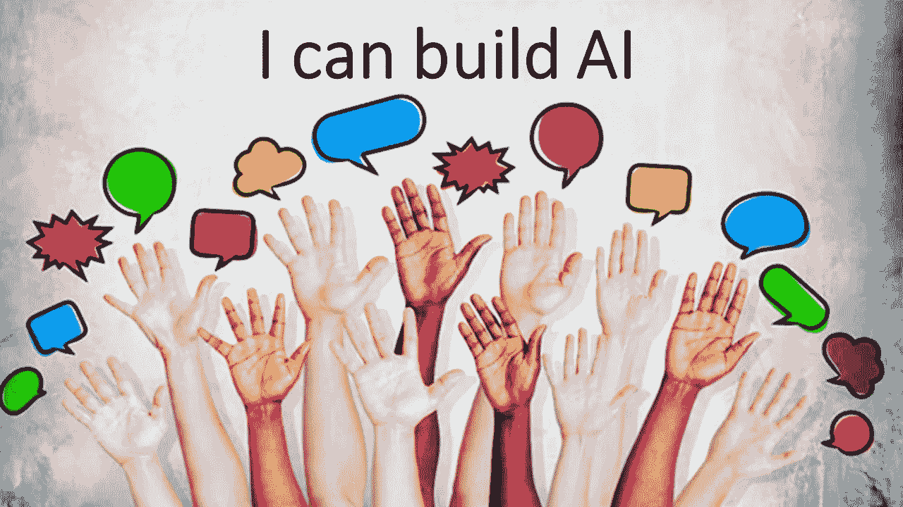
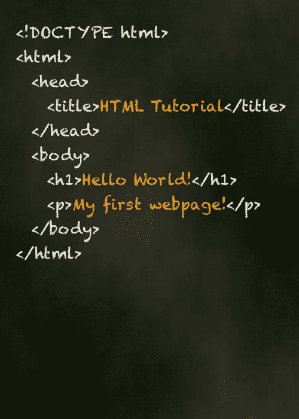

# 为什么这个世界需要像 WordPress 这样的人工智能

> 原文：<https://medium.datadriveninvestor.com/why-the-world-needs-something-likewordpress-for-ai-d6aac3aae4df?source=collection_archive---------5----------------------->

Why WordPress for AI will change as many industry (and as deeply) as the WordPress did for web design

大约 30 年前，当万维网被发明时，人们并不知道它会对社会和经济产生什么影响。如今，其他技术也是如此:人工智能。除了在媒体上读到的，人们不知道会发生什么。

在——如果你愿意的话，在 R&D——存在了几十年之后，人工智能已经为黄金时间做好了准备。但与互联网的最初几步不同，仍有一些进入壁垒严重限制着它的使用。最大的局限？非专家的可及性，加上缺乏适合这份工作的人工智能人才。

 [## 今年值得关注的人工智能趋势——数据驱动的投资者

### 预计 2019 年人工智能将取得广泛的重大进展。从谷歌搜索到处理复杂的工作，如…

www.datadriveninvestor.com](https://www.datadriveninvestor.com/2019/02/19/artificial-intelligence-trends-to-watch-this-year/) 

开发人工智能非常耗时，需要大量的专业知识，并且会很快耗尽时间、金钱和资源。然而，我认为这只是伴随着任何突破性技术而来的成长的痛苦。让我们回到万维网的例子。如何克服某些障碍，让每个人都可以拥有自己的网站？

**早期互联网时代……**

Early days & HTML

我是网站建设艺术的早期采用者。在 20 世纪 90 年代中期，当我还是一名从心理学过渡到神经科学、计算神经科学再到人工智能的学生时，我和我的同事有了一个想法:让我们建立一个网站，让临床心理学家可以在网上与他们的客户互动，绕过社会耻辱，减少现实世界中患者与心理学家互动的金钱影响。

所以，我学会了如何编写超文本标记语言，并建立了我的第一个网站。此后不久，当整个互联网拥有数千万用户时，像 Dreamweaver、FrontPage 和“Flash”这样的工具出现了，并使这个过程变得不那么依赖源代码。

然而，建立一个网站仍然很困难。然而，当我们跨入 2000 年时，一些不寻常的事情发生了。网页设计成了任何人的领域，只要他有足够的技能用鼠标点击。2003 年，WordPress 以其小型用户社区和开源设置出现，极大地降低了创建和更新网站的门槛。如今，在这个时代，面对过多的竞争对手，WordPress 及其模仿者提供了创建漂亮、动态网站的能力，而在以前，这需要专业知识(即编写代码的能力)和数十或数百小时的工作。

**寻找质量 AI 的捷径**

就像 21 世纪初，只有几家公司有网站一样，人工智能的采用也处于类似的状态。只有一小部分企业(更不用说个人)支持人工智能。如果我们只看企业界，估计今天有 30%的企业计划在未来几年内投资人工智能。然而， [91%的组织](http://assets.teradata.com/resourceCenter/downloads/AnalystReports/Teradata_Report_AI.pdf)预见到人工智能采用的重大障碍。主要障碍之一是缺乏人工智能人才来指导这一转变。

换句话说，他们不知道“AI HTML”怎么写(好吧，不叫那个，不过你懂的)。

启动人工智能革命和降低人工智能采用门槛的关键不是一种新的编码语言。

那么，我们如何解决人工智能专家短缺的问题呢？重要的是我们要从教育开始。可以理解的是，商业领袖对投资那些拥有人工智能博士学位的人持谨慎态度，他们应该利用 Coursera 这样的工具来帮助自己和他们的团队在这个问题上接受教育。

然而，对人工智能的彻底理解并不仅限于课堂。听取行业领袖的意见也很重要。麻省理工学院的 [Joy Buolamwini](https://www.ted.com/talks/joy_buolamwini_how_i_m_fighting_bias_in_algorithms?language=en) 只是这个行业中为构建道德和公正的人工智能做重要工作的一个例子。在自我教育和了解人工智能的最佳实践之后，个人和组织可以通过使用我公司的 Brain Builder 或 IBM Watson 等平台构建人工智能来实现他们所学到的东西。通过主动寻找这样的资源，任何人，不仅仅是人工智能专家，都可以在他们的组织中成功实施人工智能。

**快速成型人工智能**

许多人并不完全理解构建人工智能系统的所有内容。这是一个多阶段的过程，需要数据标记和注释、培训、部署和分析。坦率地说，大多数人并不关心它是如何工作的——他们只关心它是否能工作，是否易于快速构建。

“构建”阶段很重要，因为它可能是人工智能项目启动的成败点。这就是人工智能 WordPress 可以创造奇迹的地方。人们需要一个一站式商店，用比传统建立人工智能模型更少的数据快速构建他们的人工智能解决方案。虽然他们总是可以回去进行调整以调整算法，但有时快速获得初始原型是开始并开始了解人工智能如何影响现实世界中的组织、工作流程或用户体验的最佳方式。

最终，当普通人(即非专家)能够真正理解、拥护和团结起来共同追求一项事业时，革命就发生了。只有当人工智能访问成为低代码或无代码的努力，类似于 WordPress 和其他正在变得“平台化”的常见应用程序，我们才会看到对人工智能专家的需求减少，将控制权交给真正有创造力的人。

*最初发表于*[*【https://www.forbes.com】*](https://www.forbes.com/sites/forbestechcouncil/2019/05/01/the-world-needs-wordpress-for-ai/)*。*