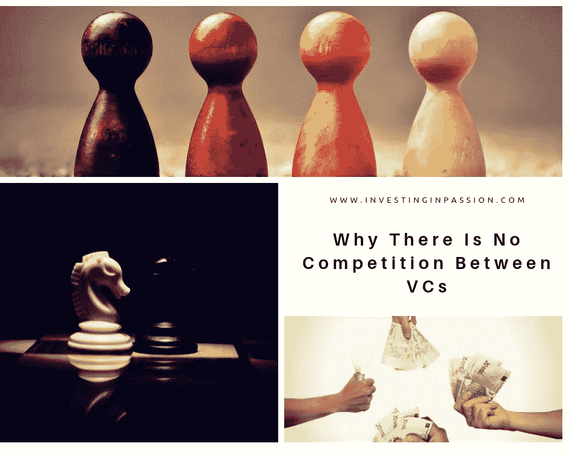

# 为什么风投之间没有竞争

> 原文：<https://medium.datadriveninvestor.com/why-there-is-no-competition-between-vcs-90310663aa6a?source=collection_archive---------8----------------------->

市场上的风险投资基金越来越多。现在有一种相当普遍的趋势，以前在风投公司工作的人离开公司，自己筹集资金。有了丰富的经验，在市场上获得了多年的信任，他们卷起袖子，根据自己的信念建立新的风险基金。

他们有机会成功吸引那些更愿意与更大、更受认可的风投合作的创业公司吗？这看起来像是风投们为了最有前途的创业公司而竞争和争斗，他们是相互对抗的。只是表面印象。当我们深入观察时，这是一个完全不同的模型。我敢说所有的风投都是相辅相成的。

 [## 风险投资家在给创业公司播种时会考虑什么标准？-数据驱动型投资者

### 2017 年，风险投资资金攀升至十年来的最高水平。你的创业公司目前吸引风险投资的机会是…

www.datadriveninvestor.com](https://www.datadriveninvestor.com/2018/04/20/what-criteria-do-venture-capitalists-consider-when-seeding-a-startup/) 

每一家风投公司都是独一无二的，都有自己的使命和愿景。他们寻找特定类型的创业公司，并以某种特定的方式工作。他们专门从事混凝土市场，并在这一特定领域有着长期的生活经验。
人们为什么会换工作的风投？他们并不都一样，人们寻找他们最认同的东西。这只是一个时间问题，直到你知道自己是否适合你所在的风投公司的使命，或者如果你喜欢发现医疗保健行业的创始人，或者你对金融科技更感兴趣，你会寻找稍微不同的东西。
风险投资基金被完美地分配，并有机地出现在需要它们的地方。他们可以共同合作，将早期公司引向专注于特定市场的基金。另一方面，初创公司不会去敲那些不太了解自己的风投的门，他们会寻找一个了解市场、拥有庞大网络和潜在客户群的合作伙伴。
**最后，这是一个创业公司的选择，他们希望与谁合作，以及哪个风险投资更符合他们想要建立的公司的愿景。**

*最初发表于:*[*www.investinginpassion.com*](http://www.investinginpassion.com)