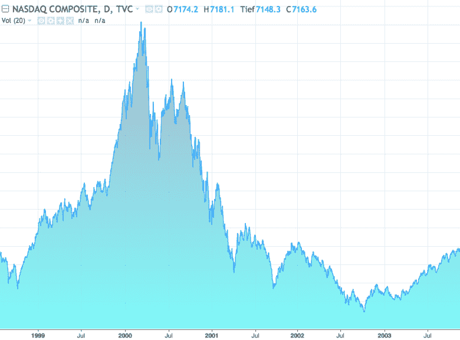
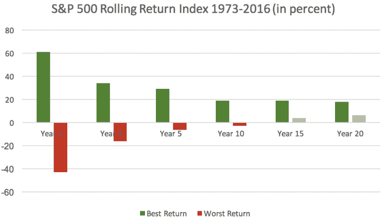

# 为什么这是投资的最佳时机

> 原文：<https://medium.datadriveninvestor.com/why-this-is-the-best-time-to-invest-your-money-ee9724b5ee46?source=collection_archive---------15----------------------->

[Christian Dubovan](https://unsplash.com/@cdubo?utm_source=medium&utm_medium=referral) on [Unsplash](https://unsplash.com?utm_source=medium&utm_medium=referral)

与普遍看法相反，你不需要等到低点再投资股票。更重要的是无论如何你都要做。

T2:特别是在低利率时期，人们会考虑购买股票是否比储蓄账户和人寿保险更有利。然而，他们中的许多人犹豫不决，从投资中退缩，等待价格低时买入股票的适当时机。但是尽管这听起来像是一个有前途策略，我预计你不会有好运气。因为最终——我猜你会感到惊讶— **,这根本不是时机的问题。**

在阐述这个观点之前，让我们先看一下普遍的看法。人们普遍认为，在购买股票时，为了获取最大利润，等待时机是不可避免的。因此，买入股票的理想切入点应该是历史低点。但是你怎么知道你喜欢的股票跌到了谷底呢？

# 买股票意味着经历起起落落

看看某只股票的表现，你会毫无疑问地发现，不管描述的公司声称多么繁荣和成功，其报价都会来回波动。在市场调整有望触发分水岭之前，即使是收入最高的企业甚至指数也会经历高点和低点。下面的图表，纳斯达克综合指数回顾，令人印象深刻地说明了这种发展。

Copyright: [FemaleMoneyMag.com](https://femalemoneymag.com/)

尽管由于 Y2K 崩溃，经济在这个时候直线下降，但它很好地说明了股票可能会在几周、几个月甚至几年内坐过山车。即使是像纳斯达克在崩盘后的发展这样的上升趋势，也会不时经历短暂的低点。因此，即使是专家也无法准确预测买入股票的最佳切入点。

因此，一只股票是否已经触底或进一步下跌的问题，只能在事后才能得到答案。回顾过去，当代高点可能只是通往更高高点的中间阶段。今天的低点可能只是一个更剧烈下跌的开始。

> 不要等待更好的时机到来。你可能永远也找不到最佳点！

你看:高点和低点主要是通过它们之间的对应关系来识别的。由于股票交易非常类似于不可预测的情绪过山车，所以不值得等待。我当然理解你热衷于避免损失。但是现在购买股票可能意味着价格会进一步上涨。因此，今天的股票相对便宜。

# 为什么正确的入市点对购买股票并不重要

由于市场波动不可预测，我强烈推荐被动投资策略。我的意思是买入股票，并尽可能长期持有。尤其是交易所交易基金(ETF)和指数，都在努力构建一个与之抗衡的投资组合。但和往常一样，前提是你要有长远的想法。

为了让你更好地理解为什么连续性对资本积累至关重要，让我们看一下所谓的滚动指数回报。在下文中，我选择了标准普尔 500 的例子。这些图表给你一个历史回顾，看看股市在好的和坏的时候是如何表现的。在下面，我描绘了 1，3，5，10。1973 年 1 月至 2016 年 12 月的 15 年和 20 年滚动指数回报。

Copyright: [FemaleMoneyMag.com](https://femalemoneymag.com/)

正如你清楚看到的，由于 2009 年 2 月的金融危机，最差的一年时间框架带来了-43%的回报。此外，最好的一年可以让你加薪 61%。因此，波动性极高，投资具有很强的投机性。

从长期来看，图表给出了一幅完全不同的画面。那些保持投资超过 20 年的人，无论是在最坏的情况下还是在最好的情况下，都获得了可观的利润。如图所示，总体收益在每年 6.4%到 18%之间。所以，不管情况有多糟糕，不管你什么时候开始买股票，你都会成为赢家。

总而言之，投资不是抓住正确的市场进入点，也不是等待高点或低点。**这是关于耐力。**关于明智的投资决策，比如关注交易所交易基金，而不是看好但有潜在风险的单只股票。例如，如果你在 1980 年只投资了 1000 美元到标普 500 指数，现在你会把 20000 美元变成你自己的——T4，尽管你的投资组合经历了千年虫危机和 2008 年的金融危机。这个例子还不足以证明现在就开始买股票吗？

如果您喜欢您刚刚阅读的内容，请点击下面绿色的“推荐”按钮，这样其他人可能会发现这篇文章。更多此类文章，向下滚动关注 [*女钱 Mag*](https://femalemoneymag.com/) *或我的账号上* [*中。*](https://medium.com/@sabrinakeler)

*女金钱 Mag 上* [*推特*](https://twitter.com/femalemoneymag) *和 instagram 上* [*。*](https://www.instagram.com/femalemoneymag/)