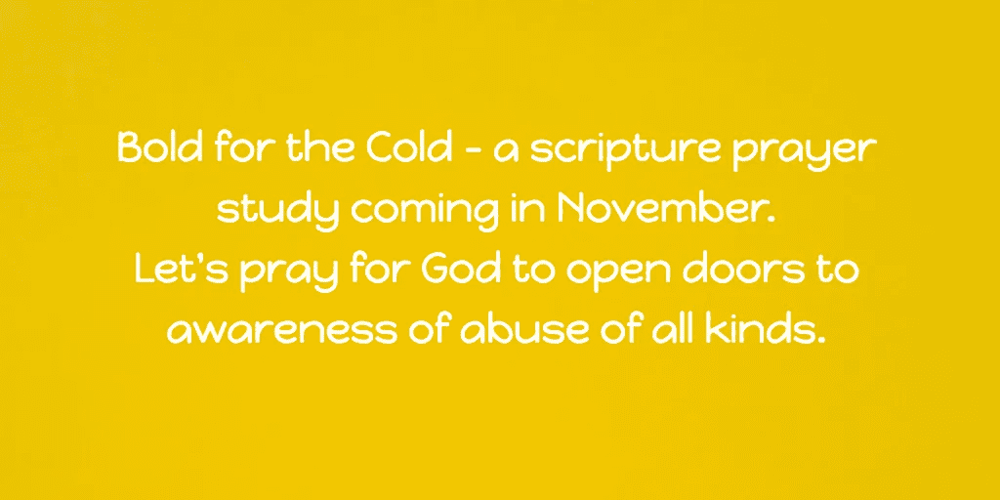
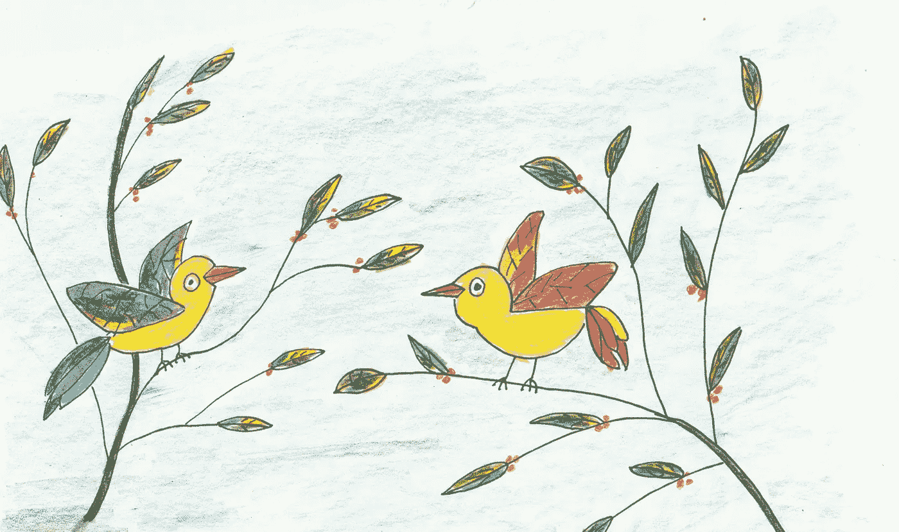

# 为什么这篇文章必须非常简短而有力

> 原文：<https://medium.datadriveninvestor.com/why-this-post-has-to-be-extremely-brief-but-powerful-811d0321c6ee?source=collection_archive---------64----------------------->

## 对“简短”一词的思考，第 24 天，共 31 天

Photo by [rawpixel](https://unsplash.com/photos/DG0tVHDxEe4?utm_source=unsplash&utm_medium=referral&utm_content=creditCopyText) on [Unsplash](https://unsplash.com/search/photos/brief?utm_source=unsplash&utm_medium=referral&utm_content=creditCopyText)

有时候我可以写很长时间。我喜欢找词来解释我的想法。有时候我只有 5 分钟的时间。

老公起床了——早餐马上就好，我有个约会，几天后我们要去旅行——需要打包。组织等。

但有时当我们的思绪短暂时，我们会说出最令人心酸的话。

## 我的简短想法

最近，上帝让我再次呼吁反对贩卖人口和任何形式的虐待。当我听说国际正义使团(加拿大)在寒冷中抱着*大胆*的时候，我忍不住了。我不得不使用这个平台。在[断链网了解更多信息。](https://ijm.akaraisin.com/pledge/Team/Home.aspx?seid=17809&mid=10&tid=201866)

## 祈祷上帝给我们指路

我也有来自田纳西州[街](http://www.streethopetn.org/)的 31 部关于人类尊严的经文。我将使用其中的一些在[脸书小组学习艺术家和作家通过神的话语](https://www.facebook.com/groups/GrowingThroughGodsWord/)成长。加入我们吧。我们将在十一月祈祷经文。

## 在寒冷中勇敢

我将尝试在 11 月份用黄色来画画、绘画、插图，而不是穿黄色(我会试着找一些黄色的东西)。我自己的挑战。但是如果你想加入——请联系我。我不知道图片会在 Instagram 还是在 Medium 上。这是我的第一张速写。

Birds on the Branches — wearing yellow — by Janis Cox

> 你看空中的飞鸟，它们也不种，也不收，也不积存在仓里。然而你的天父喂养他们。难道你们不比他们更有价值吗？”

## 我团队的名字叫断链者。

*你想帮助打破虐待链吗？*

通过倡导、祈祷、艺术或捐赠。我要求你至少想想我们这个世界现在存在的虐待。隐藏和开放。像我的脸书主页一样——帮助打破虐待的枷锁。

## 让我们成为断链者。

还有最后一个想法——我不会冷。本周我们将前往亚利桑那州我们的冬季住所。今天早上安大略省哈利伯顿下雪了。我们很幸运能够去南方旅行。这种感冒不适合我这辈子的这个时候。但我仍将是《寒冷中的大胆》的一部分。

click here to find out more — [Here](https://ijm.akaraisin.com/pledge/Team/Home.aspx?seid=17809&mid=10&tid=201866)

## 我可以为你和我祈祷吗？

父亲，人的尊严对您和我们都很重要。我祈祷你打开大门——把你的话传到你的人民的心里。我祈祷我们能让越来越多的人意识到到底发生了什么，并停止这场闹剧。我们依靠你的灵感，你的方式和自由的俘虏。以耶稣的名义。阿门。

时间到了。5 分钟过得很快。

## 我正在参加[的 31 天五分钟自由写作。](http://fiveminutefriday.com/2018/08/30/31-days-five-minute-free-writing-prompts-2018/)加入我吧。

如果您想继续学习，这些是本系列的其余部分。

第一天— [你的传奇故事是如何开始的？](https://medium.com/@AuthorJanisCox/how-did-your-fabulous-story-begin-103390eba10e?source=friends_link&sk=7fa68b0334a4c6b2731acee36e118cb9)

第 2 天— [我是多么害怕，但学会了不害怕](https://medium.com/@AuthorJanisCox/how-i-was-a-afraid-but-learned-not-to-fear-1c36b8fdb5f8?source=friends_link&sk=14421e678dbf6c82f5e0acb426c6492b)

第 3 天— [你如何相信，相信什么？](https://medium.com/@AuthorJanisCox/how-and-what-do-you-believe-2fec775433eb?source=friends_link&sk=94f74e2a9b00bd9cd52891db7aceaa93)

当事情变糟时，你会哭吗？

第 5 天——你分享了多少？

第 6 天— [你怎么知道自己属于什么时候？](https://medium.com/@AuthorJanisCox/how-do-you-know-when-you-truly-belong-d7cc3e2dea78?source=friends_link&sk=7d6695245d2dc2653711f71a428b9139)

第 7 天— [为什么抱有希望很重要](https://medium.com/@AuthorJanisCox/day-seven-in-31-days-of-five-minute-free-writes-with-prompt-hope-bdb75abf62b3?source=friends_link&sk=2b079163edab98b71d1a3533cbb342d6)

第 8 天— [哪里是寻找安慰的最好地方？](https://medium.com/@AuthorJanisCox/where-is-the-best-place-to-find-comfort-b9ec267ab4ab?source=friends_link&sk=532d5766c5684926554ed7f3491587a8)

第 9 天— [为什么灵感没有你想象的那么虚幻](https://medium.com/@AuthorJanisCox/why-inspiration-isnt-as-illusive-as-you-think-a64ca1976f4f?source=friends_link&sk=de5bf1d80fde78551dd64d586957e9e5)

第 10 天— [为什么“如何”是一个如此强大的词](https://medium.com/@AuthorJanisCox/why-how-is-such-a-powerful-word-6cc29444b4a6?source=friends_link&sk=a62167dbaeefa7cd4ab0027ae365259a)

上帝之门是开着还是关着？

第 12 天— [我对上帝的赞美还不够，你呢？](https://medium.com/@AuthorJanisCox/i-dont-praise-god-enough-do-you-bd751d09f92b?source=friends_link&sk=9d9d671627960f7f5f372879f27dd0a7)

第 13 天— [你想学习如何在别人面前说话吗？](https://medium.com/@AuthorJanisCox/do-you-want-to-learn-how-to-talk-in-front-of-others-f104c39f21c8?source=friends_link&sk=7fd9a97485cb6436fbb36337431bc73a)

你想知道一个问题的答案吗？

第 15 天— [为什么耐心如此之难](https://medium.com/@AuthorJanisCox/day-15-in-31-days-of-five-minute-free-writes-prompt-is-when-9c2829a38e38?source=friends_link&sk=1958ec139268d125331d433a706e8f5c)

第 16 天[–8 如何祈祷的实际想法](https://medium.com/@AuthorJanisCox/8-down-to-earth-ideas-of-how-to-pray-deff3655cceb?source=friends_link&sk=33e5d590708962df704d51ea7b677fe0)

第 17 天— [你有创作困惑吗？](https://medium.com/@AuthorJanisCox/do-you-suffer-from-creative-confusion-d17c90dc033?source=friends_link&sk=6973f239e257c18ad83d0ab18232a46e)

第 18 天——你需要知道为什么你绝对确定你在寻找你的人生道路

第 19 天— [上帝如何清楚地向你展示你是谁](https://medium.com/@AuthorJanisCox/how-god-can-clearly-show-you-who-you-are-c0c10455b710?source=friends_link&sk=ecc171128e958dec592e677ce3e82b71)

第 20 天— [你能做些什么来发现你的听众](https://medium.com/@AuthorJanisCox/day-20-in-31-days-of-five-minute-free-writes-prompt-is-audience-11eaf2881159?source=friends_link&sk=6a7139a80c764b3e4dd99deaed6b90f4)

第 21 天— [为什么我开始写作时最困难？](https://medium.com/@AuthorJanisCox/why-do-i-have-the-mosttrouble-starting-to-write-3f4fe81d551a?source=friends_link&sk=44b92a3e2185d0bb78c91e18ad774537)

你永远不会知道“帮助”有多么强大

第 23 天— [10 件困扰我的事情它们是如何变化的](https://medium.com/p/995a92225b59?source=your_stories_page---------------------------)