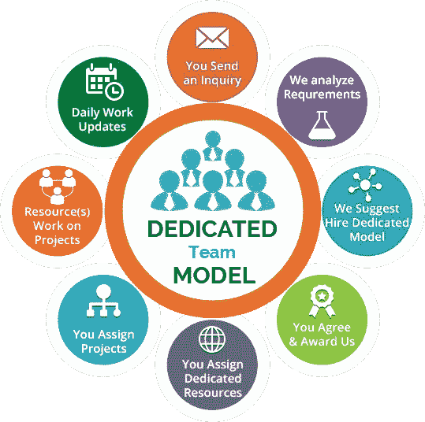

# 为什么要雇佣专门的软件开发团队？IT 启动清单

> 原文：<https://medium.datadriveninvestor.com/why-to-hire-dedicated-software-development-team-a-checklist-for-it-startup-9778f95ddaa2?source=collection_archive---------5----------------------->

一旦你雇佣了专门的软件开发人员，你需要在审查过程中全面地确保你选择了最好的。也许你没有身体接触来解决关于你的要求的关键点，但这肯定不意味着你必须满足于任何人华丽的提议。

因此，如果你已经决定开始你的下一个大型 web 开发项目或移动应用程序开发，你可能会计划雇佣最好的开发团队的必要步骤。然而，下面来寻找最好的开发团队你应该讨论你的项目需求，但要确保该公司在 IT 人员增长，外包 IT 服务方面有良好的记录，使其成为最优秀的软件开发公司。

你的渴望是由你的高期望推动的，你期望所有的东西都在正确的地方。到目前为止，还不能保证你所任命的人会像承诺的那样完成工作。但是，如果事情这么简单！

您可能已经知道数字技术出现的速度，这使得寻找合适的软件开发服务来使用最新技术变得越来越困难。

> **如果你发现自己身边缺少网络和移动应用的专业开发人员，该怎么办？最适合这个盒子的解决方案是“专用开发团队模型”。**

# ***了解什么是“专用开发团队模式”***

给人的印象是，专门的软件开发团队是一个 IT 采购层级，其中客户或公司允许供应商的外包软件开发公司带上专门的开发团队，为以前的需求工作。

在这种情况下，IT 采购公司会建立一个开发团队来“专门”满足客户开发 web/移动应用程序的需求。客户可以自由雇用程序员或开发人员，并将任务分配给团队中的每个人，但无权从众多选项中选择开发人员。

## **为什么需要雇佣专门的软件开发团队？**

正如我上面提到的，技术正以指数增长。而且，如果你有一个专注于特定领域的业务，并且有一个特定的愿景，那么你可能没有足够的时间来熟悉 [**外包软件开发服务**](https://www.xicom.biz/solutions/outsourcing/?utm_source=SM04) 的最新趋势。

但是，抓住这些趋势是必要的。每个企业，不管是小规模还是大公司，都会从网络开发投资中受益。此外，雇佣“专门的开发团队”有助于加速您的业务发展。

## **1。为搜索和招聘节省资金**

没有必要寻找希望成为项目一部分的人，而是寻找软件开发公司。通常，外包软件开发服务团队提供建立计划所需的所有人员。在这种情况下，客户与外包公司的经理互动，讨论所有的需求。

当然，还有无数的其他节省，如工作场所、培训和介绍公司政策，以及官方开支。

在决定建立一个项目和实际开始工作之间的最小时间间隔是专门的开发团队的优势。在一个地方拥有完整的专用软件开发团队也是帽子上的一根额外的羽毛，这使得初步的过程和计划稍微容易一些。

因此，遵循目标并坚持计划有利于项目的长期发展以及客户和开发团队之间的互助。

## **2。全天候互动，包括需求变更**

是的，客户决定雇用专门的软件开发团队，他们的工作量和完全访问他们的活动。计划的时间表包括各种任务—从实施不断变化的项目需求到预期的任务优先级。在任何软件开发过程中，客户和团队之间的直接沟通都是至关重要的因素。

专注的开发人员不需要隐藏产品实现中的具体问题，这使得客户可以快速做出反应，并在必要时做出决定。

## 3.**卓越的员工管理**

客户可以自由决定软件开发服务团队的实力，根据之前定义的条款培养/解雇专业人员。团队的熟练程度、精明的经验以及对专家团队成员的了解&他们的团队合作是另一个重要因素。

让我们举个例子，只有最近加入公司的人需要一些时间来适应新的环境。高效、敬业的团队将是这种情况下的最佳选择。

## **什么时候考虑雇佣专门的团队？**

> 在以下情况下,“敬业团队”模式是一种合乎道德的选择:

> 您的动机是与外包软件开发服务提供商进行长期合作。
> 
> 项目的需求经常变化。
> 
> 你假设在开发计划中你可能需要增加团队。
> 
> 你没有资源来训练你的团队。
> 
> 您希望该选项具有成本效益。

# **如何雇佣专门的软件开发团队？**

## **1。找一家 IT 采购公司雇佣开发人员**

首先，为你的下一个项目雇佣专门的软件开发人员的第一步是找到最好的资源来留住他们。具体来说，你应该寻找最好的，有经验的，但负担得起的外包软件开发服务，从一个基准软件开发公司，与体面的大量经验和特殊的客户居住。

但首先，你应该知道去哪里找。在寻找 it 外包软件开发公司 [**雇用开发人员**](https://www.xicom.biz/offerings/hire-software-developers/?utm_source=SM04) 的同时，在最受欢迎的 IT 外包国家寻找公司被证明是一项不错的投资。

你一定想知道这有什么区别？这一点很重要，因为位于这些地区的公司非常了解他们的工作，因为每个人都在同一行业工作了多年。

> **根据科尔尼** **全球服务地点指数** [**的分析，找出最适合外包 IT 需求的五个国家:**](https://www.multivu.com/players/English/8179851-at-kearney-2017-global-services-location-index/)

*   **印度**
*   **中国**
*   **菲律宾**
*   **印度尼西亚**
*   **巴西**

**在上述国家中，您可能决定将 IT 需求外包给印度，原因很简单，**

a.作为一个发展中国家，它有足够数量的合格和熟练的开发人员和软件开发公司。

b.印度是全球最大的 IT 外包软件开发服务国家。

c.印度是第二大人口大国。

## **2。与 IT 采购公司建立联系**

如今，找到一个理想的 IT 外包是一件轻而易举的事。但是，从领先公司雇佣软件开发人员时，必须记住一些要点。

其中最重要的是寻找一家符合你预算的公司。此外，你还可以通过查看  **Goodfirms** 和  **Clutch** 来寻找专业的软件公司。

## **3。召集专门团队**

既然您已经下定决心要与 IT 外包软件开发团队合作，那么下一步就是计划项目，与项目经理分享关于项目成功和成本因素的观点。一旦这些细节被确定，文件被认可，那么你应该进一步处理。

下一步是选出专注而专业的开发人员来为你的项目工作。在专用开发模型中，您完全可以选择是需要有经验的开发人员还是新手。

但是，进入 IT 外包软件开发公司的角色就是要了解你的需求，并利用他们的知识和领域专长来实现。

深入了解潜在开发人员的建议，雇佣专门的软件开发人员，如果有什么让你怀疑的地方，不要犹豫地问你的供应商。

## **4。保持与供应商公司的沟通**

围绕与外包软件开发服务的“专用开发团队模型”相一致的专用开发模型，存在着疑云。像吉拉和特雷罗这样无处不在的交互式项目管理使客户与海外项目经理和团队的沟通变得更加顺畅。

与开发团队保持持续的沟通是非常重要的。为他们提供特定任务的最后期限，但不要给团队施加压力。给他们足够的时间，同时花时间去评估。

***还有，有问题吗？希望下面是一些关于专门团队模型的常见问题，能给我们一些启发。***

*   DTM 是个好选择吗？

作为外包软件开发公司的一员，许多专业人士更喜欢这种招聘模式。我会说，大多数客户关系都是基于这种模式，因为 IT 公司大多都在与许多正在进行的项目合作。

*   **这种模式有哪些领先优势？**

> 如果只选择三个，我可能会说，

1.  过程的透明度。
2.  团队的奉献精神(专家承担全部责任，就好像项目是他们自己的一样)
3.  控制工作进度，快速建立团队。

*   **规划合适的团队需要很多时间吗？**

看情况。一些客户将团队成员的选择委托给各自的项目经理，并倾向于他们的选择。而另一些人则认为参与所有预定的面试并亲自对他们的简历进行彻底检查是非常重要的。平均来说，整个过程需要 10-15 天来建立一个专家团队。

另一方面，让专家在人群中脱颖而出的是“接近”。就像如果你需要一个 15 人的团队，首先会建议雇佣 4-5 名开发人员，然后逐渐增加团队规模。这种方法是一种屡试不爽的方法，可以雇佣最好的候选人来巩固你的项目。

# ***总结:***

如果你想跟上新兴技术的步伐，从 IT 外包公司为你的 [**web 开发项目**](https://www.xicom.biz/offerings/web-development/?utm_source=SM04) 雇佣一个专门的软件开发团队是非常有益的。他们为您提供:

> **能够面试所有专业人士**
> 
> **根据客户需求灵活安排工作时间。**
> 
> **团队的主要动机是提供完美的体验并满足项目的要求和目标。**
> 
> **指数级增长，需要时可快速交换资源。**
> 
> **项目的详细报告和正在进行的合作。**

从泛滥的选项中选择最好的外包 [**软件开发服务**](https://www.xicom.biz/offerings/software-development/?utm_source=SM04) 让你在技术规模发展的同时磨练你的专业知识。

***你对这个话题有什么关注和疑问吗？或者，您是否遇到过上述任何此类情况？请在下面的评论部分填写免费分享。***