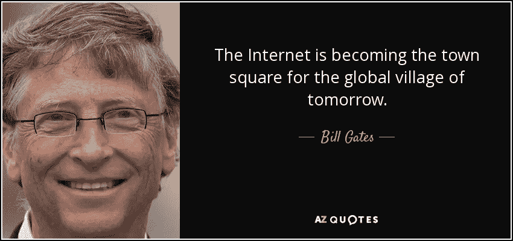

# 2019 年为什么要学习 web 开发？

> 原文：<https://medium.datadriveninvestor.com/why-to-learn-web-development-in-2019-38ffbbd2b4a4?source=collection_archive---------1----------------------->

Image taken from [https://www.azquotes.com/quote/107337?ref=world-wide-web](https://www.azquotes.com/quote/107337?ref=world-wide-web)

2019 年是机器学习、深度学习、Android 和 iOS 发展的时代。今年 Rust、Python、JavaScript 将会在开发者中更受欢迎，并且会引入许多新技术。

互联网用户的数量与日俱增。[截至 2018 年 6 月，**全球 55.1** %的人口拥有互联网接入。](https://en.m.wikipedia.org/wiki/Global_Internet_usage)每天托管多个网站。因此，这些网站的访问者数量有所增加，因为用户通过浏览器消费了更多的数据，这就是 Web 开发将非常苛刻这一事实背后的原因。

> [DDI 编辑推荐 Web 开发者课程 2.0 全集](http://go.datadriveninvestor.com/webdevelopment2/matf)

Web 开发不仅仅包含设计部分，它还引领了市场的新趋势。我们有网页设计师、用户体验设计师和后端开发人员。原生应用程序开发也需要某种 HTML、CSS 和 JavaScript 经验。

所以，我找到了一些原因来解释为什么在今天的发展中国家需要网络开发。

web 应用程序比应用程序更可靠

2)浏览器的功能日益强大

3) JavaScript 开发者是世界上收入最高的开发者。

4)类似下面提到的框架今年将会更加流行

*   有角的
*   反应等等。

5)拥有网络开发方面的知识会增加你的简历

6)ML、AI、机器人和许多其他领域都需要一个前端来连接用户，拥有 web 开发知识将始终提升你的应用程序开发技能。

7)使用 Ionic 和 React Native，您可以构建跨平台的应用程序。

8) Web 开发很酷。不再等待，不再编译。只需编写代码，就能在浏览器中看到色彩的魔力。

9) Web 开发引入了一些新的术语，如 mean stack developer 和 full stack developer。

所以，让我们来看看你如何在免费资源的情况下开始你的 web 开发生涯。

# **如何开始你的网络开发生涯**

1)学习 HTML / HTML5

2)学习 CSS / CSS3

3) JavaScript

4) Bootstrap(如果你对上述 3 有基本概念，就开始)

5)学习一些其他的前端框架比如 Google 的 material design(不难学；在学习过程中保持一致即可)

6)对于服务器端，你可以从 Python 或 PHP 开始，因为它很容易学习，而且 PHP 类似于 C/C++语法

7)开始构建一个迷你项目，学习任何服务器端编程语言。

8)在你的项目工作中至少连续花 7 天时间。

9)一些好的网站有
9.1)[Tutorialspoint](https://www.tutorialspoint.com/internet_technologies/websites_development.htm)
9.2)[W3school](https://www.w3schools.com/)
9.3)[Bootstrap](https://getbootstrap.com/)
9.4)Youtube
9.5)Udemy 等。建立小项目，但保持比平常更高的目标。尽最大努力将您的迷你项目转换成生产就绪的应用程序。

11)积极参与在线网络开发挑战和竞赛，并努力获胜。

12)作为网络开发人员更新你的 LinkedIn 个人资料

13)建立你的数字作品集，向你的朋友、同龄人、长辈等展示你的作品，并建立一个网络，从那里你将获得一个客户，你将开始通过使用你的网络开发技能来赚钱。

# 您必须熟悉的服务器端语言

1.  节点 JS
2.  Python flask /Djang
3.  核心 PHP
4.  PHP 框架

要从免费资源中学习，你可以参考 YouTube(从我开始学习的地方)、Udemy、edx、Coursera、Udacity NanoDegree 课程等上的课程，学习和提高你的经验和能力，这样你就可以通过你的网络开发技能获得更多。下面给出了一些链接。

**免费学习 web 开发的 YouTube 频道列表**

*   [TUTS+网页设计。](https://www.youtube.com/user/TutsPremium)
*   [Nptel](https://www.youtube.com/user/nptelhrd)
*   [亚当·胡里](https://www.youtube.com/user/flashbuilding)
*   编码者指南
*   布拉德·赫西
*   [CodeGeek](https://www.youtube.com/channel/UCE4tlXlo2HHdSYkXfgMb7vQ/featured)
*   [Codeonce](https://www.youtube.com/channel/UCj9nQozjM9yUGwyBnITCOPg)
*   谷歌网页设计师。
*   [设计课程](https://www.youtube.com/user/DesignCourse)
*   学习 web 代码
*   Php 学院
*   [新波斯顿](https://www.youtube.com/channel/UCJbPGzawDH1njbqV-D5HqKw)
*   [EDX](https://www.youtube.com/user/EdXOnline)
*   [网络忍者](https://www.youtube.com/channel/UCW5YeuERMmlnqo4oq8vwUpg)
*   [自由营](https://www.youtube.com/channel/UC8butISFwT-Wl7EV0hUK0BQ)

更多信息，请在 LinkedIn、Instagram、Twitter、脸书和 Medium 上关注@anki7singh

# web 开发#初学者#教育#工程# HTML # CSS #引导# JavaScript # YouTube #计算机#编程#编码#计算机科学

*编辑披露:编辑有时会发布有用资源的链接。如果你发现它们有用并购买，我们会赚很多钱。不，我不是说要把我的薯条做大。我说的是超大披萨上的意大利香肠。感谢您一直以来的支持，我们将继续为 p̶e̶p̶p̶e̶r̶o̶n̶i̶出版而努力。*