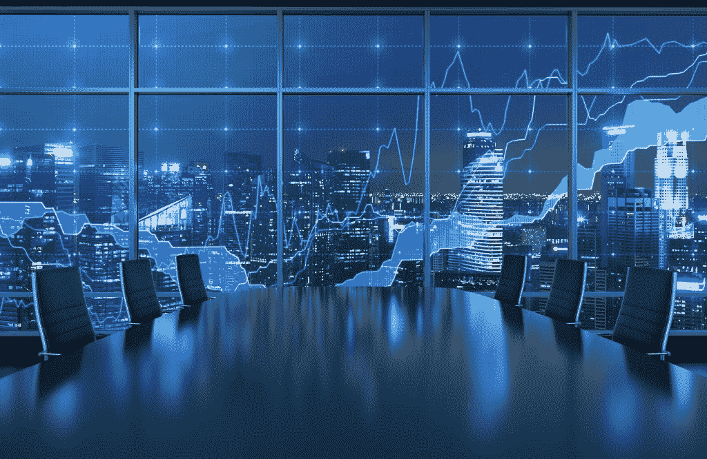

# 为什么交易算法不会改变交易的未来

> 原文：<https://medium.datadriveninvestor.com/why-trading-algorithms-wont-change-the-future-of-trading-adced3689b54?source=collection_archive---------11----------------------->

在阅读过去两周的交易时，我遇到了一个非常有趣的问题，即交易算法过度饱和的后果。虽然一些人将 12 月底的股市反弹归咎于养老基金和做空，但投资咨询公司 Omega Advisers 的创始人莱昂·库珀曼(Leon Cooperman)将趋势跟踪倾向归咎于交易算法。库珀曼坚持认为，美国证券交易委员会拒绝恢复他们的加价规则，在监控交易算法对市场行为的影响方面做得不够。随着如此多的算法现在通过世界市场交易，人们越来越担心这些算法的模式搜索倾向将导致波动性增加和不可预测的价格变化。库珀曼等怀疑论者认为，除了交易通过推推搡搡完成的时代要好得多之外，这种交易算法的过度饱和还会导致羊群行为的极端例子，加剧价格波动。我认为这是一种滚雪球效应，一种算法投资股票会促使更多的算法做同样的事情，这将导致股票价格上涨，这反过来又会刺激更多不同的算法开始投资(如此等等)。

这实际上是一个值得思考的令人难以置信的概念:如果这些算法使用实时数据，他们的预测就会受到当前市场变化的启发。但是，如果美国股票市场约 60%的交易是由算法完成的，那么由交易算法分析的每日市场变化大多只是其他交易算法的输出。从本质上讲，如今的交易算法分析其他算法的走势，而其他算法也根据市场行情做出自己的走势，从而形成一种自相矛盾的往复互动。随着量化交易占据主导地位，分析实时数据的算法只是从其他算法做出的决定中学习，库珀曼和他的公司似乎认为，这些算法将摧毁传统交易，并抹去由人类投资者控制的有效市场理论。

出于几个原因，我碰巧强烈反对库珀曼的说法。首先，交易算法使用和人类一样的信号和统计概率进行投资。我的意思是，人类是编写这些程序的人([现在是](https://www.techrepublic.com/article/developers-rejoice-now-ai-can-write-code-for-you/))，人类告诉程序在投资时要注意哪些指标。因此，如果算法代替人类进行交易，没有什么区别，除了可能会提高速度和一致性。不仅如此，交易算法的主要目标是定位市场无效并从中获利。这和人类交易者的主要目标没有区别。最终，人类交易者和他们的数字交易者一样容易从众。早在人们知道金融工程意味着什么之前，金融泡沫就已经存在，而大众思维的问题可能永远不会平息。

最后，我无法想象在没有人类参与的情况下，100%的交易由算法完成的未来。即使所有的交易最终都是通过使用交易算法的工具和软件完成的，仍然会有人为这些算法编程，改变它们的参数，测试它们的性能，并发明改进的策略。量化交易只是金融发展的下一个合乎逻辑的步骤，可以提高效率和流动性。

现在，重点不应该是质疑我们交易算法的完整性或后果，而是应该找到新的基于人工智能的算法，可以更好地合成金融数据。例如，交易的下一个巨大飞跃是学习其他交易算法行为的算法，这样他们就可以根据他们认为其他计算机会做的事情进行投资(我相信秘密的对冲基金和 HFT 基金已经在调查这一点)。

我很想知道交易算法之间的动态如何发展，我也很想听听其他人对交易在不久的将来会是什么样子的看法。

更多我的想法，请查看:【https://carpeventures.com/