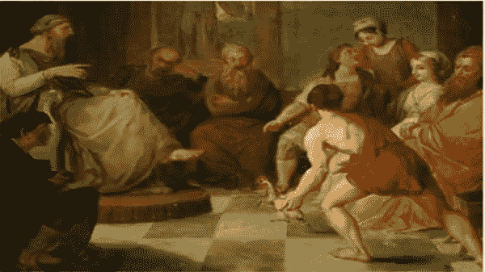

# 为什么要相信别人的定义？在此之前，应用“提奥奇尼斯测试”

> 原文：<https://medium.datadriveninvestor.com/why-trust-someone-elses-definition-apply-the-diogenes-test-before-you-do-295a22d1a128?source=collection_archive---------16----------------------->

Gerard O'Donovan 经营的教练博客，我们的目标是不断为那些寻求改善生活的人带来价值。因此，我们有一个政策，出版我们重视和欣赏的客座作者的文章和材料。今天的客座作者是马丁·古德耶(英国)。

古德耶的第欧根尼测试:是否有可能同时以良好的本质和绝对的清晰来反驳一个定义？

历史上不乏伟人和好人给出的定义被证明没什么用处的例子:

大约两千五百年前的古希腊，一些受过良好教育的雅典人几乎接受了伟大的柏拉图对人类的定义，因为经过深思熟虑后，他将其浓缩为“无羽毛的两足动物”。我敢肯定，有很多恭敬的点头和很少的提问，因为他们一定认为所有必要的思考已经由他的地位和名声的人做了；因为除此之外，这位伟人还能如何得出这个独特的定义呢？然而，第一个被称为愤世嫉俗者的人是一个有趣的家伙，他叫辛诺普的提奥奇尼斯(不要和哲学时间线上许多其他著名的人物混淆，提奥奇尼斯——因为我认为这个名字一定和“艾伦”一样常见！)，勇敢地对这个定义提出了质疑。他显然没有就这个话题展开辩论，而是闯进了柏拉图的一堂教学课，手里举着一只刚拔下毛的鸡，喊道:“看，这是柏拉图的人！”

提奥奇尼斯是一个独特的人物；显然，他住在城镇广场边上一个翻过来的旧浴池里，赤身裸体地睡在街上，把自己的生活提炼成生存所需的最基本的必需品。像所有著名的哲学家一样，他不怕提出挑战性的问题，并就如何应对“生活”的挑战提出自己的观点。事实上，他是如此著名，亚历山大大帝在访问雅典时寻求他，当有机会问一个问题这个最重要的人据报道说；“你能挪一下吗，因为你挡住了我的阳光”。幸运的是，亚历山大被他的自信和他愿意摆脱任何他认为不必要的东西逗乐了，并回答说；"如果我不是亚历山大，我想成为提奥奇尼斯！"对此，提奥奇尼斯打趣道“……如果我不是提奥奇尼斯，我也想成为提奥奇尼斯！”显然，他既自信又有幽默感，幸运的是，亚历山大也是如此。他对教练的价值在于他愿意看透政治、等级制度和声誉，这是我们在考虑大量声称教授和建议任何教练方面的材料时应该考虑的。一种自信、胜任、轻松但严肃的方法，以清晰明了为目标，解决其他困难的问题，是我现在喜欢称之为第欧根尼测试的标志，这种测试评估被提出为绝对和真实的定义，并询问是否有可能同时以良好的性质和清晰性反驳它？

应用这一测试的挑战在于，一旦某个信念被接受，就很难放弃，因为即使面对明显矛盾的证据，也无法保证任何现在已被质疑的“事实”的追随者会退缩。如果某个具有柏拉图明显智慧的人继续在他之前的犁沟中犁耕，试图通过添加人类必须有脚趾来修改他的拔过毛的鸡的定义，那么较小的灵魂不太可能坚持他们的观点并捍卫它吗？回顾 twenty-twenty，很清楚为什么柏拉图的定义没有流行起来——它确实有点垃圾，但有趣的是，一旦投资于某事，任何人都很难退出并重新考虑，即使它显然没有做预期的事情。可悲的是，类似的事情也会发生在教练定义上。通常，定义者想出的词的形式并不比提奥奇尼斯的拔毛鸡更恰当，然而教练们坚持使用它们，就好像它们是“无论是谁”的福音一样；团队教练、小组教练、公司教练、商业教练、高管教练、管理教练、工作场所教练、生活教练……这个清单还在继续，随之而来的是越来越多的定义，这些定义几乎都是简单地“编造”出来的，或者是基于以前的爱好者编造出来的。像柏拉图一样，它们作为事实存在，但事实上它们缺乏任何重要的经验证据和检验，因此它们很少经得起第欧根尼的检验。

任何形式的教练都没有一个统一的定义，更不用说教练团队的可能定位了。当然，可能有关于教练团队的“想法”,毫无疑问，其中一些是值得探索的，虽然引用其他人给出的定义是不合适的，但请允许我对团队教练做出几个明显合理的定义，例如；一种方法，通过这种方法，参与一个集体目标的一定数量的人可以认识到并致力于实现该目标的个人行动。或者也许；将顺序提问方法应用于目标一致的人员，以便他们更好地应用现有知识。我可以继续下去，包括更复杂的区别，但目的是什么？如果有力地提出并加以解释，它们很容易被接受为一个定义。因此，它们在增加价值的同时，也有可能造成损害。它们没有经过测试，也没有经过彻底的同行评审。他们是其他人关于团队教练应该是什么的想法，所以，不要从表面上接受任何关于“教练团队的方法”的定义或建议，而是问一个更好的问题；你想在这个团队中实现什么？你认为与简单的引导、团队建设或其他一些使团队提高绩效的成熟方法相比，指导能提供更好的结果是什么？团队辅导可能包括哪些其他干预措施不包括的内容，你打算如何利用这种差异来增加价值？工作场所中哪些方面的辅导产生了最有效的结果，如何将这些纳入你提议的干预措施中？在开始团队辅导之前，你可能会问自己很多问题，因为团队辅导的应用环境是动态的。

例如，假设一个团队陷入了内部政治的泥坑，每个团队成员都有未解决的个人“问题”，那么考虑一下一些提议的团队教练定义和方法在这些情况下可能如何工作？一个“过程”会带来预期的结果吗？大概不会。“关于一致目标的公开讨论”会取得成功吗？大概不会。无论是政治问题、变革阻力、团队成员之间的个人问题、组织内未言明和未承认的偏见，还是实现团队目标的其他“个人”障碍，成功的教练都可能需要采取灵活和熟练的方法来应用教练技术才能取得成功。因此，做你自己的专家:如果你要去指导团队，那么开始时要有一个非常明确的目标，这个目标是特定于这个团队的，刷新你关于教练技术和方法的知识，只有这样才能制定出一个可能给你最好结果的方法。问自己一些艰难而有见地的问题，推动你超越任何“标准”,转而创造你自己的适用于该团队的定制方法。我认为，任何团队教练的定义，或者实际上任何教练的定义都将受益于接受第欧根尼的测试，因为如果没有它，它们可能最终会像拔了毛的鸡一样有用！

**关于** [**马丁古德耶**](http://www.martin.coach/) **(** MBPsS MAC)

建立信任，创造安全的空间，并认识到没有一个领导者知道所有的答案，但总是有优势可以利用，这些都是优秀教练的标志。Martin 是一名世界级的教练，他在 17 年的商业生涯、商业管理资格和作为心理学家的坚实基础上建立了出色而广泛的教练记录，现在他作为全职教练和教练教育者已有 17 年，是教练和生产力书籍的作者，是最高认证级别的教练哲学和技能的教师，也是与来自印度、美国、非洲、斯堪的纳维亚、中欧和东欧以及远东的高管客户进行国际合作的经验丰富的教练。

他的教练风格是在团队和个人行为方面实现快速和持久的绩效改进。Martin 还担任了许多知名客户的私人教练，是研讨会平台上的优秀主持人，拥有丰富的电视和广播经验。

**在这里阅读更多内容，别忘了订阅我的教练博客网站获得免费教练报告:**[https://www . coaching-blog . com/why-trust-someone-elses-definition-apply-the-Diogenes-test-before-you-do/](https://www.coaching-blog.com/why-trust-someone-elses-definition-apply-the-diogenes-test-before-you-do/)

请访问我们的网站，订阅我们的免费教练杂志:[http://www.international-coaching-news.net/](http://www.international-coaching-news.net/)