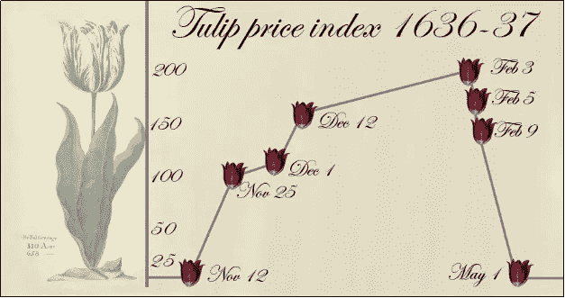
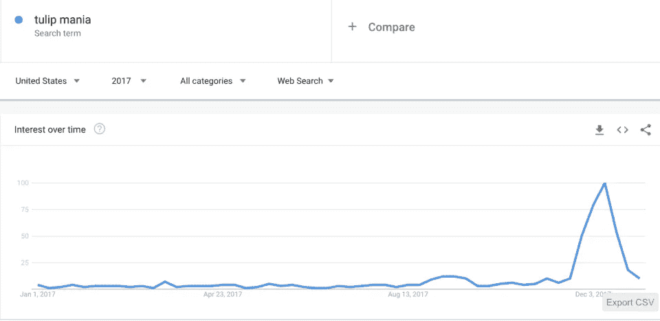

# 为什么郁金香狂热是一个糟糕的比较加密

> 原文：<https://medium.datadriveninvestor.com/why-tulip-mania-is-a-bad-comparison-to-crypto-bcbf490cd149?source=collection_archive---------5----------------------->

秘密市场的性质经常被比作荷兰黄金时代的郁金香狂热。然而，有一些基本的差异使这种比较无效。

郁金香狂热是 17 世纪荷兰的一场投机性价格泡沫。人们蜂拥购买郁金香期货合约，有时甚至每天交易郁金香球茎高达 10 倍。

[*Source:*](https://medium.com/swlh/bitcoin-a-tulip-mania-of-21th-century-c37946340135) *Sukant Khurana*

欧洲各地的商人蜂拥购买郁金香。价格在几天内暴涨。然后，市场做了所有市场都会做的事情——自我修正。必要的反弹是一切即将到来的崩溃。

人们在一夜之间损失了相当于数百万美元的资金，这一事件在历史上被作为对那些从事基于疯狂投机的投资的人的警示。

如今，郁金香狂热被比作加入加密热潮的人群。2017 年底，谷歌搜索术语“郁金香狂热”和“郁金香热”飙升至炒作的顶峰。如下图所示:

关于狂热的程度，可能有一些[历史上的不准确](https://www.independent.co.uk/news/world/world-history/tulip-mania-the-classic-story-of-a-dutch-financial-bubble-is-mostly-wrong-a8209751.html)(大多数郁金香交易者是贵族和商人阶层，而不是普通人)，但无论如何，这不再是对加密世界的公平或有趣的比较。这是被误导的。

在 2018 年初[泡沫](http://cryptoinsider.com/tag/bubble/)的高峰，将这种现象归类为“狂热”是安全的但是尘埃落定，区块链产业继续繁荣。今天那些继续称之为投机泡沫的人忽略了更大的图景。虽然仍有人希望通过加密致富，但许多业余加密交易员要么亏损并退出，要么已经意识到加密是一个更长期的游戏。

在你看到持续增长之前，你需要一个创业创始人[所描述的](https://medium.com/s/story/what-i-learned-from-30-blockchain-ceos-76c15297812a)行业的“百花齐放”阶段。这意味着启动整个生态系统需要许多想法、项目和业务。过了一会儿，大部分的花被发现是杂草。但是其中有一些是玫瑰，这些是我们希望摘的。

在 17 世纪，郁金香狂热是经济傲慢的一个小信号，但它也是荷兰巨大新兴市场的一个指标。今天，荷兰占据了全球 100 亿美元切花市场的 50%。换句话说，泡沫本身并不是坏事，而是增长的必要组成部分。从这个角度来看，互联网泡沫破裂也是一个公平的比较。这让人想起 Pets.com——互联网繁荣时期的宠儿。它失败了，但网上宠物店已经成长为最大的电子商务领域之一。

无论是郁金香狂热、互联网 IPO 还是区块链 ico，在有组织金融市场的 300 年历史中，投资者都找到了过度投机的对象。太多的钱被扔在假的或不可行的 ico 上，但总有一天其他人会拥有他们的市场。我没有喝网络泡沫饮料，但我肯定会喜欢闻闻那些郁金香！

***感谢阅读！***

*识别被低估的加密项目的最佳估价框架和工具是什么？你如何做出更明智的投资，并停止亏损？关于成为更好的交易者，李小龙教了我们什么？*

我采访了几十位投资者、交易者和企业家，问了他们这些问题以及更多更多的问题。从奖金到赚取代币的头像,《看好比特币》概述了几十种交易、投资、创造和探索新的去中心化经济的策略。

## [今天就在亚马逊上买这本书](http://mybook.to/bullishonbitcoin)

[*最初发布于 Crypto Insider。*](https://cryptoinsider.com/tulip-mania-wrong-comparison-crypto/)