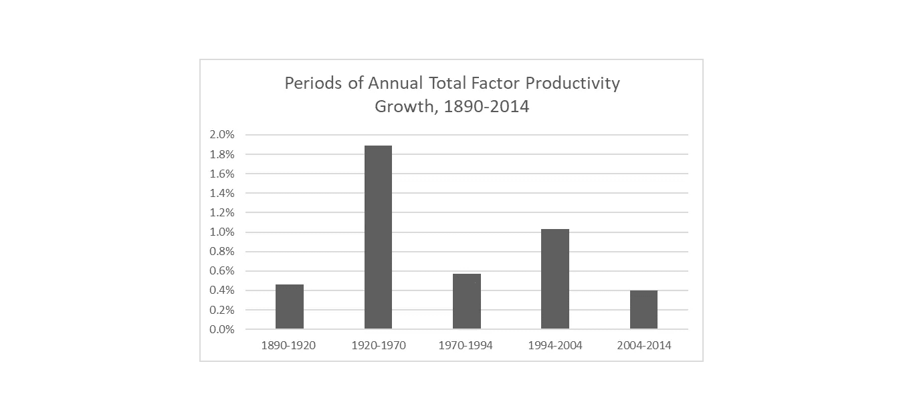

# 为什么二十世纪的资本主义是一种历史异常现象(也是一种危险的现象)

> 原文：<https://medium.datadriveninvestor.com/why-twentieth-century-capitalism-was-a-historical-anomaly-and-a-dangerous-one-too-17e5e81d14fe?source=collection_archive---------4----------------------->

Adam Smith, the father of capitalism (Creative Commons)

如果你需要技术如何快速改变现代社会的书面证据，看看 20 世纪 90 年代末的电视就知道了。许多定义我们时代的趋势都是从那时开始的。真人秀。文化战争。超精英政治。互联网。看到这些趋势在变异、交叉融合并扩展到我们生活之前的样子，可能会令人震惊。排队等候《T2》的一集《宋飞传》或《T4》【X 档案】或*吸血鬼猎人巴菲*，其中一个角色(我忘了是谁，也没在意去找出答案)曾经告诉我们，“你知道去年*发送的电子邮件是普通邮件的两倍*吗？”

如今，我们收到的电子邮件可能比信件多几百倍。至少在 20 世纪初，技术变革似乎有一种魔力。这是指数增长的魔力。技术在过去发现的基础上不断发展、综合和复合，并越来越深入地应用于社会结构和个人生活。

像未来学家雷·库兹韦尔这样的作家甚至认为，技术的指数增长是人类文明的一个基本特征，植根于人类理性本身。原则上，随着人类继续其无限向上的轨迹，人类可以期待实现真正的技术“奇点”，如强大的人工智能、数字甚至生物、不朽和其他神一样的潜力。[【1】](#_ftn1)

当然，这类预测的问题在于，它们只能被解释为纯粹的猜测，至少在不久的将来是这样。与指数复利的情况不同，在指数复利的情况下，货币在大量和高度抽象的水平上运行，过去一个世纪左右的人类历史样本规模太小，以至于没有理由将指数属性应用于我们观察到的技术变革。

将指数增长应用于技术，似乎或多或少在逻辑上导致了类似技术奇点概念的结果，这一事实实际上意味着整个想法更像是科幻小说，而不是严格的哲学或历史反思。然而，我想说的是，这种逻辑助长了新自由主义经济意识形态，这种意识形态影响了我们的公共政策，并激发了我们的政治共识。

这种逻辑并非无害；事实上，我认为这非常危险。要知道为什么，我需要列出为什么我们应该高度怀疑这种逻辑，以及它导致的技术乐观主义的理由。新自由主义意识形态在经历了一个多世纪非凡的技术变革之后，已经获得了巨大的声望，并在许多方面成为我们政治的常识。因此，举证责任通常由质疑者承担。在未来几十年的某个时候，这一负担必须转回新自由主义。

# 新自由主义背后的技术逻辑

在讨论对新自由主义持怀疑态度的理由之前，让我先概述一下我提到的这一逻辑。该论点通常类似于以下内容:

*   资本主义有一些独特的属性，这使得它比任何其他已知的经济安排形式更具活力、创新性和财富创造能力。这些属性包括利润动机、竞争、分散决策和个人选择自由
*   虽然这一主张的理论基础可能会在抽象的哲学讨论中受到质疑，但资本主义不需要这样的结论性辩护，因为二十世纪的历史证明了它的真实性。资本主义国家在创新方面要成功得多，其结果是财富的普及和生活水平的提高。
*   这一证据表明，进一步改善每个人的社会和经济状况的关键是通过放松管制、取消政府再分配做法以及将自由市场机制应用于我们社会中的所有经济活动来释放资本主义固有的价值创造能力。
*   虽然由此产生的经济不平等可能会让我们恼火，但最终我们所有人都会从中受益，因为众所周知，水涨船高。

鉴于大多数精英政治和新闻人物对待上述逻辑的正统性，很难责怪普通公民认为这种观点在经济学家和其他专家中得到广泛认同。但事实上，许多严肃的经济学家不再相信这一点，尽管他们可能仍然认为资本主义是近期的最佳选择。[【2】](#_ftn2)

关于这个话题已经有了很多著作，但对上述逻辑的基本回答很简单:二十世纪的时间跨度太短，不足以证明新自由主义所宣称的那种必胜主义。

如果我们发现资本主义在 20 世纪表面上的成功可以通过除了其假定的内在属性之外的其他解释来解释，那么政治经济可能性的整个另一个世界——如社会民主和绿色政治——突然再次成为公开辩论的话题。事实证明确实有这样的解释，而且非常有力。

正如我们将看到的，资本主义，而不是推动二十世纪财富和生活水平的爆炸，更像是其他更基本原因的有效中间人，如人口增长和一系列划时代的技术。虽然这可能是那个特定时代最有效的安排，但今天显然不再如此。

# 资本主义——只是中间人

让我们从一点重构开始。经常听到有影响力的人谈论现代时代，认为它基本上是一个或多或少的整体历史时期，从工业革命时期开始，从那时起，经济和社会发展一直处于绝对上升的轨道上。但大多数经济史学家不再相信这个故事。相反，他们认为自 18 世纪后期以来的时期有几个不同的时代，可以根据技术变革、政治发展和经济安排来划分。

我们生活的这个时代可能始于大约一百年前。然而，我认为，过去一百年包含了两个不同的时代，一个始于二十世纪的头几十年，另一个始于罗纳德·里根和现代新自由主义意识形态的崛起。我来解释一下这个历史框架背后的思路。

越来越多的学者开始认为，现代社会涉及的不是一次，而是三次工业革命。实现这一目标的方法之一是研究一种非常具体的生产率统计方法，即所谓的全要素生产率(TFP)。

全要素生产率衡量在教育(例如，工人培训和获得其他相关技能)和资本(例如，制造能力、指定工作空间、设备等)方面取得社会收益后工人生产率的增长。)都打折了。因此，它被认为是衡量技术进步对特定社会经济生产力贡献的最纯粹的标准。这也是一种倾向于密切跟踪生活水平真实增长的指标，迄今为止，它比国内生产总值(GDP)或标准工人生产率指标等其他经济增长指标表现更好。

当我们关注这一指标时，一个非常不同的经济史版本开始出现。我想特别关注罗伯特·j·戈登最近的工作。[【3】](#_ftn3)戈登的工作基于学术经济史中一个现在相当主流的观点，即把现代资本主义时代分解为至少三次或多或少不同的工业革命，所有这些革命都是由某些非常强大的技术的发展推动的。

第一次工业革命(IR #1)发生在 1770 年至 1820 年间蒸汽机和其他技术发明之后。第二次工业革命(IR #2)催生了一系列非凡的财富扩张技术，带来了全要素生产率(TFP)增长和生活水平提高的 50 年大爆炸(1920-1970)。第三次工业革命(IR #3)涉及最新的信息技术发展，持续时间短得多，也不太活跃。[【4】](#_ftn4)

戈登研究了 1890 年至 2014 年五个不同时期的全要素生产率增长。其中三个时期的年均生产率增长相对温和:1890 年至 1920 年(. 46%)、1970 年至 1994 年(. 57%)和 2004 年至 2014 年(. 4%)。[【5】](#_ftn5)然而，IR #2 和 IR #3 之后的时期，年均全要素生产率增长明显更高。

Source: Robert J. Gordon, **The Rise and Fall of American Growth** (2016)

特别是，第二次工业革命之后的时期(1920-1970)见证了令人难以置信的年生产率增长(1.89%)。戈登认为，考虑到所涉及的技术类型，以及它们所产生的大量应用，这并不奇怪。电网。灯泡。室内管道。内燃机。电话。空调。医学上的重大进步。州际公路系统和商业航空运输。工业农业和合成肥料。这个清单还在继续。

戈登认为，IR #2 影响了“几乎整个人类的需求和需要，包括食物、衣服、住房、交通、娱乐、通信、信息、健康、医药和工作条件。”[【6】](#_ftn6)考虑到人类的生活条件是多么的贫困，以及大量的技术介入其中，在这一时期，生产力飞速发展，财富、经济增长和生活水平都得到了极大的提高，这就不足为奇了。

另一方面，IR #3 之后的时期不那么引人注目，其对真正人类福祉的实际影响也不那么令人印象深刻。个人电脑和互联网确实提供了一个相对短暂的时期(1994-2004 年)显著更高的生产率增长(1.03%)，但与 IR #2 带来的长寿和彻底改变的人类环境相比，它远没有那么令人印象深刻。[【7】](#_ftn7)

自那以来，生产率增长一直处于相对停滞状态(0.4%)，戈登预测，从长期来看，发达经济体的生产率增长甚至会更低。生活水平的提高与全要素生产率的趋势非常接近。大约到 1970 年，真实进步指数(true Progress Indicator)相当接近 IR #2 时代 GDP 的爆炸式增长，该指数跟踪经济表现以及更广泛的福祉指标，如贫困、犯罪、健康、环境和教育。然而，自那以后，它逐渐落后于 GDP 的增长——在这一点上相差甚远——在 1980 年左右达到峰值，此后一直停滞不前，尽管 IR #3 的生产率增长本应导致生活水平的一些改善。[【9】](#_ftn9)在许多方面理解过去四十年的历史取决于解释这一事实。

# 摘下低垂的果实后

S o 发生了什么事？生产率以及随之而来的经济持续增长，尽管不如 IR #2 时代强劲；然而，生活水平仅略有提高。生活水平的提高是如何脱离 GDP 增长的？从本质上来说，随着 TPF 相对较小的收益，经济通过引入更多的工人进入经济，通过迫使工人为停滞的工资工作更长的时间，以及通过外包国外的廉价劳动力而继续扩张。[【10】](#_ftn10)

尽管几乎所有发达国家都试图通过更多地接纳女性和少数族裔工人以及通过宽松的移民政策来增加总工作时间，但许多欧洲国家的人均年工作时间从 1973 年到 2006 年减少了 400 小时。同一来源估计，2000 年美国人的年工作时间仅减少了 32 小时，而且由于最近的经济衰退，仅比早期水平减少了 78 小时。

然而，Juliet Schor 认为这些估计大大夸大了工作时间的实际下降。当这一指标考虑到兼职和自营职业时，结果是美国工人现在比 1973 年平均每年多工作 204 小时。虽然家庭收入确实略有增加，但这只是因为工作时间的普遍增加和女性劳动力市场参与率的大幅提高。[【12】](#_ftn12)正如我们所见，自 1980 年以来的几十年里，工资中位数基本上停滞不前。[【13】](#_ftn13)

所有这些在很大程度上解释了为什么美国的 GDP 水平比大多数欧元区国家高得多，尽管相比之下美国的生活水平较低。美国商业和政治机构主要依靠各种严厉的方法迫使工人继续工作更长时间，而工资却没有任何实质性的增长(例如，破坏工会的法律和实践，攻击公共医疗保险选项的扩展)，而不是人们认为美国资本主义拥有的任何假定的活力和创新。

是的，随着数字革命的到来，生活质量当然有所提高。但是，相对于前几代人所目睹的人类状况的巨大变化，这些进步相对来说是微不足道的，主要是在便利性和更容易获得消费品方面的进步。

这个时代产生的财富都去了哪里？本质上，这些钱都流向了超级富豪和更便宜的消费品。

美国的实际人均 GDP 从 1981 年的 28，500 美元左右增长到 2011 年的 51，000 美元。然而在同一时期，美国国内生产总值中用于消费品的比例从 60%上升到 69%。[【15】](#_ftn15)1986 年，美国的高中比购物中心还多；到 2005 年，购物中心的数量是高中的两倍。美国在珠宝、鞋子和手表上的花费超过了高等教育。[【16】](#_ftn16)自 20 世纪 70 年代以来，新房的平均面积几乎翻了一番，从 1350 英尺增加到 2500 英尺(50 年代是 950 英尺)，尽管事实上家庭越来越小。这种消费大部分是由中上阶层和富人完成的，他们几乎攫取了过去四十年间创造的所有财富。[【18】](#_ftn18)

另一方面，对绝大多数美国人来说，几乎没有任何证据表明他们的幸福有任何有意义的改善。从 1948 年到 1973 年翻了一番的实际家庭收入中值自 1980 年以来几乎没有变化，尽管夫妻每周工作的总时间已经显著增加。[【19】](#_ftn19)随着退休、住房、医疗保健、儿童保育和大学费用的飙升，公共支持和再分配政策继续缩减——即使经济不平等性急剧上升。

更广泛的社会趋势反映了这种停滞。我们可能会回过头来看我们的父母和祖父母，他们被剥夺了我们目前的环境所赋予我们的生活方式，然而没有任何证据表明我们比他们更幸福。对主观幸福感的自我评估显示，至少自 1972 年以来，自我评估幸福的趋势几乎没有改变。[【20】](#_ftn20)

# 不可避免的不平等？

在这一点上，我一直在讲的故事可能听起来像是马克思主义的阴谋论。所有这些的明显含义是，富人和权力劫持了美国的政治经济，使其极度不平等和不公正。上层阶级的成员对经济有如此大的影响力——并密谋如此之多——真的可信吗？

嗯，是也不是。是的，我确实相信富人和权力在过去四十年的经济发展中有相当大的影响力。一方面，这很有可能是不可避免的。

这是因为，即使在戈登对技术发展的分析之外，二十世纪历史上的一些独特动力也允许那个世纪的经济发展的好处在异常广泛的人口中传播，导致了不同寻常的经济平等水平。但是，当这些独特的动力开始减弱时，作为人类历史大部分特征的经济不平等的自然趋势开始重新出现。为了证明这一点，我需要快速浏览一下托马斯·皮凯蒂的作品。

皮凯蒂的《21 世纪的 T4 资本》的核心分析工具是他所谓的资本/收入比率。这就是给定社会在给定年份的 GDP 与其总财富的比率。纵观人类历史，这一比率的动态为我们最近的过去和未来提供了一些强有力的见解。

皮凯蒂分离出的第一个动态是，当全球生产总值高增长时，社会中的经济不平等倾向于减少。出现这种情况的原因有很多，而且通常都是特定的情况。对劳动力的需求越来越大，需要为这些工人投资新技能。典型地，正如二十世纪的情况一样，更高水平的 GPD 增长是由新技术的引入产生的。这些技术往往会对社会结构产生巨大变化，增加社会和经济流动性。最后，这些新技术无一例外地从上到下扩散到整个社会，最终改善了每个人的生活、健康和生产力。

因此，推动 20 世纪增长的大量新技术不仅推动了经济增长，也极大地增加了人口数量。上个世纪全球 GDP 增长的一半是由于人口增长。鉴于全球人口在 20 世纪增长了五倍，经济增长也飞速增长也就不足为奇了。

让我们注意一下资本主义所谓固有生产率的神话。如果皮凯蒂和戈登是对的，资本主义并没有在二十世纪创造经济发展和平等的爆炸。更确切地说，是泰勒·考恩(Tyler Cowen)所说的技术“低垂的果实”的大量涌现推动了这一切。

资本主义首先提供的是以极快的速度开发 IR #2 非凡技术潜力所必需的流动性，从这个意义上说，它可能是那个技术时代比共产主义更兼容的政治经济学方法。这种情况是否仍然存在尚不清楚。

没有了 IR #2 后的均衡动态，经济不平等性急剧上升，而生活质量标准、实际家庭收入和经济流动性却停滞不前。尽管共产主义可能仍然是错误的选择，但有充分的理由表明，现在应该通过政府的再分配来积极追求公共利益。但一个有悖常理的现实是，资本/收入比率的动态变化使得越是迫切需要这一点的时候，这种可能性就越小。

根据皮凯蒂的说法，这是因为随着 GDP 增长放缓，资本/收入比趋于扩大。就其本身而言，这一发现不一定是倒退的，因为像收入一样，资本所有权可以想象地以高度平等的方式进行分配。然而，皮凯蒂表明，情况几乎从来不是这样。资本所有权总是比收入分配更不平等，这似乎是人类状况的一个基本“规律”。用皮凯蒂的话来说，“我们发现，在所有有数据可查的国家的所有时期，都存在这种(资本所有权更加集中的)规律性，无一例外，而且这种现象的规模总是相当惊人。”[【23】](#_ftn23)

这一事件的后果是可以预料的。在 1970 年后的几年里，那些控制资本的人将利用他们日益增长的经济实力和随之而来的政治影响力，不断将投资重点和公共政策的应用转向维持高利润率、投资回报和 GDP 增长，而很少考虑增长在社会福利和可持续性方面的实际质量。

政治领导人在很大程度上是该项目的同谋，他们认为较高的 GDP 增长水平是低失业率和以某种形式继续扩大政府服务的必要条件。但正如我们所看到的，结果仅仅是大多数人的经济财富停滞不前，而富人，以及在较小程度上的上层中产阶级，看到他们的经济状况继续改善——就富人而言，相当显著。

# 你不能回头——尝试只会让事情变得更糟

说得清楚一点，我并不是说应该放弃基于市场的政治经济。市场及其构成价格机制是传递经济价值信息的最有效方式之一，而在家庭层面，市场鼓励的个性化判断更为合适。

然而，我想说的是，二十世纪的独特环境赋予了这种形式的经济安排远远超出其应有的声望。这造成了一些不幸的政治后果——这些后果一直延续到今天。

最明显的后果是给了新自由主义政客和政治思想强大的道德力量。特别是在冷战超级大国竞争的背景下，共和党一直能够声称他们支持去监管化、供应学派和将不受约束的自由市场竞争应用于社会的方方面面是站在历史正确的一边。主张适度再分配和有效社会安全网的模糊左翼分子被视为历史无知，他们的良好意图最终导致他们天真地破坏了只有不受约束的资本主义才能提供的长期利益。

这不仅仅是政治辞令的问题。它支撑了一场强有力的知识运动——一场支撑整个运动保守系统的运动——这场运动现在比以往任何时候都发展得更好，更有说服力。自由主义的政治思想曾经围绕着个人主义的财产权理想，比如罗伯特·诺齐克和安·兰德，他们在公共利益方面的缺陷相对明显。

现在，当前的中右翼政治思想家，如迪尔德丽·麦克洛斯基、杰森·布伦南、彼得·泰尔和约翰·托马西，最近开始称自己为铁石心肠的自由主义者——言下之意是，他们对自由主义政治经济的支持完全是因为他们相信自由主义政治经济在社会经济上优于社会民主经济安排。事实上，托马西相当出色的新书明确利用了大自由主义哲学家约翰·罗尔斯(John Rawls)自己的《正义原则》(principles of justice)来捍卫一种激进的自由主义政治经济哲学。[【24】](#_ftn24)

其结果是，即使现代资本主义横行无忌——产生荒谬程度的政治经济不平等，同时迫使工人和穷人接受充其量是经济和社会停滞，并一直依赖不可持续的资源消耗和对地球气候和生态系统的破坏——其他潜在的更公平和可持续的政治经济可能性也被挤出了公共话语的议程。

从本质上讲，我在这里并不是说资本主义不值得在公共领域占有一席之地，而是说，事实证明，资本主义的成功并不像人们普遍认为的那样引人注目。对其有利的压倒性偏见根本不再合理。因此，应该更加积极地尝试重新评估其他经济安排和政策。我个人对探索绿色的、社会民主的、地方性的和参与性的经济安排很感兴趣，但原则上我对任何可行的方法都持开放态度。(肮脏的秘密:我是罗伯特·诺齐克的无政府主义、国家和乌托邦的超级粉丝。)

我们现在生活在这样一个世界里，尽管拥有近乎神圣的技术能力，但与以前的时代相比，绝大多数人的能动性比以往任何时候都要小——如果我们所说的能动性是指作为我们个人自由的表现而影响我们的社区和环境的能力的话。

简而言之，也许在整个 20 世纪 90 年代，全球主义政治经济秩序被视为人类自由最终救赎的曙光。弗朗西斯·福山声称，历史已经终结。但越来越清楚的是——随着一度被认为已经完全不可信的右翼政治运动开始席卷西方世界——事实并非如此。

这些运动——不管其种族主义、性别歧视或神权政治框架如何——最终都是由左翼、右翼和中间派无能为力者共有的直觉所驱动的:失去了代理感。一种我们无力控制我们所生活的世界的感觉。

随着这个世界在全球资本主义的要求下，日益走向不可持续和全球变暖，这种失控将使我们远远超出机构和生活水平的侵蚀。对数十亿人来说，这将很快成为一个生存问题。如果我们现在担心政治右翼的复苏，那就等着看这几十亿人开始作为气候难民集体来到我们的社区吧。

多年来，我们一直被告知资本主义是生金蛋的鹅，是自由、财富和发展的引擎。我们所需要的就是解放它去做它的工作。我们现在知道这种观点是错误的——或者至少是严重误导。

【雷蒙·库兹韦尔】*【奇点临近:当人类超越生物学*】，(纽约:维京出版社，2005)。

[【2】](#_ftnref2)罗伯特·m·瓦普莱斯(Robert M. Whaples)，《经济的未来:导论》，*独立评论*，20，第 3 期(2016 年冬季)，325–34:[http://www . Independent . org/pdf/TIR/TIR _ 20 _ 03 _ 01 _ wha ples . pdf .](http://www.independent.org/pdf/tir/tir_20_03_01_whaples.pdf.)

[【3】](#_ftnref3)罗伯特·j·戈登(Robert J. Gordon)，*美国增长的兴衰:内战以来的美国生活水平*，(普林斯顿:普林斯顿大学出版社，2016)。

[【4】](#_ftnref4)同上，319–320 ff，574ff。

[【5】](#_ftnref5)同上，第 575 页。

[【6】](#_ftnref6)同上，第 320 页。

[【7】](#_ftnref7)同上，575 页

同上，第 579-604 页，第 641 页及其后各页。

[【9】](#_ftnref9)Rob Dietz 和 Dan O'Neill，*适可而止:在一个资源有限的世界里建立一个可持续的经济*，(三藩市:Berrett-Koehler 出版社，2013 年):第 119 页。

[【10】](#_ftnref10)沃尔夫冈·施特雷克，*争取时间:民主资本主义的延迟危机*，(纽约:Verso，2014)。

朱丽叶·舒尔(Juliet Schor)，*《真正的财富:数百万美国人如何以及为什么正在创造一种时间充裕、生态轻便、小规模、高满意度的经济*》，(纽约:企鹅图书公司，2011 年):105，166–67 页。

[【12】](#_ftnref12)斯特雷克(2014)，53。

约翰·德格拉夫、大卫·万恩和托马斯·h·奈洛尔，《富裕:过度消费如何杀死我们——以及如何反击》，第三版。，(旧金山:伯瑞特-克勒出版公司，2014 年):38 页。

[【14】](#_ftnref14)圣路易斯美联储银行。资料来源:美国经济分析局。(访问时间:2016 年 7 月 15 日):[https://fred.stlouisfed.org/graph/?g=hh3.](https://fred.stlouisfed.org/graph/?g=hh3.)

[【15】](#_ftnref15)美联储圣路易斯银行。资料来源:美国经济分析局。(访问时间:2016 年 7 月 15 日):[https://fred.stlouisfed.org/graph/?g=hh3.](https://fred.stlouisfed.org/graph/?g=hh3.)

[【16】](#_ftnref16)德格拉夫等(2014)，15。

[【17】](#_ftnref17)同上，19。

[【18】](#_ftnref18)马修·史都华(Matthew Stewart)，《百分之九点九是新美国贵族》，*《大西洋》*，2018 年 6 月(访问时间:2018 年 9 月 9 日):[https://www . thealantic . com/magazine/archive/2018/06/The-birth-of-a-New-American-birthy/559130/](https://www.theatlantic.com/magazine/archive/2018/06/the-birth-of-a-new-american-aristocracy/559130/)；参见托马斯·皮凯蒂，《21 世纪的资本》(剑桥，麻省:哈佛大学出版社，2014 年)。

[【19】](#_ftnref19)马丁·福特，*机器人的崛起:技术和失业未来的威胁*，(纽约:基础图书，2015): 35。

[【20】](#_ftnref20)wha ples(2016)，330。

[【21】](#_ftnref21)皮凯蒂，(2014)，1–11。

[【22】](#_ftnref22)同上，第 244 页。

[【23】](#_ftnref23)同上，244 页。

[【24】](#_ftnref24)参见，例如，托马西的*自由市场公平*，(普林斯顿:普林斯顿大学出版社，2012 年)。