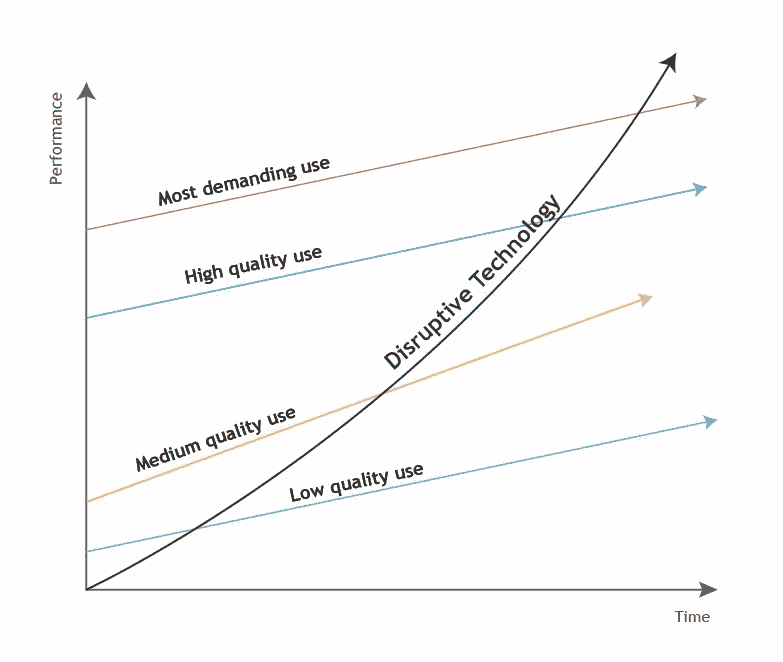

# 颠覆性创新:为什么优步没有颠覆性，而网飞有

> 原文：<https://medium.datadriveninvestor.com/why-uber-isnt-disruptive-but-netflix-is-disruptive-innovation-explained-198d250f4db0?source=collection_archive---------1----------------------->

[www.itonics.de](http://www.itonics.de)

颠覆性技术挑战那些创新速度不够快的行业领导者。它们可以摧毁现有的模式，改变整个行业。特别是像**北电网络、Grundig、Blockbuster、宝丽来、柯达**或 **Myspace** 这样的大型老牌公司不得不亲身经历这些。然而，在取得巨大成功之前，新技术往往被大型行业参与者低估。

术语**“颠覆性创新”**最早是由哈佛商学院的 Clay Christensen 教授提出的。这个术语被证明是思考创新驱动型增长的一种令人信服的方式。人们开始在全球范围内使用“颠覆性创新”一词，但颠覆的含义经常被许多人误解和误用。那么这个广为人知的流行语背后的原始理论是什么呢？是什么让网飞陷入混乱而优步没有？

## 破坏性创新理论

克里斯滕森的理论认为，每一家成功的老牌公司总有一天会被一家革命性的新公司超越和威胁。在每个市场，顾客的偏好都各不相同。一些客户可以满足于非常基本的性能水平，而另一些客户则非常苛刻，只有在技术达到非常高的性能水平时才会感到满意。颠覆性的小公司以非常低的绩效进入市场，但很快他们的绩效就会提高，并进入高端市场。

在中断周期的开始，大多数其他市场参与者认为新的创新不够好，但对于那些需求较低的客户来说似乎足够了。特别是，较低的价格，易于操作或以前的行业参与者没有提供的利基功能，使未知的产品或服务对新创建的客户群特别有吸引力。从已确立的行业领导者的角度来看，新技术仅仅是来自无足轻重的竞争对手的不够成熟的原型和商业想法。他们自己的目标群体对新优惠的需求被忽略，日常业务照常进行。然而，颠覆者从底层起步，向高端发展，甚至设法满足最苛刻客户的需求。克里斯滕森认为，颠覆是保持市场长期生存并不断发展的必要过程。

## 为什么优步没有破坏性，而网飞有

克雷·克里斯腾森教授解释了他的理论，他举了一个例子来说明为什么网飞具有破坏性，而 T2 优步没有。根据他的理论，颠覆性业务在低端市场获得了立足点，而这些低端市场被老牌公司所忽视，这些公司更关注有利可图的客户。另一方面，颠覆者必须建立一个全新的市场，把非客户变成客户。优步的情况不适用于这两个假设；它的目标是已经使用出租车服务的人，并没有创造一个全新的市场。根据克里斯滕森的说法，真正的颠覆性业务始于低质量的产品，然后通过提高质量最终覆盖主流市场。他指出，优步也不符合这个条件。

同时，作者给出了网飞作为一个典型的颠覆性企业的例子。最初的网飞邮件订阅服务对百视达的主流客户来说并不具有吸引力，他们“按需”租借新的发行版本。网飞只吸引了那些不关心新电影的人，那些 DVD 机的早期用户或者网上购物的人。从理论上讲，这是一种颠覆，因为网飞瞄准了被其竞争对手忽视的人群，以更低的价格提供了一种劣质(但更具针对性)的替代产品。最终，网飞通过增加主流消费者想要的东西，进入了高端市场。然后有一天，再也没有理由用百视达了。

## 不仅仅是一个流行词

行业巨头专注于**增量创新**，升级现有产品以吸引更高付费的客户。他们开始通过添加没人愿意花钱购买的花哨功能来使产品变得过于复杂。在某些时候，大公司会忽略那些只想要简单低价替代品的客户。颠覆者为那些想要简单替代品的人开发了基本产品。与此同时，颠覆者改进其产品并向高端市场进军。很快，颠覆者接管了市场。

. . .

*原载于*[https://www . itonics . de/2018/08/beyond-the-buzz word-disruptive-innovation-explained/](https://www.itonics.de/2018/08/beyond-the-buzzword-disruptive-innovation-explained/)