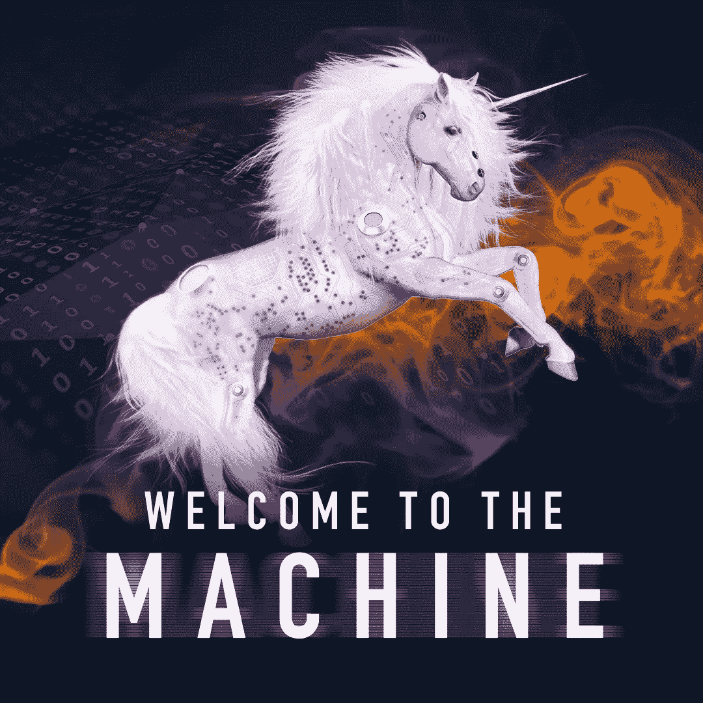

# 为什么我用独角兽来描绘营销人工智能

> 原文：<https://medium.datadriveninvestor.com/why-use-a-unicorn-to-depict-marketing-ai-a247cc24fd85?source=collection_archive---------6----------------------->

The cover art for my forthcoming book Welcome to the Machine: A Primer on AI for Marketers

一些人问我为什么在*欢迎来到机器*封面上用独角兽来描绘营销人工智能。答案很简单。虽然和其他人一样，我认为[人工智能将融入大多数营销人员的日常任务](https://www.theverge.com/2019/1/28/18197520/ai-artificial-intelligence-machine-learning-computational-science)，但关于营销人工智能有一个清晰而明显的炒作曲线，这将让许多营销人员失望。

人工智能，或者更好地描述为机器学习，已经在营销部门扩散了许多小任务。从聊天机器人和分析警报到我们各种广告、营销和社交媒体平台中的建议，人工智能在外联方面不断改进。

机器学习将继续成为我们日常营销任务的一部分。它将变得如此普遍，以至于一个被广泛讨论的恐惧——因为人工智能而失去工作——在一定程度上是真实的。如果营销人员没有接受算法机器学习的影响，并且没有学会如何使用它，那么人们可以假设他们的技能很快就会过时。

更年轻、更灵活、愿意支持、提高和改善人工智能工作的同事将被选中担任新的工作和晋升。在最糟糕的情况下，更年轻、更懂人工智能的员工将保住自己的工作，而拒绝适应人工智能的年长、更昂贵、更不灵活的同事将发现自己在找工作。

我不认为这种失业是人工智能独有的现象。相反，这是一个历史性的问题，在技术创新的每个时代都影响着所有的职业。

> “每一代人都有 20%到 30%的传统工作消失，”作家兼全球营销负责人 Seth Godin 在为该书接受采访时说。“这已经持续了一百年了。挖沟工人害怕蒸汽铲，但有些人想出了如何成为蒸汽铲操作员，打卡打字员害怕终端，但有些人想出了如何成为程序员。”

就像之前的 Web 2.0 社交媒体浪潮一样，营销人员需要关注并接受机器学习驱动的技术。我写了*欢迎来到机器*来帮助我自己和其他在职业生涯中建立的营销人员理解和拥抱人工智能。

尽管如此，有用算法的存在已经变成了各种夸大的承诺和戏剧化的恐惧。因此独角兽。营销人员需要睁大眼睛关注机器学习。这里是我听到的关于营销人工智能的三个最大的神话。

## 误区一:每个营销平台都有 AI 在里面

It’s hard not to fall for a unicorn (my daughter Soleil at age 5)

第一批看到人工智能价值的营销人员是那些销售营销工具的科技公司人员。你可以在他们推给你的每封电子邮件、广告、网页和宣传材料中看到炒作曲线，特别是如果你以任何方式参与购买营销技术或广告的话。

这些技术真的是用 AI 服务市场的吗？或者他们已经创建了一个软件程序，使用他们所有客户的数千甚至数百万个数据点来为你提供一个简洁的应用程序？像 Grammarly 和 Scoop.it 这样的内容营销技术浮现在脑海中[披露:本文用 Grammarly 进行了验证]。

当然，你可以将人工智能定义为使用算法来处理数据，并提出行动建议..例如，人工智能增强的营销工具可能会建议发送电子邮件或复制基本任务(如在社交网络上跟踪某人)的最佳时间。这些小的机器辅助任务存在于大多数平台中。

因为这些技术而宣传你的品牌使用人工智能有点，嗯，不真诚。这有点像说你有一个社区驱动的企业，因为你的公司让人们对你的商业脸书页面发表评论。当然，这些应用程序为机器学习提供了很好的介绍，并节省了大量时间，但这不是为你的企业营销人工智能。

> “人工智能分析数据，做出假设，学习并提供人类无法复制的规模和深度的预测，”Alexandre Gonfalonieri 在他最近的媒体文章“[中说，“真的是人工智能吗？](https://medium.com/predict/is-it-really-ai-between-the-hype-cycle-and-real-ai-8fc65ddd292d)’”

强人工智能将利用整个企业的大部分(如果不是全部)数据集来提供重要的见解、建议和行动，以更好地与客户互动并为客户服务。这些变化将为营销项目提供增量增长，并在一些情况下实现突破，而仅靠人力是不可能的。

充分认识到，营销人工智能代表了一个巨大的变化，将真正改变一个公司接近客户和营销自己的整个方式。要实现这一目标，除了主要的技术实现之外，还需要大量的提升。考虑将受到影响的许多文化流程和方法，以及品牌如何找到、清理和利用企业范围的数据。大多数品牌只是没有他们的数据(是的，这是神话 2)。

*在什么是可能的背景下，今天由 martech 公司向企业出售的营销人工智能革命——在大多数情况下——是一个骗局。*实际上，你会看到营销程序在其软件中使用预测分析或简单的算法脚本(比如社交媒体机器人)。这些营销技术被过度宣传为人工智能，以迫使购买。

对于营销技术买家来说，这应该是一个危险信号。可能会出现独角兽。

**建议:**深入挖掘，寻找隐藏的东西。查看是否部署了简单的程序，或者系统是否利用您的全部客户数据来提供更强大的分析和结果。

## 误区二:你的公司有足够的数据部署 AI

除非你的公司或组织有先见之明，在其所有平台上创建和维护智能数据治理政策，否则人工智能不会是一件容易的事情。一项成功的人工智能计划需要数量惊人的数据，如此之多的数据会让你惊讶于你的数据科学团队花费了多少时间来获取和清理数据。

也许你的品牌已经为最终挖掘这些数据做好了准备，以产生见解、建议和内容/输出。如果是这样的话，那么您最初的数据治理工作将会使实施变得更加容易，这要归功于预先存在的对数据进行[清理的工作](https://medium.com/datadriveninvestor/eliminating-uncertainty-through-clean-data-337c8555a7c6)。

如果你的品牌像大多数已建立的品牌一样，那么你就有难以置信的大而全异的信息系统，它们彼此之间不能很好地交流。系统范围从 CRM 和产品数据库到营销自动化和烹饪在线访问者的在线数据库。你可能有几十个，如果不是几百个，甚至几千个公司社交媒体账户。就其本身而言，这些数据集代表了为您的机器学习计划准备数月甚至数年的数据。

是的，你可以通过像尼尔森这样的大型媒体公司购买一些数据。你也可以通过政府获取公共数据。但是，您仍然需要将这些信息关联回您的客户，以便您的机器学习算法可以开始训练和学习必要的模式和可能的结果(例如，洞察力)，这是您成功所需的。

对于 B2B 或 B2G 品牌来说，这是一个特别艰巨的挑战。虽然营销人员可以明确转向一些先进的技术，如基于账户的营销(ABM)，以优化他们的线索生成和转化率，但 B2B 品牌可能不仅仅是有足够的数据来部署强大的人工智能解决方案。

想想波音的商用飞机部门在全球有多少客户。数量以百计。几百个客户很少产生几十万个交互来分析。

我的朋友 Andre Yee 是 ABM 公司 [Triblio](https://triblio.com/) 的创始人兼首席执行官，他一直在探索如何将人工智能引入 B2B 市场。

> “B2B 购买周期有很多方面，从 20 到 25 到 35 个有意义的变量，可能会给你一个准确的模型来预测倾向，”安德烈说。“不容易确定下来。这不仅仅是 A-B 测试。你将需要几十万个单独的测试用例，如果不是几百万个的话。如果你没有足够的数据或正确的数据，那么你就会在模型中出现错误和不同的问题，人们称之为模型中的过度拟合或欠拟合。”

有点臭名昭著的人工智能肖像 [Edmond De Belamy](https://www.bloomberg.com/news/articles/2018-10-25/ai-generated-portrait-is-sold-for-432-500-in-an-auction-first) 在拍卖中使用较少的数据点获得了超过 40 万美元。但它确实分析了跨越几个世纪的 10，000 幅广受好评的画像的每个方面，然后创建了一幅人类引导的画像。毫无疑问，干净的肖像数据的水平和质量远远高于正常水平。显而易见的艺术努力工作，以确保用于养活他们的人工智能网络的信息是优越的。

**建议:**考虑你想在你的公司里用人工智能做什么，并检查你已经有的可用数据。在考虑人工智能技术合作伙伴时，要理解这些数据的重要性，如果收集数据不是谈话的中心点，那就逃之夭夭。

**神话 3:人工智能取代营销人员**

我已经注意到，那些未能发展出包括人工智能工具在内的技能的人可能会被取代。这并不意味着营销人员将被人工智能单位取代。相反，他们将被更有能力、更了解现代营销工具的人所取代。

当然，规则也会有例外。获得报酬、喜欢每条提及该品牌的推文的初级实习生将被替换。每周花几十个小时从你的分类数据集中创建仪表板的数据分析师将被取代。

然而，要实现人工智能，你需要一个人来训练它和指导它。绩效需要管理。它需要人类授权新的行动和营销举措，并发送新的查询供人工智能分析。该算法可能需要调整，或完全重写。迭代学习是游戏的名字。

此外，有些技能可能永远不会被机器学习所取代。他们本质上是人类，无视数据分析的基本好处。例如，你可以使用人工智能来帮助建立一个网页，但总是有设计师指导机器学习，指导作者和总体设计来满足品牌的需求。

***营销人工智能研究所的创始人兼首席执行官保罗·罗策尔说:“创造力不会被机器取代。“人类的创造力是独一无二的。策略是机器很难复制的另一套技能。移情、情感，这些都是机器(很难)擅长的特质和技能……也许有一天会发生变化，但现在，这些东西是人类独有的。”***

**在现实中，机器学习通过执行耗时的可复制任务来服务于营销部门。大多数营销人员觉得这样的任务很无聊。以下是人工智能将很快在几乎每个营销商店中执行的一些任务示例:**

****校正视频原始素材中的音频和灯光****

****根据客户的使用模式为他们撰写报告****

****优化电子邮件和社交信息的发送时间****

****分析网站和社交网络数据，确定新的客户机会****

****寻找不同客户群之间的共性****

****校对博客文章、营销报告和新闻稿****

**从现在到世界末日你都可以把无聊的营销任务加到清单里。这些任务是大多数营销人员想要做的，还是他们更喜欢机器学习程序的帮助，以便他们可以专注于他们喜欢的创造性工作？**

**建议:考虑一下你的工作是否是重复性的和基于数据的。如果是这样，考虑向更具创造性和战略性的角色发展，因为你的工作可能很快就会被取代，或者成为机器学习支持的助教。要保持活力，不要逃避机器，要欢迎它。学习如何使用它来使你的营销更好，并成为企业的无价之宝。**