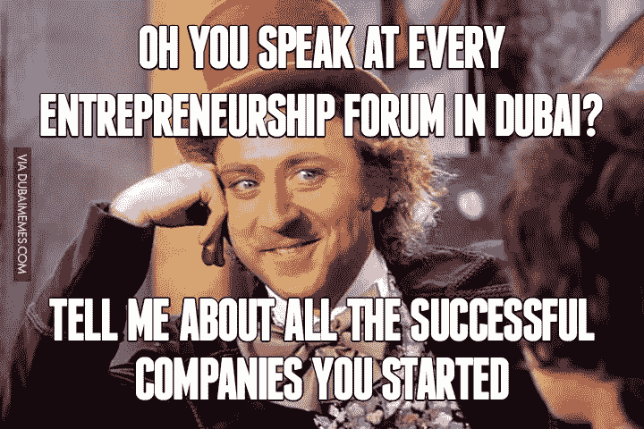
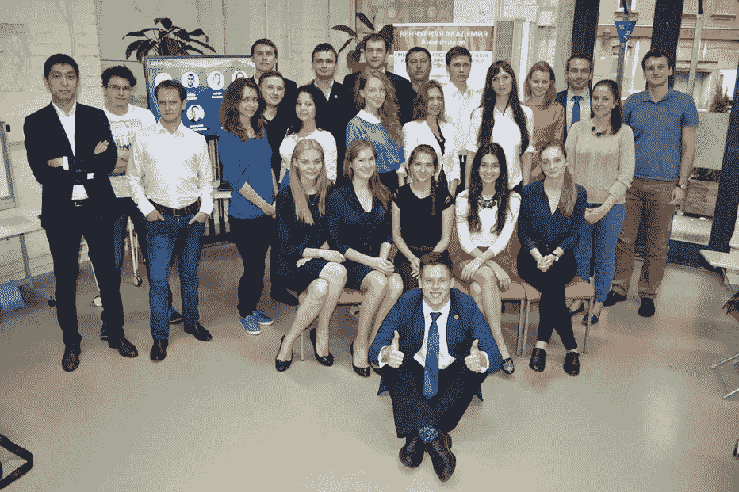

# 为什么风险投资者在寻找潜在的冠军？

> 原文：<https://medium.datadriveninvestor.com/why-venture-capital-investors-are-looking-for-potential-champions-2bfa0b0e5ff8?source=collection_archive---------18----------------------->

*俄文版上* [*电报博客*](http://t.me/asvcme/29)

过去两周，我与 170 多家初创企业进行了交流，只有 5 家进入了投资委员会，我们投资了其中的 2 家。为什么他们更好？

我决定写这篇关于冠军的文章。这就是我所说的能够建立一个价值十亿或更多的公司的企业家。

*为什么风险投资者在寻找潜在的冠军？*

很简单，他们需要那些在 5-10 年内能够成为新细分市场领导者的人，**那些能够创造收入或潜在收入的人，以及那些能够突破许多问题的人:**

理解公司给予消费者的价值；

寻找最快或最便宜的渠道来传递这一价值；

副产品

筹集不明智的资金

组

市场趋势不断变化

竞争对手

其他的

**我想用体育来打个比方。**我是体育大师，2011 年俄罗斯交谊舞副冠军。

small champions dance class(2010)

我和一个女孩跳舞直到 18 岁。当我在索契开始 8 年的时候，那是很艰难的。这个地区没有舞会，所有的舞蹈老师都在莫斯科，费用非常昂贵。45 分钟的课程花费 50-100 欧元，我不得不支付 3 万卢布来缝制一件新的燕尾服。父母的工资大约是 15000 到 20000 卢布，这极大地限制了我的机会。一开始我也这么认为。但是后来我意识到我不需要上 20 节课，每节课 100 欧元，每个月上 1-2 节课就足够了，剩下的时间在大厅里投入独立的工作。在 10 年的舞蹈生涯中，我克服了很多:更换舞伴、受伤、政治等等。但我自己发现了一件事。如果我在 5 年后(当时我和我的搭档在索契甚至不是第一名)或者 7 年后(当时我们在俄罗斯锦标赛中排名第 12)放弃，我们就不会达到我们的目标。

并不是说我想花一分钟谈论我的运动生涯。但与初创企业有一个明显的相似之处。舞蹈是我们的产品，观众的兴奋感是我们的价值，合同和一小时的教学费用是我们的资本。不同的舞蹈演员在职业生涯中或职业生涯结束后，每小时可以挣 500 到 10 000 卢布。

我的舞蹈老师是最好的风险投资家。她把我们聚集在索契各处，挑选出那些能够进入决赛并在大厅里工作了一整天的人，并塑造他们的个性。她在我们身上寻找最好的品质和才能，并开发它们。在某一点上，她意识到我们需要更广泛地发展。她吸引了来自世界各地的 10 多名教练和我们一起工作。

**我的潜在创业冠军清单:**

1.他清楚地了解初创企业的目标；

2.他看到未来 10 年的市场、公司发展、产品和技术，有自己的见解和愿景；

3.他组建了一个团队，能够创造最好的技术、产品和销售——最适合初创企业——他们在自己负责的领域做得更快、更大、更聪明。他们的动机不是为了钱而工作，而是因为他们创建了一家将改变世界的公司，特定人的生活将变得更好；

4.如果不能，他不会放弃。童年时期是初创企业还是音乐学校都无所谓。如果它最初对他来说很重要，但在实现目标的过程中不再获得，他只是决定改变范围，原因取决于他。不要被市场已经不再是创业的事实所迷惑，2018 年你还在创造一个社交网络，因为贴纸比脸书更好；

5.他知道如何找到最优秀的人，激励他们(不要和提高市场工资三倍的动机混淆)并发展；

6.他能够倾听消费者、合作伙伴、导师、竞争对手和其他利益相关者的意见，并将他们的经验用于自己的目的；

7.他已经准备好做很多工作了。即使在他看来，他有一个“完美”的团队，它会自己做所有的事情，他只需要有时被包括在内。请记住，在硅谷或亚洲的某个地方，坐着同一位工作 15-20 个小时的创始人。而且他的团队也不差。

[作](http://asvc.me/about)