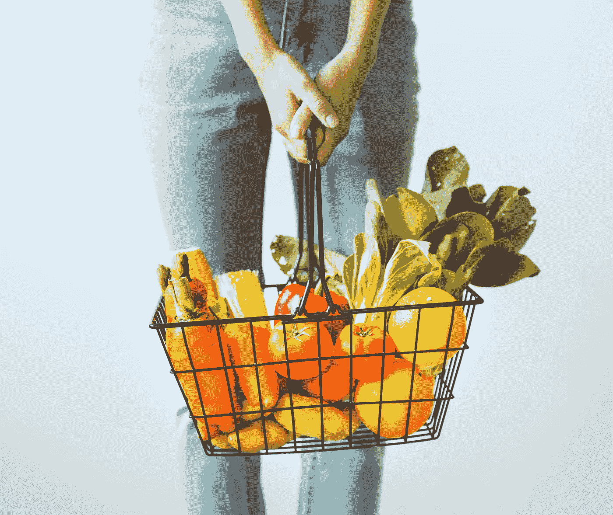

# 沃尔玛为什么选择区块链？

> 原文：<https://medium.datadriveninvestor.com/why-walmart-chose-blockchain-da12064a620f?source=collection_archive---------10----------------------->

如果你还不知道沃尔玛和 IBM 之间的新合作，在我们深入了解区块链的商业利益之前，让我给你一个快速的了解。

沃尔玛已经与 IBM 合作了大约一年，测试并准备实施区块链技术。这将在他们的供应链机制中运作，并使沃尔玛能够几乎立即追踪他们产品的来源。

受此变化影响的所有供应商需要在 2019 年 9 月 30 日前启用此技术。这将减少获取特定产品来源信息所需的时间(从绿叶蔬菜开始)。到目前为止，使用物理分类账，可能需要长达 7 天的时间才能找到产品(比如菠菜——将使用该平台跟踪的首批产品之一)的来源。现在有了新技术，几秒钟就能搞定。

Photo by [rawpixel](https://unsplash.com/photos/VxjZ56owYwM?utm_source=unsplash&utm_medium=referral&utm_content=creditCopyText) on [Unsplash](https://unsplash.com/search/photos/shopping-cart-vegetable?utm_source=unsplash&utm_medium=referral&utm_content=creditCopyText)

显然，这种转变的最终用户结果将是大大减少可供销售的受感染产品的数量。这将使沃尔玛能够快速识别和召回被标记为不适合消费的产品(最大的驱动因素之一是绿色食品中的大肠杆菌)。

那么是什么让区块链如此适合商业用途呢？

**共享总账**

共享分类帐使业务网络中的各方能够共享和访问所有信息。他们可以看到相同的信息，并且所有人都可以看到对网络所做的任何更改。

这是区块链巨大潜力的主要促成因素。它确保了整个过程的透明度，并使沃尔玛能够立即跟踪任何产品链上的确定性。

**隐私**

由于区块链，商业网络中的所有各方(在我们的例子中是供应商、第三方和沃尔玛)都有一定程度的匿名性和数据保护。根据各自的职责，各方都有在区块链中查看或添加条目的权限。

加密的概念是确保隐私的核心。它使数据变得安全、可靠和可验证。这对沃尔玛确保准确和快速的业务运营非常重要。

区块链中的数据是不可变的和最终的。这意味着不能更改单个块。所做的任何更改或添加都显示为附加块，从而创建可追踪的轨迹。

**信任**

交易由相关参与者或验证机构认可和验证。一旦交易被添加和验证，它可以被商业网络的所有成员信任。

这有可能降低审计和法规遵从性的成本。在受感染食品追踪的世界中—减少追踪和召回已被确定为有问题的食品所需的时间。

区块链为企业带来了几个关键好处:

1.节省时间(在沃尔玛，从几天到几秒)

2.降低风险(潜在的错误追踪路径会导致完美食品的召回)

3.在商业网络内创建更强的结合(因为所有交易都被验证；供应商值得信任，并且可以信任沃尔玛)

4.降低成本(寻找受感染的食物可能会很昂贵，如果是长期的话

5.提供对数据的实时访问(记录没有时间延迟)

这是第一个也绝对不是最后一个区块链的真实使用案例。沃尔玛采用新技术的大胆行动将随着时间的推移提供大量有用的信息和数据，并有助于区块链的进一步利用。请在下面的评论区分享你的观点！