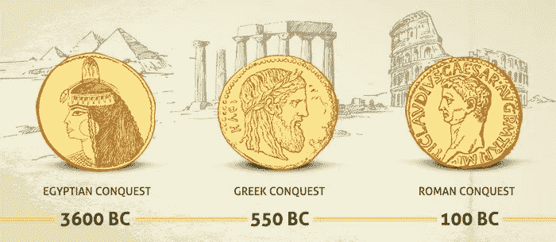
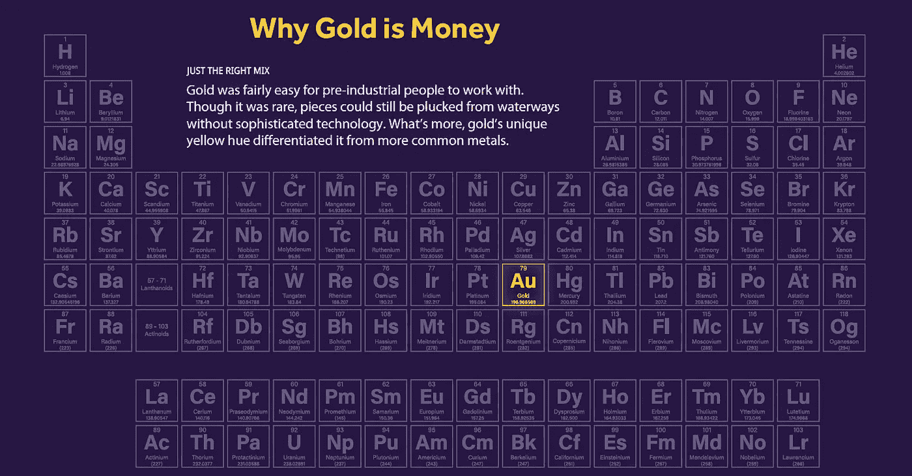
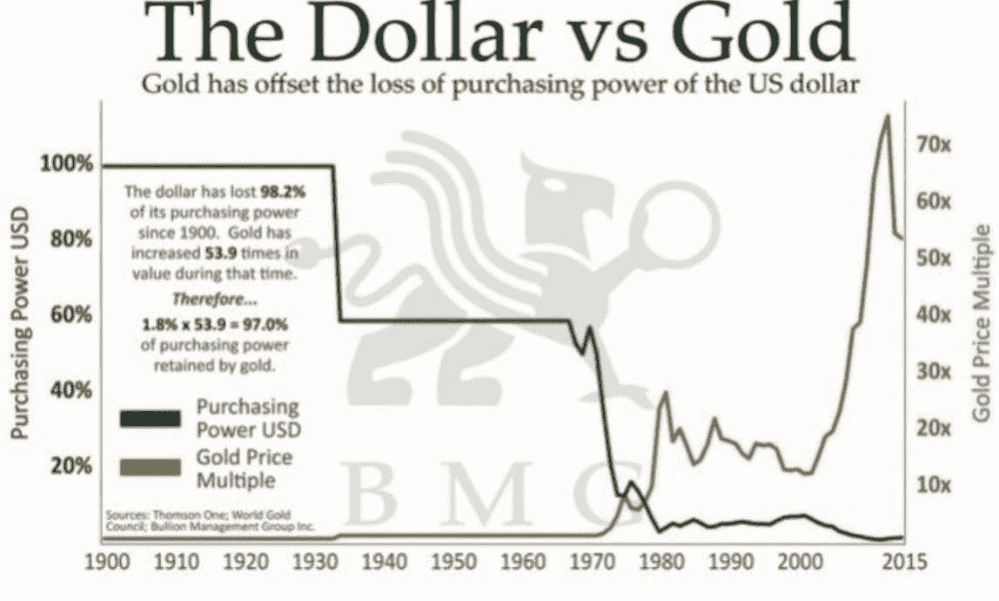

# 为什么黄金在大部分历史时期都是货币的主要形式

> 原文：<https://medium.datadriveninvestor.com/why-was-gold-used-as-money-over-all-other-elements-56fd3f943f84?source=collection_archive---------0----------------------->

Why Was Gold Used As Money Over All Other Elements?

# **简介**

这篇文章是对我的文章《为什么黄金和区块链是天作之合》的补充，可以在[这里](https://medium.com/hackernoon/blockchain-and-gold-a-fruitful-symbiosis-bc0267ef4bb2)找到。

> **这篇文章探讨了为什么黄金是有价值的，为什么黄金在历史上比其他所有元素/金属都更容易被用作货币。**

# **黄金为什么值钱**

作为讨论的开始，重要的是要记住，世界上没有什么东西是有内在价值的。价值是我们作为个体给予某物的东西，比如 100 美元和 1 美元钞票的价值差异*。*

> **黄金已经存在了数万年，历史上一直作为货币使用。这一悠久的历史与黄金的特性相结合，为黄金为何有价值提供了答案。**

## *特殊特性*

黄金的价值在于它的特性。黄金经久耐用，几乎不会被破坏，因为它不会被水(不会生锈)、时间或火破坏。熔化黄金至少需要 1945 华氏度。[【1】](#_edn1)此外，黄金还具有很强的延展性，即:可以压制+捣成各种形状。黄金也是非常稀有的，如果世界上所有的黄金都融化了，它将适合一个奥林匹克游泳池的范围。

## *相对于其他资产的财务优势*

与其他资产相比，黄金还有几个金融优势。*黄金没有时间限制，没有保质期；发现的大部分黄金仍然存在。*黄金也是便携的，可分割的*；与钻石等其他金属不同，分割黄金不会改变其价值。最后，黄金不能被伪造或膨胀；中央银行不能像生产法定货币那样生产黄金。*

# **为什么是黄金而不是其他元素/金属**

使黄金成为比所有其他元素/金属更好的选择的是它上面提到的特殊特性。元素周期表上有 118 种元素。[【2】](#_edn2)出于显而易见的原因(即:无法与气体进行交易)，社会立刻淘汰了所有代表气体的元素。还有 38 种其他元素不能用作货币，因为它们要么太容易反应，随着时间的推移会腐蚀，要么暴露在空气中会燃烧。

此外，你希望金属是稀有的，但不要太稀有。剩下 5 种可能的贵金属:铑、钯、银、铂和金。铂和钯太稀有，不足以创造足够的硬币流通；一种金属必须是稀有的，所以不是每个人都在生产硬币，但足够多，所以可以创造出合理数量的硬币来进行商业交易。银不是一个好的选择，因为它随着时间的推移会失去光泽，铑也很少被使用。当制造/选择一种元素作为货币时，这使得黄金成为最强的选择。

## **虽然黄金是用作货币的最佳元素，但任何金属都可以用**进行代币化和交易

上述分析提供了为什么黄金一直是历史上最好的交易元素。理论上，任何贵金属现在都可以进行令牌化和交易，并且有许多项目的目标是令牌化其他金属，如铂和钯。例如，俄罗斯首富弗拉基米尔·波塔宁想推出一种与贵金属钯挂钩的加密货币。[【3】](#_edn3)虽然这些其他元素都有自己的历史和用途，但它们都没有黄金的广泛影响力。

## **为什么美国放弃了金本位制？**

在 20 世纪 20 年代末 30 年代初的大萧条时期，美国政府开始脱离金本位制。在大萧条时期，政府发现他们在刺激经济方面无能为力。当时的罗斯福总统命令所有美国人上缴他们的黄金和凭证以换取纸币，以此来刺激经济。按照尼克松的说法，“金币的自由流通是不必要的”，并坚持认为“黄金的转移只有在支付国际贸易差额时才是必不可少的。”尼克松还将“囤积金币或金条”定为犯罪，并处以罚款或监禁。

The Dollar has only lost its purchasing power over the years.

直到 20 世纪 70 年代初，尼克松总统才宣布美国不再以固定价格将美元兑换成黄金。这是美国完全放弃金本位制，开始使用由中央政府发行的国家货币的时候。接下来，政府会将决定印钞量的任务委托给独立的央行。这些银行将负责根据它们对经济需求的评估做出决定(我们都知道这些决定的结果)。

# **重述**

这一切都是对为什么黄金一直是货币的主导形式，而不是所有其他元素的快速回顾。理论上，随着区块链科技的出现，任何贵金属都可以作为货币使用。尽管黄金是许多人选择与他人交易时的主要贵金属。问问彼得·希夫为什么对它如此着迷。

[https://www . hardassetsalliance . com/blog/why-is-gold-valued-the-5-reasons-most-investors-lookup](https://www.hardassetsalliance.com/blog/why-is-gold-valuable-the-5-reasons-most-investors-overlook)

[【2】](#_ednref2)[https://gizmodo . com/why-gold-is-the-perfect-element-for-money-5696149](https://gizmodo.com/why-gold-is-the-perfect-element-for-money-5696149)

[【3】](#_ednref3)[https://www . ccn . com/Russian-亿万富翁-加密货币-令牌-钯](https://www.ccn.com/russian-billionaire-cryptocurrency-token-palladium)

[【4】](#_ednref4)[https://www . gulfcoastcoin . com/blog/why-the-United States-decated-the-gold-standard](https://www.gulfcoastcoin.com/blog/why-the-united-states-abandoned-the-gold-standard)

[【5】](#_ednref5)[https://www . business insider . com/history-of-us-gold-standard-2015-12](https://www.businessinsider.com/history-of-us-gold-standard-2015-12)