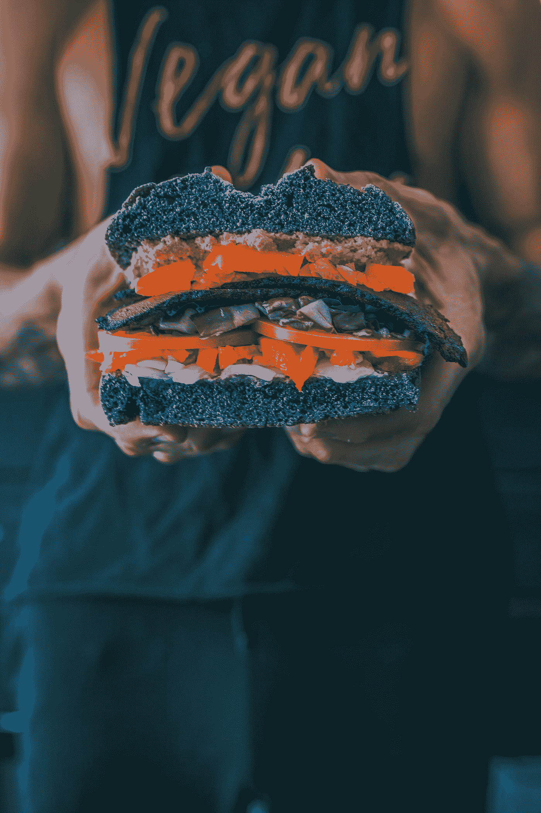
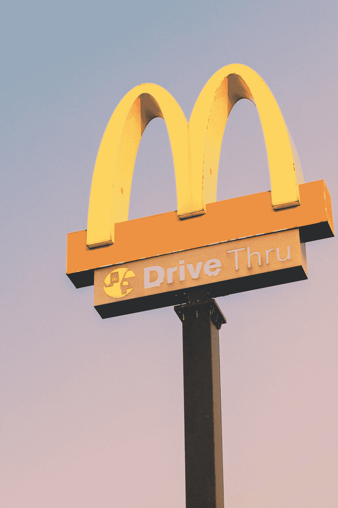
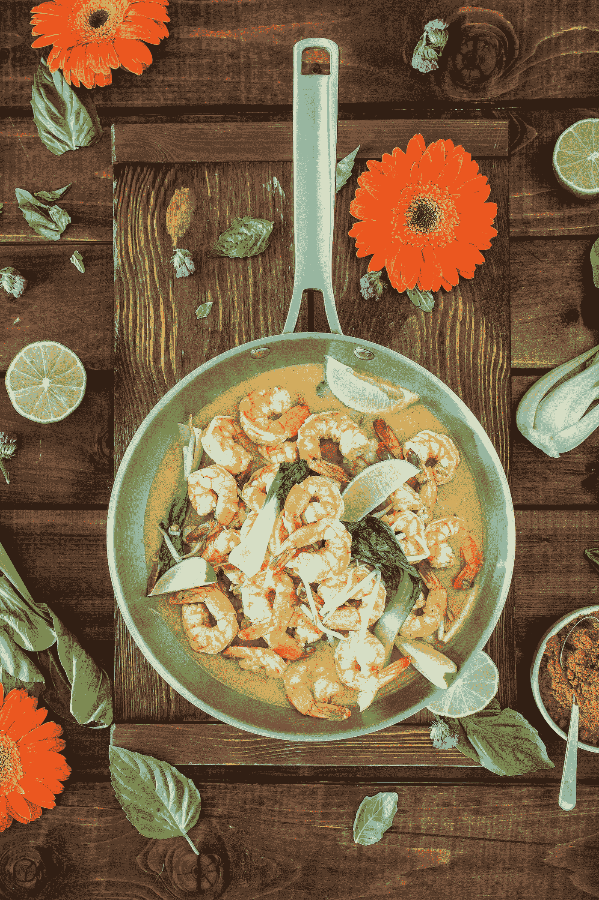
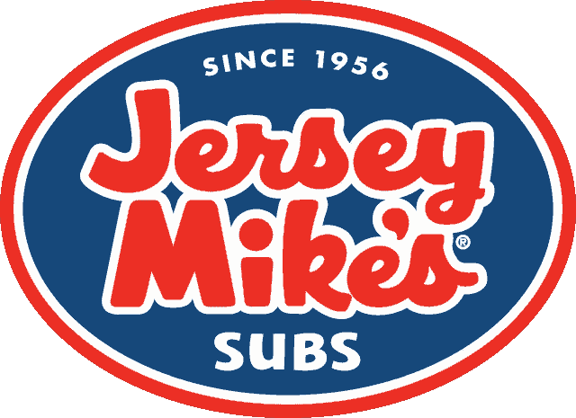
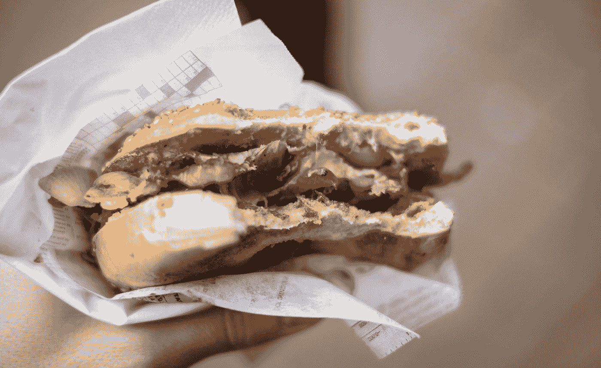

# 为什么我们买 9 美元的三明治

> 原文：<https://medium.datadriveninvestor.com/why-we-buy-9-00-sandwiches-1ffe8116864e?source=collection_archive---------5----------------------->

Photo by [Rustic Vegan](https://unsplash.com/@rusticvegan?utm_source=medium&utm_medium=referral) on [Unsplash](https://unsplash.com?utm_source=medium&utm_medium=referral)

这位男朋友在自己做饭时有时会偷懒，不久前他走进当地的一家温蒂快餐店买了一份鸡柳三明治。队伍很长(嘿，很挤，这里是科罗拉多州)，他很有耐心。然而，当他最终拿到三明治时，它已经凉了。这不应该是鸡肉沙拉三明治，这是冷的，而是鸡肉里脊三明治，这应该是热的。

除非快餐业发生了根本性的变化，而我们没有得到通知。

他走回柜台，那里的队伍仍然很长，他不愿意(我也会)排在二十多人后面，他插队到前面。柜台服务员很恼火。男朋友也是。当他问到三明治时，柜台服务员冲他咆哮。那没有帮助。他找了个经理，经理很生气。在因为一个冷鸡肉三明治而升级为近乎言语斗殴之后——这就是我们现在的样子——男朋友要求退款。经理也不想这么做。男朋友身高 6 英尺 205 英寸，肌肉结实，坚持己见。柜台后面的瘦子递出了现金。

这是今天的温迪。质量是我们的秘诀。确实如此。http://wendys.ge/en/about/quality-is-our-recipe

还有一次，男朋友在当地一家 7-11 商店拿彩票时，柜台服务员给了他错误的彩票。男朋友是一个非常有礼貌的人，他向助手指出了这一点。那帮人咆哮着反击，既自卫又愤怒。他找到了经理，经理也不喜欢男朋友的反馈。这就是我们现在的样子。他拿到了正确的票，但不会回到 7-11 去拿他的甜甜圈。他喜欢油炸圈饼。他吃了很多。不是从 7-11，他不会。

Photo by [Angelos Michalopoulos](https://unsplash.com/@angelovisuals?utm_source=medium&utm_medium=referral) on [Unsplash](https://unsplash.com?utm_source=medium&utm_medium=referral)

一个周六，我去当地的家得宝(Home Depot)挑选园艺用品(这本身就是一个恐怖故事)，我去了隔壁的米奇快餐店(Mickey D's ),买了两盒热薯条给最近有心情吃的男朋友。停车场很拥挤，汽车通道有 20 辆车。我终于找到了一个地方。里面至少有 15 个人在排队，都在等柜台，还有 10 个人站在周围等着吃东西。现在提醒你，这是午餐高峰后的*。柜台后面做饭的孩子们一点也不着急。事实上，他们看起来都好像是停机时间。当我终于轮到我时，我问收银员为什么这么慢。*

“我们不慢，”他生气地反驳道。“就是*忙*。”对记者说这话可不明智。一个顾客。对任何人。尤其是当你的全体员工像刚喝完酒起床一样四处走动的时候。我花了四十多分钟才点了一份薯条。这是今天的“快餐”蹩脚的冷食带着一点不尊重，一声咆哮，还有你应该高兴——我们甚至在为你服务，*愚蠢的*。

Photo by [a befendo](https://unsplash.com/@ga2006292845?utm_source=medium&utm_medium=referral) on [Unsplash](https://unsplash.com?utm_source=medium&utm_medium=referral)

麦当劳可能仍然是我们访问量最大的快餐连锁店，但他们正在努力摆脱这篇文章委婉地描述为糟糕客户服务的*印象*:[https://247 wallst . com/services/2017/07/31/McDonalds-struggles-to-over-percepts-poor-customer-service/](https://247wallst.com/services/2017/07/31/mcdonalds-struggles-to-overcome-perceptions-of-poor-customer-service/)/

不，你们这些白痴。是服务差。没什么可*察觉*的。

Photo by [Dana DeVolk](https://unsplash.com/@thissillygirlskitchen?utm_source=medium&utm_medium=referral) on [Unsplash](https://unsplash.com?utm_source=medium&utm_medium=referral). NOT what we got at Pei Wei.

大约一个月前，我和男朋友出去做家务。这是傍晚时分，我们都饿了。我们非常喜欢亚洲食物，但是我们最喜欢的家常菜点离这里很远。附近有一个裴頠。BF 哼了一声，但我们还是进去了。

首先，一对年长的夫妇在我们前面(让我们弄清楚，我 65 岁，男朋友 49 岁，但当我说“年长”时，我在一定程度上指的是行为)。他们在菜单选择上犹豫不决，犹豫不决，犹豫不决，这在我们看来很简单。最后，男朋友问他们是否要点菜，这就像一只靴子踢在屁股上。然后收银员花了很长时间来接受他们的订单。轮到我们时，我们迅速点菜。我想要蛋卷，BF 鸡肉炒饭。我注意到收银机旁边有一杯红酒。我漫不经心地想，这个年轻的女人是不是边工作边喝酒。她花了大量时间来整理我们非常简单、直接的请求。我要了一份糖醋酱(“那还要 0.69 美元。”OMG 真的吗？？？？？)最后，我们搬到了自助酒吧。有一个装橘子片的容器，我自己拿着喝水。

最终食物出来了。女服务员给我送来了鸡肉卷。嗯。*否*。不是我们点的。不仅如此，我们还要为包装付费，这比蛋卷足足贵了 8 美元。我们把它退回去了。鸡肉炒饭来了。男朋友咬了一口，放下叉子。我试过了。做了同样的事情。它就像炒纸板一样吸引人，但味道却差得多。蛋卷和我们的退款一起退回来了。我们把食物倒进最近的垃圾桶。这是最糟糕的食物，糟糕的服务，混乱的订单，额外的费用。这就是美国人这些天所忍受的。一小瓶糖醋酱要多付 69 美分，我的小屁股。不过，橘子片很好吃。仅此而已。我们在家吃了煎蛋卷。

如果你看看 Yelp 的评论，你会发现裴頠在阳光下的日子并不好过。原因有很多，如果不是无穷无尽的话。

## 终于有发现了

我们住在一条主干道附近，最近，随着人口激增，这条主干道上出现了许多崭新的三明治店和星巴克。一个是泽西麦克的。这位出生在北泽西的男朋友，有一天去买了一份凯撒鸡肉卷。孩子递给他，里面有西红柿。不仅那不在菜单上，而且男朋友讨厌西红柿。这是一个 9 美元的三明治。

男朋友向经理指出了这一点，经理立即拿回了三明治，把钱交给了男朋友，连连道歉，并立即给他做了另一个。男朋友把钱还了回去，解释说这是不必要的。他只是希望三明治做得正确。的确是。不仅如此，鸡肉软，嫩，精致，美味，酱可爱。我知道。我每次都能拿到另一半。这是一个很棒的三明治，由非常非常希望你回来的有礼貌的人送来。你可以在收据上给他们小费，所以让我们明确一点——不像其他快餐连锁店，你可以用小费来表达你的满意，而且是在昂贵的 sammich 之上。但让我们明确一点:如果食物真的真的真的真的真的很好，而且你做得又快又好，三明治是热的，刚从烤架上下来，你会带着灿烂的笑容为它买单，并在它上面放上小费。你打赌。每一次。

我们现在想吃快餐的时候会去泽西麦克快餐店。服务一流，食物美味，员工训练有素。总的来说，这是一次很好的体验。三明治太贵了吗？

最近，当我停下来为自己和男朋友做总结时，经理和我正在讨论这个问题。他记得他的男朋友(男朋友是姜，这让他更加难忘)。他说他们意识到他们的食物比地铁贵了很多。然而，赛百味的三明治不再很好，它们的成分不合标准。便宜，但是物有所值。男朋友再也不会在地铁里买水了。赛百味不仅犯了一个怪异的错误，让一个恋童癖者成为你的国家代言人(may Jared roast in hell)，还没有找到留住顾客的方法，他们正在关闭数百家特许经营店([https://www . business insider . com/Subway-to-close-another-500-stores-2018-4](https://www.businessinsider.com/subway-to-close-another-500-stores-2018-4))。糟糕的食物，糟糕的服务，一个恋童癖来代表你。嘿，我不能代表任何人说话，但这并不能让我觉得是成功的秘诀。

此外，这是我们再也不去地铁的另一个原因。最近，男朋友在地铁买了一个金枪鱼三明治。他最后食物中毒了。当他回去和经理说话时(出于礼貌和其他原因)，柜台的人指责他没有洗手。现在我不能代表任何人，但这是一个在你的三明治店里买到指关节三明治的好方法。男朋友没有，但你明白我的意思。简直骇人听闻。

Photo by [Jérémy Stenuit](https://unsplash.com/@stenuitj?utm_source=medium&utm_medium=referral) on [Unsplash](https://unsplash.com?utm_source=medium&utm_medium=referral)

成功的秘诀是把你的家人训练得非常好。我们正处于一个艰难的招聘市场——不是吗——但泽西麦克不知何故找到了解决办法。维珍航空明白了:重视你的员工，他们就会重视顾客。提供制作精良、健康、体面的食物，人们会回来。正如温迪快餐还没有解决的那样，向一家营销公司支付数百万美元来构思一个完全没有意义的、懦弱的企业口号(*质量到底是什么意思？事实证明，什么都不会改变基层的客户体验。训练可以。好的食材会。当你不断地偷工减料来偿还股东时，最终人们只会。走路。走开。就像他们对赛百味做的一样。*

这并不难，美国企业。体面的食物，始于好的食材、训练有素的员工、致力于客户服务的经理。真有趣。我记得这是不久前的*标准*。如此多的商店长期以来一直被忽视，以至于进入这个竞争激烈的市场的价格现在变得非常突出。可悲的是，如此多的小商店最终走向大公司，这是体面的食物，真正的质量和良好的培训的丧钟。在休闲食品行业，我最喜欢的一个例子是 Stacy 的皮塔薯片。曾经我最喜欢的零食，百事可乐买了之后，同样的价格，袋子变小了很多，质量下降了，我不再买了。比如公司收购你的时候。史黛西很有钱。对她有好处。我们这些对她的原创产品非常忠诚的人。走了。走开。公司收购只让极少数人受益。与此同时，我们失去了质量、价值、独创性和激情。

我们恢复质量的唯一方法是要求它。走出去。不要去那些浪费顾客金钱和时间的垃圾地方。我们带着钱包走，过一会儿，股东们会开始尖叫。既然他们是企业贪婪者的上帝，那么天哪，也许他们会听。当利润变得微薄时，也许美国会重新得到像样的快餐。与此同时，我们在 Jersey Mike's 购买 9.00 美元的 sammiches，我们真诚地希望质量保持不变。我们很乐意付钱。