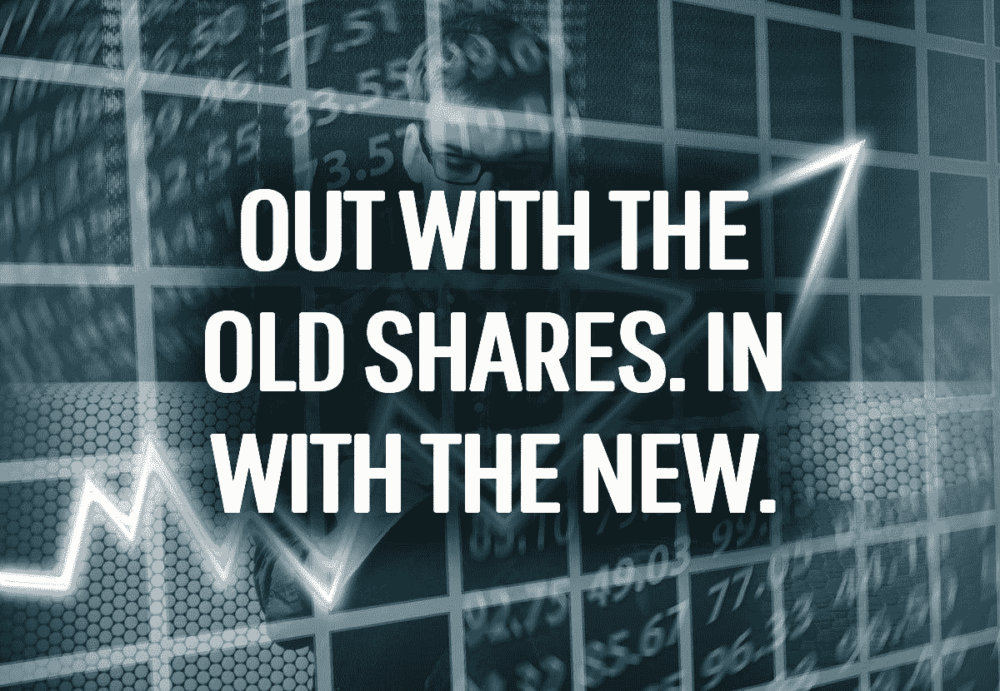
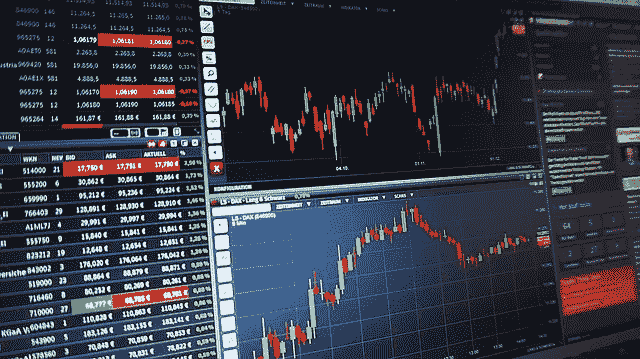
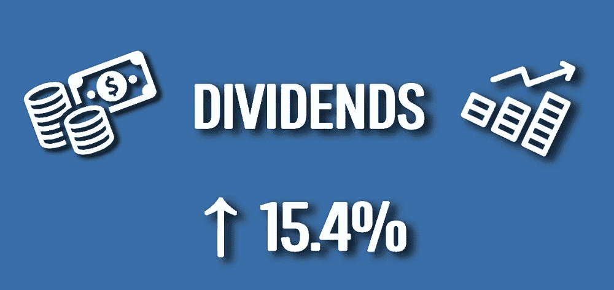

# 为什么我们资本回收我们的股票投资组合

> 原文：<https://medium.datadriveninvestor.com/why-we-capital-recycled-our-share-portfolio-hishermoneyguide-f9f490b21018?source=collection_archive---------11----------------------->

我从大约 16 岁开始投资股票。我的第一笔投资要感谢我祖父母给我的 500 美元的礼物，明确的目的是为我的未来投资。

所以不像亚历克斯和 T2，我从小就不害怕投资股票。从很小的时候起，我就被这样引导着，试着涉水，获得了一定程度的经验和自信。

 [## 算法交易的机器学习|数据驱动的投资者

### 当你的一个朋友在脸书上传你的新海滩照，平台建议给你的脸加上标签，这是…

www.datadriveninvestor.com](https://www.datadriveninvestor.com/2019/01/30/machine-learning-for-stock-market-investing/) 

亚历克斯已经写了两篇关于他如何随着时间的推移改变提前退休计划的帖子([见第一部分](https://hishermoneyguide.com/we-capital-recycled-our-share-portfolio/alexs-early-early-retirement-plans-story-pre-ellie))，我将来也会这样做。但是不用说，我们现在的目标和我当初的目标也不一样。

随着时间的推移，这条道路时断时续，时隐时现。

但是我们的股票组合——尤其是我的，因为它更大更老——没有改变。

事实上，尽管在过去的 19 年里我一直参与股票交易，但直到最近我才积极地出售了我的第一批股票。

当然，我在收购中损失了一些股份，但我从未在市场上出售过任何股份。作为一名长期投资者，这不是我需要做的事情。我买股票是因为我相信这家公司——不管是好是坏——并持有这些股票。

然而，我们提前退休的计划现在非常先进，引导我们循环利用我们的股份资本，优化我们的投资组合以实现我们的目标。这种“股本循环”是今天博客的主题，这是一个令人兴奋的概念，甚至可以帮助我们更快退休。

Capital recycling is most commonly known in regards to infrastructure.

# 什么是资本循环？

资本——或资产——回收是你在政界最常听到的事情。道路、水利设施、林业和能源基础设施等资产通常归政府所有，它们有一定的价值，但也有赚不到多少钱的时候。

在这些情况下，对所有者来说，出售资产而不是持有资产在财务上是有利的，并且可以更好地利用释放的资本。

在政治上，这种公共资产私有化可能会引起很大争议。但实际上这个概念是普遍的。当私营公司发现某些领域的资产要么是真正的负债(即亏损)，要么表现不佳，并且它们没有意愿扭转这方面业务的命运时，它们会定期将部分业务出售给其他方。

同样，完全相同的概念也适用于个人拥有的资产——像你我这样的人。

像股票这样的资产是有价值的，有办法卖给买家(股票市场)，赚到的钱可以用于其他目的。这正是我和亚历克斯最近发现的情况，所以我们决定采取行动，改善我们走向财务独立的道路。

As the pieces of our retirement puzzle come together, so do our plans.

# 我们的股本回收

随着时间的推移，我们——主要是我——获得了大量股票，从而增加了我们的持股数量。

许多肯定是有意购买的——无论是为了资本增长还是股息收入。然而，其他人没有被购买，而*获得了*。

在证券交易所上市的公司可能会被兼并——所以你最终会拥有一家你并不是一开始就拥有的公司。同样，他们也可以进行分拆，剥离一家公司。在澳大利亚，这方面的例子有 Coles 从 Wesfarmers 分离出来，英国 Clydesdale 银行从澳大利亚国民银行分离出来，在美国，Dr. Pepper Snapple 集团离开了 Cadbury Schweppes。

当这种情况发生时，作为个人股东，你不可避免地会以持有少量股份告终。例如，你在 A 公司持有的每 50 股股票可能会换来一股新的 B 公司股票。除非你在 A 公司持有*股票*，这意味着你在新成立的 B 公司不会有太多的股票

凭借我长期的股票历史，我已经获得了一些这样的股票。有些表现很好，有些则不然。但不管怎样，这导致了价值上的小规模持有。

也就是说，这些年来，我们也投资了其他有良好意愿的公司——一些表现良好(要么是成长股，要么是分红股),一些表现不佳(损失价值，或者分红很少，或者两者兼而有之)。

在这种情况下，现在作为寻求收益率的股息投资者，我们的既定目标是为我们的提前退休提供资金，我们决定出售我们认为表现不佳的股票，收益用于推进我们的退休收入目标。

# 需要注意什么

我们出售的股票大多在资本回报或股息回报方面表现不佳。对于那些价值低于我们获得它们的价格的资产，我们可以为不确定的未来储备资本损失。

然而，我们资本回收的一只股票实际上是一只表现强劲的成长股(我们在[Q2 2019 年净值更新](https://hishermoneyguide.com/quarter-2-2019-net-worth-update)中谈到了这一点)。在那种情况下，它的价值在四五年内几乎翻了一番。

我们出售它的一个原因是，它只是大计划中的一个小农场——最初购买时价值约 5000 美元，目前价值近 10000 美元。随着我们的投资组合朝着 200 万股的目标增长，像这样的小股是不正常的。

然而，该股的资本增长与其股息增长并不匹配。它只提供了不到 3%的年回报率，没有任何附加的[印花抵免](https://hishermoneyguide.com/franking-credit-changes-vulnerable)(例如:预付税款)。

在这种情况下，我们需要仔细权衡不需要出售股票的股息收入与资本增长的目标。最终，我们推断，如果我们不想在资本[退出策略](https://hishermoneyguide.com/how-much-do-you-need-to-retire)下积极、定期地长期出售股票，持有股票对我们有什么好处？我们决定把这笔钱投资到股息收益率更高的股票上会更好。

风险在于股票的表现将好于我们的股息回报，但这是一个我们可以接受的风险——稍后会有更多内容。

如果你自己也走这条路，要注意资本利得税的影响。对我们来说，出售已经贬值的股票可以抵消这一点，所以这不是问题。然而，如果你不小心，它可能会导致一个沉重的税单。

另一个不太相关的问题是，从税收的角度来看，要小心[洗涤销售](https://www.ato.gov.au/law/view/document?DocID=TPA/TA20087/NAT/ATO/00001)(适用于澳大利亚和世界上许多地方——通常规则是你需要在出售和重新购买之间等待至少 30 天)。如果你为了税收的目的想把资本损失存入银行，但仍然相信一只股票，不要卖出并立即回购同一家公司的股票。回购股票前需要等待。同样，如果你不小心，税务员会追捕你，没有人喜欢税务员。

Out with the underperforming stocks, and in with improved dividends.

# 为我们提前退休的股份资本循环的预期利益

那么，如果我们发现了缺陷，资本回收我们的股份对我们有什么好处呢？

我们总共卖出了 9 份股份，总价值为 33，500 美元。这些个人持股价值低至 73 美元(经典分拆！)以及高达 11100 美元。

每个财政年度，他们的年度股息总额为 926 美元(包括适用的邮资已付抵免)，总收益率为 2.8%。在这些股票中，有些根本没有分红。

我们真的希望获得 6%的股息回报，实现这一目标的选择非常广泛。所以你可以明白为什么我们想把这些投资回收到更有生产力的地方。

如果我们把这笔钱拿出来，以 6%的总股息回报率进行投资，总股息将跃升至 2010 美元。这相当于每年增加 117%或额外增加 1，084 美元。

所以这样做是完全有意义的，对吗？嗯，实际上我们很容易就赢了。

事实上，每年额外的 1，084 美元接近我们总股息目标的 1%，所以这对我们来说几乎是免费的，只是为了重组我们的投资组合！是的，我们在销售经纪业务上损失了一些，但很快就弥补回来了。

我们最近发布消息称，从净财富的角度来看，我们有 50%的机会解雇 T3——这还是在 T4 工作了 12 年之后。所以，在交易几天后，你的收入提高了 1%，这实际上是很大的进步！

最终，这将帮助我们更快地达到退休，这是我们都想要的，不是吗？

优化你的投资组合摇滚！

Taken from our [Q1 income and expenses report](https://hishermoneyguide.com/q1-2019-income-and-expenses/). We want to see increases like this continue to happen in the years ahead until we hit early retirement.

# 保持灵活的投资方式

那么，如果资本循环利用你的股份这么好，为什么我们不早点这么做呢？

嗯，消费者惰性背后的相同机制[当然也发挥了作用——懒惰。另一方面，你希望你的投资有好的表现，所以我们等着看它们是否会好转。](https://hishermoneyguide.com/consumer-inertia-your-brain-is-costing-you-money)

这些股票也是我们最初的——更分散的——投资方法的一部分。随着时间的推移，我们对投资有了更多的了解，也完善了我们的目标。

因此，这也关键地表明，你需要灵活运用任何投资策略。事实上，随着时间的推移，我们当前的目标/策略无疑也会发生一些变化。因此，现在的情况不一定是 5 年或 10 年后的情况。更不用说 20 或 30 年后的事情会是什么样子。

与房地产等其他资产类别相比，股票的美丽之处在于其灵活性。你可以在任何时候存取你的钱而没有任何罚款(酒吧经纪费)。

我们应该更早地灵活处理我们的股票，资本更早地回收这些表现不佳的股票。这就是生活。

但至少我们最终还是做到了，这表明我们所有人都需要掌控自己的资产，定期检查他们是否在做我们想要和需要他们做的事情。

干杯，

*艾莉*

PS:你有没有回收过你的投资来优化它们以实现你现在的财务目标？

*原载于 2019 年 9 月 16 日*[*【hishermoneyguide.com】*](https://hishermoneyguide.com/we-capital-recycled-our-share-portfolio/)*。*