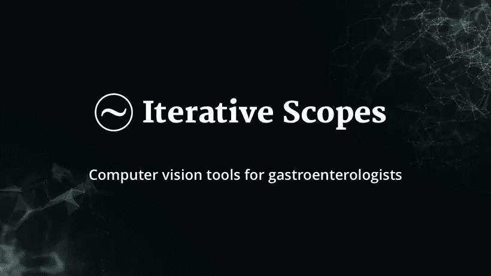
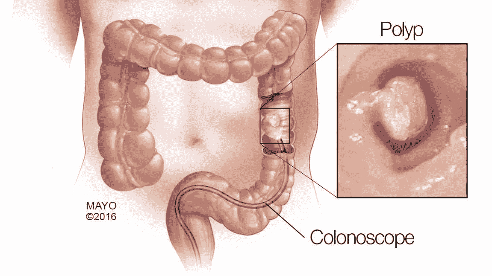
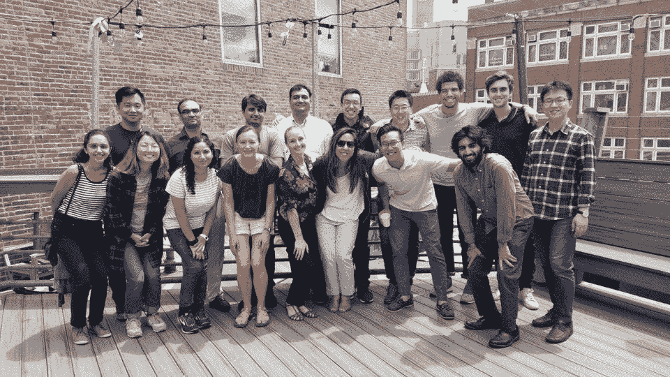
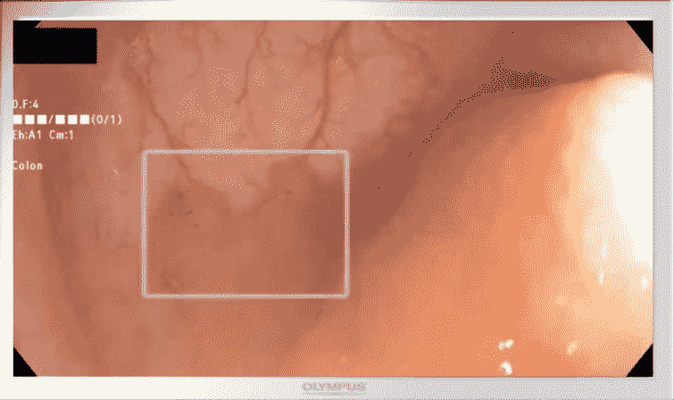

# 为什么我们投资迭代示波器，也就是为什么计算机视觉可以拯救你免于结肠癌

> 原文：<https://medium.datadriveninvestor.com/why-we-invested-in-iterative-scopes-aka-why-computer-vision-can-save-you-from-colon-cancer-e991f22c0ea3?source=collection_archive---------7----------------------->

Iterative Scopes 很快将宣布一个大型种子轮，这是我们通过硅谷 AI-first 种子基金 [Tau Ventures](http://tauventures.com/) 进行的投资之一。这家公司是在麻省理工学院孵化的，它给我们留下了深刻的印象，它确定了(1)一个强烈的需求，(2)建立一个注重执行的团队，以及(3)创造一个差异化的产品。在我们的调查过程中，我们与各种专家进行了交谈，包括约翰霍普金斯大学的胃肠病学负责人和 Mount Sinai 的首席创新官，他是一名 GI，为我们验证了需求和解决方案。这篇文章特别关注这家公司，但也反映了我们对投资的广泛看法。

 [## 医疗保健的未来正在被一场大型技术入侵所塑造|数据驱动型投资者

### 过去十年，全球经济的所有部门都经历了大规模的数字颠覆，而卫生部门现在…

www.datadriveninvestor.com](https://www.datadriveninvestor.com/2018/11/02/the-future-of-healthcare-is-being-shaped-by-a-big-tech-invasion/) 

**1)需要**

美国癌症协会建议所有 45 岁以上的成年人都应该定期进行结肠癌筛查。根据年龄和风险水平，筛查的年数会有所不同，但平均而言，建议是每 5 年进行一次。根据 CDC 的数据，2010 年结直肠癌的直接医疗费用为 140 亿美元。一个人一生中大约有 5%的机会患结肠直肠癌。今天的医生漏掉了他们需要检测的高达 25%的息肉，即他们检测到了所有息肉的 75%。

图片来源:[梅奥诊所网](https://newsnetwork.mayoclinic.org/discussion/technology-advances-help-to-prevent-lessen-impact-of-colon-cancer/)。

**2)团队**

首席执行官 Jonathan Ng 是一名医学博士/工商管理硕士/公共卫生硕士，曾在新加坡国立大学、麻省理工学院和哈佛大学接受培训，并在柬埔寨众筹并建造了一所医院。他从医多年，接触到结肠癌的高发病率，并意识到分析图像有助于更早、更好的诊断。乔纳森召集了他麻省理工学院的同学和波士顿地区的工程师组成的团队，并让 Humedica 的首席技术官斯坦·诺顿(Stan Norton)加入进来。我们在这个阶段看到了成千上万的公司，并认可迭代 Scopes 团队中的 X 因素(hustle + heart + hard work)。

图片来源:福布斯，来自他们于 2019 年 8 月在迭代范围上发表的[文章。](https://www.forbes.com/sites/frederickdaso/2019/08/09/iterative-scopes-an-mit-healthcare-startup-raises-the-standard-of-cancer-treatment/#4b974d051d05)

**3)产品**

迭代内窥镜实时分析结肠镜检查的视频图像，这是计算机视觉的经典应用。该公司的第一款产品名为 Skout，主要用于检测病变，预计将于 2020 年初在黄金时间推出。第二个产品叫做 GutCheck，是一个令人难以置信的颠覆性创新。GutCheck 本质上将使用人工智能提供治疗指导，从而分别为保险、医生和患者节省成本、时间和痛苦。

照片致谢:迭代范围

由非临床数据支持的 Iterative 的临床试验正在测试息肉检测从当前标准的 20%增加，即从 75%移动到 90%。此外，他们的模型可以检测出临床医生目前切除的所有息肉中的 98%以上。这也是他们能够与 40 家医院合作的部分原因，无论是学术医院还是私立医院，无论规模大小，还会有更多的医院加入进来。

我们很荣幸也很兴奋能成为 Iterative Scopes 之旅的一部分，利用技术解决一个大问题。更在[http://iterativescopes.com](http://iterativescopes.com/)。

*我是* [这些都是专注于实践见解的有目的的短文(我称之为 GL；dr —良好的长度；确实读过)。我的许多文章都在](https://www.linkedin.com/pulse/announcing-tau-ventures-amit-garg/)[*https://www . LinkedIn . com/in/am garg/detail/recent-activity/posts*](https://www.linkedin.com/in/amgarg/detail/recent-activity/posts/)*上，如果它们能让人们对某个话题产生足够的兴趣，从而进行更深入的探讨，我会感到非常兴奋。如果这篇文章有对你有用的见解，请对这篇文章和 Tau Ventures 的 LinkedIn 页面* *上的* [*发表评论和/或给予赞，感谢你对我们工作的支持。这里表达的所有观点都是我自己的。*](https://www.linkedin.com/company/tauventures)