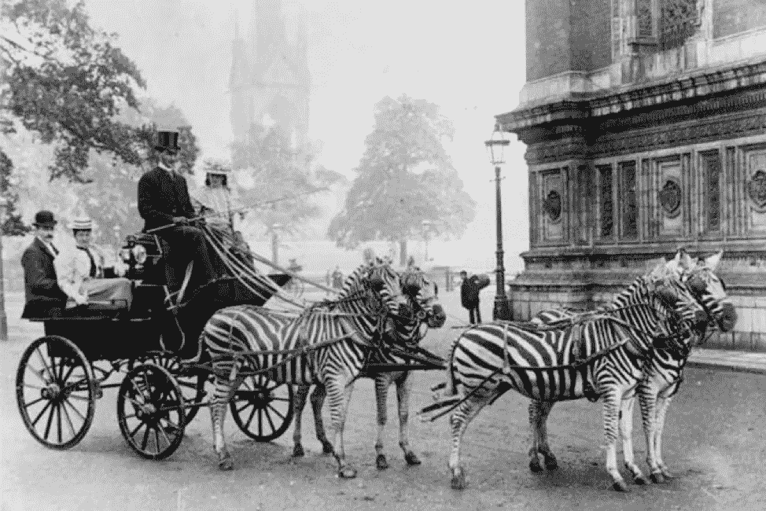
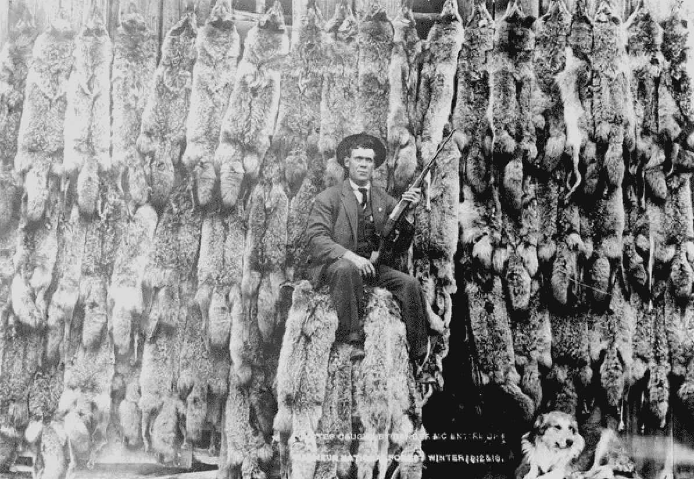
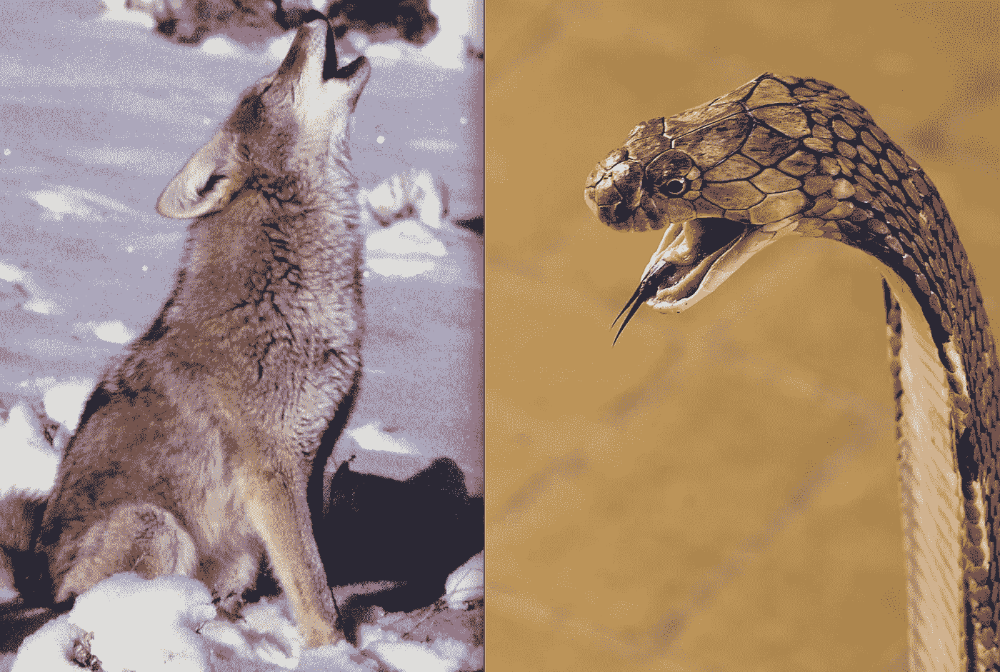
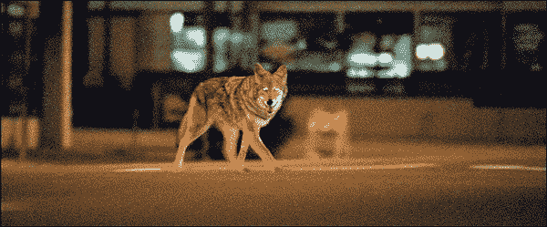

# 为什么我们总是得到错误的假新闻

> 原文：<https://medium.datadriveninvestor.com/why-we-keep-getting-fake-news-wrong-90ed2517f1e?source=collection_archive---------4----------------------->

**Podiem 论文#3:关于*假新闻*什么样的郊狼性爱能教会硅谷**

*# the diempets 是一个正在进行的短文系列，旨在围绕新闻和社交媒体交叉的核心问题加强公众对话。*

__________________________________________________________________

***“草原狼并不像狼一样是食肉动物或令人闻风丧胆的猎人。郊狼是一个自私自利的骗子，是混乱的代理人，挑起麻烦，测试和违反道德戒律……用来测试可能性和秩序的界限。”-*** [***纳瓦霍文字***](http://www3.brandonu.ca/cjns/7.2/cooper.pdf)

在这篇文章中，我想针对最近假新闻的泛滥提出两点

 [## 我们屏蔽了社交媒体，这引起了公愤。-数据驱动型投资者

### 上瘾，我们看不出来。在最近的一项研究中，基于以前的研究成果，我们想…

www.datadriveninvestor.com](https://www.datadriveninvestor.com/2018/12/01/we-blocked-access-to-social-media-it-caused-an-outrage/) 

> 1.)在定义假新闻时，硅谷正在犯一个危险的错误。
> 
> 2.)提出了一种新颖的、尽管有点另类的思考方式来看待*假新闻*，以努力确保我们不会鼓励科技公司让现有的问题变得更糟。

为了做到这一点，我们需要先谈谈眼镜蛇攻击和郊狼性交。

**一、眼镜蛇和郊狼**

19 世纪晚期，在英国殖民统治下，印度新德里饱受眼镜蛇攻击的困扰。一位省长认为设立一项奖金计划来补救这些攻击是明智的；眼镜蛇皮换钱。没过多久，一些勤劳的新德里企业家开始在自家后院“养殖”眼镜蛇。政府发现了这些眼镜蛇农民的策略，并立即取消了奖金计划。因此，农民们让所有养殖的眼镜蛇自由活动，眼镜蛇的数量很快就超过了最初的数量。

同样的事情发生在越南河内的老鼠身上，也发生在乔治亚州詹宁斯堡的野猪身上。短语*“眼镜蛇效应”*现在被用来说明一种特殊的*“意外后果法则”*，其中错位的激励最终加速了一个人最初试图避免的结果。

我想把这个故事放在另一个类似的*意外后果*故事的背景下，但这次是关于郊狼的。

在整个 19 世纪末和 20 世纪初的北美，农民们请求政府在消灭狼的基础上着手消灭郊狼。理由是为了保护农民的牲畜和儿童，他们声称这些人容易受到郊狼的攻击。在随后到 1956 年为止的 30 年期间，农业部继续消灭了 650 万只郊狼，这是我国历史上对单一动物物种发动的最全面的灭绝运动之一。

然而，到了 70 年代末和 80 年代初，一种奇怪的趋势出现了。郊狼数量激增。生态学家正在追踪迁徙到加拿大北部、中美洲和南美洲的郊狼，以及芝加哥、纽约和洛杉矶等城市的城市化进程。

那么，为什么郊狼的数量急剧增加，而狼的数量却继续徘徊在灭绝的边缘呢？郊狼是如何能够在城市和农村地区茁壮成长，同时又能适应热带和零下温度的呢？

生态历史学家丹·弗洛雷斯解释如下:

> “……郊狼发展了这种[裂变-融合适应](http://anthro.palomar.edu/behavior/behave_2.htm)……这使它们能够作为群体掠食者或者作为单独或成对的个体发挥作用。当它们受到迫害时，它们倾向于放弃群居策略，成对成对地分散在各处。(DoA)毒药运动是使他们在北美不断扩散的原因之一。
> 
> 它们的另一种适应是，每当它们的种群受到压力时，它们的产仔数量就会增加……它们用它们的嗥叫和叫声来进行一种郊狼种群的普查。如果它们的叫声没有得到其他狼群的回应，就会引发自发反应，产生更多的幼崽(比正常情况下多)。"

乍一看，很容易将我们的郊狼故事归类为眼镜蛇效应的又一次重复。另一个例子是人类的愚蠢造成了意想不到的下游副作用。但是，仔细观察一下，就能发现我们*假新闻*问题的核心。

在我们的 cobra 例子中，目标是可行的，但是策略是有缺陷的。我们的目标是实现一个没有眼镜蛇咬人的结果，只是他们实现这个目标的方式有缺陷。然而，我们可以设想另一种策略，这种策略很可能成功地从*市根除了眼镜蛇，即眼镜蛇陷阱或抗蛇毒血清的开发。*

我们的郊狼故事正好相反。目标本身是有缺陷的，因此，无论战略如何实施，都注定要失败。考虑到郊狼独特的生物学特性，它们的数量永远不可能为零。实施的任何战略都肯定会加剧这一问题。

> **COBRA:** 可行的目标，有缺陷的策略
> 
> **郊狼:**不可能的目标，战略因此无关紧要

**二世。** **假新闻是土狼问题**

这就是我们在*假新闻上犯的那种分类错误。我们必须停止试图把假新闻当作眼镜蛇的问题，而开始把它当作郊狼的问题。*假新闻*不是等待治愈的传染病，也不是等待根除的蛇虫灾，而是自由言论社会中新闻采集与报道的共生必然性。*

假新闻和郊狼对环境都非常敏感和适应。如果我们着手试图清除系统中的任何假新闻，我们的新闻系统和信息生态系统将分裂出来，形成新的群体，并鼓励更多的狼传播。那些希望在整个系统中传播假新闻的人明白这一点，并希望我们尽可能多地花费时间和资源去猎杀郊狼。他们希望我们把*假新闻*视为一个眼镜蛇问题，确信存在一个解决方案，着手努力取缔任何“造假”发生的地方。

问题是我们不知道一条新闻在哪个精确的点上跨越了从阴谋到发人深省的猜想再到集体共享的真相的门槛。在处理“新闻事件”的过程中，不可避免地会出现一些新闻“错误”或“不太正确”的情况。即使是出于好意传播的消息，碰巧也是假的。事实是，大多数阴谋论者真的相信他们的阴谋是真的，就像一些阴谋本身实际上被证明是真的一样。

取以下标题:*“Nasa 照片显示月球上美国国旗迎风飘扬；登月造假？!"*

在这个世界上，那个标题的作者对这个问题的探索是真诚的，真诚地认为他们偶然发现了一些奇怪的、值得我们注意的东西，认为他们正在认真地加入到公众的讨论中。

但同样可能的是，作者可能是俄罗斯宣传的喉舌，试图剥夺美国太空计划的合法性和公众对它的信任。

如果你想清除假新闻，使其不再在推特世界中流行，你必须能够区分以上两种情况。在那些有意欺骗的出版商或作者和那些无意中欺骗的人之间。这当然是一项不可能的任务。在这个世界里，每个拥有博客的人在发表文章之前都必须接受测谎。

**三。那又怎样**

我们不能指望我们的技术平台优雅地解决假新闻问题。相反，我们必须将假新闻视为自然新闻生态系统的一部分。如果我们着手试图消除新闻生态系统中的每一个“虚假”实例，我们将鼓励不良行为者变得更擅长语言游戏和隐藏的意义。我们将加速他们反映真实新闻的复杂性。我们将增加对游戏观众的奖励，因为我们对它的反应非常强烈。我们将鼓励信息的裂变-融合和自生反应，对抗“郊狼”更快地繁殖和扩散到“城市”。鉴于他们现有的盈利模式，坐等脸书、推特和苹果来解决这个问题，就像期待农业部杀死所有的土狼一样不切实际和天真。

我们只是对假新闻的“适应性生物学”知之甚少，不足以引发一场灭绝运动。我们不知道在一个自由社会中言论控制的确切正确的设定点。我们不知道如何区分一个人犯错的*自由和试图说服他人犯错的*自由。*我们肯定不知道谁有足够的责任或能力来大规模地巡查这些地方。 *Youtube 最近在这方面的言论都太[暴露了](https://www.vox.com/recode/2019/6/10/18656937/youtube-susan-wojcicki-code-conference)。**

我不是唯一担心的人，如果我们走上把假新闻视为眼镜蛇问题的道路，并因此实施消灭眼镜蛇的策略，我们很可能完全破坏我们的公共信息系统。双方都声称对方在清洗谎言和宣传。我们将把这些系统撕成一千个碎片，继续自我封闭。没有共享现实的世界。只有个人定制的意识形态镜屋电脑终端。随时间推移，我们的心理免疫系统变得脆弱，因为没有暴露或容忍外部意识形态的阻力。

在这个反乌托邦的未来世界，唯一致富的人将是那些兜售新闻作为政治和经济欺骗的人，这进一步刺激了寻租者进入蛇头生意。作为郊狼农民或郊狼猎人在经济反馈循环中获利。

我们将会面临一个被郊狼咬伤者淹没的社会，而郊狼的数量将会增长并进一步扩散，直到没有值得保护的牲畜。直到没有共同的历史。相反，一个分散的，原子化的，个人的历史…正适合你。