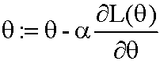
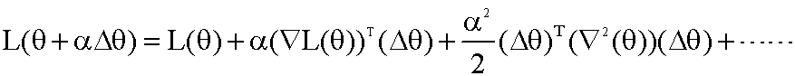
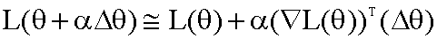
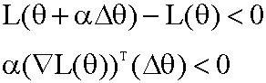
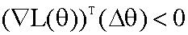
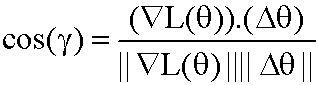
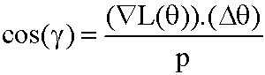
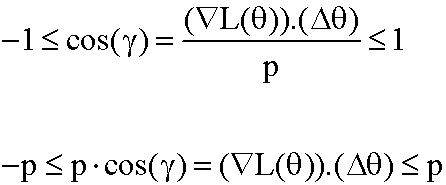

# 为什么我们在梯度的相反方向移动我们的重量？

> 原文：<https://medium.datadriveninvestor.com/why-we-move-our-weights-in-opposite-direction-of-gradients-565679ff9320?source=collection_archive---------10----------------------->

在这篇文章中，我将给出一些直觉，为什么我们在梯度的相反方向上移动我们的权重，以使用梯度下降来寻找函数的最小值。

让我们考虑损失函数 L(θ),然后梯度下降中θ的更新规则由下面的等式给出

我将讨论为什么我们在上面的等式中做负。让我们考虑损失的变化δθ，学习率为α。所以我们迭代后的最终损失是 L(θ+α。Δθ).从[泰勒级数](http://fourier.eng.hmc.edu/e176/lectures/NM/node45.html)展开我们可以写出 L(θ+α。δθ)如下

对于小α，我们可以忽略所有具有α^{n}的词，其中 n≥2，所以方程是

在梯度下降中，我们在每次迭代中减少损失，因此当前损失小于先前损失，因此根据上述等式

α是正的所以

上式是∇ L(θ)和δθ的点积。假设这两者之间的角度为γ，则 cos(γ)为

让我们假设||∇ L(θ)||。| |δθ| | = p so

[cos](https://web.ma.utexas.edu/users/jmeth/TrigSheet.pdf) 函数的取值范围是[-1，1] so

我们发现θ的变化，即δθ，使得∇ L(θ)。δθ< 0 ⇒ p.cos(γ) < 0 . it is less than zero when γ in (90,270) and cos(γ) is more negative if γ = 180 degrees (cos(180) = -1). so we are moving opposite direction of gradient to get present loss less than the previous loss.

*参考文献:*

1.  CS7015:深度学习—2018 IIT·马德拉斯