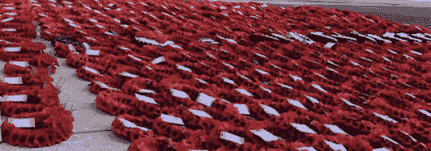
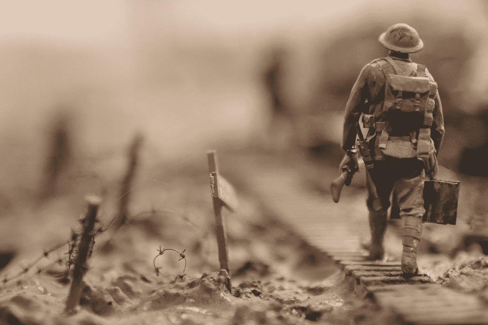

# 第 10 章，为什么我们有责任在停战日站在雨中说谢谢

> 原文：<https://medium.datadriveninvestor.com/why-we-must-all-sit-in-the-rain-to-say-thank-you-on-armistice-day-7fff2728e43d?source=collection_archive---------19----------------------->

由于许多特殊的原因，购物中心、骑兵卫队和纪念碑都很接近我的心。今天，我有幸成为(200 万人中的)1 万人中的一员，有机会参加第一次“人民游行”，这是一次经过纪念碑的游行，纪念碑通常是军队的保留地。

这是一生只有一次的经历，也是一个为我们的祖先为我们的自由所做出的牺牲而自豪的机会。

自从 1995 年搬到伦敦后，我每隔一年都会参加和平纪念碑的停战日纪念活动。16 年前，当我读到塞巴斯蒂安·福克斯的《鸟鸣》时，我真正开始对 WW1 着迷。我写了一篇关于为什么英国军队在第一次世界大战中没有叛变的论文，我为英国军团卖罂粟花，当我的哥哥开始军旅生涯时，我成了一名士兵的妹妹。

“soldier walking on wooden pathway surrounded with barbwire selective focus photography” by [Stijn Swinnen](https://unsplash.com/@stijnswinnen?utm_source=medium&utm_medium=referral) on [Unsplash](https://unsplash.com?utm_source=medium&utm_medium=referral)

今天并不是我第一次泪眼模糊、骄傲地对着令人感动的石头纪念碑“睁大眼睛”的时刻。2008 年，我读了布林·帕里的《乡村生活求助》。他有一个想法，为受伤的士兵建立一个慈善机构，他的第一次筹款是一次赞助的“大型战场自行车骑行”。我不认识布林，但我打电话说‘我加入’(一如既往，以后再弄清楚细节，比如如何骑自行车)。5 天骑行 350 英里能有多难？法国北部不是以平坦为主吗？

一辆有补贴的自行车(照顾 Halfords)和几起流产的夹板事故(这偶然让我在树篱、沟渠和偶尔沮丧的眼泪中)，我认为我已经训练得“刚刚够”在 5 天内骑行 350 英里穿越西部前线。我错了，这是痛苦的努力，即使我所有的四肢。你骑自行车骑得越差，完成每天的里程需要的时间就越长，这减少了你的恢复时间。跟上别人很痛苦，落后也很痛苦。我没有达到我应该达到的健康水平，我没有(现在也没有)理解齿轮，我真的不擅长用法语看地图。

我是 200 个来到朴茨茅斯的人之一，谁也不认识，只带着我的自行车和一个小背包，除了尽我所能帮助我们的英雄之外，对将要发生的事情没有任何先入之见。

真正的英雄要么没有胳膊或腿，要么更糟，有时两者都没有，但他们非常健康，而且总是很开心。为了激励我们跟上，他们会骑自行车回来(加倍他们的距离),没有腿肯定很累，只用他们的手臂在一辆特别改装的自行车里推动自己前进。我感到内疚，但他们从未抱怨过。相反，他们会在远处没完没了地对我大喊大叫，告诉我我还是挂错了档。我似乎就是不能“理解”。我感到非常自卑，但这一切都与我无关，我是来帮助他们的，尽管他们似乎不需要我的帮助也能做得很好。

一名士兵让我们开心，他讲述了当他失去一条腿时(推断他把腿放错了地方)，他的团友给他买了一只塑料鹦鹉和一个眼罩。在我到达前几个小时，这些英雄们会在酒吧里用他们的假肢支撑着吧台。我发誓再也不抱怨任何事情了。

我们很快意识到，如果我们一直戴着太阳镜，我们就可以在骑车穿过索姆河、伊普尔河、阿拉斯河、帕斯尚代尔河和蒂埃普瓦尔河时掩饰我们的眼泪。我们整个星期都在说‘我没事，只是眼睛里进了点东西’。

我从自行车上摔下来的次数多得数不清。又是那些鞋钉。就像一叠卡片一样，我把一整排我们帮助英雄骑自行车的人带到了一个铁路道口，并以那块五颜六色的瘀伤作为证据。我无数次想退出。当支援巴士缓缓驶过来接走掉队者时，这是如此诱人。我会严厉地告诉自己，我不会让那成为我。我宁愿是最后一个，仍然骑着自行车，即使换错了档位，在法国迷失了方向**和**在暴雨中，也不愿让那成为我。

当你有四肢时，你怎么能挣扎呢？

尴尬和潜在的羞愧推动着我，我们一起骑车穿过暴雨，感受着从一个战场到另一个战场的极度悲伤。尽管这是我第二次参观英联邦阵亡将士公墓和西线战场，但我还是非常激动，如果不是更激动的话。

逆境和改变人生的经历总是会形成亲密的友谊。友情存在于你们共同面对的斗争和共同的障碍中。我们以陌生人的身份离开朴茨茅斯，5 天后作为朋友一起骑车逛商场。我永远不会忘记把我的父母、哥哥和弟妹介绍给我在 Horseguards 的所有新朋友的激动心情。

在我们经历了这些之后，生活不可能再和以前一样了。

我好几天不能坐下来。我发誓再也不骑自行车了。一周后，我坐在一间办公室里，尽管很不舒服，但我仍试图理解这一切。上周我乘坐二战登陆艇旅行。

每句话都以“骑自行车……”开头，因为我会用另一个关于我骑自行车冒险的故事来取悦每个人。我记得在经历了这样一场改变人生的事件后，我曾问自己要如何适应，这是每个士兵回家后都要努力面对的问题。我无法想象士兵们如何从旅途中的紧张经历中减压，谢天谢地，我没有目睹死亡。哈里王子宣布将他的一生致力于帮助退伍军人和女性的精神健康，这既令人感动又令人尊敬。

今天我在国家游行上认识了一个新朋友。我一个人去了，她也去了，但很快我们就开始聊天，她有军方的关系，我们很亲密，就像在大战场上骑自行车一样。她与她分享这一天，使这一天变得更加特别。

我们都有自己记忆的理由。

对我们倒下的战士们，你们已经尽了你们的责任，向你们致敬是我们的责任。

我们只是祈祷我们能对得起为我们做出的牺牲。