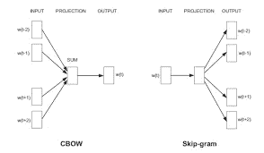

# 为什么我们需要在自然语言处理中嵌入单词？？？

> 原文：<https://medium.datadriveninvestor.com/why-we-need-word-embedding-in-natural-language-processing-8bb929e1f428?source=collection_archive---------10----------------------->

自然语言分类中最具挑战性的工作之一是特征工程。原因是大多数机器学习算法不支持字符串输入，我们必须将自然语言输入转换为数字表示。早期流行的方法之一是使用 N 元语法。随着深度学习的普及和发展，人们开始使用词嵌入来达到这个目的。

Photo by [Patrick Tomasso](https://unsplash.com/@impatrickt?utm_source=medium&utm_medium=referral) on [Unsplash](https://unsplash.com?utm_source=medium&utm_medium=referral)

最近，我参加了在 kaggle 举办的“毒性分类中的拼图意外偏差”机器学习竞赛。比赛的目的是找出在各种不同的对话中起作用的有害评论。在这次比赛中，我能够使用几种类型的单词嵌入。从这篇文章中，我将分享我从上述比赛中获得的关于单词嵌入的经验和知识。

 [## 2019 年最值得学习的编码语言|数据驱动的投资者

### 在我读大学的那几年，我跳过了很多次夜游去学习 Java，希望有一天它能帮助我在…

www.datadriveninvestor.com](https://www.datadriveninvestor.com/2019/02/21/best-coding-languages-to-learn-in-2019/) 

> 单词嵌入是一种将词汇表中的一组单词映射到向量空间中的实数向量的技术。 **Glove** 和 **Word2Vec** 是自然语言处理中最流行的两种单词嵌入实现。

Word embedding created using Word2vec | Source: [https://www.adityathakker.com/introduction-to-word2vec-how-it-works/](https://www.adityathakker.com/introduction-to-word2vec-how-it-works/?source=post_page---------------------------)

首先，我们来看看为什么单词嵌入是比 N-gram 更好的选择。让我们假设我们有一个分类问题来分类这个句子是否是关于宠物的。考虑句子“世界上大多数人把狗作为宠物”和“世界上大多数人把小狗作为宠物”。这两个句子都是关于宠物的，叙述者试图从这两个句子中表达相同的意思。N-gram 方法没有给模型一个单词之间相似性的概念。也就是说，它没有向模型给出狗和小狗在宠物的上下文中具有相似含义的想法。它仅仅给出了单词的顺序和存在的概念。在单词嵌入中，具有相似上下文的单词占据接近的空间位置。

**Skip Gram** 和 **Common Bag Of Words** 是使用词汇表获得单词嵌入的两种流行方法。在普通单词包中，我们试图在给定上下文的情况下预测目标单词，而在 Skip Gram 中，我们试图在给定目标单词的情况下预测上下文。

[https://skymind.ai/wiki/word2vec](https://skymind.ai/wiki/word2vec)

大部分自然语言语料库都是非结构化数据。因此，在大多数情况下，语料库中的原始数据不能使用预先训练的单词嵌入模型直接映射到向量。所以在映射之前我们必须做很多预处理。大多数 NLP 语料库都是从社交媒体中提取的，因此它包含了微笑、表情符号和发音等内容。不仅如此，它还包含相关语料库中没有的拼写错误的单词和专有名词。在下一篇文章中，我将展示我们如何预处理 NLP 数据，以从基于单词嵌入的深度学习解决方案中获得成功的结果。