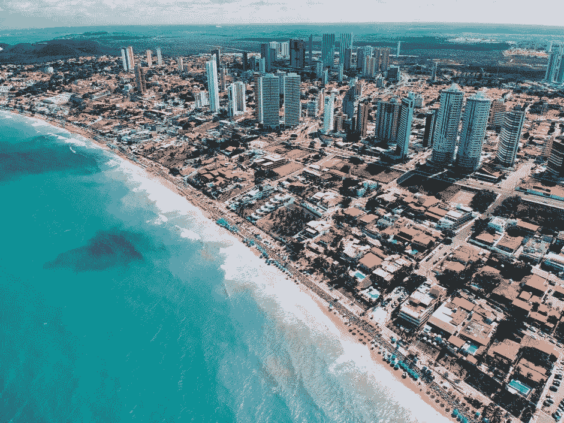

# 为什么我们看到了巴西经济的曙光？

> 原文：<https://medium.datadriveninvestor.com/why-we-see-light-at-the-end-of-the-tunnel-for-the-brazilian-economy-2e1946028130?source=collection_archive---------17----------------------->

尽管在 2003 年至 2013 年的十年中，巴西经济取得了长期进步，但它一直在苦苦挣扎。在经历了严重衰退后，巴西进入了经济活动高度低迷的阶段，其增长率自 2010 年代初以来一直在放缓。尽管巴西的一些拉美邻国一直在报告创纪录的增长和投资，但巴西的国内生产总值(GDP)却出现了收缩，经济危机导致大宗商品价格下跌，政府难以为公民提供关键服务——但接下来会发生什么？

去年，巴西的劳动力市场疲软，由于选举的不确定性、罢工和一些外部因素(如美元走强和不确定的全球经济)而缺乏投资。巴西面临着最大的挑战:要么恢复该国的财政可持续性，解决债务问题，要么面临半途而废的风险。

当[拉美的商业环境](https://www.noobpreneur.com/2018/08/27/5-tips-for-succeeding-in-a-latin-american-business-environment/)从未像现在这样让全世界的投资者兴奋时，我们仔细看看巴西的经济，并解释为什么隧道尽头有光明，为企业提供了巨大的回报机会…

**政治新格局**

竞选活动总是会引起分歧——看看美国或英国就知道了——但在巴西，去年的总统竞选期间有一种明显的紧张感。是雅伊尔·博索纳罗在[巴西选举](https://medium.com/@craigdempsey_25901/post-election-where-to-next-for-brazil-64b1692a97e4)中获胜，获得了 55.1%的选票，使他有能力击败对手。他的意识形态遭到了一些人的批评，但他受到了大企业和上层阶级的青睐，因为他对企业的态度很明确，并告诉该国的企业家，“媒体必须停止把你视为坏人。在巴西做一个企业主就是做坏人，”这是一个明显的迹象。与一些左翼人士不同，Bolsonaro 支持企业，并希望给予企业更多权力和对其财富和员工的控制权——他认为这将是重振该国经济增长和鼓励更多外国投资的关键。

他获胜之际，当地企业家表达了他们对希望保障更多工人权利的政党的失望和担忧。大企业认为，给工人太多的权力，会使他们更难经营有利可图和高效率的企业，他们中的一些人甚至在考虑撤出这个国家。Bolsonaro 希望给商界带来什么样的变化还有待观察，虽然这些变化可能不会让小家伙受益，但它们应该会安抚商界，并说服更多的组织在该国扩张或投资。

但不仅仅是大企业的政治格局在发生变化。总统征召经验丰富的经济学家保罗·盖德斯协助管理政府。有人说，这两人可能会选择将中国的一些国有企业私有化，这将为商界带来新的机遇，甚至会降低进口关税，以帮助新企业在市场上茁壮成长。再说一次，在 Bolsonaro 的任期内知道他肯定会做什么还为时过早，但显而易见的是，亲商业的激励措施和立法正在路上。

越来越多的成功

判断一个国家是在上升还是在下降的最好方法之一是看它的成功故事。在整个拉丁美洲，创业领域的企业正在蓬勃发展，汇集了最优秀的商业头脑和企业家精神，创建了在世界各地引起轰动的新公司。还有一些成功的[巴西创业公司](http://www.theglobaldispatch.com/startups-showing-the-most-potential-in-brazil-14929/)应该加入这个名单，展示这个国家的潜力，并作为下一代企业家的榜样，他们自己创业，可以在没有政府支持或投资的情况下合并和扩大他们的业务。

事实上，互联网已经改变了人们在这个国家做生意的方式，现在专家可以向世界各地的消费者提供他们的技能和服务，而不必离开他们的卧室或办公室。Quinto Andar 是这种增长的另一个辉煌的例子——它现在是巴西最知名的公司之一，为用户提供搜索、查看、预订和租赁该国房产的能力。在获得 2000 多万美元的资金后，该公司拥有 300 多名员工，并计划在全球范围内扩张。

**诱人的投资主张**

如果巴西想要提振经济，鼓励新的企业和工作岗位，那么它必须能够将自己定位为外国直接投资的主要选择。尽管在巴西并不全是好消息，但事实是，在过去的二十年里，这个国家至少保持了一定的增长。据分析师称，巴西将在 2019 年继续实现 GDP 增长，估计为 1.3%。根据 Trading Economics 的数据，这一数字将在 2020 年上升至 2.4%，这表明了对经济的乐观态度和对新总统的信心。

作为一名考虑向巴西这样的国家扩张的企业家，知道你可以期待它的经济随着你的业务扩张而增长是件好事。这也应该导致该国中产阶级的增加，他们的可支配收入高于平均水平，有能力购买像你们这样的奢侈品和服务。

同样有趣的是，该国的失业率预计也将保持在相对较高的水平——2019 年为 11.6%，2020 年为 11.1%。从外部看，这可能是一个负面消息，但它为企业提供了进入强大劳动力市场的机会。根据 Estadao 的说法，该国工资水平最低的普通工人预计每月收入约为 77 美元，大大低于美国的最低工资，在美国，工人的工资至少为每小时 7.25 美元，全职合同每年为 15，080 美元。无论您选择在制造、研究、客户服务或任何其他行业中运营，获得低成本、高技能的员工将提高您组织的盈利能力。

不可否认，巴西面临着巨大的挑战，企业和公民必须努力保护自己的未来。但除了这些挑战，对于那些希望在市场恢复往日辉煌之前进入市场的企业来说，也存在真正的机会——因此，快速行动是保证增长和投资回报的唯一途径。无论你选择进入哪个行业，我们都祝你好运！