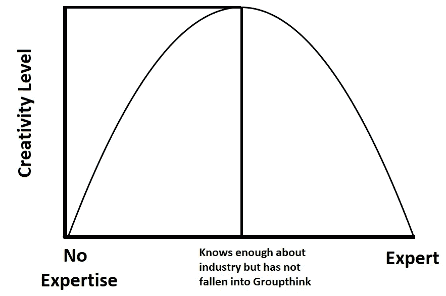
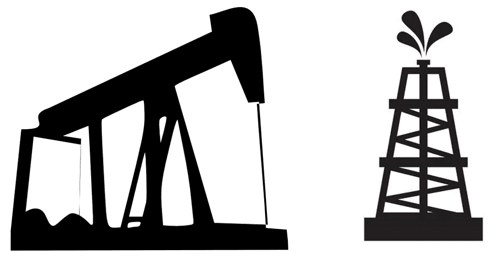

# 为什么我们不应该像对待上帝一样对待专家

> 原文：<https://medium.datadriveninvestor.com/why-we-shouldnt-treat-experts-like-god-e8ffc0792b31?source=collection_archive---------7----------------------->

注意:本文表达的观点仅是我个人的观点，并不代表我的雇主或任何其他人的观点。

专家受到社会的广泛关注。我们经常依靠它们来分析形势和预测未来事件。这是可以理解的，但专家在我们的社会中地位过高，原因有几个:

**1。** **专家经常告诉我们一些我们已经知道的事情**

专家们最近试图预测的是，美国和全球是否会出现衰退，以及何时会出现衰退。这是有道理的，考虑到我们已经经历了一个非常长的扩张期，根据历史数据，[美国通常每 7-8 年就会经历一次衰退](https://www.nber.org/cycles.html)。关于衰退的预测是合理的，但其中一些也是显而易见的。保罗·克鲁格曼最近说，“我认为我们很有可能在今年晚些时候(或明年)陷入衰退。”这是我见过的最不冷不热、有条件的预测。他不仅给了我们一个是否会出现经济衰退的可能性，还把他的时间框架扩大到了今年和明年。我有消息告诉他，一个高中生也能做出这种预测。只有当专家准确地告诉我们什么时候会发生衰退，什么会导致衰退时，关于衰退的预测才会令人感兴趣。在这种观点已经成为主流之后，说衰退可能会发生并不有趣。

 [## 想知道领导是谁？请他决定。-数据驱动型投资者

### 一个有效的领导者能为组织提供的最有价值的东西之一是决策能力…

www.datadriveninvestor.com](https://www.datadriveninvestor.com/2019/01/25/want-to-know-who-the-leader-is-ask-him-to-decide/) 

专家们不做出大胆有趣的预测，可能有一个很好的理由。首先，这可能是他们的专有工作。专家做分析和预测可以得到很多钱，为什么他们会免费提供“好东西”呢？第二种可能性是，专家只是非常谨慎的人，喜欢用概率而不是确定性来工作。他们只想在有高度把握的情况下做一个预测。尽管当这个想法已经成为主流并且每个人都接受它时，这种情况往往会发生，这使得专家的观点不那么具有突破性。最后的理由是有证据的。专家们倾向于在做出结论之前需要确凿的经验证据。仅仅感觉到衰退即将到来是不够的，你需要确凿的数字和证据，比如收益率曲线反转或 T2 公司债务水平反转等等。

**2。** **集体思考**

专家们对世界有如此冷淡的看法和预测的另一个原因是群体思维。专家们倾向于与志同道合的人交谈，也倾向于阅读来自相似类型人的新闻资料。他们的现实和虚拟新闻世界是一个巨大的泡沫。结果，他们都以同样的方式结束思考。你确实需要行业知识才能有创造力，但如果你拥有太多的行业知识并成为专家，你可能会失去这种优势。*图 1* 概述如下。

Figure 1

**群体思维也与看门人问题有关**。为了成为一名专家，或者至少是一名被社区认为是专家的人，你需要得到看门人的批准。在学术界，这些把关者是学术期刊的编辑，他们决定哪些文章可以发表。这些看门人通常希望人们有他们共同的观点，并因此而最终延续相似的观点。事实上，最近有一个丑闻， [3 名研究人员写了 20 多份假研究，并将其中几份发表在《性教育杂志》上，很大程度上是因为他们对“戴着镣铐的白人”的观点与该杂志的观点一致](https://www.usatoday.com/story/opinion/voices/2018/10/10/grievance-studies-academia-fake-feminist-hypatia-mein-kampf-racism-column/1575219002/)。这场骗局最终不攻自破，但揭示了学术界的一个巨大漏洞，并解释了为什么专家们经常有同样的想法。应该注意的是，这本杂志是一个相当挑剔的杂志，只有[接受了不到 20%的投稿](https://www.nytimes.com/2018/10/04/arts/academic-journals-hoax.html)。这里的关键要点是，我们需要专家之间的健康交流，以保持想法的活力，我们需要解决看门人的问题。

**3。** **讲解 vs .分析**

当我们见到专家时，通常有两种情况——解释和分析。专家通常会向更广泛的受众解释一个概念或特定的主题。他们分解复杂的问题，并能够简化它，以便初学者理解。[想想 Vox 做的一些解释经济和政治概念的视频](https://www.youtube.com/user/voxdotcom/videos)。这是非常有用的，也是专家们与我们建立信任的原因。我们假设，如果他们能够向我们解释一个概念，他们将能够分析这个概念，指出缺陷并提出改进建议。这两件事并不完全相关。

解释一个概念通常只需要对主题有一个扎实的理解，以及分解概念的能力。另一方面，分析不仅需要确凿的事实和知识，还需要创造力。

**有两种类型的分析——提炼和发明**。你可以对形势进行全新的分析，并彻底改变方向，或者你也可以利用现有的分析，在边缘处进行调整。专家是非常谨慎的人，通常会进行提炼，因为这是一条老路。然而这并不总是对他们有效。就像上面的群体思维例子一样，在这些领域拥有最多知识的人倾向于在相同的想法中饱和。[这在 2016 年大选中表现得最为明显，专家们没有看到美国有很大一部分人完全支持唐纳德·特朗普](https://www.nytimes.com/2016/11/09/podcasts/election-analysis-run-up.html)，这足以让他越过终点线。这些人可能擅长解释政治概念，但他们不一定擅长分析形势。

**4。** **勘探与生产**

在上游石油行业，有两个主要阶段——勘探和生产。勘探是根据地理空间数据和岩层确定石油公司应该在哪里钻井，而生产是在确定钻井位置后计算如何钻井。**探索是一个相当开放的过程，也是一个“大海捞针”的练习**。你可能会犯无数次错误，而且你总是在概率中工作。生产仍有不确定性，但定义更明确了(没有双关语的意思)。成为石油行业的专家并不意味着你同时是勘探和生产方面的专家。他们有两种截然不同的技能。这种勘探和生产的原则也可以用于其他行业和一般问题的解决。

Figure 2\. Exploration

Figure 3\. Production

以医疗保健为例。当你带着一个问题去看医生时，你告诉医生你的一般症状，并试着看看它可能与什么医疗条件有关。有上百种可能。假设你有严重的胃痛，它是由某些食物和某些活动引发的。这可能是胃酸倒流，或细菌感染，或与饮食和锻炼有关，或与压力有关，甚至是肠道泄漏问题。有许多不同的答案和许多不同的兔子洞你可以下去。直觉上，我们认为医学领域的专家如医生将能够缩小问题的范围，即探索。以我的经验来看，这不是真的**。医生擅长告诉你哪些疾病是不可能的，一旦发现疾病，他们甚至擅长治愈疾病，但他们并不普遍擅长缩小问题范围。这有几个原因**

他们在你的问题上花的时间很少，一天要看几十个病人

他们不了解你的身体和完整的病史

有数百种可能的组合，这使得人类很难一一尝试

对于前两个问题，在某些方面，你可能比你的医生更能缩小你的医疗问题的范围，因为这是你的身体，你一直在思考它。然而，最好的方法是基于与大量组合相关的第 3 点。 [IBM Watson Health 基本上试图通过帮助医生缩小可能的疾病范围来解决这个问题，方法是使用机器学习来筛选患者病历中数百万、数十亿的数据点，并找出潜在的问题是什么](https://www.ibm.com/watson/health/about/)。简而言之，许多专家善于解决问题，一旦有人把它刻出来，放在银盘子里交给他们。

**5。** **专家不同意**

人们经常用专家的意见来加强他们的论点。因为与他们争论的人不是专家，他们很难反驳这一点。除了专家一直不同意。你可以找到几十个专家说特朗普的税收法案如何对经济不利，[你也可以找到专家说相反的话](https://www.heritage.org/taxes/commentary/separating-economic-facts-fiction-the-trump-tax-cuts)。很多问题的双方都有专家。**这里的要点是不要让凭证这个论点**。

当你提出论点时，你的核心论点应该是你为什么认为自己是对的数据和分析。你的证书或专家的证书应该是它的最后一部分。对许多人来说，他们使用证书作为主要论据本身，本质上是说要从表面上看。如果我读了一篇文章，里面没有实质性的解释，只有专家的意见和建议，我会认为那个人不知道如何独立思考，只是随大流。资格证书很重要，但许多专家说他们比你更神圣，我们应该盲目信任他们，而没有任何真正的解释，从而制造了一种势利感。