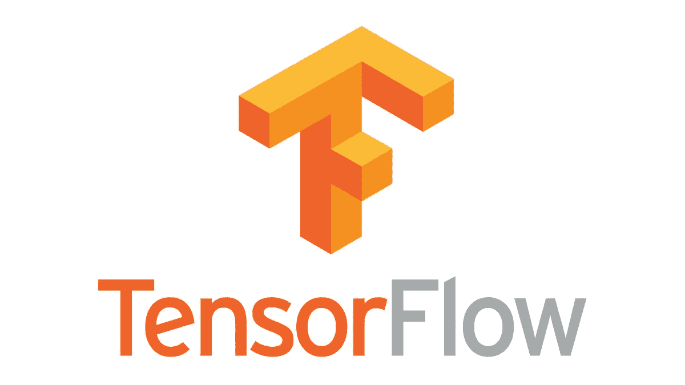
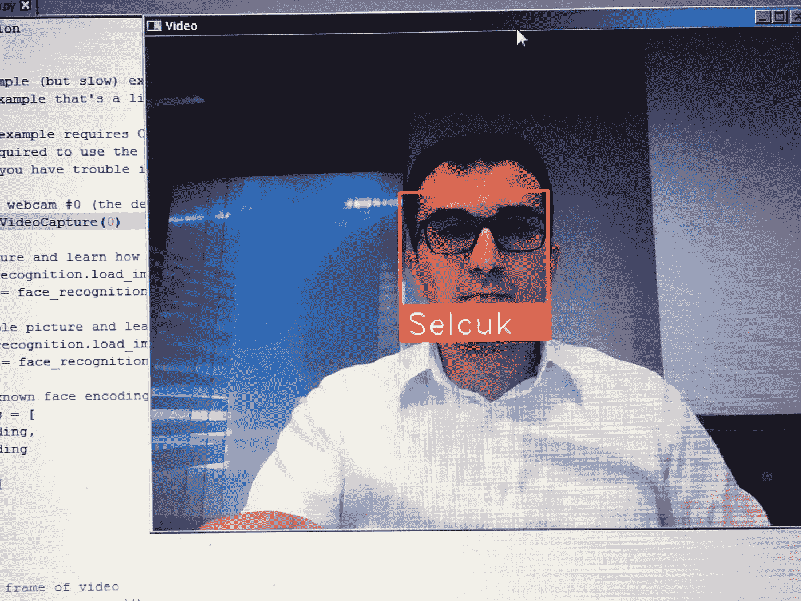

# 为什么我们在现实生活中使用人脸识别？

> 原文：<https://medium.datadriveninvestor.com/why-we-use-face-recognition-in-real-life-fd76d51ab636?source=collection_archive---------9----------------------->

面部识别用于从数字图像或视频源中识别一个人。最近，面部识别在 2018 年开始在大的智能城市流行，以监测人们的运动和行为。使用的常见理由是为了公共安全和商业利益来追踪人类利益。一些例子，如监控公共闭路电视摄像头，机场的移民检查可以用于公共安全。此外，关于商业利益，我们可以提到零售商店、教育学校、医疗诊所等，它们可以使用面部识别来跟踪购物者、患者和学生。购物者多久来这些商店一次？人们最喜欢买什么？有多少病人在使用人脸情感技术就诊时感到高兴？

(photo credit: ©iStock.com | LeoPatrizi)

在本文中，我将介绍如何在 Docker 容器中使用 TensorFlow 人脸识别 API 来执行实时视频后期处理。它将以 1/4 的分辨率处理每个视频帧，并且只在每隔一帧的视频中检测人脸。由于我使用网络摄像头，OpenCV 安装是必须的。完整的代码可以在下面由 Adam Geitgey 分享的 Github 链接中找到；

[https://github.com/ageitgey/face_recognition](https://github.com/ageitgey/face_recognition)

TensorFlow™ is an open source software library for high performance numerical computation.

该模型使用 dlib 的人脸识别库建立，对标记人脸的准确率超过 99%。由于 face_recognition API 依赖于用 C++编写的 dlib，因此 Dlib 包含了广泛的机器学习算法。所有这些都被设计成高度模块化，执行快速，通过一个干净的现代 C++ API 使用简单。

Dlib is a modern C++ toolkit containing machine learning algorithms

这些 python 代码建议在 macOS 或 Linux 上运行，windows 没有得到官方支持，但我能够在使用 windows 7 的计算机上运行，所以它应该也能在您的 Windows 平台上运行。

**以下是代码的先决条件:**

*   Python 3.5
*   张量流
*   OpenCV 3.4 版
*   Dlib C++
*   CMake 3.12

**导入必要的库到你的系统:**

*导入人脸识别
导入 cv2*

**加载一张样图，学习如何识别。**

*Obama _ image = face _ recognition . load _ image _ file(" Obama . jpg ")
Obama _ face _ encoding = face _ recognition . face _ encodings(Obama _ image)【0】*

为了用 OpenCV 构建我们基于深度学习的实时人脸识别，我们需要以有效的方式访问我们的网络摄像头。网络摄像机可以是我们系统中预装的默认设备、通过电缆连接的第三方摄像机或 IP 摄像机。通常，您的笔记本电脑网络摄像头是“0”设备。

**现在，我们可以使用 openCV 代码开始一个直播视频流，并使用下面的*代码发送它的直播流；***

*视频 _ 捕捉= cv2。视频捕捉(0)*

**让我们为我们的摄像头执行 python 命令，这将需要几秒钟来启动摄像头:**

*$ python facerec _ from _ web cam . py*

下面是运行这些代码的示例屏幕截图:

Webcam real time face detection

由于 OpenCV 可以访问您的网络摄像头，所以您应该可以看到任何检测到的面部图像的输出视频帧。检测速度取决于您是否正在使用计算机的 CPU 或 GPU 资源。如果你有一台多 CPU 内核的电脑，人脸识别可以并行完成。例如，如果您的系统有 4 个 CPU 内核，通过并行使用所有 CPU 内核，您可以在相同的时间内处理大约 4 倍多的图像。

你还会注意到，人们如何靠近镜头，预测会比距离更远更准确。

**结论**

在这篇文章中，我们学习了如何使用深度学习和 OpenCV 使用我们的网络摄像头进行实时人脸识别。如果你喜欢并从这篇文章中学到了什么，请为它鼓掌。如果您有任何问题/意见/想法，可以通过 linkedin 给我发一封短信。

**资源:**

[https://github.com/ageitgey/face_recognition](https://github.com/ageitgey/face_recognition)
[https://pypi.org/project/face_recognition/](https://pypi.org/project/face_recognition/)
[http://dlib.net/](http://dlib.net/)
[https://cmake.org/](https://cmake.org/)
https://www.tensorflow.org/