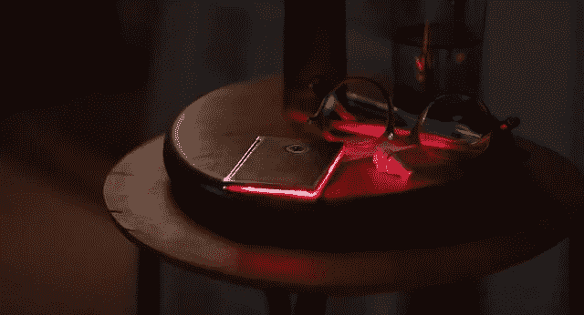

# 为什么我们永远不会爱上智能手机的虚拟助手

> 原文：<https://medium.datadriveninvestor.com/why-we-will-never-fall-in-love-with-our-smartphones-virtual-assistant-606924f7730e?source=collection_archive---------3----------------------->

在看完她的《T1》(2014 年金球奖最佳剧本奖)后，我被它令人惊叹的表演和令人愉悦的技术迷住了。《连线》甚至认为[她将比《少数派报告》更主导 UI 设计。](http://www.wired.com/design/2014/01/will-influential-ui-design-minority-report/)

在电影中，技术对用户来说几乎是完全透明的:主角西奥多和他的“智能手机”之间的大部分交互都是通过耳机和虚拟助手进行的，他只在想看一张照片时才触摸小屏幕。这是他的小玩意的样子:

几乎看不到可视用户界面，这就是信息:人类交互是个人计算的未来。

 [## 今年值得关注的人工智能趋势——数据驱动的投资者

### 预计 2019 年人工智能将取得广泛的重大进展。从谷歌搜索到处理复杂的工作，如…

www.datadriveninvestor.com](https://www.datadriveninvestor.com/2019/02/19/artificial-intelligence-trends-to-watch-this-year/) 

就在我们被介绍给萨曼莎(超级智能的个人助理)之前，我们看到了西奥多典型的一天:他对着电脑写文档，触摸屏幕前的一个区域进行无语音交互(没有键盘或鼠标)，他使用耳机查看新邮件，回复邮件，浏览新闻等。这种人工智能已经在进入我们口袋的路上了，但是萨曼莎呢？

萨曼莎的声音和行为像一个真正的人:当有重要的事情要说时，她会改变声调，当西奥多正在谈话时，她会为打扰他道歉，甚至会开玩笑和大笑。毫无疑问，我们将达到虚拟助手听起来非常真实的阶段，因此我们可以相信我们正在与人类互动。但即使那样，我们也不会爱上他们。

这部电影的一个前提是，萨曼莎像正常人一样进化和成长，她从自己的经历中学习(这很快就会成为现实，因为 Siri/Alexa/谷歌助手已经开始发生这种情况)。然后她开始有感觉:她变得不安、悲伤、烦恼…这是我们永远不会从智能手机上看到的一件大事。我们生活在一个竞争激烈的世界中，用户根据他们的偏好和喜欢在服务之间切换。如果前一天晚上我们发生了争执，在危机时刻我们会相信我们的智能手机吗？公司会为了出售最令人愉快的助手而争斗吗？

这些问题的答案是否定的和肯定的。如果每天都有伤害消费者的风险，没有公司敢假装他们的助理有感情。让我们不要忘记，我们会爱上一个完全不理解难过或受伤是什么意思的人吗？我们还会相信那些只有有限的“好”感觉的人吗？

而生理上的限制呢？如果不能构建无限数量的服务器，计算能力和存储能力就会受到限制。这仅仅意味着所有这些助手将需要分享知识，因此他们的行为不会有足够的不同(至少我们需要实际感受到对其中一个人的爱)。

我甚至还没有谈到隐私问题:我们的助理从我们这里了解到的个人信息会怎么样？如果一家公司知道我们生活中发生的重大事件，让我们成为现在的我们，我们会感到舒服吗？所有这些信息会存储在哪里？如果出现数据泄露，会发生什么？我想你明白我的意思了。

虚拟助手会变得更聪明，他们会理解我们说的几乎每一句话，而且很可能会对几乎每一个问题都有答案。他们会从未解决的问题中学习，我们甚至可以教他们某些答案，最终，我们会非常喜欢他们，没有他们我们无法生活。但是爱上他们？就像今天任何人爱 Siri 一样。

*最初发表于*[*【geekonrecord.com】*](https://geekonrecord.com/2014/01/17/why-we-will-never-fall-in-love-with-our-virtual-assistant/)*。*

*图片来自华纳兄弟影业*