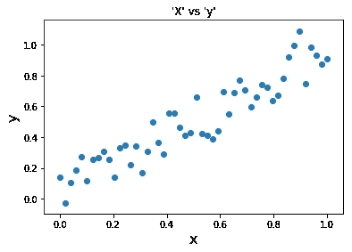
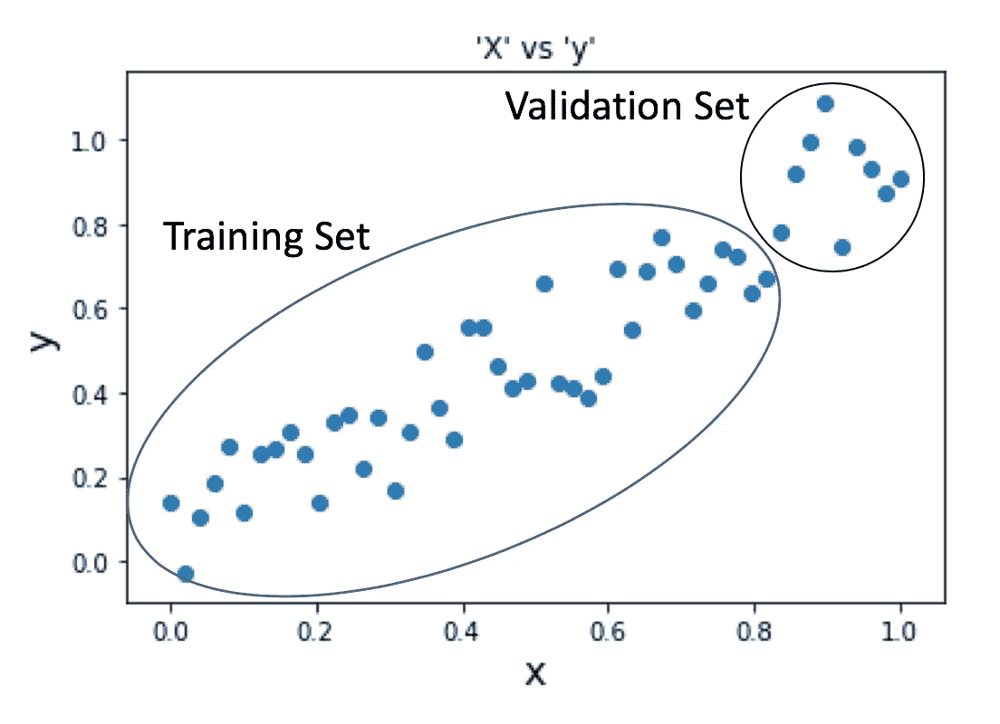
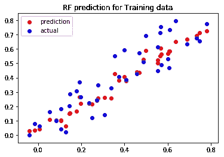
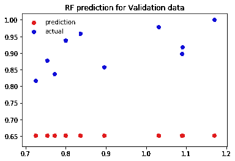
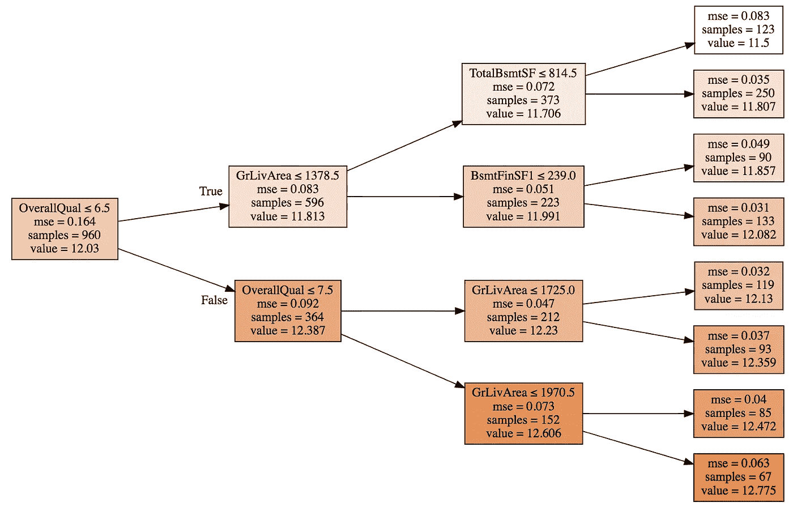
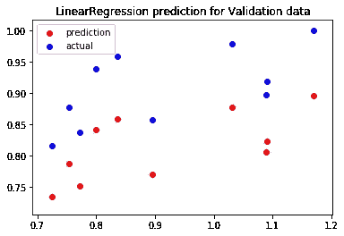
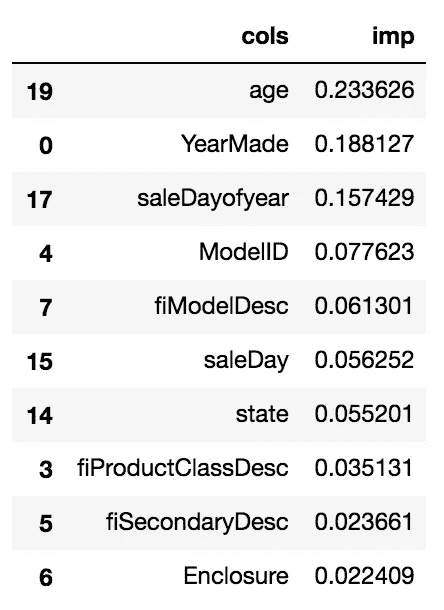

# 为什么随机森林不能预测趋势，如何克服这个问题？

> 原文：<https://medium.datadriveninvestor.com/why-wont-time-series-data-and-random-forests-work-very-well-together-3c9f7b271631?source=collection_archive---------0----------------------->

[](http://www.track.datadriveninvestor.com/1B9E)

R 随机森林通常不受统计假设、预处理负担和丢失值处理的影响，因此被认为是大多数实用解决方案的良好开端！虽然随机森林可能不会为你赢得一场 Kaggle 比赛，但进入排行榜的前 15%是相当容易的！相信我，我在大会上使用随机森林和它的变体额外树分类器(高度随机的树)尝试并赢得了一场课堂 Kaggle 比赛，ROC 得分为 87%，比第二名多 5%。

在做由[杰瑞米·霍华德](https://en.wikipedia.org/wiki/Jeremy_Howard_(entrepreneur))(我是他的忠实追随者)教授的 fast.ai 的[机器学习入门](https://course.fast.ai/ml)课程时，我被介绍到了随机森林中的**外推问题。Jeremy 声称随机森林不太适合时序数据！通过这篇文章，我分享了 Jeremy 的教导，并探索了在随机森林中解决外推问题的技巧。**

但是，我只是最近才开始在 Kaggle 竞赛中使用时间序列数据，例如[谷歌商店预测](https://www.kaggle.com/c/ga-customer-revenue-prediction)或[出租车费用预测](https://www.kaggle.com/c/new-york-city-taxi-fare-prediction)，令我惊讶的是，我在随机森林中遇到了一个缺点。 ***随机森林不太适合处理时间序列分析时经常遇到的增减趋势，比如季节性！*** (如果你不了解时间序列分析，这里的是一篇可以帮助你入门的文章)

让我借助一个例子来说明**外推**。

让我们为此创建一个合成数据集。(*注:卡住时，创建一个合成数据集，亲自尝试！—来自杰里米*的建议。

```
x = np.linspace(0,1, num=50)
```

设 x 是我们的输入，它线性分布在 0 和 1 之间，是一个大小为 50 的向量。

假设，我们的因变量‘y’是‘x’的线性函数，带有一些随机噪声以增加方差。随机噪声在某种程度上模拟了真实世界的场景。

```
y = x + np.random.uniform(-0.2, 0.2, x.shape)
```

让我们画出我们的`X`和`y`。



很明显,“X”和“y”之间存在线性关系，并且有增加的趋势。

这可能与现实世界用例中的增长趋势非常相似，例如 10 月、11 月、12 月的销售增长或 2019 年的人口增长等。

杰里米的说法是，在这样的数据上拟合随机森林不会给我们带来好的结果。所以，让我们试着适应一个随机的森林，看看会发生什么！

```
X_train, X_val = x[:40], x[40:]
y_train, y_val = y[:40], y[40:]
```



我们将使我们的随机森林回归器适合训练数据，并首先探索它如何预测`X_train`，然后继续进行`X_val`。

```
m = RandomForestRegressor(n_estimators=10)
m.fit(X_train, y_train)
m.predict(X_train)
```



我们的随机森林似乎在训练数据方面做得很好！(应该是这样的，它以前也看到过这个数据)。

现在，让我们进入有趣的部分，预测`X_val`。请记住，我们的随机森林之前没有看到过这些数据，当我们预测验证数据时，您预计会发生什么？在向下滚动之前，这是花一分钟思考这个问题的好时机。



我们的随机森林无法预测它以前从未见过的值！它预测所有验证数据的因变量值为 0.65。奇怪？不完全是。

## **为什么我们的验证集的预测值明显小于实际值，而它对训练数据却非常有效？**

要回答这个问题，我们可能需要深入了解一下[随机森林是如何工作的](https://link.medium.com/oBMyj5bG1S)。我们将借助艾姆斯房屋数据来解释这个答案。

随机森林由决策树(弱分类器)组成，决策树本身是对训练数据的二分分裂(决策)的组合。直觉上，你可以认为这是一种对最近邻居进行分组的奇特方式。决策树把可能属于同一价格类别的房子集合在一起，也就是说，它通过对房子进行分组来区分昂贵的房子和便宜的房子。总质量≤ 7.5 居住面积≤1970.5 的房屋(67 个样本/房屋)在最底层的叶节点中分组在一起。对于验证集中落在该叶子中的任何房屋，预测值是 67 个样本的平均值，即 12.775。



A simple Decision Tree (Ames housing data)

*对于随机森林以前没有见过的任何数据，它充其量只能预测以前见过的训练值的平均值。如果验证集包含的数据点多于或少于训练数据点，随机森林将为我们提供平均结果，因为它无法推断和理解数据的增长/减少趋势。*

因此，随机森林模型不能很好地适应时间序列数据，可能需要在生产中不断更新，或者使用超出我们训练集范围的一些随机数据进行训练。

回答诸如“明年的销售额会是多少？”，“五年后中国的人口会是多少？”、“50 年后全球气温会是多少？”或者“在接下来的三个月里，我的手套销量是多少？”使用随机森林会变得非常困难。

## **如何解决这个外推问题？**

1.  **寻找其他选项**

因此，在这种情况下，拟合线性模型或神经网络可能足以预测具有增加/减少趋势的数据。



这是我在同一个数据集上拟合线性回归模型时的结果。还可以安装一个*神经网络*，用于需求预测或任何其他类型的时间序列图。请继续关注另一篇关于如何使用神经网络进行需求预测的文章。

**2。在训练随机森林时忽略数据的时序成分**

这是一个微妙但又是另一个可能的方法来***提高泛化*** (我们说一个模型泛化得好，如果它对以前没有见过的数据预测得好，并且机器学习中的一个主要挑战是创建可扩展和可泛化的健壮 ML 模型)使得我们的模型能够预测未来数据是为了 ***不使用我们的数据中可能与时间成分*** 相关的特征)。我们的输入矩阵可能有各种用于预测因变量的特征。如果我们不使用与时间相关的特征进行预测，我们的随机森林模型将能够很好地概括！

考虑一个例子，Kaggle 上的推土机挑战蓝皮书，其目的是预测未来几个月重型设备的“价格”。在检查功能对竞争的重要性时，我们得到了下表:



Courtsey: fast.ai (Jeremy Howard)

最重要的特征是`Age`、`YearMade`和`SaleDayofyear`，它们都是时间相关的！这也可能是一个很好的时机来说明验证 LRMSE 分数为 0.249366，具有上述特征重要性。

如果我们放弃这些依赖于时间的特性，您预计我们的验证分数会有什么变化？下降到 0.210967！

我们的模型概括得更好，因此，我们看到验证集对数均方根(LRMSE)误差的减少。

进一步改进:使用随机森林进一步改进预测的另一个想法是使用时间序列预测来消除季节性，然后使用随机森林进行预测。