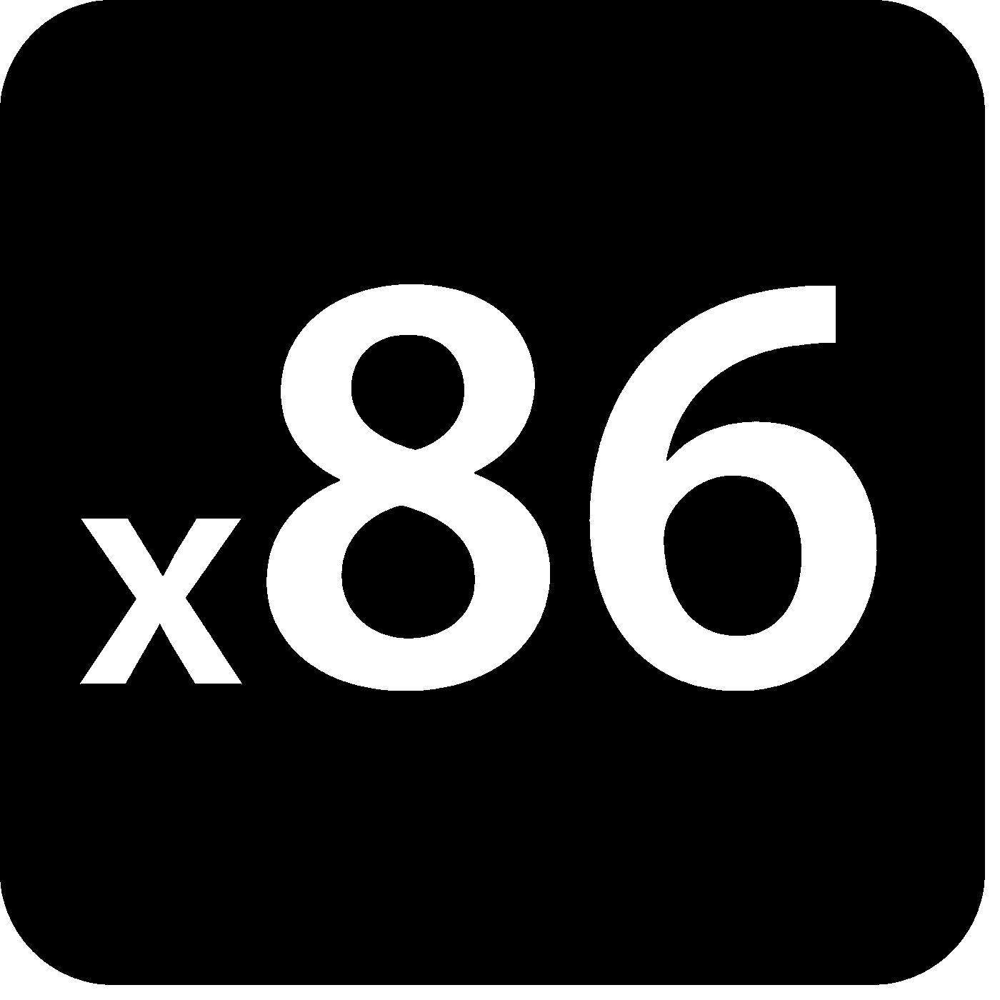
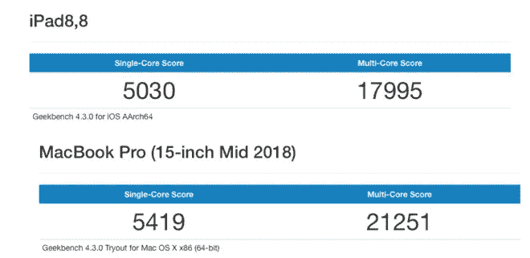
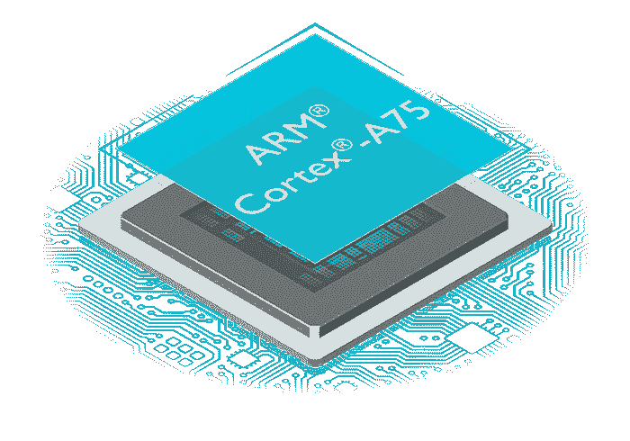

# 为什么 x86 无法生存

> 原文：<https://medium.datadriveninvestor.com/why-x86-wont-survive-220f94c6c5ef?source=collection_archive---------2----------------------->

x86 是英特尔自 1978 年以来创建的微体系结构。它支持大多数笔记本电脑，很可能支持你现在正在使用的电脑。直到几个月前，它还被认为是强大、有效和可靠的。

仅在 2018 年发现的 x86 微架构中发现的漏洞和利用的简短历史:
- Meltdown，
- Spectre，
-SMT/超线程被发现是安全威胁。

看起来很少，对吧？不。这 3 个缺陷是最近历史上发现的一些最主要的缺陷，影响几乎所有的笔记本电脑、台式机和服务器核心。虽然已经对前两个问题进行了修复，但主要缺点是性能损失高达 15%。在 Spectre 和 Meltdown 修复后不久，SMT/超线程技术已被证明会使英特尔和 AMD CPUs 上的推测性执行缺陷变得更糟。x86 凭借其陈旧和混乱的指令集，开始显示出它的老化和它曾经能够做到的事情的无能。

这就是 [**手臂**](https://www.arm.com/) 的用武之地。ARM 成立于 1990 年，是台式机处理器的更新、更轻量级的“替代品”，通常用于手机。如今，大多数智能手机都使用基于 ARM 的处理器，如高通的骁龙系列、麒麟和苹果定制的 7 纳米 A 系列处理器。这些都是轻量级的，功能强大，效率极高。这些处理器*比几年前的一些高端游戏台式机*更好，但它们有一个主要缺点——这就是为什么它们从未用于笔记本电脑或台式机:应用程序兼容性。

The newest iPad pro vs Macbook Pro geekbench

几乎所有的应用都是专为 x86 开发的，没有考虑 ARM 的空间。然而，这就开始[改变](https://www.onmsft.com/news/google-chrome-could-be-coming-to-windows-10-on-arm-soon-with-help-from-microsoft)。谷歌正在帮助高通和微软将他们的浏览器带到 ARM 驱动的 Windows 设备上。这是一个缓慢的开始，但这标志着 x86 终结的开始。
谷歌看到了 ARM 的好处，苹果和微软也看到了。如果他们开始致力于让一切都与 ARM 兼容，许多主要的开发者(比如 Adobe)将会跟进并为这个架构发布他们自己的软件。随着兼容性的增加，更多的用户会因为速度、可靠性、安全性和价格而转向 ARM。越来越多的人会离开有着明显漏洞的 x86 CPUs，而代之以 ARM 驱动的设备。

当然这不会在一年甚至两年内发生，但最终会发生。这将是 x86 的终结，没有它我们可能会过得更好。