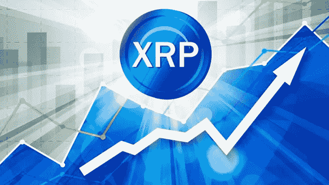

# 为什么 XRP 如此分裂，但仍将繁荣。

> 原文：<https://medium.datadriveninvestor.com/why-xrp-is-so-divisive-but-will-still-flourish-68ace0424f64?source=collection_archive---------19----------------------->

[XRP](https://www.youtube.com/watch?v=cfeGCQ1xwg0) ，一种通常与 Ripple 公司有关的加密货币，尽管他们试图保持距离。通常是秘密社区中许多笑话、迷因和两极分化意见的结尾。

这背后有两个核心原因。

1.  **不是分散:**

无论什么代表[布拉德·加林豪斯可能会说](https://www.ccn.com/xrp-is-very-clearly-decentralized-ripple-ceo-brad-garlinghouse/)，事实上，有一家公司拥有首席执行官和广告团队，向潜在的合作伙伴发行产品，使得 Ripple 成为一个中央集权的实体。加密货币的主要卖点(除了潜在的财富)，就是货币是[去中心化](https://www.forbes.com/sites/investor/2018/09/06/decentralized-cryptocurrencies-are-the-future/)。

没有管理机构来提高利率，或者完全控制区块链。Ripple 托管了大部分 XRP 代币，这一事实令许多人担忧。

2.他们与银行合作。

比特币的产生是为了分离社会对银行这一金融服务的需求，而银行是生活的本质所在。Ripple 设计了 XRP 和它的其他产品， [Xcurrent](https://ripple.com/ripplenet/process-payments/) 和[XV via](https://ripple.com/ripplenet/send-payments/)为银行谋福利。因此，在这个过程中，公平竞争和破坏加密货币的目的。

这两个症结引起了纯粹主义者的愤怒，他们不会用棍子去碰它。俗话说，一个人的垃圾是另一个人的财富。在这种情况下，全球有多家银行与 Ripple 合作，目前它们的数量 [**多得无法列举。**](http://rppl.info/)

批评者主要担心的是，尽管有无尽的合作伙伴名单，但只有少数几个在使用 XRP，这是通过他们的三个主要产品之一的 [Xrapid](https://blockexplorer.com/news/what-is-xrapid/) 合并的。

只要银行不使用 XrapidXRP 仍将停滞不前，事实上，相当无用。

如果银行不将 Xrapid 整合到他们的协议中，那么 Ripple 就失去了大规模采用的主要策略，迫使他们专注于初创公司。反过来，这将大大增加风险，同时大大减少暴露。

对瑞波来说幸运的是，日本最大的银行财团 [SBI 控股](http://www.sbigroup.co.jp/english/)已经采用了这项技术；与他们合作[创建资金 Tap 支付应用](https://cointelegraph.com/news/japanese-financial-giant-sbi-and-ripple-launch-blockchain-payment-app-in-japan)。这将会改变他们的游戏规则。

Money Tap 将成为 Ripple 通向大规模采用的门户。当然，该应用将基于 Xcurrent，因为它将专注于日本。然而，如果 SBI 控股希望扩大业务范围，未来将需要专门从事跨境支付的 Xrapid。

当这种情况发生时，预计闸门会突然打开…因为许多对加密货币知之甚少的人将通过标准银行业务获得同样的好处。这基本上会减少对 90%的[替代硬币](https://www.investopedia.com/terms/a/altcoin.asp)的需求，在这场皇家战役后只留下强者。