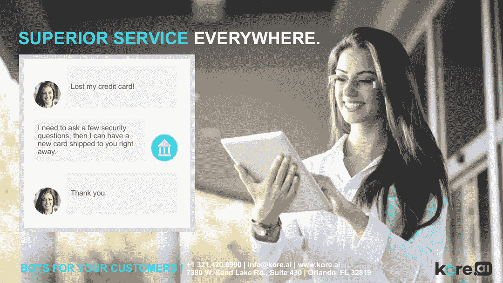
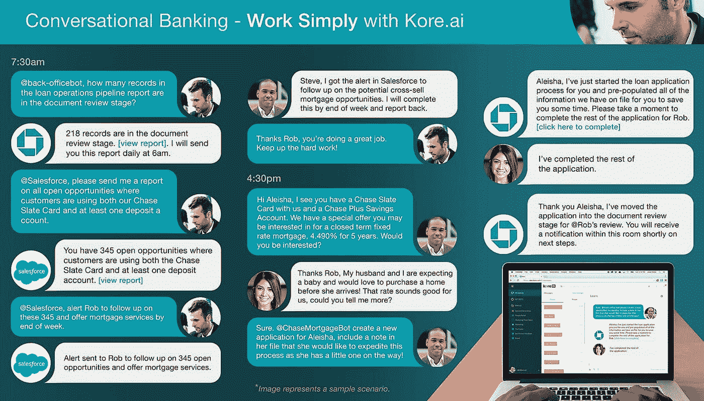
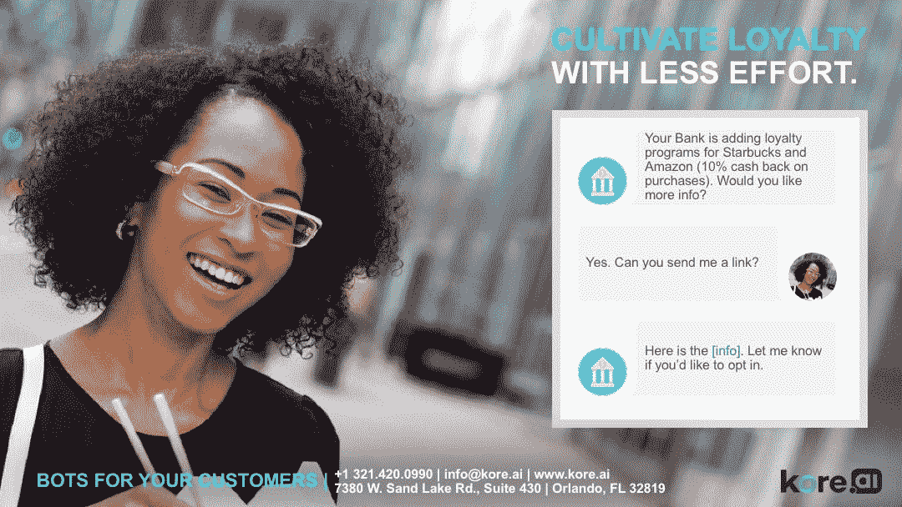

# 为什么你再也无法避开聊天机器人了

> 原文：<https://medium.datadriveninvestor.com/why-you-cant-avoid-a-chatbot-anymore-ef37cfb9198c?source=collection_archive---------0----------------------->

***复杂的人工智能驱动的对话解决方案将推动全球商业的未来***

你知道让聊天机器人与你的客户交谈并满足他们的需求很酷，但你有没有想过这会如何影响你的底线？你喜欢人工智能是因为它现在很流行，还是你已经想好了如何通过它获得具体的回报？无论是哪种情况，技术都不是一成不变的——它总是在进化，并取代我们生活中的许多东西。你要么跟上，要么淡出。保持漂浮的最好方法是理解它是如何影响你的世界的。

**聊天机器人，游戏改变者**

聊天机器人凭借其独特、新颖的技术界面，正在彻底改变客户服务或企业运营的管理方式。你可以通过聊天或通过界面说话来完成事情，而不是打字或发送电子邮件。这里的问题是聊天的另一端不是一个活生生的人；你在和一台模拟人类反应的机器说话。

如果你愿意，考虑一下这些用例:今天，你用聊天机器人给银行打电话，获取你的账户余额。但你也可能在客户服务电话的开始部分与聊天机器人交谈，以传达诸如你的姓名和你打电话的原因等信息。如果你已经[点了星巴克、披萨或者优步之旅](https://www.inc.com/larry-kim/10-examples-of-how-brands-are-using-chatbots-to-de.html)，你可能会和机器人聊天，而不是和电话那头的人聊天。1997 年之于互联网，2018 年之于聊天机器人。

然而，并非所有的机器人都生来平等。有些人依赖于预先编程的反应，除了检索那些固定的答案之外，他们几乎无能为力。[看看这些复杂聊天机器人应用的例子](https://masterofcode.com/blog/10-best-chatbot-ai-apps)。

**为什么是聊天机器人**

从全球来看，如今商业消费者的平均年龄是 37 岁。企业应该足够温和，能够与她沟通。聊天机器人是个好主意，因为早期的客户互动形式已经过时了。例如，许多千禧一代不喜欢打电话给别人(*华尔街日报* [最近报道他们也不喜欢接门铃](https://www.wsj.com/articles/ask-not-for-whom-the-doorbell-tolls-they-wont-answer-it-1503864316)。)[根据一家电信公司](https://news.o2.co.uk/press-release/making-calls-has-become-fifth-most-frequent-use-for-a-smartphone-for-newly-networked-generation-of-users/)的研究，你智能手机的电话部分是普通大众第五大最常用的应用。

摩根大通取消了约 65%员工的语音邮件服务，这些员工是志愿者，不经常与公众交流。这一举措意味着每年节省 300 万美元。

如果你的客户没有打电话给你，你有什么办法与客户沟通？虽然 Twitter 是一个有用的客户服务工具，但这些互动是公开的，可能会导致许多来回的交流；它还需要一个人来监控它。当然，你必须有办法通过电子邮件联系到某人。但是聊天机器人的优势是反应迅速。此外，它们不需要人类的帮助。

聊天机器人还有其他优势，比如

*   不睡觉。你可以提供 24/7 在线客户服务，非常适合你的夜猫子客户或拥有全球市场的公司。
*   不用等了。客户现在可以询问他们的问题，而不是被搁置“等待下一个有空的代表”。
*   数据收集。聊天机器人会给你互动的记录。你可以利用这一点来更多地了解你的客户，他们的习惯，沟通的语气，等等。这种分析对于销售和营销团队以及客户服务的人性化方面都很有价值。
*   强沟通。人类有糟糕的日子。人们可能会忘记为顾客的生日寄贺卡。聊天机器人可以被编程来做后者，并且永远不会偶然听起来脾气暴躁。聊天机器人可以被编程为与人类一起工作，如果需要，让你的团队有能力加入对话。
*   快乐的顾客。78%的消费者因为糟糕的服务体验而放弃交易或没有购买意向。根据金融培训服务，96%不开心的顾客不会抱怨，但是 91%的顾客会离开并且永远不会回来。留住一个客户的成本也远低于获得一个新客户的成本。所有这些加起来就是客户服务是你公司的一个关键部分。
*   战胜人类。聊天机器人可以在 1 秒钟内回答一个问题，而人类可能需要 5 分钟，并在 20 秒内完成一项任务，而人类需要 10-20 分钟。这就是机器学习& AI。但潜在的是，聊天机器人不需要太多的时间来训练，24/7 工作，可以拥有全渠道的存在，每项任务的成本只是人类的一小部分，可以帮助人类更快地检索信息，最重要的是，可以与人类交谈。

**一切都是为了价值**

如果您正在考虑自动化(以实现成本节约)，那么您是对的。聊天机器人在这方面做得很好，处理客户服务并将下一阶段交给人类。您可以加强客户服务，减少等待时间，更快地解决问题，并取代手动任务。但是[自然语言处理](http://blog.imaginovation.net/amazons-ai-services-and-how-they-can-help-your-business)很快改变了游戏规则:加上机器学习，人工智能程序可以从经验中学习，并提供实质性的价值。

虽然整个客户服务部门不太可能被取代，但聊天机器人可以为公司节省数万美元的工资和福利成本。这也有助于提高客服人员的满意度。根据 BI Intelligence 的说法，这种增强可以自动化 30%的联络中心团队任务，为美国公司节省 230 亿美元。好好想想吧！！！

by-Phani maru paka

*   聊天机器人布道者，Kore . ai[的产品营销和技术作家](https://medium.com/u/949cb4612ef0?source=post_page-----ef37cfb9198c--------------------------------)

## 这篇文章发表在 [The Startup](https://medium.com/swlh) 上，这是 Medium 最大的创业刊物，有 312，043+人关注。

## 在此订阅接收[我们的头条新闻](http://growthsupply.com/the-startup-newsletter/)。

