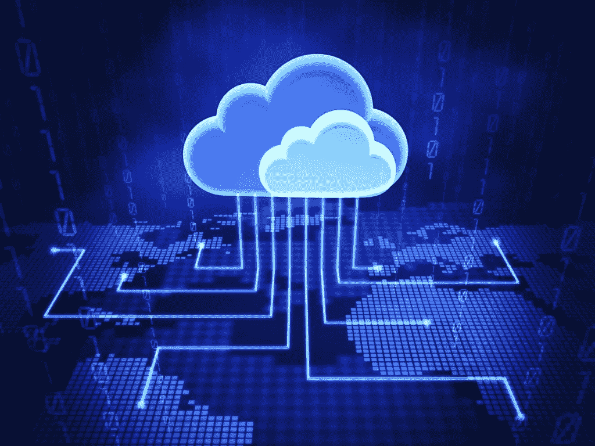

# 为什么您需要让您的企业拥有基于云的未来

> 原文：<https://medium.datadriveninvestor.com/why-you-need-to-give-your-business-a-cloud-based-future-611763be3cf1?source=collection_archive---------11----------------------->

事实证明，云对每个企业来说都是一个福音，提供了一系列数字革命之前无法获得的好处。它为组织提供了随时随地连接所需的灵活性。获得对数据的访问从未如此简单。转向云的公司记录了管理和维护其信息技术(IT)系统的较低成本。此外，除了增加和无限制的移动性、自动升级和增强的安全性之外，它们还在存储需求方面享有可扩展性优势。有了这些好处，组织将继续走在最新技术发展的前沿。

云技术的采用继续快速增长。有必要让自己跟上该领域的最新发展和趋势，并利用这些知识来推动数字化转型和 It 产品组合的现代化。

以下是云计算的五大创新趋势。

***1。*** ***更高数量的应用将在云上可用***

让应用程序在云上可用有很多好处。它不仅有助于企业专注于更高价值的活动，而不会耗费系统管理的时间，而且使应用程序在云上可用还可以使您的企业更加敏捷，并在很大程度上降低成本。通过规模经济，云计算提供商以较低的成本提供了更大的可扩展性。为了跟上这一新趋势，你可能会从一个低风险、低价值的应用程序开始，使用最少的客户数据，直到你掌握了云是如何运行的。此后，您可以选择升级。

***2。*** ***不再有传统基础设施***

由于云的不断发展的特性，企业很快将很难绘制其基础架构的地图。软件和硬件将完全分离，因为公司现在可以在网上找到无价的应用。这意味着公司可以在互联网上运行应用程序，而不是在自己的服务器上运行，从而消除了购买新服务器的需求。作为替代，企业可以转向模块化软件，其中组件可以被修改而不关闭整个程序。这在应用程序较大且较复杂的情况下非常有益。

***3。*** ***人力资源与营销将控制技术创新***

技术世界将很快被人力资源和市场营销所控制。组织开始意识到通过云使用大数据应用程序的好处，此外还意识到人力资源和营销团队现在也可以将它用于各自的部门。这取代了缓慢、耗时、过时的流程。

***4。*** ***软件会从社交媒体上获取灵感***

预计软件将很快开始获得通常与社交媒体网站和应用程序相关的特征。因此，开发人员不再需要担心提供昂贵的基础设施，如服务器或存储设备。软件将根据需求进行管理，而不是相反。

***5。*** ***软件将部分从硬件***

云的未来就在眼前，并且还在扩展。预计软件将与硬件分离，因为在最终与硬件交互之前，它需要经过无数次过滤。因此，基于平台即服务或前端应用构建的应用将缺乏硬件交互。

云计算领域即将到来的趋势确实正在塑造商业世界的未来。因此，公司应该考虑将他们的 It 运营转移到云上，并享受它提供的众多好处。

**概要:**

为了在竞争中处于领先地位，组织正在快速采用云计算策略，并使用它们来降低成本、享受更高的可扩展性和增强的安全性，以及其他优势。一些即将到来的趋势包括云上应用程序的更高可用性，软件很快将与硬件分离，软件从社交媒体中获得灵感，人力资源和营销负责技术创新，以及不再有传统和不必要的基础设施。