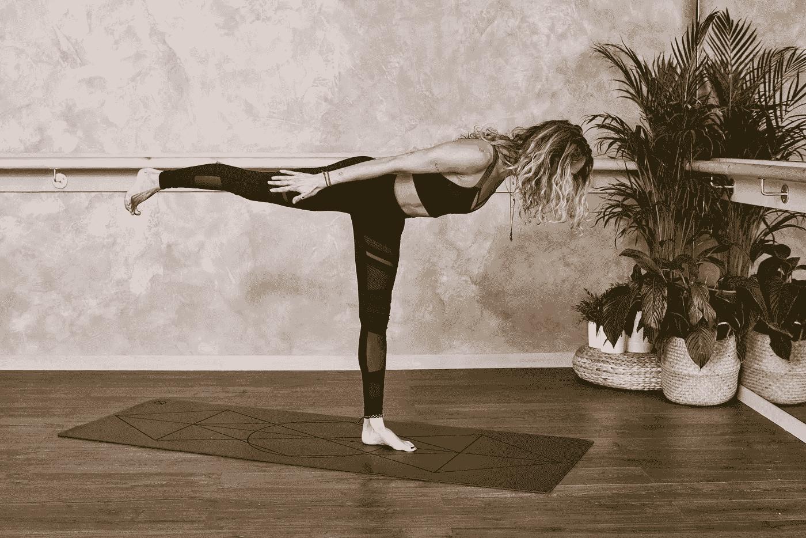
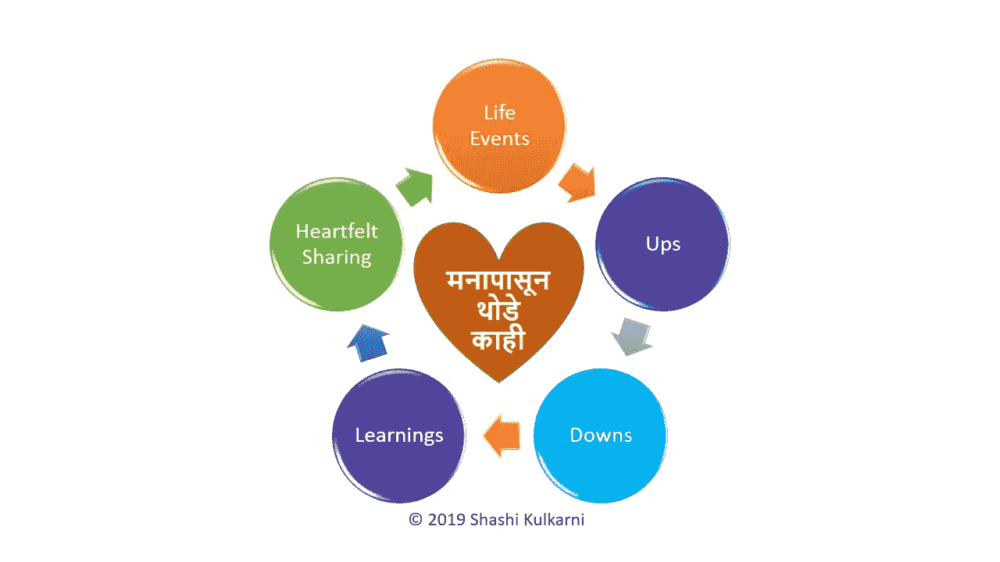

# 为什么你需要把 2020 年的一些目标变成习惯

> 原文：<https://medium.datadriveninvestor.com/why-you-need-to-turn-some-of-your-2020-goals-to-habits-4771a31e8222?source=collection_archive---------9----------------------->

## 疯狂的定义是一遍又一遍地做同样的事情，却期待不同的结果——阿尔伯特·爱因斯坦

Photo by [Form](https://unsplash.com/@theformfitness?utm_source=unsplash&utm_medium=referral&utm_content=creditCopyText) on [Unsplash](https://unsplash.com/s/photos/goals?utm_source=unsplash&utm_medium=referral&utm_content=creditCopyText)

随着新年的临近，我们都喜欢谈论(再次)设定目标。

我们享受假期，主要做两件事。与家人和朋友一起庆祝节日，思考我们新的一年的目标。

我们中的许多人也会回顾过去，看看我们在这一年中实现了多少我们设定的目标。

但是，我们当中有多少人回顾四到五年，看看我们在这一时期在建立我们努力实现的目标方面重复做了什么？

许多目标都属于健康(饮食)、健身(锻炼)、正念(冥想)、专业(学习)、财务(职业)或财产(物质)。

斯克兰顿大学的研究表明，只有 8%的人实现了他们的新年目标。

 [## 跑步摆脱疯狂:锻炼如何提高你的生产力|数据驱动的投资者

### 没有比锻炼更好的方式来开始一天的工作了。我试着一周至少做四天，在…

www.datadriveninvestor.com](https://www.datadriveninvestor.com/2018/10/23/running-to-get-rid-of-the-crazy-how-working-out-increases-your-productivity/) 

这些年来，我个人设立了很多目标，但很多都没能实现。我的很多朋友也有类似的经历。

当我们无法持续实现某些目标时，我们需要改变我们的方法。

这就是我们需要理解目标和习惯的区别的地方。

## 目标

目标是那些有明确的预定义的结果，可以衡量，并有目标时间限制的目标。理想情况下，它们必须是 SMART(具体、可衡量、可实现、相关和有时限的)。)

目标需要努力，有时会增加压力，如果一次又一次没有实现，会导致抑郁。目标是里程碑，需要持续的监控、测量和调整通往目标的道路。

如果出于某种原因，我们迷失了方向，落后了，要回到正轨需要付出巨大的努力。大多数时候，他们会从我们的列表中消失。这是健身房会员率在新年几个月后下降的时候。

> “必须记住，生活的悲剧不在于没有达到你的目标。悲剧在于没有可以达到的目标。”本杰明·e·梅斯

## 习惯

习惯是那些你经常有规律地做的动作，有时你并不知道自己在做。

习惯是专注于常规而形成的。它们可以通过在一段时间内专注于少量的持续努力来形成，直到它们不再是专注的努力，而是变成习惯。

根据 Maltz 博士在他的书 [Pschyco-Cybernetics](https://www.amazon.com/gp/product/0671700758/ref=as_li_qf_sp_asin_il_tl?ie=UTF8&camp=1789&creative=9325&creativeASIN=0671700758&linkCode=as2&tag=jamesclear-20&linkId=6DQ32IRAG3LU4PKA) 中提到的，“至少需要 21 天的时间来溶解旧的心理图像，并形成新的心理图像。”

习惯相对更容易培养，对我们的生活有重大影响。

斯坦福大学心理学家 B.J .福格[推荐每天重复的](http://tinyhabits.com/)“小习惯”。

> ”[成功人士并不是生来如此。他们之所以成功，是因为养成了做不成功的人不喜欢做的事情的习惯。”―威廉·梅克比斯·萨克雷](http://www.success.com/article/6-qualities-of-wildly-successful-people)

## 应该变成习惯的目标

仔细看看目标的类别，那些与健康、健身、正念有关的，甚至一些与专业知识有关的，不应该继续作为目标。

它们需要变成习惯。

> 我们当中有多少人真正回顾四到五年，看看我们在这一时期在建立我们努力实现的目标方面重复做了什么？

不要设定今年减重 30-40 磅的目标，而是要养成每周至少锻炼 5 次、每次 30 分钟的习惯，培养平均步行 10，000 步的习惯，消除吃垃圾食品的习惯。有了这些习惯，从长远来看你会过得更好。

不要设立一个目标，到 2020 年底征服你的五官，控制你的思维，通过活在当下实现正念，而是专注于建立每天冥想 10 分钟的习惯。用这种方法你会看到更好的结果。

尽管到 2020 年底，你可能不会活在当下，但在接下来的几年里，你会注意到你的专注能力大幅提高，你培养习惯的能力随着时间的推移而提高，你的生活似乎永远更加平静。

与其设立一年写 100 篇博客的目标，不如着重培养每天写 30 分钟的习惯。你可能会写更多的文章，谁知道呢，可能还会写一两本书。

不要把目光放在下一次大的促销上，而是要养成一种习惯，向你遇到的每一位顾客表示赞赏，并帮助你的经理解决他们每一两周可能会遇到的问题。

不用你开口，你的客户会向你的经理推荐你的名字。经理本人(或她自己)会开始考虑提拔你，因为你会在短短几个月内让他们的生活变得轻松。

## 需要继续作为目标的目标

这会给你留下你需要努力实现的目标。

确保它们是明智的目标，并计划去实现它们。

## 摘要

这个假期，当你开始列出 2020 年的目标时，请遵循以下步骤:

1.  列出目标清单
2.  回顾过去几年，找出那些每年都在你清单上的目标
3.  检查一下你无法实现这些目标的原因
4.  检查哪些需要变成习惯，即使可能需要更多的时间来达到里程碑
5.  在 2020 年培养这些习惯——这将比实现一个巨大的目标花费更少的时间(每个习惯 21 天)
6.  剩下的将是你想在 2020 年实现的目标清单

2019 沙希·库尔卡尼。保留所有权利。

