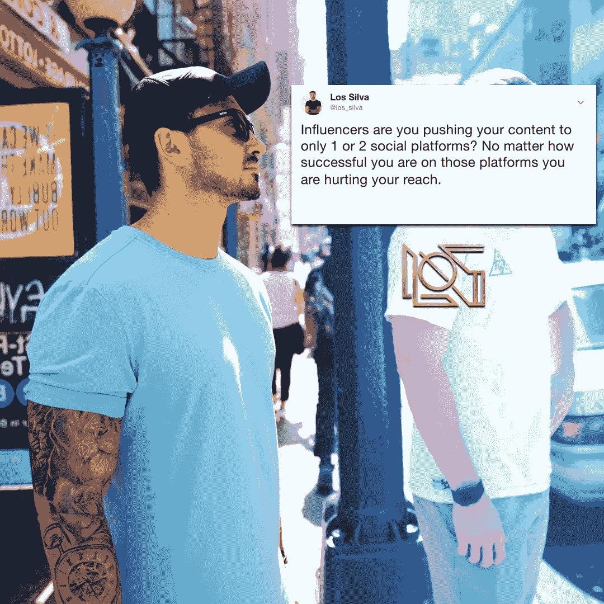
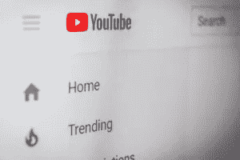

# 为什么你需要用我的放大器方法来放大你的内容

> 原文：<https://medium.datadriveninvestor.com/why-you-need-to-use-my-amp-method-to-amplify-your-content-7409cca4c84a?source=collection_archive---------33----------------------->

今天，我想和你们谈谈这个办公室里我们称之为“放大器方法”的东西

那么 AMP 代表什么，为什么它很重要？

AMP 代表**放大信息生产。**

这是什么意思？

你作为一个影响者，作为一个内容创作者，这几乎是每个人都应该为他们的业务做的事情…创造内容的人。

不一定是一个有影响力的人，比如，“看看我的蓝宝，我是个混球，我有一块古驰手表。”

在“我对我所服务的人、我所推销的产品以及我所信仰的有助于我的业务增长的事物有影响力”这样的信息中更是如此。

对吗？一个有影响力的人。

你需要不断扩大你的信息。

您可能已经在创建内容了。如果你没有，你就落后了。你必须开始创造内容。

然而，如果你在创作内容，大多数时候，大多数和我一起工作和交谈的有影响力的人，**都专注于一个渠道。**

那么，用一个渠道做有什么问题呢？

用**一个频道做这件事的问题是，你在和一种人说话，吸引一种人。**

我很清楚这一点，因为我管理着很多媒体。我和多少人一起工作，通过观察社会是如何发展的。

人们花时间在不同的渠道上，作为一个有影响力的人，你需要接触这些人。你所处环境中的各种类型的人。

我们生活在这样一个时代，我们刚刚获得了面对大量人群的机会。

人们有可能以我们能承受的价格与我们联系。

我们大多数人都负担不起把世界上所有的钱都花在电视广告上，老实说，这是为了谁？

我们与那些利用电视做广告的人一起工作，与他们利用放大的信息所能做的相比，他们从来没有看到转化。

所以，这样想……你已经在创造内容了。接下来，你需要开始将这些内容放大到多个社交平台，以接触到不同空间的合适人群。

如果你在为 YouTube 制作内容，那么你需要把这些内容剪切下来，放到 Instagram、IGTV、Instagram stories、脸书、LinkedIn、私人脸书团体、Twitter 等网站上。

你认为好是有道理的。我可以编辑我的视频，以适应每个社交平台的需求，从而扩大我的粉丝。

但是，您需要进一步删减这些内容。

通过转录来分解同样的 Youtube 视频。

一旦它被转录，你就可以编辑你的博客、推特、社交状态、长篇文章、电子邮件、媒体文章的内容..等等。

你现在在想…“哇，太疯狂了，我能做到。”

我会给你另一个来源的放大…撷取音频，把它放入 Spotify。把它用在你的播客上。

是不是开始听起来势不可挡了？当然是，但是如果你写下正确的过程并建立一个系统，这实际上是你可以实现的。

你必须从 10 个不同的地方开始吗？不，但是从下一个开始。

我看到太多有影响力的人在脸书有 30 万人，然后在推特上有 150 个粉丝。或者他们在 YouTube 上有 10 万人，却没有一个脸书页面。

人们在观察他们想去的地方。许多在多个平台上。

就我个人而言，我把所有的时间都花在 YouTube 上。我不去脸书。我知道有 Facebook Watch。我不在乎。

但是，你知道谁不在乎吗？所有看 Facebook 的人都会看，但不会加入 YouTube。

你知道谁根本不在乎吗？所有看 Instagram 故事和 IGTV 的人。

你知道谁对 Instagram 的故事不感兴趣吗？只听播客的人，对吗？

因此，你创造内容，却未能将这些内容推向多个平台，这是对你自己的一种**伤害。无法创造更多的对话。**

你需要创建一个地图，一个战略，把它放在每个地方，这就是你需要思考的方式。

我可以推送内容的前 3 个即时平台是什么？

如果你已经在 Instagram 上创建了，那就从为 IGTV 创建一些东西开始吧，一些只为那里的人而特别的东西。

或者开始思考如何让你的帖子对特定的受众特别。例如，我在 Instagram 上发的帖子会更长。更多基于教学/对话。

我与阅读我的帖子的人进行不同的对话，并以这种身份参与其中。

如果你在 YouTube 上，**开始想办法分支到不同的社交平台，只需要花一些额外的时间来删减你已经创建的内容。**

如果你没有分发你的内容，如果你没有使用像 AMP 这样的方法，或者如果你没有发布你的信息..你在伤害你自己。

你在为自己创造一个有限的空间。

在我们生活的世界里，如果你遵循正确的结构，你的信息可以被每个人听到。如果你只是投入额外的时间和思想。

如果你正在阅读这篇文章，并立即开始思考，如果你制作程序并开始放大你的内容，你将会爆炸。你错了。

这需要时间。这需要信任。人们必须了解你，喜欢你，信任你。

我今天给你的计划是…写下你已经放大内容的地方，然后写下最有意义的地方，从那里开始。

一如既往，如果您需要帮助，请填写下面的方框。

你可以申请和我一起工作，如果你很适合，我们可以就这一点进行讨论。

