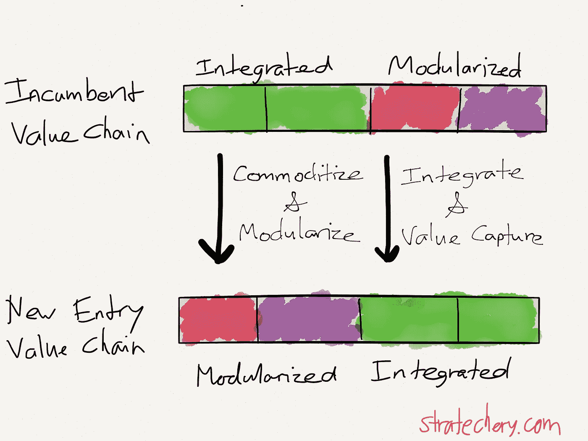
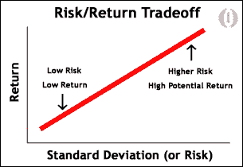

# 为什么你应该建立一个平台

> 原文：<https://medium.datadriveninvestor.com/why-you-should-build-a-platform-bd7e96135b71?source=collection_archive---------8----------------------->

在我的[上一篇文章](https://medium.com/@kislayverma/products-are-not-platforms-153ad22abb1b)中，我讨论了什么是平台，以及它与产品或服务有何不同。今天我想谈谈为什么一个公司应该着眼于建立一个平台。

在我们进入为什么之前，我想澄清一下，我这里说的是技术平台。许多人和文章将这与双向市场(亚马逊、优步)或其他具有网络效应的产品相混淆。这些不是一回事。

平台是通过多方面应用的能力来识别的。如今的 Airbnb 不太可能被用于租房之外的任何用途。它可能会产生引人注目的网络效应，随着越来越多的房主(供给)和度假者(需求)注册，它可能会越来越快地增长，但它不太可能轻易涉足旅游预订。Amazon.com 的情况也类似。它只是一个商业平台(比如“你可以在我们的*平台*上发现成百上千的卖家和数百万的客户”)。亚马逊已经在内部建立了一个平台，但网站/应用仍然是建立在平台之上的产品。因此，这里可能有重叠和争论，但我们应该认识到这是有区别的。

**诱人利润守恒定律**

克莱顿·克里斯滕森的书《创新者的解决方案》创造了一个术语“诱人利润守恒定律”。关于这一点的讨论可以在[这里](https://stratechery.com/2015/netflix-and-the-conservation-of-attractive-profits/)找到。它对平台问题提供了很好的见解，认为当人们将现有的经济体系和流程重新安排为对他们越来越有利的方式时，就会产生价值创造。

克里斯滕森教授表示，当一个产品不够“好”或处于婴儿期时，价值是通过拥有一个集成的、锁定的技术栈来创造的，该技术栈为特定目的进行了高度优化。如果你不这样做，一般化带来的开销将阻止产品变得足够好，并阻止它获得更多客户和攀登价值链。

然而，随着产品及其性能变得越来越好，并且它变得足够好，增加其性能或其他已经存在的质量没有进一步的价值，因为客户已经发现它足够好，并且不会为相同能力的进一步改进支付额外费用。这就是所谓的“商品化”。价值创造的焦点现在已经从产品转移到周围的生态系统。允许产品与外部服务和产品集成，使您的产品在全新的维度上发展，客户可能会发现这很有吸引力。然而，要做到这一点，您需要开放您的产品堆栈，以允许与外部系统的互操作性。换句话说，你必须开始将你的产品平台化。

Modularization exposes opportunities for value creation in face of commoditization

即使是现在，我们也可以进入多个层次。我们可以:

1.  开放我们的产品，使之足以与一些外部服务相集成。
2.  再开放一点，允许任何外来者以服务于我们核心产品的明确方式与我们互动。
3.  全力以赴，开放整套能力，开始作为局外人使用它们。

第一种选择提供了最小的增值，因为你只能做你能想到的。第二个选项提供了更多的好处，因为您的生态系统现在可以为您的产品做出贡献。当然，第三个选择是让互联网和风投保持活跃，并在现有产品之外提供潜在的新商机。

由于回报是按照选项的递增顺序排列的，实现回报的成本显然是相反的顺序。也就是说，增强一个产品，使其足以与一些外部服务相集成(添加“社交”服务等)，相对来说是廉价且无风险的。开放产品以便其他人可以通过标准协议和接口进行集成(例如，提供 webhooks 或 API)是一件更加耗时的事情，并且可能涉及对产品设计的重大更改。最后一个选项要求组织的思维模式发生彻底的改变，这很难实现，如果执行不当，对组织来说可能是致命的。

公司应该在什么时候搭建平台？

我真的很喜欢“足够好”这个论点，它是决定你应该建立一个平台还是一个产品的经验法则。一家公司应该[永远不要从构建平台开始](https://techcrunch.com/2015/11/28/the-platform-paradox/)，当然，除非它明确是一家构建平台的公司。在早期阶段，它应该专注于其核心客户产品，并努力实现一个令众多初创公司难以企及的产品市场。只有当你有一个客户明显喜欢的产品时(通过收入来证明)，你才应该尝试探索平台选项。

搭建一个平台你应该期待什么好处。外面有许多文章赞美平台的优点，所以为什么不补充我自己的两分钱:)

**开发生态系统**

Platforms connect the eco-system for mutual benefit

一个设计良好的平台使得与外部系统的集成变得非常简单。一旦实现了这一点，我们就可以立即看到商业价值是如何在我们平台的边缘产生的，而不是由我们单独产生的，而是由我们和我们在商业生态系统中的合作伙伴共同产生的，以实现互利。[平台的边缘设计用于速度和灵活性](https://stories.platformdesigntoolkit.com/design-apis-for-disobedience-7894f930e2cc)以产生新的体验，而核心设计用于稳定性和重用。

这使得我们可以在更广泛的经济中的任何地方插入插件，并挖掘我们以前无法利用的机会。

**在不断变化的商业环境中缩短上市时间**

如果业务前景预计会经常变化或有许多细微差别的用例，构建平台将缩短上市时间，因为不断变化的业务需求只需要重新拼接平台功能，而不是完全重新发明产品。当然，这是一种过度简化，但我可以从个人经验中说，可重用的业务和技术组件越多，组织对业务变化的响应就越快。

**进化的容易程度**

如前所述，平台支持现有能力集边缘的进化。越来越多的功能和特性可以添加到平台中，而不会影响现有的功能和特性。这是可能的，因为平台的各个部分并不相互连接或严格依赖(记住工具箱的类比)。它们独立存在，也可以根据需要串在一起。

因此，我们可以非常容易地向平台添加越来越多的功能。我们甚至可以进行设计，以便我们的行业合作伙伴或用户自己能够贡献新的功能。这就是网络效应开始发挥作用的地方。越多的人可以和我们一起构建，他们就会和我们一起构建(希望如此！).

**工具和经验的一致性**

如果你遵循了平台的黄金法则，你很可能会使用你的平台自己构建各种各样的产品。从技术的角度来看，一个设计良好的平台提供的功能都有一个统一的开发者和用户体验，所以很容易从一个部分转移到另一个部分，随心所欲地探索和挑选。最终产品会有一种内聚的感觉，因为基础中遵循的标准是相同的。

*如果你喜欢这篇文章，你可以订阅* [*我的邮件列表*](https://www.kislayverma.com/) *来获得最新消息。*

